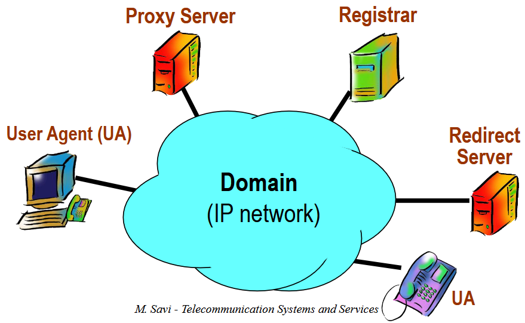
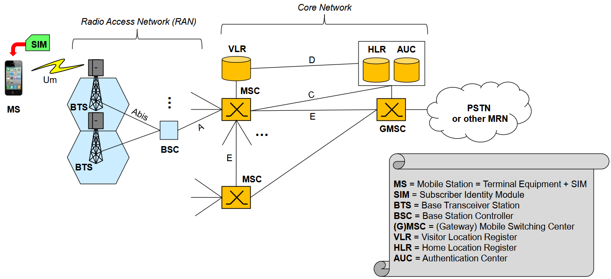

:::tip[Come usare questa pagina]
Queste sono domande **reali** di appelli passati (dal meno recente al più recente), raccolte dal gruppo studenti. Accanto a ogni domanda si trova la **lezione** di riferimento.
:::

:::note[Formato dell'esame]
Tutti gli appelli raccolti sono a **domande aperte**: "descrivi", "confronta", "data questa figura descrivi i componenti". **Niente crocette.** L'insidia non è la difficoltà, ma la **completezza** della risposta e il non confondere le sigle. Quasi ogni appello ha **4 domande, una per macro-area**: (1) accesso fisico, (2) core/WAN, (3) QoS/VoIP, (4) mobile.
:::

## Appello (non datato, il più vecchio)

1. Descrivere le varie architetture di rete d'accesso in fibra (FTTE, FTTC, FTTB, FTTH) e le due tipologie di FTTH. → [Lez. 09](/unimib-magistrale/sistemi-e-servizi-di-telecomunicazione/teoria/09-broadband-access-networks/)
2. Descrivere SDN, i suoi componenti architetturali e i suoi vantaggi. → [Lez. 11](/unimib-magistrale/sistemi-e-servizi-di-telecomunicazione/teoria/11-network-devices-and-advances-networking-technologies/)
3. Differenza tra QoS e QoE, cosa sono SLA e TCA, i tre modi con cui si può gestire il traffico in eccesso. → [Lez. 12](/unimib-magistrale/sistemi-e-servizi-di-telecomunicazione/teoria/12-quality-of-service/)
4. Descrivere ad alto livello le quattro procedure di cell selection, location update, handover e paging. Dire come la dimensione della location area influenza le varie tipologie di messaggi di segnalazione. → [Lez. 15](/unimib-magistrale/sistemi-e-servizi-di-telecomunicazione/teoria/15-mobile-radio-networks/)

## Appello di Settembre

1. Architettura delle reti di accesso satellitari, con differenza tra GEO e LEO. → [Lez. 09](/unimib-magistrale/sistemi-e-servizi-di-telecomunicazione/teoria/09-broadband-access-networks/)
2. Descrivere DiffServ e in breve la differenza con IntServ. → [Lez. 12](/unimib-magistrale/sistemi-e-servizi-di-telecomunicazione/teoria/12-quality-of-service/)
3. Le componenti di un sistema VoIP che usa SIP e che interazioni hanno tra di loro (con disegno dell'architettura). → [Lez. 13](/unimib-magistrale/sistemi-e-servizi-di-telecomunicazione/teoria/13-voice-over-ip/)
4. L'evoluzione da 2G a 4G, con particolare riferimento al paradigma ALL-IP e Flat Network. → [Lez. 16](/unimib-magistrale/sistemi-e-servizi-di-telecomunicazione/teoria/16-2g-3g-4g/)

## Domande da appelli non datati (frammenti)

1. Differenza tra il doppino in rame e la fibra ottica, e differenze tra esse e la comunicazione radio. → [Lez. 08](/unimib-magistrale/sistemi-e-servizi-di-telecomunicazione/teoria/08-mezzi-trasmissivi/)
2. Descrizione architetturale della rete FWA e differenze principali tra essa e le reti cablate, ed essa e le reti radiomobili. → [Lez. 09](/unimib-magistrale/sistemi-e-servizi-di-telecomunicazione/teoria/09-broadband-access-networks/) (+ [15](/unimib-magistrale/sistemi-e-servizi-di-telecomunicazione/teoria/15-mobile-radio-networks/)/[16](/unimib-magistrale/sistemi-e-servizi-di-telecomunicazione/teoria/16-2g-3g-4g/) per il confronto)
3. Descrizione degli algoritmi di scheduling nella QoS in generale e nello specifico differenze tra Time Division Multiplexing, Round Robin, Weighted Fair Queuing e Priority Scheduling. → [Lez. 12](/unimib-magistrale/sistemi-e-servizi-di-telecomunicazione/teoria/12-quality-of-service/)
4. Principali innovazioni portate dalla rete 5G rispetto al 4G. → [Lez. 17](/unimib-magistrale/sistemi-e-servizi-di-telecomunicazione/teoria/17-5g/)

## Altro appello (solo argomenti):

- Multiplazione → [Lez. 07](/unimib-magistrale/sistemi-e-servizi-di-telecomunicazione/teoria/07-multiplexing-e-multiple-access/)
- DiffServ → [Lez. 12](/unimib-magistrale/sistemi-e-servizi-di-telecomunicazione/teoria/12-quality-of-service/)
- SIP → [Lez. 13](/unimib-magistrale/sistemi-e-servizi-di-telecomunicazione/teoria/13-voice-over-ip/)
- Radio planning → [Lez. 15](/unimib-magistrale/sistemi-e-servizi-di-telecomunicazione/teoria/15-mobile-radio-networks/)

## Appello 14/07

1. Canale di trasmissione di Shannon e formula della capacità (spiegare la formula) e modulazione digitale. → [Lez. 06](/unimib-magistrale/sistemi-e-servizi-di-telecomunicazione/teoria/06-teoria-della-comunicazione/)
2. Differenza fra le varie tecnologie in fibra (FTTC, FTTB, FTTH con le due tipologie). → [Lez. 09](/unimib-magistrale/sistemi-e-servizi-di-telecomunicazione/teoria/09-broadband-access-networks/)
3. QoS, QoE, SLA e TCA e meccanismi di regolazione del traffico. → [Lez. 12](/unimib-magistrale/sistemi-e-servizi-di-telecomunicazione/teoria/12-quality-of-service/)
4. Innovazioni del 5G rispetto alle altre reti mobili. → [Lez. 17](/unimib-magistrale/sistemi-e-servizi-di-telecomunicazione/teoria/17-5g/)

## Appello 15/09/2023

1. Illustrare architettura rete satellitare e differenze tra GEO e LEO. → [Lez. 09](/unimib-magistrale/sistemi-e-servizi-di-telecomunicazione/teoria/09-broadband-access-networks/)
2. Connettività WAN generalizzata e dedicata. Introdurre le possibili soluzioni per il caso dedicato. → [Lez. 10](/unimib-magistrale/sistemi-e-servizi-di-telecomunicazione/teoria/10-wan-connectivity-services/)
3. Illustrare paradigma SDN e introdurre architettura SDN e i suoi componenti. → [Lez. 11](/unimib-magistrale/sistemi-e-servizi-di-telecomunicazione/teoria/11-network-devices-and-advances-networking-technologies/)
4. Data l'architettura GSM in figura, descrivere i suoi componenti principali. → [Lez. 16](/unimib-magistrale/sistemi-e-servizi-di-telecomunicazione/teoria/16-2g-3g-4g/)
5. Descrivere GPRS e i rapporti con GSM. → [Lez. 16](/unimib-magistrale/sistemi-e-servizi-di-telecomunicazione/teoria/16-2g-3g-4g/)

## Appello 25/01/2024

1. Descrivere e confrontare i mezzi di trasmissione guidati: doppino in rame e fibra ottica. Presentare il mezzo radio con i suoi impairments. → [Lez. 08](/unimib-magistrale/sistemi-e-servizi-di-telecomunicazione/teoria/08-mezzi-trasmissivi/)
2. Architettura MPLS e in quali contesti può essere usato. Confrontare LS Forwarding con destination-based forwarding e spiegare come mai il primo è più adatto a essere ingegnerizzato. → [Lez. 10](/unimib-magistrale/sistemi-e-servizi-di-telecomunicazione/teoria/10-wan-connectivity-services/)
3. Descrivere i codificatori vocali: waveform codec e source codec, confrontare il bitrate e la qualità della voce. → [Lez. 13](/unimib-magistrale/sistemi-e-servizi-di-telecomunicazione/teoria/13-voice-over-ip/)
4. Descrivere le procedure di cell selection, location update, handover, paging. Analizzare come la dimensione della location area influenza il paging e la location update. → [Lez. 15](/unimib-magistrale/sistemi-e-servizi-di-telecomunicazione/teoria/15-mobile-radio-networks/)

## Telecomunicazioni Giugno 2024

1. Introdurre FTTH, descrivere le due tipologie (P2P e PON), la peculiarità di **Open Fiber**. → [Lez. 09](/unimib-magistrale/sistemi-e-servizi-di-telecomunicazione/teoria/09-broadband-access-networks/)
2. Descrivere connettività generale e dedicata, le diverse possibilità nel caso dedicato. → [Lez. 10](/unimib-magistrale/sistemi-e-servizi-di-telecomunicazione/teoria/10-wan-connectivity-services/)
3. Data l'architettura di SIP in figura, descrivere ciascun componente e dire a cosa servono i metodi **Via**, **Record-Route** e **Route**. → [Lez. 13](/unimib-magistrale/sistemi-e-servizi-di-telecomunicazione/teoria/13-voice-over-ip/)
4. Descrivere brevemente l'evoluzione da 2G a 5G, facendo riferimento ai concetti di all-IP e flat network. → [Lez. 16](/unimib-magistrale/sistemi-e-servizi-di-telecomunicazione/teoria/16-2g-3g-4g/) + [17](/unimib-magistrale/sistemi-e-servizi-di-telecomunicazione/teoria/17-5g/)

## Appello (non datato)

- Multiplazione. → [Lez. 07](/unimib-magistrale/sistemi-e-servizi-di-telecomunicazione/teoria/07-multiplexing-e-multiple-access/)
- QoS, QoE, SLA, TCA e cosa posso fare del traffico non-compliant. → [Lez. 12](/unimib-magistrale/sistemi-e-servizi-di-telecomunicazione/teoria/12-quality-of-service/)
- Frequency planning e cosa posso fare se in una certa area serve più capacità. → [Lez. 15](/unimib-magistrale/sistemi-e-servizi-di-telecomunicazione/teoria/15-mobile-radio-networks/) (cell splitting / umbrella cell)
- SDN, i vantaggi, elementi che la compongono. → [Lez. 11](/unimib-magistrale/sistemi-e-servizi-di-telecomunicazione/teoria/11-network-devices-and-advances-networking-technologies/)

## Appello (non datato)

1. Descrivere i mezzi di trasmissione guidata: doppino e fibra. Introdurre la trasmissione radio e i suoi impairments. → [Lez. 08](/unimib-magistrale/sistemi-e-servizi-di-telecomunicazione/teoria/08-mezzi-trasmissivi/)
2. Descrivere MPLS, la sua architettura e la differenza tra LS Forwarding e Destination-based forwarding, e come mai il primo è più adatto a essere ingegnerizzato. → [Lez. 10](/unimib-magistrale/sistemi-e-servizi-di-telecomunicazione/teoria/10-wan-connectivity-services/)
3. Descrivere lo scheduling e definire gli algoritmi di scheduling (TDM, RR, ...). → [Lez. 12](/unimib-magistrale/sistemi-e-servizi-di-telecomunicazione/teoria/12-quality-of-service/)
4. Descrivere le procedure di mobilità di un TE (cell selection, ...), specificando se in stato idle o active mobility. Spiegare come la dimensione della location area è influenzata dai messaggi di segnalazione. → [Lez. 15](/unimib-magistrale/sistemi-e-servizi-di-telecomunicazione/teoria/15-mobile-radio-networks/)

## Appello 19/09/2025

1. Descrivere FTTH e le differenze tra FTTH punto-punto e PON. Descrivere le peculiarità di **Open Fiber**. → [Lez. 09](/unimib-magistrale/sistemi-e-servizi-di-telecomunicazione/teoria/09-broadband-access-networks/)
2. Descrivere ad alto livello le tecniche di scheduling per il QoS: Time Division Multiplexing, Round Robin, priorità di servizio e Weighted Fair Queuing. → [Lez. 12](/unimib-magistrale/sistemi-e-servizi-di-telecomunicazione/teoria/12-quality-of-service/)
3. Descrivere l'architettura SIP (con figura dei dispositivi): funzionalità di User Agent, Redirect Server, Proxy Server, Registrar. Dire cosa fanno **Via**, **Route** e **Record-Route**. → [Lez. 13](/unimib-magistrale/sistemi-e-servizi-di-telecomunicazione/teoria/13-voice-over-ip/)
4. Descrivere l'evoluzione delle reti mobili dal 2G al 4G. Citare cosa vogliono dire flat network e all-IP. → [Lez. 16](/unimib-magistrale/sistemi-e-servizi-di-telecomunicazione/teoria/16-2g-3g-4g/)

## Appello Giugno 2026

1. FTTH con la spiegazione di PON, P2P e **Open Fiber**. → [Lez. 09](/unimib-magistrale/sistemi-e-servizi-di-telecomunicazione/teoria/09-broadband-access-networks/)
2. DiffServ: differenza e miglioramenti rispetto a IntServ. → [Lez. 12](/unimib-magistrale/sistemi-e-servizi-di-telecomunicazione/teoria/12-quality-of-service/)
3. CDN. → [Lez. 14](/unimib-magistrale/sistemi-e-servizi-di-telecomunicazione/teoria/14-content-delivery-network/)
4. Rete 5G: architettura, miglioramenti rispetto alla 4G e parte in comune tra 5G e 4G. → [Lez. 17](/unimib-magistrale/sistemi-e-servizi-di-telecomunicazione/teoria/17-5g/)

## Domande più gettonate (Analisi delle Frequenze)

| Domande e varianti ricorrenti (Estrazione Dettagliata) | Lezione | Frequenza |
|:---|:---|:---:|
| **Architetture in fibra:** Descrivere le varie architetture di rete d'accesso in fibra (FTTE, FTTC, FTTB, FTTH) e le due tipologie di FTTH (P2P e PON). Descrivere le peculiarità di **Open Fiber**. | [09](/unimib-magistrale/sistemi-e-servizi-di-telecomunicazione/teoria/09-broadband-access-networks/) | **5** |
| **Architettura VoIP/SIP:** Descrivere le componenti di un sistema VoIP che usa SIP e che interazioni hanno tra di loro (con disegno/figura dell'architettura). Descrivere le funzionalità di User Agent, Redirect Server, Proxy Server, Registrar e dire a cosa servono i metodi/parametri **Via**, **Record-Route** e **Route**. | [13](/unimib-magistrale/sistemi-e-servizi-di-telecomunicazione/teoria/13-voice-over-ip/) | **4** |
| **QoS, QoE e Gestione Traffico:** Differenza tra QoS e QoE. Cosa sono SLA e TCA. Meccanismi di regolazione del traffico / i tre modi con cui si può gestire il traffico in eccesso / cosa fare del traffico non-compliant. | [12](/unimib-magistrale/sistemi-e-servizi-di-telecomunicazione/teoria/12-quality-of-service/) | **3** |
| **Algoritmi di Scheduling (QoS):** Descrizione degli algoritmi di scheduling nella QoS in generale e nello specifico le differenze ad alto livello tra Time Division Multiplexing (TDM), Round Robin (RR), Priority Scheduling (priorità di servizio) e Weighted Fair Queuing (WFQ). | [12](/unimib-magistrale/sistemi-e-servizi-di-telecomunicazione/teoria/12-quality-of-service/) | **3** |
| **Paradigma SDN:** Descrivere/Illustrare il paradigma SDN (Software Defined Networking), introdurre l'architettura SDN, descriverne gli elementi/componenti architetturali e i suoi vantaggi. | [11](/unimib-magistrale/sistemi-e-servizi-di-telecomunicazione/teoria/11-network-devices-and-advances-networking-technologies/) | **3** |
| **Mobilità Radiomobile:** Descrivere ad alto livello le procedure di mobilità di un TE: cell selection, location update, handover e paging (specificando se in stato idle o active mobility). Spiegare/Analizzare come la dimensione della location area influenza il paging e la location update (i messaggi di segnalazione). | [15](/unimib-magistrale/sistemi-e-servizi-di-telecomunicazione/teoria/15-mobile-radio-networks/) | **3** |
| **Mezzi Trasmissivi:** Descrivere e confrontare i mezzi di trasmissione guidati (doppino in rame e fibra ottica). Differenze tra esse e la comunicazione radio. Presentare/Introdurre il mezzo radio e i suoi disturbi (impairments). | [08](/unimib-magistrale/sistemi-e-servizi-di-telecomunicazione/teoria/08-mezzi-trasmissivi/) | **3** |
| **Evoluzione Mobile:** Descrivere brevemente l'evoluzione delle reti mobili dal 2G al 4G / dal 2G al 5G. Citare/Fare riferimento ai concetti di architettura ALL-IP e Flat Network. | [16](/unimib-magistrale/sistemi-e-servizi-di-telecomunicazione/teoria/16-2g-3g-4g/) / [17](/unimib-magistrale/sistemi-e-servizi-di-telecomunicazione/teoria/17-5g/) | **3** |
| **Tecnologia 5G:** Architettura e principali innovazioni portate dalla rete 5G rispetto alle altre reti mobili (4G). Spiegare i miglioramenti e la parte in comune tra 5G e 4G. | [17](/unimib-magistrale/sistemi-e-servizi-di-telecomunicazione/teoria/17-5g/) | **3** |
| **DiffServ:** Descrivere DiffServ, le differenze e i miglioramenti rispetto a IntServ. | [12](/unimib-magistrale/sistemi-e-servizi-di-telecomunicazione/teoria/12-quality-of-service/) | **3** |
| **Accesso Satellitare:** Illustrare l'architettura delle reti di accesso satellitari e le differenze tra GEO e LEO. | [09](/unimib-magistrale/sistemi-e-servizi-di-telecomunicazione/teoria/09-broadband-access-networks/) | **2** |
| **Connettività WAN:** Descrivere la connettività WAN generalizzata e dedicata. Introdurre le diverse/possibili soluzioni per il caso dedicato. | [10](/unimib-magistrale/sistemi-e-servizi-di-telecomunicazione/teoria/10-wan-connectivity-services/) | **2** |
| **Tecnologia MPLS:** Architettura MPLS e in quali contesti può essere usato. Confrontare LS (Label Switching) Forwarding con destination-based forwarding e spiegare come mai il primo è più adatto a essere ingegnerizzato. | [10](/unimib-magistrale/sistemi-e-servizi-di-telecomunicazione/teoria/10-wan-connectivity-services/) | **2** |
| **Multiplazione:** Multiplazione (in generale). | [07](/unimib-magistrale/sistemi-e-servizi-di-telecomunicazione/teoria/07-multiplexing-e-multiple-access/) | **2** |
| **Radio Planning:** Radio planning / Frequency planning e cosa si può fare se in una certa area serve più capacità (concetti di cell splitting e umbrella cell). | [15](/unimib-magistrale/sistemi-e-servizi-di-telecomunicazione/teoria/15-mobile-radio-networks/) | **2** |
| **Teoria di Shannon:** Canale di trasmissione di Shannon, formula della capacità (spiegare la formula) e modulazione digitale. | [06](/unimib-magistrale/sistemi-e-servizi-di-telecomunicazione/teoria/06-teoria-della-comunicazione/) | **1** |
| **GSM e GPRS:** Data l'architettura GSM in figura, descrivere i suoi componenti principali. Descrivere GPRS e i rapporti con GSM. | [16](/unimib-magistrale/sistemi-e-servizi-di-telecomunicazione/teoria/16-2g-3g-4g/) | **1** |
| **Codec Vocali (VoIP):** Descrivere i codificatori vocali (waveform codec e source codec) e confrontare il bitrate e la qualità della voce. | [13](/unimib-magistrale/sistemi-e-servizi-di-telecomunicazione/teoria/13-voice-over-ip/) | **1** |
| **Rete FWA:** Descrizione architetturale della rete FWA (Fixed Wireless Access) e differenze principali tra essa e le reti cablate, ed essa e le reti radiomobili. | [09](/unimib-magistrale/sistemi-e-servizi-di-telecomunicazione/teoria/09-broadband-access-networks/) | **1** |
| **CDN:** CDN (Content Delivery Network). | [14](/unimib-magistrale/sistemi-e-servizi-di-telecomunicazione/teoria/14-content-delivery-network/) | **1** |

## Schede di Ripasso (Domande e Risposte)

### 1. Architetture in fibra
**Domanda:** Descrivere le varie architetture di rete d'accesso in fibra (FTTE, FTTC, FTTB, FTTH) e le due tipologie di FTTH (P2P e PON). Descrivere le peculiarità di **Open Fiber**.

❓ Clicca qui per visualizzare la risposta

Le architetture di rete d'accesso in fibra possono essere raggruppate in due principali insiemi, che si differenziano su come fanno uso di collegamenti in rame e in fibra. Questi due insiemi prendono il nome di Hybrid Fiber-Copper Access Networks e Fiber Access Netoworks. Innanzitutto, i due principali mezzi di trasmissione utilizzati appunto in queste due tipologie di Access Network sono i Doppini in rame e i cavi in Fibra Ottica.
Un Doppino in Rame, Twisted Pair in inglese, è una guaina esterna che contiene diversi cavi in rame attorcigliati tra loro a coppie. Il motivo principale dell'attorcigliamento è per evitare un fenomeno che prende il nome di Diafonia: siccome i cavi in rame emettono energia elettromagnetica nell'area per trasferire i segnali, due cavi in rame vicini tra loro causano interferenza reciproca; attorcigliando questi due cavi, si va a creare la cosiddetta Destructive Interference, che va a diminuire il fenomeno della diafonia. Il problema è che, siccome la guaina contiene più doppini, anche queste causano interferenze l'una con l'altra; la soluzione è attorcigliare i vari doppini a passi differenti, sempre per creare Interferenza Distruttiva e mitigare la Diafonia. Oltretutto, si può continuamente attorcigliare coppie di doppini una con l'altra.

I cavi in Fibra Ottica sono invece formati da un Core, da un Cladding e da una guaina. Sia il Core che il Cladding sono in pasta vitrea. Esistono due tipi di cavi in Fibra Ottica: Multi-Mode e Single-Mode. Si differenziano in base a quante direzioni il segnale può seguire durante la trasmissione; i Single-Mode sono molto più pregiati e più costosi, con core di dimensioni pari a 8 µm, mentre per gli altri sui 50µm.

Fatta questa premessa, possiamo parlare dei due tipi di Access Network. Gli Hybrid Fiber-Copper Access Network utilizzano appunto un approccio ibrido, anche con l'obiettivo di diminuire i costi ma aumentare banda e velocità. Gli access network di questa categoria sono: Fiber to the Exchange, Fiber to the Cabinet, Fiber to the Building.

Nell'architettura Fiber to the Exchange, gli elementi principali della rete rimangono gli stessi di quella in rame; il cambiamento principale lo si ha nel Central Office, dove il collegamento tra il DSLAM e l'IP Router è in Fibra Ottica. Gli altri componenti e collegamenti rimangono, come detto prima, uguali a quelli dell'architettura con cavi in rame: a casa dell'utente, si ha una Borchia di Utente che si collega tramite un doppino in rame al Punto di Distribuzione solitamente locato nello scantinato. Da questo punto di Distribuzione, se entrano n doppini in rame, ne escono altrettanti n. Questa infrastruttura è chiamata Vertical Cabling. Successivamente, dal Punto di Distribuzione si ha un collegamento con un Ripartitore, che collega il doppino in ingresso con quello in uscita tramite un cavalotto, che non sono altro che dei piccoli cavi in rame. Si passa poi a un altro ripartitore, e infine al Central Office, dove il collegamento raggiunge il Main Distribution Frame, che è di fatto un Ripartitore ma più grande in quanto deve gestire i collegamenti di tanti utenti, e poi il DSLAM, che ha il compito di demultiplare i segnali in ingresso e di demodularli.

Per quanto riguarda l'architettura FTTC, invece, si ha un collegamento diretto in fibra ottica tra la centrale e il ripartitore. In questo caso, si ha uno svantaggio: è necessario posizionare un DSLAM all'interno di questo ripartitore, il problema è che si tratta di un dispositivo attivo ed è quindi necessario alimentarlo. Il collegamento tra il Ripartitore e il Punto di Distribuzione è sempre in rame.

In FTTB, invece, si ha un collegamento diretto in fibra ottica dal Central Office all'edificio dell'utente, dove, invece del punto di distribuzione, viene situato un mini-DSLAM alimentato tramite tecnica di Reverse Feeding. Si ha comunque un collegamento in rame tra Punto di Distribuzione e Borchia di Utente.

Passando alla categoria di Fiber Access Network, dove sono presenti solamente collegamenti in fibra ottica, le tipologie sono due: Point to Point e Passive Optical Network. Nel caso di P2P, si ha un collegamento in fibra ottica che parte dal central office e che arriva fino all'utente. Questa soluzione è molto costosa in quanto si deve dispiegare un collegamento in fibra ottica per ciascun utente. Nel caso di PON, invece, si utilizza una struttura ad albero: tra il central office e edificio dell'utente è situato uno splitter che, di fatto, divide il cavo in fibra ottica in ingresso in più collegamenti, solitamente con un ratio 1:32. Poi, dove è situato il punto di distribuzione, è presente un ulteriore splitter. Il risultato è che con 1 cavo uscente dal Central Office è possibile avere diversi collegamenti. In italia di solito il ratio di splitting è 1:64. Lo svantaggio è che la banda va condivisa tra tutti i collegamenti presenti.

Nel caso di Open Fiber, la struttura è leggermente diversa. A casa dell'utente si ha la Borchia di Utente, una per ogni UI unità immobiliare. Ognuna di queste fibre arriva al PTE, ovver Punto di Terminazione di Edificio, che solitamente si trova negli scantinati; ha n fibre che entrano e n fibre che escono. Quando Open Fiber dispiega la fibra, questa viene portata fino al PTE. Solo se l'utente attiva il servizio, Open Fiber fa il cablaggio verticale fino a casa dell'utente. All'interno del Cabinet, invece, si ha quello che prende il nome di PFS Punto di Flessibilità Secondario. Si ha uno splitter con rapporto 1:16. Con Open Fiber, in un Cabinet, non si ha un unico PFS, ma un PFS per ogni operatore che ha fatto cablare a Open Fiber. Viene quindi usato un Permutatore Ottico per collegare tramite cavallotti ottici fibre che entrano e fibre che escono. Si ha infinte un secondo punto di splitter chiamato PFP Punto di Flessibilità Primario, con ratio 1:4.

---

### 2. Architettura VoIP/SIP
**Domanda:** Descrivere le componenti di un sistema VoIP che usa SIP e che interazioni hanno tra di loro (con disegno/figura dell'architettura). Descrivere le funzionalità di User Agent, Redirect Server, Proxy Server, Registrar e dire a cosa servono i metodi/parametri **Via**, **Record-Route** e **Route**.

❓ Clicca qui per visualizzare la risposta

Le principali componenti di un sistema Voice Over IP che fa utilizzo di Session Initiation Protocol sono: un determinato numero di User Agents, un Proxy Server, un Registrar e un determinato numero di Redirect Server.

Innanzitutto, SIP è un importante protocollo di VoIP signalling, utile quindi per avviare, modificare e terminare le chiamate.

In VoIP esistono due tipi di signalling: in-band e out-band. Nel primo caso, i metodi di segnalazione utilizzano gli stessi canali per il flusso dati, mentre nel secondo è presente un canale apposta per le segnalazioni. Sulla rete IP il signalling può essere minimizzato, in quanto si possono utilizzare le tecnologie già previste in IP, come per esempio il DNS per tradurre un nome nell'indirizzo IP del chiamante o del chiamato. Potrebbe quindi essere sufficiente aggiungere un nuovo protocollo per avvisare il chiamato e un altro per scambiare i parametri della chiamata, ma la situazione risulta più complessa, dato che si vuole rendere questo VoIP Signalling il più simile possibile al PSTN Signalling, che garantisce Call Admission Controll, Access Control e anche gestione di tariffazione. È qui che entra in gioco SIP.

In SIP, ogni utente ha associato un identificativo unico di nome SIP URI, che sintatticamente e semanticamente è identico agli indirizzi email. Importante è notare che il SIP URI è associato all'utente, non al terminale: questo abilita la User Mobility, che permette a un determinato utente di spostarsi tra terminali diversi, anche collegarsi contemporaneamente da più terminali. SIP, similmente a HTTP, ha diversi metodi, i cui principali sono: INVITE, BYE, REGISTER, CANCEL, ACK, OPTIONS. SIP, a differenza di HTTP che si basa su TCP, non garantisce consegna perché può adottare anche UDP oltre a TCP.

L'architettura VoIP con SIP prevede la seguente struttura:

Gli User Agents sono i terminali che gli utenti utilizzano per la comunicazione. Lo User Agent che chiama è definito Client, quello che riceve è definito Server.

Il Registrar ha il compito di associare l'indirizzo IP di un terminale con il SIP URI dell'utente che lo sta utilizzando. In questo modo è possibile rintracciare l'utente e sapere da dove sta chiamando. Lo UA Client invia periodicamente un messaggio di REGISTER per aggiornare questa associazione, siccome l'utente potrebbe appunto spostarsi a un altro terminale.

Il Proxy Server ha invece il compito di instradare le richieste provenienti dalla rete locale, ma indirizzate a un'altra rete VoIP. Sostanzialmente, lo UE-Client invia un messaggio di INVITE al Proxy Server, che interroga un Database per capire, sulla base del SIP URI di destinazione, verso quale rete va instradato il messaggio di INVITE nella rete di destinazione in cui si trova lo UA Server. Il proxy della rete di destinazione riceve l'INVITE e interroga il registrar della sua rete per poter conoscere a quale terminale è attualmente associato l'utente. A questo punto, il proxy nella rete di destinazione è in grado di inoltrare il messaggio INVITE allo UA Server, che potrà poi rispondere.

Il Redirect Server è utile nel momento in cui una chiamata è indirizzata verso un terminale ma l'utente si è spostato.

Altri parametri fondamentali sono Via, Record-Route e Route. Il parametro Via viene utilizzato per fare Response Routing: quando una richiesta segue un determinato percorso per raggiungere un UA Server a partire da un UA Client, nella maggior parte dei casi si vuole fare in modo che la risposta segua lo stesso percorso, ma al contrario. Questo è molto utile anche per gestire la tariffazione. All'interno del campo Via, vengono inseriti nell'header gli indirizzi dei Server Proxy attraversati dal messaggio. A destinazione sarà possibile fare Source-Based routing per ripercorrere al contrario il percorso.

Record-Route e Route funzionano in maniera simile, ma sono utilizzati quando si vuole inviare più richieste differenti lungo lo stesso percorso. In questo caso, Record-Route funziona allo stesso modo di Via, ma, una volta giunto a destinazione, UA Server invia la risposta salvando il contenuto di Record-Route, in modo che una volta raggiunta il UA Client, la prossima richiesta potrà seguire lo stesso percorso tramite il campo Route.

---

### 3. QoS, QoE e Gestione Traffico
**Domanda:** Differenza tra QoS e QoE. Cosa sono SLA e TCA. Meccanismi di regolazione del traffico / i tre modi con cui si può gestire il traffico in eccesso / cosa fare del traffico non-compliant.

❓ Clicca qui per visualizzare la risposta

QoS si riferisce a tutti i servizi di rete e al flusso traffico. Quality of Service è un indicatore di qualità che misura il livello di servizio fornito rispetto a quanto si aspetta l'utente. I parametri fondamentali presi in considerazione sono:
- available bandwith
- affidabilità
- ritardi
- simili

In termini assoluti, la QoS determina dei valori tali per cui determinati parametri devono rispettarli. Ad esempio, end-to-end delay < 20ms.

La differenza principale tra QoS e QoE, ovvero Quality of Experience, è che QoS misura la qualità di un servizio in maniera oggettiva, mentre QoE misura in modo soggettivo. Il problema principale di QoE è che le tecniche per ottenere risultati dagli utenti sono estremamente costose. Bisogna chiedere molte opinioni agli utenti, ma in caso di modifiche o aggiunte come per esempio nuovi protocolli, bisognerebbe rifare tutto da capo.

In QoS, ci sono due elementi fondamentali: SLA e TCA. SLA, ovvero Service Service Level Agreement, è un vero e proprio contratto stipulato con l'ISP per definire dei Service Level Objective che l'ISP si deve impegnare a rispettare e garantire. Il problema è che non tutto il traffico è uguale, quindi è necessario definire anche su quale profilo di traffico il SLA deve valere. Questo è il compito del Traffic Conditioning Agreement, che specifica quale è il traffico IN (compliant) e OUT (non-compliant).
I valori su cui ci si basa per la definizione del traffico sono: peak rate, average rate, maximum burst length, maximum packet lenght, minimum packet length.

I tre modi per la gestione del traffico sono Policing, Shaping e Marking. Con il Policing, si prende il traffico OUT, ovvero il traffico non-compliant, e lo si scarta. Con Shaping, invece, il traffico viene ritardato per fare in modo che diventi compliant. Infine, con Marking, si marchia del traffico per decidere più tardi se scartarlo o meno.

---

### 4. Algoritmi di Scheduling (QoS)
**Domanda:** Descrizione degli algoritmi di scheduling nella QoS in generale e nello specifico le differenze ad alto livello tra Time Division Multiplexing (TDM), Round Robin (RR), Priority Scheduling (priorità di servizio) e Weighted Fair Queuing (WFQ).

❓ Clicca qui per visualizzare la risposta

Lo scheduling viene effettuato sulle interfacce di uscita dei router per suddividere al meglio la banda tra i flussi di traffico in uscita. Gli algoritmi di Scheduling visti sono Time Division Multiplexing, Round Robin (Fair Queuing), Weighted Fair Queuing, Service Priority.

Lo scheduling Time Division Multiplexing, prevede che ogni round vengano inviati pacchetti per riempire un time slot per ciascuna coda. Si ha quindi una corrispondenza rigida tra time-slot e le queues. Il problema di questa tecnica di Scheduling QoS è che, se una delle code si trova vuota in un round, viene inviato un time-slot vuoto, quindi si sprecano risorse.

Il Round Robin funziona in maniera simile al TDM, ma, se si incontra una coda vuota durante un round, si va a cercare un unità di traffico nella coda successiva.

Il Weighted Fair Queuing funziona come il Round Robin (Fair Queuing), ma è possibile dare più peso a diverse code piuttosto che ad altre, in maniera non necessariamente equa. Quindi, è possibile inviare $K_i$ unità di traffico per una determinata coda.

Service Prority prevede che ogni time-slot corrisponde a un round. Il meccanismo di questo tipo di Scheduling consiste nel prendere prima le unità di traffico contenute nelle code con priorità più alta, poi il traffico delle code con priorità subito prima e così via. Si presenta però un problema: se si invia un'unità di traffico molto lungo a bassa proprità e subito dopo si dovrebbe inviare un'unità di traffico proveniente da coda a priorità alta, questa subirebbe ritardi considerevoli. La soluzione è frammentare a livello 2.

---

### 5. Paradigma SDN
**Domanda:** Descrivere/Illustrare il paradigma SDN (Software Defined Networking), introdurre l'architettura SDN, descriverne gli elementi/componenti architetturali e i suoi vantaggi.

❓ Clicca qui per visualizzare la risposta

Il paradigma SDN, ovvero Software Defined Networking, si basa sulla divisione delle logiche Control Plane e Data Plane.

Guardando la struttura dei dispositivi di rete, è possibile notare come il Control Plane e il Data Plane siano logicamente separate, ma fisicamente co-locate. In generale, le logiche di Data Plane sono simili tra i vari dispositivi, mentre il Control Plane è più specifico in base alle funzionalità del device.

SDN stravolge questo paradigma e ha come obiettivo una separazione totale tra piano di Controllo e piano Dati; quindi, oltre ad essere separati logicamente, lo sono anche fisicamente.
L'architettura SDN prevede un SDN controller che funge da cervello e si interfaccia superiormente tramite delle Northbound Interfaces con le applicazioni di rete all'Application Layer, come Firewall o Load Balancer. I programmatori di rete possono utilizzare queste interfacce per programmare le applicazioni tramite regole di alto livello. Verso il basso, invece, il SDN Controller si interfaccia con i dispositivi di rete all'Infrastructure Layer tramite Southbound Interfaces. In questo caso, i programmatori di rete sono in grado di programmare i dispositivi tramite istruzioni di basso livello.

Quindi, grazie a SDN, si ha un notevole aumento di programmabilità della rete. Già prima era programmabile, ma grazie al paradigma SDN lo è molto di più.

La Southbound Interface su cui ci siamo focalizzati è OpenFlow. L'architettura di OpenFlow prevede la suddivisione in due gruppi: Control Channel e Data Channel. Nel Control Channel, sono presenti degli OpenFlow Channel che ricevono le istruzioni e i comandi dal SDN Controller. Questi comandi vengono poi mandati dall'OpenFlow Channel alle Flow Table, ovver tabelle di flusso. Le Flow Tables vanno a costituire la Pipeline che deve essere seguita fino a raggiungere l'interfaccia di uscita. Ogni pacchetto, mentre viaggia lungo la Pipeline, ha associato dei Metadati e un Action Set. I Metadati sono delle informazioni aggiuntive che riguardano il pacchetto, ma che hanno vita soltanto all'interno della Pipeline stessa. L'Action Set, invece, è un set di informazioni che viene popolato sempre di più al passaggio da un punto all'altro.

---

### 6. Mobilità Radiomobile
**Domanda:** Descrivere ad alto livello le procedure di mobilità di un TE: cell selection, location update, handover e paging (specificando se in stato idle o active mobility). Spiegare/Analizzare come la dimensione della location area influenza il paging e la location update (i messaggi di segnalazione).

❓ Clicca qui per visualizzare la risposta

La Mobile Radio Network è strutturalmente composta dagli UE User Equipment, che sono i terminali degli utenti che si connettono alla rete, la Radio Access Network che permette di interconnettere i vari UE e la Core Network, che connette la RAN con la rete IP esterna.  
La Radio Access Network è formata da un diverso numero di antenne che prendono il nome di Base Station. Queste BT fanno da ponte tra gli UE e la Core Network, tramite un collegamento che prende il nome di Backhaul. 

In una Mobile Radio Network, l'area di superficie è suddivisa in Celle; motivo per cui si chiama rete cellulare. Ogni cella ha la forma logica di un esagono, ottimo perché è la forma geometrica più simile al cerchio che permette di tassellare l'intera superficie e facilita anche i calcoli. Nella realtà, però, le aree non sono realmente a forma esagonale a causa della propagazione del segnale. Comunque, ad ogni area è assegnata una Base Station e il meccanismo fondamentale da garantire agli utenti della rete mobile è la User Mobility. Questa è garantita grazie a diverse procedure:

- Cell Selection: un utente deve capire a quale BS connettersi. Si fa in mobility IDLE, ovvero quanto un utente non è coinvolto in una comunicazione. Ciascuna antenna nella Location Area, ovvero un determinato insieme di Celle che definiscono la posizione dell'utente, invia un segnale Beacon e, in base alla potenza del segnale ricevuto dall'utente, questo decide a quale connettersi. È presente un database per salvare la posizione degli utenti, utile per gestire le comunicazioni.

- Paging: siccome la posizione dell'utente è conosciuta a livello di granularità di Location Area, è necessario conoscerne la posizione relativamente alle celle. La procedura di Paging prevede che ogni BS di ciascuna cella invii un messaggio indirizzato all'utente. Se questo risponde, si sa in quale cella si trova. Si fa quando l'utente passa da IDLE ad ACTIVE, ovvero quando è coinvolto in una comunicazione.

- Handover: quando un utente si sposta fisicamente in un'altra cella, si rileva che la potenza del segnale con la BS di prima scarseggia ma aumenta la potenza del segnale della BS della nuova cella. La BS collegata all'utente sarà quella nuova, con l'obiettivo di non far capire all'utente che questo cambio è avvenuto.

- Location Update: nella rete 2G quando un utente si sposta in un'altra cella. Può succedere che si ha uno spostamento tale per cui si cambia Base Station Controller ma non il Mobile Switching Center, oppure uno spostamento per cui si cambia sia Base Station Controller che Mobile Switching Center.

Ovviamente, più una Location Area è estesa, più il Paging peggiora perché ogni singola BS deve inviare il messaggio e aspettare che l'utente risponda. Invece, la Location Update migliora perché è meno probabile che un TE si sposti da una cella all'altra.

---

### 7. Mezzi Trasmissivi
**Domanda:** Descrivere e confrontare i mezzi di trasmissione guidati (doppino in rame e fibra ottica). Differenze tra esse e la comunicazione radio. Presentare/Introdurre il mezzo radio e i suoi disturbi (impairments).

❓ Clicca qui per visualizzare la risposta

I due principali mezzi di trasmissione guidati sono il doppino in rame e la fibra ottica.

Il doppino in rame consiste in una guaina esterna che contiene diversi cavi in rame che trasportano segnale emettendo dell'energia elettromagnetica. Il problema è che, siccome emettono energia elettromagnetica nell'area, cavi in rame vicini causano interferenza reciproca; allora una soluzione è attorcigliare due cavi in rame per creare interferenza distruttiva, che mitiga, appunto, l'interferenza reciproca causata. Tuttavia, siccome all'interno di una guaina sono presenti più coppie di cavi in rame, anche queste diverse coppie attorcigliate causano ulteriore interferenza tra loro. La soluzione è attorcigliare le varie coppie a passi differenti e, ulteriormente, attorcigliare tutte le diverse coppie le une con le altre, in continuazione.

I cavi in fibra ottica prevedono anche questi una guaina esterna, che contiene però un core centrale e uno strato di cladding, entrambi in pasta vitrea. Esistono due tipi di cavi in fibra ottica: multi-mode e single-mode, che si differenziano in base a quanti "modi" di trasmissione ci sono. I "modi" di trasmissione sono le possibili direzioni intraprese dal segnale all'interno del mezzo di comunicazione. I cavi single-mode sono molto più pregiati e costosi dei single mode, perché il segnale viene inviato esclusivamente lungo un'unica direzione e presentano un core di dimensioni pari a circa 8µm, mentre il multi-mode attorno ai 50µm.

Le reti a comunicazione radio, invece, fanno uso di antenne per la comunicazione con gli utenti. Esistono vari tipi di reti a comunicazione radio, come Fixed Wireless Access Networks, Mobile Radio Networks e le Satellite Networks. I principali tipi di antenne sono le antenne Isotrope, che irradiano perfettamente in area sferica, però inesistenti nella realtà e utili per fare calcoli, antenne Omnidirezionali che irradiano attorno ad esse a forma di ciambella; infatti, posizionandosi sopra o sotto l'antenna, non si riesce a captare il segnale, e antenna direzionale, che può inviare il segnale lungo una determinata direzione; il problema è che generano inevitabilmente del segnale non desiderato anche in altre direzioni.

Le Fixed Wireless Network prevedono una antenna di nome Base Station, collegata a un IP Router tramite rete di Backhaul. Questa antenna comunica poi con gli utenti; ovviamente ciascun utente necessita di una sua antenna di nome Subscriber Station. 

Le reti satellitari prevedono una stazione di Terra che comunica con un satellite e una stazione all'utente che anch'essa comunica con il satellite. Il problema è che, nonostante aiuti contro il digital divide, questo modello di rete presenta dei ritardi non indifferenti perché la comunicazione deve passare dal satellite.

Le mobile radio networks prevedono 3 principali componenti architetturali: lo UE, ovvero user equipment, una Radio Access Network e una Core Network. La RAN interconnette gli utenti con la core network, mentre quest ultima interconnette la RAN con la rete IP.

Gli impairments del mezzo trasmissivo via radio sono fondamentalmente la Path Loss, ovvero l'attenuazione dovuta alla distanza dalla sorgente, calcolata come:
$$
P_r = P_s (\frac{λ}{4πd})^2
$$
dove d è la distanza dalla sorgente, $P_r$ la potenza ricevuta, $P_s$ la potenza trasmessa e λ la lunghezza d'onda, calcolata come $\frac{c}{f}$, con c velocità della luce e f frequenza.

Altri fattori di attenuazione sono dovuti da condizioni atmosferiche, riflessione, shadowing, scattering e diffrazione.

---

### 8. Evoluzione Mobile
**Domanda:** Descrivere brevemente l'evoluzione delle reti mobili dal 2G al 4G / dal 2G al 5G. Citare/Fare riferimento ai concetti di architettura ALL-IP e Flat Network.

❓ Clicca qui per visualizzare la risposta

L'evoluzione delle architetture mobili è guidata dal voler passare da una rete a commutazione di circuito, a una rete a commutazione di pacchetto, usando sistemi software flessibili e basandosi sulla rete IP.

Con la rete 2G GSM, si ha la prima rete digitale che però è ancora basata sulla commutazione di circuito, con una struttura che segue una gerarchia ad albero tra i componenti MS, BSC e MSC. Con GPRS, General Packet Radio Service si introducono due nuovi nodi SGSN e GGSN, oltre che il concetto di tunnel. Un tunnel agisce come un bitpipe per l'invio di dati e ne sono stabiliti 2: uno tra la MS e SGSN di livello 2, un altro tra SGSN e GGSN di livello 4.

Con 3G UMTS, invece, permette velocità maggiori e inizia ad adottare una struttura ibrida sia a commutazione di circuito che a commutazione di pacchetto, introduce il concetto di Bearer che sono fondamentalmente analoghi ai tunnel ma possono garantire QoS. Esistono 4 tipi di Bearer Services: Conversational, Streaming, Interactive e Background. I Bearer più importanti sono: Core Network Bearer Service tra SGSN e GGSN, Radio Access Bearer Service tra UE e SGSN e Radio Bearer Service tra UE e RNC. Tramite il soft handover, gli utenti si possono collegare contemporaneamente fino a un massimo di 6 NodeB, migliorando qualità grazie alla ridondanza. Si ha un nuovo schema di autenticazione che risolve il problema del 2G in cui l'utente si autentica nei confronti della rete, ma non il contrario. Infine, 3G introduce anche il concetto di flat-network, ovvero dividere sempre di più il piano data dal piano di controllo, con l'obiettivo di far viaggiare i dati quando più direttamente possibile.

Con 4G i concetti all-IP e flat network vengono portati al livello successivo e non si ha più una rete a commutazione di circuito.

Con 5G, SBA Service Based Architecture, non si cerca solo di aumentare la velocità, ma anche di aumentare affidabilità, minimizzare i ritardi e il consumo energetico. Si utilizza il concetto di virtualizzazione, in cui è possibile creare delle slice di architetture di rete differenti da assegnare a diversi tenant. Anche l'Edge Computing è introdotto, che prevede di fare computazione in Edge Nodes locati il quanto più possibile vicino agli utenti.

---

### 9. Tecnologia 5G
**Domanda:** Architettura e principali innovazioni portate dalla rete 5G rispetto alle altre reti mobili (4G). Spiegare i miglioramenti e la parte in comune tra 5G e 4G.

❓ Clicca qui per visualizzare la risposta

Con la rete radiomobile 5G, per la prima volta a differenza delle precedenti generazioni, si hanno obiettivi diversi dal solo aumento della velocità. Si cerca infatti di aumentare quanto più possibile l'affidabilità, nonché di diminuire i ritardi e il consumo energetico. 5G fa uso della virtualizzazione, che permette di definire delle vere e proprie reti virtuali isolate diverse tra loro. Queste reti virtuali prendono il nome di Network Slices e possono presentare diverse architetture, assegnate a diversi Tenant. Il vantaggio di questo approccio è che se dovessere esserci un problema in una delle reti virtuali, questo problema non ha ripercussioni sulle altre e rimane isolato.

Un'ulteriore novità del 5G è l'Edge Computing, ovvero la possibilità di effettuare computazione tramite degli Edge Nodes situati vicino agli utenti, con l'obiettivo di effettuare computazioni quanto più vicino possibile agli utenti della rete.

Viene introdotto anche l'uso delle Onde Millimetriche, che sono molto appetibili agli operatori perché, oltre ad essere nuove e quindi poco utilizzate, essendo millimetriche conferiscono banda molto elevata. Inoltre, le dimensioni delle antenne sono direttamente proporzionali alle dimensioni delle onde trasmesse, quindi le antenne per la trasmissione di queste One Millimetriche risultano piccolissime. Il problema di questa tecnologia è che sono molto soggette al Path Loss e alle condizioni atmosferiche, ovvero ai principali Impairments della trasmissione via radio. La soluzione sarebbe adottare delle Small Cells, ovvero suddividere la superficie in celle molto piccole in cui si fa uso di queste antenne. Sarebbe molto utile utilizzare questo approccio in piccole aree, come per esempio qui negli edifici universitari.

Anche il Massive MIMO è una novità portata con il 5G; permette di effettuare MIMO ma a un livello superiore, tramite diversi array di antenne, con un certo numero di queste che trasmettono verso l'utente. MIMO, Multiple Input Multiple Output, è una tecnica utilizzata per rendere la trasmissione più robusta al rumore. Il funzionamento è che ci sono più antenne che inviano allo stesso tempo il medesimo segnale e più antenne che lo ricevono, situate a distanza tali per cui si va a generare Interferenza Distruttiva. Similmente a come succede nei doppini in rame attorcigliando i cavi in rame.

Architetturalmente, in 4G separava la logica di Control Plane e Data Plane, ma nel 5G è presente CUPS totale, ovvero Control User Plane Separation; tutte le funzionalità del piano di controllo sono disaggregate in funzionalità il più possibile atomiche. A differenza del 4G, la eNodeB prende il nome di gNB (next-generation eNodeB) e a sua volta si può suddividere in 2: gNB-CU (gNB Centralized Unit) e gNB-DU (Unified Unit). La gNB-DU è responsabile per le operazioni di livello 1 e 2, mentre la gNB-CU è responsabile per le operazioni di livello 2 zona alta e livello 3.

La RAN in 4G prende il nome di Next Generation RAN in 5G.

Il Core Network, che in 5G prende il nome di 5G CORE, è molto diverso da quello di 4G, in quanto le interfacce a livello di controllo possono comunicare tramite un message bus e scambiarsi quindi messaggi tramite interfacce di tipo REST.
I componenti della 5G CORE che hanno controparti in 4G sono:
- AMF (Acess & Mobility Management Function): la sua controparte in 4G è MME, si occupa delle funzionalità di mobility.
- SMF (Session Management Function): la sua controparte in 4G è MME e PGW, si occupa della gestione delle informazioni di sessione degli utenti e alloca gli IP. Come succede in 4G con MME, SMG gestisce e stabilisce i Bearer.
- AUSF (Authentication Server Function): la sua controparte in 4G è HSS, si occupa dell'autenticazione.
- UDM (Unified Data Management): la sua controparte in 4G è HSS, si occupa di salvare informazioni riguardo gli utenti.

I componenti nuovi senza controparti in 4G sono:
- NRF (Network Repository Function): mantiene in un repository tutte le funzioni per cui si può fare deployment.
- NEF (Network Exposure Function): permette agli utenti esterni alla rete di accedere alle informazioni della rete 5G tramite API.
- NSSF (Network Slice Selection Function): quando un terminale entra in stato IDLE mobility, la NSSF decide a quale Network Slice collegarlo.

Inoltre, lo User Plane Function in 5G permette di mettere in comunicazione un utente con la rete esterna. La controparte in 4G è PGW e SGW.

---

### 10. DiffServ
**Domanda:** Descrivere DiffServ, le differenze e i miglioramenti rispetto a IntServ.

❓ Clicca qui per visualizzare la risposta

DiffServ è un importante modello progettato per garantire QoS nelle reti IP, nato nel 1998 come successore di IntServ. Il principale problema di IntServ riguarda la scalabilità; IntServ aveva come obiettivo garantire QoS nelle reti IP basandosi su ciascun flusso di dati, sfruttando il meccanismo di Call Admission Control su, appunto, ciascun flusso.

CAC è una tecnica per garantire QoS che consiste in un insieme di azioni per negoziare una connessione: verifica se si hanno sufficienti risorse per accettare la nuova richiesta e, se così fosse, allora la si accetta. Esistono 3 tipi di CAC: Centralized, Distributed e Hybrid. Nel primo caso, esiste un server centrale che comunica con gli altri nodi della rete per capire come è il traffico e, sulla base di questi dati, decide se ammettere o meno nuove richieste. Il secondo caso di Distributed invece prevede che ciascun nodo in rete comunichi con gli altri quale è la propria situazione di gestione delle risorse, per poi prendere decisioni, ma il problema è che è complesso da scalare e serve un sistema di segnalazione tra i vari nodi. Infine, la modalità ibrida è appunto ibrida tra le due precedenti, dove la CAC è effettuata solo ai nodi edge, ma è comunque necessario che gli altri nodi comunichino il loro stato di occupazione delle risorse.

A causa di questo approccio basato sui singoli flussi, IntServ risulta inutilizzabile dopo l'esplosione del traffico web proprio a causa di problemi di scalabilità e anche considerando il fatto che sono necessari router che supportano RSVP, ovvero il protocollo di signalling utilizzato da CAC e quindi IntServ, utilizzato per riservare risorse sui percosi.

DiffServ, invece, non si basa più su garantire QoS a livello di singoli flussi tramite CAC, ma definisce delle classi di servizio tali per cui si garantisce QoS. La peculiarità di DiffServ è che la regolazione del traffico viene effettuata solo ai router di bordo, dove viene immesso il traffico e si specifica a quale classe di servizio questo appartiene. Arrivati a questo punto, i router interni devono solo fare Differentiated Routing, ovvero instradare differenziando il traffico sulla base delle varie classi di servizio a cui appartiene. La cosa utile di DiffServ per la scalabilità è che non necessita di dispositivi prioritari, ma viene utilizzato il capo Type of Service all'interno dell'header IPv4 per discriminare i vari tipi di traffico.

---

### 11. Accesso Satellitare
**Domanda:** Illustrare l'architettura delle reti di accesso satellitari e le differenze tra GEO e LEO.

❓ Clicca qui per visualizzare la risposta

L'architettura delle Reti di Accesso Satellitari prevede una Ground Station collagata tramite collegamento di backhaul all'IP Router. Per permettere la comunicazione con gli utenti, è installata un'antenna che prende il nome di VSAT a casa dell'utente stesso. La Ground Station e VSAT sono in grado di comunicare tra di loro grazie ai satelliti, che fungono fondamentalmente da ponte tra i due. Questa architettura e questo tipo di rete di accesso aiuta contro il Digital Divide, ovvero la separazione tra persone che hanno accesso a internet e chi no, ma presentano problemi di delay, ritardi, non indifferenti, proprio perché le comunicazioni devono passare dal VSAT, fino al satellite e poi fino alla Ground Station. Oppure viceversa.

Esistono due tipi di satelliti: i satellit GEO e i satelliti LEO.

I GEO Satellites si suddividono a loro volta in due tipi: single-beam, ovvero satelliti che fanno uso di un singolo raggio per ottenere copertura. Questi raggi possono essere molto estesi e coprire fino a un terzo della superficie terrestre, ma ovviamente il problema è che la banda andrebbe suddivisa per tutta l'area ricoperta. I multi-beam, invece, utilizzano diversi raggi di copertura, ma è importante usare frequenze diverse su beam vicini tra loro per evitare interferenze.

I satelliti LEO sono invece più recenti e permettono connessione, ovviamente se si ha una Ground Station, andando a formare una "costellazione" di satelliti.

---

### 12. Connettività WAN
**Domanda:** Descrivere la connettività WAN generalizzata e dedicata. Introdurre le diverse/possibili soluzioni per il caso dedicato.

❓ Clicca qui per visualizzare la risposta

Connettività WAN generalizzata e dedicata sono due tipologie differenti di connettività WAN che permettono agli utenti di accedere alla rete IP pubblica. Il primo caso la connettività è fornita dagli ISP principalmente agli utenti residenziali. L'architettura di una WAN generalizzata prevede un diverso numero di LAN, interconnesse alla rete ISP. Questa rete ISP è formata da un numero di Autonomous Systems interconnessi tra loro, dove è presente un edge router che a sua volta collega ogni AS con le diverse reti LAN.

Nel secondo caso, invece, ovvero nel caso delle WAN dedicate, la situazione è diversa perché questa struttura è rivolta principalmente ad aziende e, quindi, utenti business. L'architettura cerca di interconnettere tutte le varie reti LAN di un'azienda, ovvero i suoi diversi branch, per poi fornire accesso alla rete IP pubblica. Esistono tre diverse soluzioni per il caso dedicato:

1. Dedicated Physical WAN: questa prima soluzione prevede che sia l'azienda a dispiegare l'intera infrastruttura di rete WAN per interconnettere tutti i branch della propria azienda. Questa soluione è molto utile perché si ha controllo totale sull'intera infrastruttura e si ha elevata disponibilità di bansa, ma allo stesso tempo questa soluzione è estremamente costosa, a tal punto che solamente poche aziende davvero grosse possono permettersela.

2. Leased Lines: la seconda soluzione prevede che un operatore, su richiesta dell'azienda, vada a definire all'interno della sua infrastruttura, dei circuiti privati da assegnare all'azienda. Risulta comodo, ma anche questo approccio è costoso e comunque l'azienda deve sapere bene tutti i dettagli di quello che bisogna richiedere all'operatore.

3. MPLS WAN: MultiProtocol Label Switching WAN. Questa soluzione prevede l'utilizzo del protocollo MPLS e di una MPLS Network gestita dall'operatore. Nel momento in cui l'azienda vuole stabilire una WAN per connettere i suoi vari diversi Branch LAN, l'operatore fornisce all'azienda dei Customer Edge Router da posizionare in ciascuna LAN come nodo EDGE. In questo modo, i CE comunicheranno con i Provider Edge Router all'interno della MPLS Network, dove è presente una Mesh Connectivity che interconnette tutte le diverse LAN tra di loro e ne permette l'interconnettività mesh.

---

### 13. Tecnologia MPLS
**Domanda:** Architettura MPLS e in quali contesti può essere usato. Confrontare LS (Label Switching) Forwarding con destination-based forwarding e spiegare come mai il primo è più adatto a essere ingegnerizzato.

❓ Clicca qui per visualizzare la risposta

MPLS, ovvero Multi Protocol Label Switching, è un procollo che può essere utilizzato nelle WAN Dedicate. Infatti, quando si parla di WAN dedicate, le tre possibili soluzioni sono Dedicated Physical WAN, Leased Lines e MPLS WAN.

MPLS WAN è un modo per interconnettere i vari branch LAN di un'azienda dispiegati in posti diversi. Questo tipo di WAN prevede un MPLS Network gestito da un Operatore di Rete, che, quando stipula un accordo con un'azienda, fornisce dei nodi di edge di nome Customer Edge Router, da posizionare in ciascuna rete LAN dell'azienda. All'interno della MPLS Network sono presenti dei nodi edge che prendono il nome di Provider Edge Rotuer, il cui compito è connettersi da una parte con il Customer Edge Router di una LAN, mentra dall'altra parte con la Mesh Network della MPLS Network, per garantire ai branch dell'azienda una Mesh Connectivity.

All'interno di questa Mesh Network sono presenti dei Provider Router e risulta quindi necessario stabilire un percorso tra Provider Edge Router di Ingress e Provider Edge Router di Egress; questo percorso prende il nome di Virtual Circuit, o, per il procollo MPLS, Switched Path. Sempre per MPLS, il Provider Router è chiamato Label Switched Router, mentre il Provider Edge Router è chiamato Label Edge Router.

MPLS funziona, a differenza di IP che adotta il destination-based forwarding, tramite Label Switched Forwarding: invece di guardare l'indirizzo di destinazione e instradare il pacchetto, si utilizza una MPLS Forwarding Table che associa "In Interface" con "In Label" e "Out Label" con "Out Interface". Quando un pacchetto arriva al router, questo legge il label in ingresso, lo sostituisce con quello in uscita e lo inoltra sulla relativa interfaccia di uscita. Inoltre, questo modo di forwarding, risulta più ingegnerizzabile del Destination Based forwarding, in quanto permette Traffic Engineering: si può scegliere il percorso che il traffico deve seguire in rete.

Il Path Binding è un'operazione molto importante legata proprio a MPLS: immaginando di essere in una situazione con un Label Switched Edge Ingress, un Label Edge Router Egress e un Label Switched Router, se il traffico deve raggiungere l'Egress, significa che il router in mezzo al percorso deve avere una MPLS Forwarding Table di enorme dimensioni, in cui salva le associazioni di ciascuna etichetta di traffico che può passare. Quindi, per evitare questo problema, l'Ingress vede che diversi pacchetti sono indirizzati verso la stessa destinazione di Egress e inserisce nei pacchetti un ulteriore etichetta, uguale per tutti. Quando questi pacchetti arrivano al Label Switched Router, questo legge la nuova etichetta e, risultando uguale per tutti, invia tutti i pacchetti sulla stessa interfaccia di uscita. Una volta arrivati all'Egress, questo fa una Pop del nuovo label, per poi andare a leggere le etichette originali di caiscun pacchetto e inoltrare appropriatamente.

---

### 14. Multiplazione
**Domanda:** Multiplazione (in generale).

❓ Clicca qui per visualizzare la risposta

La multiplazione è quell'operazione che consiste nel condividere la capacità di un canale di trasmissione tra segnali diversi, combinati in un unico segnale. Con risorse si intende, frequenza, tempo o codice.

Esistono diversi tipi di Multiplazione:
- (FDM) Frequency Division Multiplexing 
- (OFDM) Orthogonal Frequency Division Multiplexing
- (TDM) Time Division Multiplexing, che si divide in Synchronous e Asynchronous e a sua volta quest ultimo in slotted e unslotted
- (CDM) Code Division Multiplexing

Il Frequency Division Multiplexing prevede la divisione della banda in diversi range di frequenza, ognuno assegnato al segnale in ingresso che deve essere multiplato. Questa suddivisione tra frequenze viene effettuata tramite la Modulazione Analogica e Band-Pass Filters, proprio come avviene con le radio: vengono isolati determinati range di frequenze, in modo da ottenere quella desiderata.

Con la Orthogonal Frequency Division Multiplexing si va a dividere il canale in tante piccole sottoportanti con banda piccola, ortogonali l'una con l'altra; questo permette la trasmissione in parallelo su ogni sottoportante senza creare interferenze.

Il Time Dividion Multiplexing, invece, divide il tempo come risorsa. Questo significa che le sorgenti possono trasmettere a turni regolari detti time slot, una dopo l'altra nel caso di Synchronous Time Division Multiplexing. In questo caso è necessario avere informazioni aggiuntive per la sincronizzazione, in modo da sapere quando un determinato time-slot di una sorgente termina: il primo time slot, rinominato time slot 0, trasporta proprio queste informazioni di sincronizzazione.

Il Time Division Multiplexing Asincrono gode del medesimo funzionamento del TDM Sincrono, ma i time slots dei segnali sono, appunto, asincroni e non per forza uno dopo l'altro. Inoltre, nel caso dello Slotted ATDM, i segnali hanno lunghezza fissa, mentre per gli Unslotted ATDM i segnali hanno lunghezza variabile.

Infine, il Code Division Multiplexing funziona in modo che ciascuna terminale ha associata una Chip Sequence; al momento della trasmissione, questa viene moltiplicata con la Chip Sequence opportuna. Per esempio, se un trasmettitore vuole inviare 3 segnali diversi a 3 destinatari diversi A, B e C, ciascuno di questi segnali verrà moltiplicato per la rispettiva Chip Sequence, per poi sommare i 3 risultati ottenuti. Questo è il segnale che verrà ricevuto da tutti e tre i destinatari A, B e C. A questo punto, ciascun destinatario moltiplica questo segnale per la propria Chip Sequence per fare demultiplazione e si sommano i singoli valori ottenuti per capire cosa è stato trasmesso in origine.

---

### 15. Radio Planning
**Domanda:** Radio planning / Frequency planning e cosa si può fare se in una certa area serve più capacità (concetti di cell splitting e umbrella cell).

❓ Clicca qui per visualizzare la risposta

Con Radio Planning si intende il processo che decide dove posizionare le Base Stations in una rete Radiomobile e come configurarle. L'operazione si divide in due fasi: Coverage Planning, in cui si decide cove posizionare le Base Stations e come si configurano e il Frequency Planning, con cui si assegnano risorse, in termini di frequenze, alle reti dispiegate. Questa seconda fase era fondamentale per 2G GSM ma adesso non è più necessaria.

Durante il Coverage Planning, ci sono diversi aspetti da dover prendere in considerazione. Primo tra questi è dover effettuare una Predizione della Propagazione del Segnale: si utilizzano dei software appositi per predirre quale sarà la copertura dell'area di una determinata Base Station. La rete mobile è definita cellulare perché la superficie viene divisa in Celle a forma esagonale; forma conveniente per fare i calcoli e perché tassella perfettamente la superficie. Tuttavia, nella realtà, proprio a causa di della propagazione del segnale, l'area di copertura non è realmente a forma esagonale ma risulta deformata.

Altro aspetto importante del Coverage Planning è effettuare una stima del traffico che la Base Station dovrà servire, sulla base della sua posizione.

Il Frequency Planning invece consiste nell'assegnare delle frequenze a diverse base station in ciascuna Cell in maniera intelligente, per evitare di creare interferenze. Nasce il concetto di Frequency Reuse e Cluster. Un Cluster è un insieme di Celle che quali usano frequenze diverse. In questo modo, se si hanno celle adiacenti che usano frequenze diverse, si diminuisce interferenza. Risulta quindi ovvio come Cluster di dimensioni $K$ ridotte risultano migliori per la suddivisione delle risorse, ma le celle con frequenza uguale sono più vicine tra loro rispetto a quanto succede con Cluster di dimensioni maggiore, che però a sua volta comporta una maggiore divisione della capacità per ciascuna cella.

Il concetto di Cell Splitting prevede che delle celle di determinate dimensioni possono essere suddivise in ulteriori celle di dimensioni più ridotte per garantire una migliore separazione delle risorse e maggiore capacità di traffico.

Umbrella Cell viene invece utilizzato quando un utente verifica molti handover, ovvero quando un terminale che si trova in una cella inizia a spostarsi in più celle diverse. In questo caso, l'utente viene servito dalla Umbrella Cell anziché dalla singola cella piccola. Utile soprattuto in contesti urbani dove sono presenti molte celle di dimensioni ridotte che garantiscono maggiore capacità di traffico.

---

### 16. Teoria di Shannon
**Domanda:** Canale di trasmissione di Shannon, formula della capacità (spiegare la formula) e modulazione digitale.

❓ Clicca qui per visualizzare la risposta

Un Canale di Trasmissione è un'astrazione che mette insieme il mezzo di trasmissione e segnale di rumore, distorsione e attenuazione. L'obiettivo della trasmissione è, a partire da una sequenza di bit 0 e 1, riuscire a inviare lungo il canale di trasmissione un segnale analogico. Questo può essere fatto mediante metodi di codifica; è possibile convertire la sequenza di bit in un segnale analogico a forma d'onda che, quando il bit da trasmettere è per esempio 1, questa avrà ampiezza A, mentre quando il bit da trasmettere è 0, la Waveform avrà ampiezza -A.

Un canale di trasmissione viene modellato dunque da una funzione di trasferimento $h_c(t)$, che prende in ingresso il segnale s(t), un segnale di rumore n(t) e restituisce in uscita un nuovo segnale s^(t). Oltre al segnale di rumore, ci sono due ulteriori impairments generati dalla Funzione di Trasferimento, ovvero la Distorsione e l'Attenuazione. La Distorsione si verifica quando la Waveform che corrisponde uno dei bit del segnale da trasmettere invade il bit seguente, mentre l'Attenuazione corrisponde all'Ampiezza della waveform che diminuisce naturalmente col passare del tempo.

Shannon dimostra che la capacità di un canale è pari a:
$$
C = B * log_2(1 + \frac{S}{N})
$$

Dove B è la banda, S è la potenza del segnale originale e N è la potenza del rumore. Quindi, osservando la formula, più la potenza è elevata, più la capacità aumenta. Purtroppo, però, non è possibile sparare al massimo i segnali perché causerebbero interferenze e diventerebbero fonte di rumore per gli altri segnali. Il Signal-to-noise-Ratio $\frac{S}{N}$ rappresenta quanto rumore c'è per una determinata di potenza di segnale, e grazie al processo di modulazione è possibile cercare di avvicinarsi al limite teorico rappresentato da questa formula.

Esistono dunque due tipi di modulazione: modulazione analogica e digitale. La modulazione analogica ha il compito di prendere segnale e convertirlo in alta frequenza, di fatto traslandolo lungo l'asse delle frequenze. Viene fatto tramite un segnale di Carrier e l'uso di band-pass filter.

Invece, la modulazione digitale prevede l'assegnazione di waveforms a gruppi di bit che vanno tramessi; ogni waveform prende il nome di symbol, mentre il numero massimo di symbols che possono essere trasmessi in 1 secondo si chiama Baudrate. Risulta quindi che il bitrate è il doppio del Baudrate, proprio perché il bitrate è il numero di bit trasmissibili al secondo. Come nell'esempio fatto all'inizio, è possibile fare modulazione digitale su due livelli in modo che bit 0 -> -A / 1 -> A, con A che corrisponde all'ampiezza della Waveform, ma anche a quattro livelli: 
- 00 -> -A
- 01 -> $-A/2$
- 10 -> $A/2$
- 11 -> A

---

### 17. GSM e GPRS
**Domanda:** Data l'architettura GSM in figura, descrivere i suoi componenti principali. Descrivere GPRS e i rapporti con GSM.

❓ Clicca qui per visualizzare la risposta

La seguente immagine rappresenta l'architettura della Radio Access Network 2G, ovvero seconda generazione, chiamata GSM.

Il dettaglio fondamentale è che l'architettura è divisa in due zone, la RAN (Radio Access Network) e la CN (Core Network). La RAN ha il compito di interconnettere gli utenti (MS Mobile Station) con la Core Network, mentre quest ultima connette la RAN con la rete esterna.

La peculiarità della rete GSM è che è fondamentalmente strutturata ad albero, con i seguenti componenti che si interconnettono e ripetono di continuo: BTS, BSC e MSC.

Nel dettaglio, La RAN è composta da diverse Base Station, che vengono dispiegate nelle varie Celle, una per Cella. Ogni BTS (Base Transceiver Station) serve una Mobile Station MS ed è collegata a una BSC, ovvero Base Station Controller che, di fatto, controlla la BTS e invia le azioni che deve eseguire. Una BSC può controllare più BTS. Successivamente, le BSC sono collegate a un MSC (Mobile Switching Center), collegamento che porta poi nella Core Network.

La Core Network è composta da diverse entità, ognuna che svolge delle azioni fondamentali: la MSC ha il compito di connettere e gestire più BSC, instrada le chiamate e gestisce le operazioni di Mobility degli utenti. Ogni MSC ha un proprio VLR (Visitor Location Register), ovvero un database in cui vengono salvate informazioni relative a quale BTS un determinato utente è collegato; quindi in quale cella si trova un utente.

Il GMSC, ovvero il Gateway Mobile Switching Center, interconnette la Core Network con la rete esterna.

HLR, Home Location Register, è un database centrale che contiene informazioni sugli utenti, fondamentale per instradare le chiamate.

Infine, AUC, Authentication Center, è un'entità coinvolta nell'autenticazione dell'utente nei confronti della rete.

GPRS, ovvero General Packet Radio Service, è un servizio di commutazione di pacchetto costruito sopra la rete GMS ed è la prima tecnologia che permette la comunicazione a commutazione di paccchetto sulla Rete Radiomobile. Raddoppia la velocità di GMS, anche passando a circa 270Kbps, anche se ovviamente al giorno d'oggi risulta estremamente lenta. GPRS introduce due nuovi instradatori, ovvero due router, che prendono il nome di SGSN e GGSN e il concetto di Tunnel, molto importante per l'instradamento dei pacchetti. Sostanzialmente, in GPRS, un tunnel è come un bitpipe nel quale transitano i dati e ne vengono stabiliti due: uno tra la MS e il SGSN, di livello 2 e un altro tra SGSN e GGSN di livello 4. Nonostante il concetto di tunnel, quello di livello due consiste semplicemente nell'incapsulare un pacchetto di livello 2, in cui si ha che la sorgente è la MS e la destinazione il server. Il tunnel di livello 4, invece, incapsula in pacchetto di livello 4 in cui la sorgente è SGSN e la destinazione GGSN. 

---

### 18. Codec Vocali (VoIP)
**Domanda:** Descrivere i codificatori vocali (waveform codec e source codec) e confrontare il bitrate e la qualità della voce.

❓ Clicca qui per visualizzare la risposta

I codificatori vocali sono utilizzati in VoIP per trasformare il segnale vocale originale, generato e prodotto dal corpo umano, in segnale digitale che può essere trasmesso e dunque riprodotto dal destinatario. Esistono due tipi di codificatori vocali: il primo tipo si chiama Waveform Codec, mentre il secondo Speech Codec (o Source Codec, oppure ancora Vocoder).

I Waveform Codec si basano sulla logica che è possibile codificare direttamente il segnale waveform della voce. Per fare questo, è necessario seguire due fasi:
1. Sampling: in questa prima fase, si prende la waveform del segnale vocale originale e si prende un campione ogni determinato periodo di tempo. In questo modo si trasforma un segnale time-continuous in un segnale time-discrete.

2. Quantization: dopo aver fatto il sampling, c'è un problema; lungo l'asse delle Y, i valori di ampiezza della waveform sono appartengono all'insieme dei numeri reali $\mathbb{R}$, che devono quindi essere trasformati in bit 0 e 1. Per fare questo, la Quantization "appiattisce" i valori di ampiezza della waveform: se, per esempio, in un punto campionato durante la fase di sampling l'ampiezza è pari a 5.7, questa viene quantizzata a 6. Successivamente, ogni valore di ampiezza quantizzata ottenuta viene associata a una determinata sequenza di bit. Tuttavia, questa procedura introduce un errore di Quantizzazione.

Gli Speech Codec, invece, analizzato le proprietà intrinseche del segnale vocale originale e cercano di replicarlo. Il segnale vocale viene prodotto, fisiologicamente, in tre principali fasi: generazione del fiato, vibrazione delle corde vocali e modulazione tramite naso e bocca. Gli Speech Codecs cercano di replicare queste fasi per generare un segnale simile a quello originale.

In particolare, esistono due tipo di waveform generate dal segnale vocale: segnale Voiced, generato dalle vocali e caratterizzato da Waveform, che si ripetono e segnale Unvoiced, tipico delle consonanti.

Gli Speech Codec funzionano si basano sul Phoneme model, che comprende due fasi: fase di eccitazione e fase di modulazione del suono. Nella prima fase, se il suono vocale è di tipo Voiced, si genera un segnale di eccitazione a una determinata frequenza di pitch, mentre si genera white noise se il segnale è unvoiced. Questo segnale di eccitazione viene mandato alla seconda fase di modulazione, che contiene un filtro riverberante che modella il suono. Quindi, le due fasi degli Speech Codecs sono analoghe: fase di Analysis e fase di Synthesis. La prima analizza il suono vocale originale e, se è voiced genera un segnale di eccitazione a una determinata frequency pitch, se è unvoiced si genera white noise. Fornisce poi questo segnale di eccitazione alla fase di Synthesis, che prende in ingresso questi parametri $a_i$ e, con il Gain G, un flag voiced/unvoiced e varianza del rumore oppure pitch frequency in base al tipo di segnale, riproduce la voce.

Quindi, di fatto, i Vocoder analizzano la voce e generano dei determinati parametri $a_i$ utilizzati per la ricostruzione al mittente.

---

### 19. Rete FWA
**Domanda:** Descrizione architetturale della rete FWA (Fixed Wireless Access) e differenze principali tra essa e le reti cablate, ed essa e le reti radiomobili.

❓ Clicca qui per visualizzare la risposta

*Inserisci qui la tua risposta...*

---

### 20. CDN
**Domanda:** CDN (Content Delivery Network).

❓ Clicca qui per visualizzare la risposta

L'architettura Web originale prevedeva una rete di backbone con un Origin Server che possiede tutti i contenuti che gli utenti possono accedere e gestisce tutte le richieste degli utenti stessi. Tuttavia, con l'esplodere del traffico Web, questa struttura non è più possibile in quanto si genera un enorme collo di bottiglia nella rete backbone e, in particolar modo, nell'origin server. La soluzione è stata adottare dei Server Proxy, in cui si copiano i contenuti dell'Origin Server in modo da distribuirli uniformemente e da poter quindi accettare molte più richieste per l'accesso ai contenuti da parte degli utenti. Esistono due tipi di proxy: Reverse Proxy e Forward Proxy; il primo tipo consiste nell'avere un gruppo di Server Proxy, che vengono chiamati Cache anche per comodità, raggruppati tutti insieme nella rete di backbone, ciacuna cache con i contenuti replicati dall'origin server. In questo modo si risolve il problema di sovraccarico dell'origin server, ma, essendo queste cache raggruppate, tutte le richieste verso i contenuti replicati arrivano allo stesso gruppo e permane quindi un collo di bottiglia per le richieste in ingresso. Inoltre, necessitano anche di un Load Balancer per la gestione delle richieste in ingresso e per distribuire queste richieste verso le varie cache del gruppo. Una soluzione è stata adottare i Forward Proxy: le Cache che contengono i contenuti dell'Origin Server replicati, vengono spostate il quanto più possibile vicino agli utenti, addirittura alcune volte anche nella rete locale delle aziende. In questo modo, si cerca di ridurre al massimo la latenza.
 
È stata citata più volte l'azione di replicazione del contenuto dell'Origin Server all'interno delle cache, operazione che prende il nome di caching, ma, ovviamente e purtroppo, non è possibile replicare l'intero contenuto originale dell'Origin Server; questo richiederebbe costi, risorse e tempi esorbitanti. La soluzione è replicare solamente i contenuti più popolari: viene effettuata una classifica, associando a ciascun contenuto un punteggio "m", calcolato come $\frac{n. accessi al contenuto}{n. accessi totali}$. In questo modo è possibile capire quali sono i contenuti più acceduti e popolari, in modo da poter cachare solamente quelli. Ci si basa anche sul concetto di località temporale e località spaziale; se un contenuto è stato acceduto, è probabile che verrà acceduto nuovamente tra poco e che verrà acceduto anche un contenuto vicino geograficamente.

Ovviamente, siccome questi contenuti vanno replicati nelle varie cache, è necessario che siano consistenti con quanto salvato nell'Origin Server: servire del contenuto obsoleto non va bene. Ci sono due tipi di consistenza che si possono offrire tramite le cache: Consistenza debole e forte. Con quella forte prevedo che il contenuto servito non sarà mai obsoleto, ma è molto difficile da adottare, mentre con quella debole si cerca il più possibile di servire contenuti aggiornati, ma si è consapevoli che potrebbe raramente capitare di servire contenuti obsoleti.
Le 3 principali operazioni per garantire la consistenza dei contenuti sono:
1. Invalidation: allo scadere di un determinato conto alla rovescia di Expiry Time, il contenuto risulta invalidato.
2. Freshness: si controlla se, allo scadere dell'Expiry Time, il contenuto sia obsoleto o ancora consistente con quanto salvato nell'Origin Server.
3. Validation: si controlla che il contenuto sia valido, dato che potrebbe risultare obsoleto anche prima dell'Expiry Time.

La CDN, Content Delivery Network, prevede che un CDN Provider stipuli accordi con un ISP e, pagandolo, possa usufruire la sua rete per posizionare le proprie cache. Successivamente i content provider pagano i CDN provider per replicare i propri contenuti nelle cache dispiegate.
Nell'architettura di CDN, i 2 elementi fondamentali sono: Accounting System, Request Routing System e Distribution System.

Il Distribution System è quello che si occupa di cachare i contenuti dell'origin server nelle varie cache, l'accounting system si occupa di salvare informazioni per la gestione della tariffazione, mentre il request routing system si occupa di decidere se inoltrare le richieste verso l'origin server oppure verso una delle cache. Il Request Routing System può funzionare in due modi: o tramite DNS Redirection, o tramite URL Rewriting. Nel secondo caso, semplicemente si riscrive l'URL per fare in modo che punti alla risorse salvata in una delle determinate cache. Il caso di DNS Redirection è invece più complicato. Innanzitutto, si può effettuare in due modi diversi:
1. Normalmente, il workflow di una richiesta DNS va al Root Nameserver, poi al Top Level Domain Nameserver e, infine, all'authoritative nameserver che risponde all'utente. Nel caso di DNS Redirection, si aggiunge un nuovo CDN Nameserver in modo che l'Authoritative nameserver risponda puntando questo nuvo nameserver; il CDN Nameserver si occuperà poi di decidere se indirizzare verso uno dei determinati Replica Server oppure verso l'Origin Server.

2. Il CDN Provider gestisce l'Authoritative nameserver in modo che venga modificato per gestire la stessa logica del metodo 1, per scegliere se indirizzare verso un Replica Server o l'Origin Server. 

---

## Nuove Domande di Ripasso (argomenti MAI usciti agli esami)

:::note[Perché questa sezione]
Confrontando **tutte le 17 lezioni** con le domande degli appelli passati, sono stati selezionati i **sotto-argomenti mai chiesti finora**, quelli che le risposte agli esami precedenti non trattano affatto.
:::

### 1. Trasformata di Fourier e banda
**Domanda:** Cos'è la **trasformata di Fourier** e come permette di definire la **banda** di un canale di trasmissione? → [Lez. 06](/unimib-magistrale/sistemi-e-servizi-di-telecomunicazione/teoria/06-teoria-della-comunicazione/)

❓ Clicca qui per visualizzare la risposta

La Fourier Transform sostiene che un qualsiasi segnale lungo nel dominio del tempo può essere trasformato in un segnale nel dominio della frequenza. Ogni segnale può essere scomposto in un infinito numero di segnali a onde sinusoidali con una determinata fase, ampiezza e frequenza.

La banda di un segnale nel dominio della frequenza corrisponde al massimo segmento di frequenze lungo l'asse delle ascisse tale per cui si hanno valori non nulli.

---

### 2. Duplexing, Power Control e MIMO
**Domanda:** Nella trasmissione radio, come si separano le direzioni **uplink** e **downlink**? Descrivere le due tecniche di **Duplexing** (TDD e FDD). Spiegare poi a cosa serve il **Power Control** e il funzionamento del **MIMO**. → [Lez. 08](/unimib-magistrale/sistemi-e-servizi-di-telecomunicazione/teoria/08-mezzi-trasmissivi/)

❓ Clicca qui per visualizzare la risposta

Nella trasmissione radio, per la separazione delle trasmissioni uplink e downlink, viene effettuato il Duplexing. Esistono due tecniche di Duplixing: Time Division Duplexing, che prevede l'invio di pacchetti ognuno in determinati time slots, in modo che se il primo è in direzione downlink, il secondo sarà in uplink e così via alternati. Il Frequency Division Duplexing consiste invece nel assegnare determinate frequenze della banda per le comunicazioni uplink e altre porzioni di frequenza per le cominicazioni downlink.

Il Power Control è una tecnica per combattere il problema dell'attenuazione del segnale, impairment che si presenta quando ci si distanza dalla sorgente del segnale. Questo impairment prende il nome di Path Loss e, la formula per calcolarlo è:
$$
P_r = P_t (\frac{λ}{4 pi d})^2
$$

Grazie al power control, si aumenta o diminuisce la potenza delle trasmissioni appropriatamente. Per esempio, se con il nostro cellulare ci troviamo lontani da un'antenna, questo aumenterà la potenza delle trasmissioni, in modo da cercare di ottenere segnale maggiore, a discapito di un maggiore consumo energetico. Il contrario se ci troviamo vicino all'antenna.

Il MIMO, Multiple Input Multiple Output, è una tecnica di trasmissione utilizzata per ovviare al problema della diafonia. MIMO prevede che ci siano più antenne che trasmettono e più antenne che ricevono lo stesso identico segnale, ma sono posizioni in modo tale da creare Destructive Interference e cancellare quindi il fenomeno di diafonia e interferenza. Tecnica simili all'attorcigliamento dei cavi in rame nel caso dei doppini in rame.

---

### 3. Tecnologie xDSL e Vectoring
**Domanda:** Descrivere le tecnologie **xDSL** e il trade-off banda/distanza sul doppino in rame. Spiegare in dettaglio il **Vectoring**. → [Lez. 09](/unimib-magistrale/sistemi-e-servizi-di-telecomunicazione/teoria/09-broadband-access-networks/)

❓ Clicca qui per visualizzare la risposta

Esistono diversi tipi di Digital Subscriber Line, ognuna con standard diversi che permettono maggiore capacità di banda, nonostante la distanza massima supportata rimane pressoché identica tra i vardi standard. Questo è reso possibile dal Vectoring, che è una tecnica utilizzata per eliminare completamente la diafonia tra i cavi in rame vicini. Questi doppini in rame, più aumentano in termini di distanza, più la banda diminuisce a causa dell'attenuazione del segnale, causano diafonia reciproca; è possibile mitigare questa diafonia attorcigliano i cavi tra loro, a passi differenti per creare la Destructive Interference.

Ciononostante, la diafonia è ancora presente e il Vectoring permette di eliminarla completamente. Il Vectoring definisce che, se si stanno trasmettendo due segnali s_1 e s_2 e quindi ricevendo dal lato mittente r_1 e r_2, è possibile calcolare la potenza del segnale ricevuto, tenendo in considerazione il rumore causato dall'interferenze dell'altro segnale. Quindi:
$$
r_1 = s_1 + k_2r_2
$$
$$
r_2 = s_2 + k_1r_1
$$

Dove $k_1$ e $k_2$ sono appunto i segnali di interferenza causati rispettivamente dal segnale 1 e dal segnale 2. Il DSLAM, presente nelle Hybrid Fiber-Copper Access Networks, ha il compito di utilizzare queste due formule per mettere in atto il vectoring e cancellare la diafonia. Rappresentato in forma matriciale, risulta che:
$$
r = T * s
$$

Con T = [1, k2, k2, 1].

Quindi, se il DLSAM deve inviare un segnale,calcola la matrice inversa $T^{-1}$ trasmette s* = $T^{-1}$*s. Risulta quindi che $r=s$.

Il problema del vectoring è che richiede complessità computazionale dato che la matrice inversa di T deve essere calcolata ogni volta.

---

### 4. Distribuzione delle etichette MPLS e Traffic Engineering
**Domanda:** Come vengono creati gli **LSP (Label Switched Path)** in una rete MPLS? Confrontare i tre meccanismi di signalling **LDP**, **CR-LDP** e **RSVP-TE**, spiegando perché LDP non supporta il **Traffic Engineering** e cosa sono il **Constraint-Based Routing** e il **Protection Switching**. → [Lez. 10](/unimib-magistrale/sistemi-e-servizi-di-telecomunicazione/teoria/10-wan-connectivity-services/)

❓ Clicca qui per visualizzare la risposta

MPLS, Multi Protocol Label Switching, è un protocollo utilizzato nelle MPLS WAN. MPLS si basa su Label Swapping Forwarding, .........

Esistono tre modi per definire 

---

### 5. Middlebox: Firewall, IDS e Anti-DDoS
**Domanda:** Cosa sono le **Middlebox**. Descrivere i diversi tipi di Middlebox visti a lezione. → [Lez. 11](/unimib-magistrale/sistemi-e-servizi-di-telecomunicazione/teoria/11-network-devices-and-advances-networking-technologies/)

❓ Clicca qui per visualizzare la risposta

*Inserisci qui la tua risposta...*

---

### 6. Token Bucket e Leaky Bucket
**Domanda:** Descrivere gli algoritmi di regolazione del traffico **Token Bucket** e **Leaky Bucket**. Per il Token Bucket, spiegare il ruolo dei parametri ($p$, $r$, $k$), come si realizzano **policing** e **shaping** e la formula della durata massima del burst $L = \frac{k}{p-r}$. Spiegare perché il Leaky Bucket **non preserva la burstiness**. → [Lez. 12](/unimib-magistrale/sistemi-e-servizi-di-telecomunicazione/teoria/12-quality-of-service/)

❓ Clicca qui per visualizzare la risposta

*Inserisci qui la tua risposta...*

---

### 7. IntServ, RSVP e Call Admission Control
**Domanda:** Descrivere il modello **IntServ** e le sue classi di servizio. Spiegare il protocollo **RSVP**, i tre tipi di **Call Admission Control** e perché IntServ non è scalabile. → [Lez. 12](/unimib-magistrale/sistemi-e-servizi-di-telecomunicazione/teoria/12-quality-of-service/)

❓ Clicca qui per visualizzare la risposta

*Inserisci qui la tua risposta...*

---

### 8. Degradazione della voce e Mouth-to-Ear Delay
**Domanda:** Descrivere le sorgenti di ritardo che compongono il **Mouth-to-Ear Delay** in una chiamata VoIP. Spiegare cos'è il **Jitter** e come il **Playout Buffer** lo compensa. Descrivere infine la tecnica di **Silence Suppression**. → [Lez. 13](/unimib-magistrale/sistemi-e-servizi-di-telecomunicazione/teoria/13-voice-over-ip/)

❓ Clicca qui per visualizzare la risposta

*Inserisci qui la tua risposta...*

---

### 9. PCM, DPCM, ADPCM e Mean Opinion Score
**Domanda:** Partendo dai Waveform Codec, descrivere le codifiche **PCM**, **DPCM** e **ADPCM**. Spiegare infine come si valuta la qualità di un codec con il **Mean Opinion Score (MOS)** e i suoi limiti. → [Lez. 13](/unimib-magistrale/sistemi-e-servizi-di-telecomunicazione/teoria/13-voice-over-ip/)

❓ Clicca qui per visualizzare la risposta

*Inserisci qui la tua risposta...*

---

### 10. GSM: identificatori, autenticazione e cifratura
**Domanda:** Descrivere i principali **identificatori GSM** (**MSISDN**, **MSRN**, **IMSI**, **TMSI**, **LAI**) e perché serve il TMSI oltre all'IMSI. Descrivere poi la procedura di **autenticazione e cifratura** (chiave $K_i$, numero RAND, algoritmi **A3/A8/A5**) e il **problema di sicurezza** del GSM. → [Lez. 16](/unimib-magistrale/sistemi-e-servizi-di-telecomunicazione/teoria/16-2g-3g-4g/)

❓ Clicca qui per visualizzare la risposta

*Inserisci qui la tua risposta...*

---

### 11. GSM: Location Update, chiamata entrante e Handover
**Domanda:** Descrivere la procedura di **Location Update** (caso stesso MSC/VLR vs nuovo MSC) e cosa succede all'accensione di una MS (IMSI Attach). Descrivere ad alto livello una **MS Terminated Call**. Elencare infine i tre tipi di **Handover** GSM. → [Lez. 16](/unimib-magistrale/sistemi-e-servizi-di-telecomunicazione/teoria/16-2g-3g-4g/)

❓ Clicca qui per visualizzare la risposta

*Inserisci qui la tua risposta...*

---

### 12. 3G UMTS: architettura, bearer e soft handover
**Domanda:** Descrivere l'architettura **UMTS** (UTRAN, NodeB, RNC, consolidamento di HLR/AUC in **HSS**) e le novità del 3G: il concetto di **Bearer** con le quattro classi di QoS e i tipi di Bearer Service, il **soft handover** e la nuova **autenticazione**. → [Lez. 16](/unimib-magistrale/sistemi-e-servizi-di-telecomunicazione/teoria/16-2g-3g-4g/)

❓ Clicca qui per visualizzare la risposta

*Inserisci qui la tua risposta...*

---

### 13. Architettura della rete 4G LTE
**Domanda:** Descrivere l'architettura **4G LTE**: il ruolo della **eNodeB** e i componenti della **EPC** con le loro funzioni. Spiegare cos'è la **X2 Interface**, la procedura di **Attach** con il **Default Bearer** e come si concretizzano i concetti di **all-IP** e **flat network**. → [Lez. 16](/unimib-magistrale/sistemi-e-servizi-di-telecomunicazione/teoria/16-2g-3g-4g/)

❓ Clicca qui per visualizzare la risposta

*Inserisci qui la tua risposta...*

---

### 14. Allocazione delle risorse: Peak Allocation e Dual Leaky Bucket
**Domanda:** Spiegare la differenza tra allocazione **deterministica** e **statistica** delle risorse. Descrivere la **Peak Allocation** ($N_p = \frac{C}{p}$) e la **Dual Leaky Bucket**, spiegando perché il DLB permette di ammettere **più flussi senza perdite** rispetto alla Peak Allocation ($N_{DLB} > N_p$). → [Lez. 12](/unimib-magistrale/sistemi-e-servizi-di-telecomunicazione/teoria/12-quality-of-service/)

❓ Clicca qui per visualizzare la risposta

*Inserisci qui la tua risposta...*

---

### 15. Direttive HTTP di caching e validazione dei contenuti
**Domanda:** Descrivere come si gestisce il **ciclo di vita dei contenuti** in cache tramite le direttive HTTP e le direttive imperative. Spiegare il meccanismo di **validazione** da parte del client. → [Lez. 14](/unimib-magistrale/sistemi-e-servizi-di-telecomunicazione/teoria/14-content-delivery-network/)

❓ Clicca qui per visualizzare la risposta

*Inserisci qui la tua risposta...*

