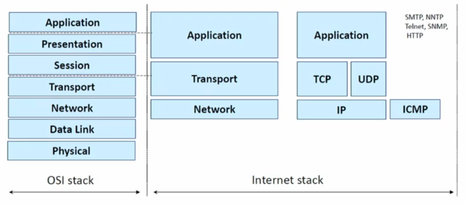
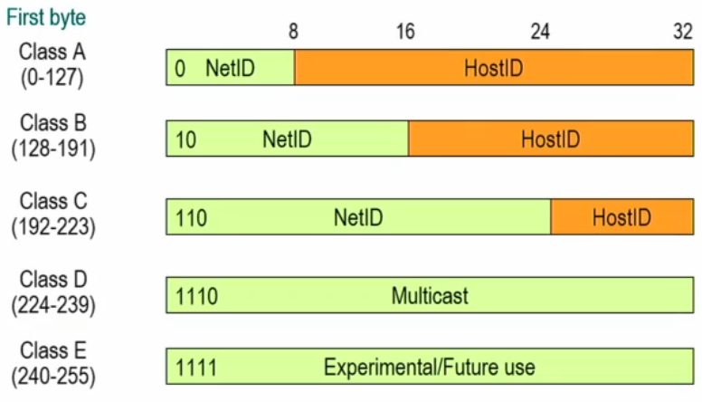

## Il Paradigma di Internet
Possiamo riferirci a Internet come a una rete di reti, ovvero a una rete che è un insieme di reti interconnesse a commutazione di pacchetto con una struttura gerarchica in cui queste reti sono raggruppate in vari sistemi autonomi. Ogni singolo sistema autonomo è gestito ed amministrato in maniera indipendente.

Una cosa fondamentale è garantire che due host che vogliono comunicare possano farlo; è necessario creare un instradamento corretto per poterli mettere in comunicazione.

Dal punto di vista dei servizi, Internet è
- una rete logica indipendente dalle tecnologie trasmissive utilizzate
- una piattaforma a supporto della definizione di applicazioni distribuite; se voglio mettere in comunicazione due processi su due macchine differenti, apro una socket TCP o UDP ma mi disinteresso completamente dell'implementazione della rete sottostante.

## Stack Internet a il modello OSI

In un'architettura a strato vengono implementati dei servizi in ogni strato che si basano sui servizi messi a disposizione negli strati sottostanti. Questo permette di suddividere i compiti in modo intelligente. Se voglio cambiare il protocollo che adotto in uno specifico strato, posso farlo senza intaccare gli altri strati.

## Modello di Interconnessione
Il protocollo IP è quel protocollo che funge da collante di tutta la rete internet e le entità fondamentali sono i router e gli host.

- **Router**: nodi che interconnettono network fisici instradando l'informazione contenuta nei pacchetti IP fino alla loro destinazione
- **Hosts**: nodi terminali capaci di interpretare tutti i livelli dello stack TCP/IP

## Ripasso del Protocollo IP
Innanzitutto, il protocollo IP è il protocollo fondamentale; la versione di IP maggiormente adottata al giorno d'oggi è IPv4.

- fornisce un servizio di tipo best-effort: trasmette dati senza garantirne la consegna, l'ordine, integrità, fa del suo meglio per trasportare da mittente a destinatario.
- IP (livello di rete 3), permette di frammentare i pacchetti se il layer 2 lo richiede, in modo da trasmetterli al livello più piccoli. La ricostruzione dei frammenti arriva solo alla ricezione, ovvero lato destinatario.

Il protocollo IP è un protocollo di livello 3 (network), che risiede sopra il livello 2 Data Link.

Come è possibile vedere dall'immagine, che rappresenta un esempio di interconnessione di una Local Area Network, il protocollo IP è condiviso da tra le reti LAN, mentre a livello 2 posso avere dei protocolli differenti.  
IP viene parlato da tutti i dispositivi.

### Indirizzi IP
Gli indirizzi IP sono rappresentati in notazione decimale puntata, formati da 32 bit raggruppati in gruppi da 8.

10000011 10101111 00010101 00000001
131.175.21.1

Gli indirizzi si suddividono in due parti:
- **NetID**: identificano la rete
- **HostID**: identificano l'host nella rete

Tutti gli host nella stessa rete condividono lo stesso NetworkID.

#### Classful Addressing

Originariamente, come venivano definiti gli indirizzi di rete e gli indirizzi di host in un lindirizzamento Classful? Andando a vedere il primo bit del NetID.
- Se il primo bit è pari a 0, so che per certo che l'indirizzo è di classe A e che i primi 8 bit sono riservati al NetID
- Se il primo bit è pari a 1 e il secondo pari a 0, allora è classe B e i primi 16 bit sono riservati al NetID
- Eccetera

#### Indirizzi Speciali
- Per ciascuna rete, esiste un indirizzo speciale che la identifica; consiste nell'impostare tutti i bit dell'HostID pari a 0. Identifica la rete.
- Indirizzo di broadcast: tutti i bit HostID impostati a 1.
- Indirizzo di loopback: tutti gli indirizzi che iniziano ocn 127 indicano un loopback allo stesso host (localhost).

## Subnetting
Il subnetting aggiunge un grado di flessibilità ed elimina la rigidità e i limiti del Classful Addressing.

Gli indirizzi di tipo Classful sono estremamente rigidi e non permettono di specificare un numero di host consono a quelli che sono le effettive necessità delle varie reti. Quindi, è stato definito il meccanismo del subnetting che permette di definire in maniera dinamica e flessibile quanti bit sono assegnati alla parte di rete e quanti bit sono asseganti alla parte di host.

Posso assegnare indirizzi IP con una granularità più fine, ma per fare ciò ho bisogno di un nuovo elemento: la **Subnet Mask**. La Subnet Mask va a definire effettivamente quanti bit sono relativi alla parte di sottorete e quanti bit sono relativi alla parte di host.

:::danger
Un router NON HA un indirizzo IP! Un router ha un indirizzo IP per interfaccia, non uno specifico e basta. Gli indirizzi IP sono assegnati alle interfacce, non hai nodi.
:::

## Pacchetto IP

Innanzitutto, l'header del pacchetto IP è grande **almeno** 20 bytes. Potrebbe essere più di 20 perché ci sono delle opzioni che possono aumentarne la dimensione. Siccome devo raggiungere dimensioni multiple di 32 bit, potrei aver bisogno di aggiungere padding, ovvero bit senza significato per appunto raggiungere i valori multipli di 32.

Quali sono i campi a disposizione nel pacchetto IP?
- Versione (4 bit): indica la versione di protocollo. 4 per IPv4, 6 per IPv6.
- Header Lenght (4 bit): indica la lunghezza dell'header, espressa in parola da 32 bit. Il minimo valore valido è 5; ho sempre almeno 5 parole da 32 bit, ma posso averne anche più di 5.
- Type of Service (8 bit): viene utilizzato per gestire la priorità nelle code quando voglio implementare politiche di qualità del servizio.
- Total Length (16 bit): indica la lunghezza totale del pacchetto in byte. Sottraendo la Header Length alla Total Length, è possibile sapere quanto è lungo il Payload.
- Time To Live: impostato a un valore e viene decrementato ad ogni router passato.
- Header Checksum: utilizzato per controllare l'integrità dell'header del pacchetto IP, capire se ci sono errori nella trasmissione dei bit. Se così fosse, bisogna scartare il pacchetto.

## Fragmentation
La seconda riga del pacchetto IP rappresenta i seguenti componenti utili per la frammentazione:
- Fragmentation Identification (16 bit): campo che identifica univocamente tutti i fragments che appartengono allo stesso pacchetto.
- Flags (3 bit):
  I bit sono composti come:
  | 0 | D | M |
  - il primo bit è settato a 0
  - il secondo è il bit D che viene settato quando non voglio effettuare la frammentazione del mio pacchetto. (Don't Fragment).
  - il terzo bit è il bit M, ovvero il bit More. Sarà impostato a 0 solamente per l'ultimo fragment, 1 per gli altri. Indica che ce ne sono ancora altri.
- Fragment Offset (13 bit): immaginiamo di avere un pacchetto con payload di 2000 byte. Abbiamo la necessità di frammentarlo in due pacchetti da 1000 byte l'uno. Il primo frammento avrà Fragment Offset 0 perché includerà i primi byte del pacchetto originario, il secondo invece avrà come Offset 1000. Tuttavia, visto che il Fragment Offset per regola deve essere espresso come multipli di 8 bytes, non verrà scritto come 1000, bensì 1000/8, ovvero 125.

Innanzitutto, solitamente viene effettuata per necessità del livello sosttostante. Magari il livello 2 non può gestire il pacchetto di determinate dimensioni, quindi viene richiesto il pacchetto frammentato per farli rientrare nella dimensione massima.

Ogni frammento avrà ovviamente vita propria e viaggerà indipendentemente dagli altri sulla rete, ognuno con la sua intestazione.
