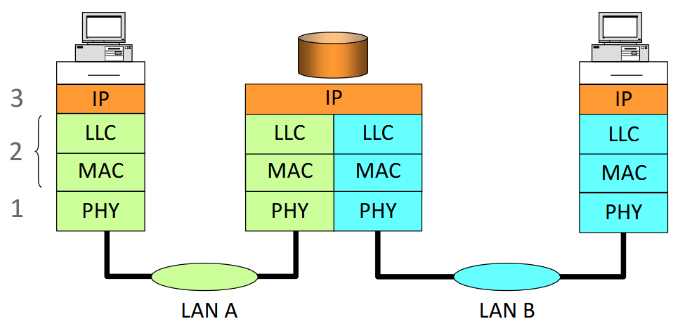
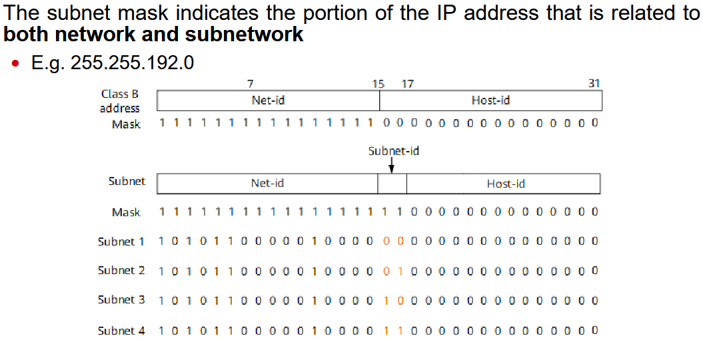
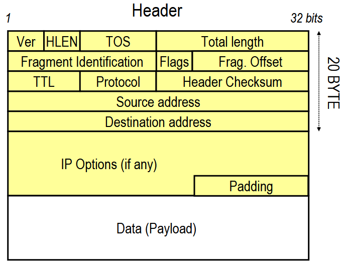

## Il Paradigma di Internet

Possiamo riferirci a Internet come a una **rete di reti**: una rete formata da un insieme di reti interconnesse **a commutazione di pacchetto**, con una struttura **gerarchica** in cui queste reti sono raggruppate in vari **sistemi autonomi**. Ogni singolo sistema autonomo è gestito ed amministrato in maniera **indipendente**.

:::note[Obiettivo fondamentale]
Garantire che due host che vogliono comunicare possano farlo: è necessario creare un **instradamento corretto** per metterli in comunicazione.
:::

Dal punto di vista dei **servizi**, Internet è:

- una **rete logica** indipendente dalle tecnologie trasmissive utilizzate;
- una **piattaforma** a supporto della definizione di **applicazioni distribuite**. Se voglio mettere in comunicazione due processi su due macchine differenti, apro una socket TCP o UDP ma mi disinteresso completamente dell'implementazione della rete sottostante.

## Stack Internet e il modello OSI


In un'**architettura a strati** vengono implementati dei servizi in ogni strato che si basano sui servizi messi a disposizione negli strati sottostanti. Questo permette di suddividere i compiti in modo intelligente.

:::tip[Vantaggio della stratificazione]
Se voglio cambiare il protocollo che adotto in uno specifico strato, posso farlo **senza intaccare gli altri strati**.
:::

## Modello di Interconnessione

Il protocollo **IP** è quel protocollo che funge da **collante** di tutta la rete Internet. Le entità fondamentali sono i **router** e gli **host**.

| Entità | Ruolo |
| --- | --- |
| **Router** | Nodi che interconnettono network fisici, instradando l'informazione contenuta nei pacchetti IP fino alla loro destinazione. |
| **Host** | Nodi terminali capaci di interpretare tutti i livelli dello stack TCP/IP. |

## Ripasso del Protocollo IP

Innanzitutto, il protocollo IP è il protocollo fondamentale; la versione di IP maggiormente adottata al giorno d'oggi è **IPv4**.

- Fornisce un servizio di tipo **best-effort**: trasmette dati senza garantirne la consegna, l'ordine o l'integrità. Fa del suo meglio per trasportare da mittente a destinatario.
- IP (livello di rete, **livello 3**) permette di **frammentare** i pacchetti se il livello 2 lo richiede, in modo da trasmetterli in dimensioni più piccole. La **ricostruzione** dei frammenti avviene solo alla ricezione, ovvero lato destinatario.

Il protocollo IP è un protocollo di **livello 3 (Network)**, che risiede sopra il **livello 2 (Data Link)**.



Come è possibile vedere dall'immagine, che rappresenta un esempio di interconnessione di una Local Area Network, il protocollo IP è **condiviso** tra le reti LAN, mentre a livello 2 posso avere protocolli differenti.

:::note
**IP viene "parlato" da tutti i dispositivi.**
:::

### Indirizzi IP

Gli indirizzi IP sono rappresentati in **notazione decimale puntata**, formati da **32 bit** raggruppati in gruppi da 8.

```text
10000011 10101111 00010101 00000001
   131  .   175  .   21   .    1
```

Gli indirizzi si suddividono in due parti:

- **NetID** → identifica la rete;
- **HostID** → identifica l'host nella rete.

:::tip
Tutti gli host nella **stessa rete** condividono lo stesso **NetID**.
:::

#### Classful Addressing


Originariamente, come venivano definiti gli indirizzi di rete e gli indirizzi di host in un indirizzamento **Classful**? Andando a guardare i **primi bit** del NetID:

- se il primo bit è pari a **0** → l'indirizzo è di **classe A** e i primi **8 bit** sono riservati al NetID;
- se il primo bit è **1** e il secondo è **0** → è di **classe B** e i primi **16 bit** sono riservati al NetID;
- e così via.

#### Indirizzi Speciali

| Indirizzo | Come si ottiene | Significato |
| --- | --- | --- |
| **Indirizzo di rete** | Tutti i bit dell'**HostID a 0** | Identifica la rete stessa |
| **Indirizzo di broadcast** | Tutti i bit dell'**HostID a 1** | Raggiunge tutti gli host della rete |
| **Indirizzo di loopback** | Indirizzi che iniziano con **127** | Loopback verso lo stesso host (`localhost`) |

## Subnetting

Il **subnetting** aggiunge un grado di flessibilità ed elimina la rigidità e i limiti del Classful Addressing.

Gli indirizzi di tipo Classful sono estremamente **rigidi** e non permettono di specificare un numero di host consono alle effettive necessità delle varie reti. Per questo è stato definito il meccanismo del subnetting, che permette di definire in maniera **dinamica e flessibile** quanti bit sono assegnati alla parte di rete e quanti alla parte di host.

Posso così assegnare indirizzi IP con una **granularità più fine**, ma per farlo ho bisogno di un nuovo elemento: la **Subnet Mask**. La Subnet Mask definisce effettivamente quanti bit sono relativi alla parte di **sottorete** e quanti alla parte di **host**.



:::danger[Attenzione]
Un router **NON HA** un singolo indirizzo IP! Un router ha **un indirizzo IP per interfaccia**, non uno solo. Gli indirizzi IP sono assegnati alle **interfacce**, non ai nodi.
:::

## Pacchetto IP



Innanzitutto, l'header del pacchetto IP è grande **almeno 20 byte**. Potrebbe essere più grande perché ci sono delle **opzioni** che possono aumentarne la dimensione. Siccome devo raggiungere dimensioni multiple di 32 bit, potrei aver bisogno di aggiungere del **padding**, ovvero bit senza significato, appunto per raggiungere valori multipli di 32.

Quali sono i campi a disposizione nel pacchetto IP?

| Campo | Dimensione | Descrizione |
| --- | --- | --- |
| **Versione** | 4 bit | Indica la versione del protocollo: `4` per IPv4, `6` per IPv6. |
| **Header Length** | 4 bit | Lunghezza dell'header, espressa in parole da 32 bit. Il valore minimo valido è **5** (sempre almeno 5 parole da 32 bit, ma possono essere di più). |
| **Type of Service** | 8 bit | Gestione della **priorità** nelle code, per implementare politiche di qualità del servizio. |
| **Total Length** | 16 bit | Lunghezza totale del pacchetto in byte. Sottraendo la Header Length alla Total Length si ricava la lunghezza del **Payload**. |
| **Time To Live (TTL)** | - | Impostato a un valore iniziale, viene **decrementato** ad ogni router attraversato. |
| **Header Checksum** | - | Controlla l'**integrità** dell'header del pacchetto IP, per capire se ci sono errori nella trasmissione dei bit. In tal caso, il pacchetto viene **scartato**. |

## Fragmentation

La **seconda riga** dell'header IP contiene i seguenti campi, utili per la **frammentazione**:

- **Fragmentation Identification** (16 bit): identifica univocamente tutti i fragment che appartengono allo **stesso pacchetto**.
- **Flags** (3 bit): i bit sono composti come `| 0 | D | M |`
  - il **primo bit** è sempre settato a `0`;
  - il bit **D** (*Don't Fragment*) viene settato quando **non voglio** effettuare la frammentazione del pacchetto;
  - il bit **M** (*More*) è impostato a `0` solo per l'**ultimo** fragment e a `1` per tutti gli altri, indicando che ce ne sono ancora.
- **Fragment Offset** (13 bit): indica la posizione del frammento all'interno del pacchetto originario.

:::note[Esempio - Fragment Offset]
Immaginiamo di avere un pacchetto con payload di **2000 byte** da frammentare in **due pacchetti da 1000 byte** l'uno.

- Il **primo frammento** avrà Fragment Offset `0`, perché include i primi byte del pacchetto originario.
- Il **secondo** avrà come Offset `1000`. Tuttavia, poiché il Fragment Offset per regola deve essere espresso in **multipli di 8 byte**, non verrà scritto come `1000`, bensì come `1000 / 8 = 125`.
:::

La frammentazione viene solitamente effettuata per **necessità del livello sottostante**. Magari il livello 2 non può gestire un pacchetto di determinate dimensioni, quindi viene richiesto il pacchetto frammentato per farlo rientrare nella dimensione massima consentita.

:::tip
Ogni frammento ha **vita propria** e viaggia **indipendentemente** dagli altri sulla rete, ognuno con la sua intestazione.
:::
