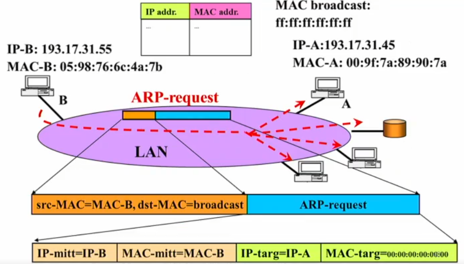

## Corrispondenza tra indirizzi IP e indirizzi fisici

Vogliamo comunicare con un host nella **stessa rete locale**. Solitamente ne conosco l'**indirizzo IP**, ma non l'**indirizzo MAC**, ovvero l'indirizzo fisico.

:::note[Il problema]
Dato l'**IP** di un host, serve un protocollo in grado di reperire il suo **MAC**, dato che è quest'ultimo a essere usato per la comunicazione a **livello 2**.
:::

Questo protocollo è l'**ARP** (*Address Resolution Protocol*). Le corrispondenze tra indirizzi IP e MAC vengono salvate in una tabella:

- **ARP Table** (o **ARP Cache**): tabella che salva le corrispondenze tra **indirizzi IP** e **indirizzi MAC**.

## Funzionamento

1. **ARP Request** - Il nodo B invia una richiesta in cui specifica:
   - come **MAC di destinazione** un indirizzo MAC di **broadcast**;
   - come **MAC di sorgente** il proprio indirizzo MAC (così può comunicarlo all'altro nodo);
   - l'**indirizzo IP del destinatario** che sta cercando.

   In sostanza chiede: *"Chi ha questo indirizzo IP? Può dirmi quale sia il suo indirizzo MAC?"*

2. **Ricezione** - Tutti gli host sulla rete locale ricevono il messaggio, ma **solo uno** trova un match con il proprio indirizzo IP.

3. **ARP Reply** - Questo host invia una risposta comunicando il proprio **indirizzo MAC**.

4. **Caching** - Ricevuta l'informazione, il primo host **salva l'associazione** nella propria ARP Table.

:::tip
Grazie al caching, non è necessario rieseguire ARP la **prossima volta** che si contatta lo stesso host.
:::
