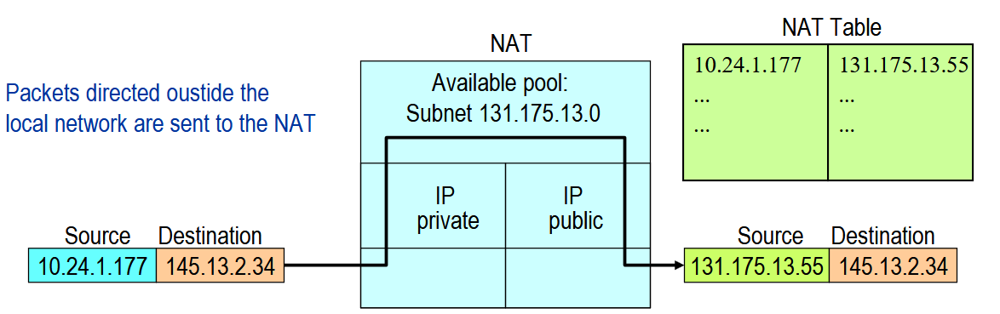
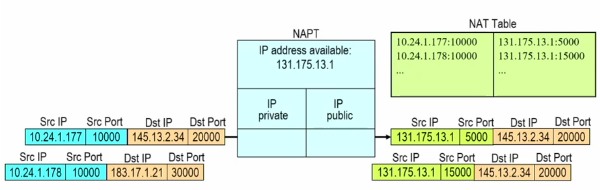

## Network Address Translator

A livello IP si usano indirizzi di **32 bit**, ovvero circa 4 miliardi di possibili IP distinti, che al giorno d'oggi **non sono sufficienti**.

Si potrebbe standardizzare **IPv6**, ma nel mentre una soluzione meno invasiva proposta è stata la distinzione tra **indirizzi IP pubblici** e **privati**:

- gli **indirizzi pubblici** vengono esposti su interfacce visibili sulla rete Internet pubblica;
- gli **indirizzi privati** vengono assegnati a interfacce di dispositivi che **non** sono esposti direttamente alla rete pubblica.

:::note[Esempio tipico]
Il router a casa nostra è esposto alla rete pubblica, mentre i nostri dispositivi no.
:::

Gli intervalli riservati agli indirizzi privati sono:

| Pool | Intervallo |
| --- | --- |
| **Pool 1** | `10.xx.xx.xx` |
| **Pool 2** | da `172.16.0.0` a `172.31.255.255` |
| **Pool 3** | `192.168.xx.xx` |

Chiaramente, se faccio una cosa del genere, ho necessità di un meccanismo che **mappi gli indirizzi IP privati su indirizzi IP pubblici** ogni qualvolta devo comunicare con un host che si trova in una rete pubblica, o se per comunicare con questo host devo transitare per una rete pubblica. Questo è appunto il **NAT**.

## Funzionamento del NAT

Se ad esempio sono nella mia rete privata e voglio andare verso la rete pubblica, ho un indirizzo IP sorgente e uno di destinazione. Arrivo al **router**, dove solitamente viene eseguito il NAT: questo prende un indirizzo IP dal pool e va a **sostituire l'indirizzo IP di sorgente**.

Abbiamo quindi bisogno di una **NAT table** per mettere in relazione indirizzo IP privato e pubblico.

Queste associazioni possono essere **statiche** o **dinamiche**:

- **statiche** → l'associazione dura nel tempo.

### Dynamic Assignment

Si basa sul concetto di **sessione**:

1. Quando il NAT riceve il **primo pacchetto** di una sessione, crea l'associazione tra IP privato e IP pubblico.
2. Alla **fine della sessione**, l'indirizzo viene liberato.

### Basic NAT & NAPT

Con il **Basic NAT** si ha una corrispondenza **one-to-one** tra indirizzi durante una sessione.

:::caution[Il problema]
Ci potrebbero essere dei **blocchi** a causa di un numero non sufficiente di indirizzi pubblici quando il numero di sessioni attive è alto.
:::

La soluzione è il **NAPT** (*Network Address Port Translator*): invece di tradurre indirizzi IP, traduce la **coppia** `(IP privato - porta TCP/UDP)`.

:::tip[Vantaggio chiave]
È possibile **condividere uno stesso IP pubblico** tra più host che hanno differenti IP privati.
:::

