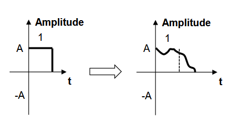
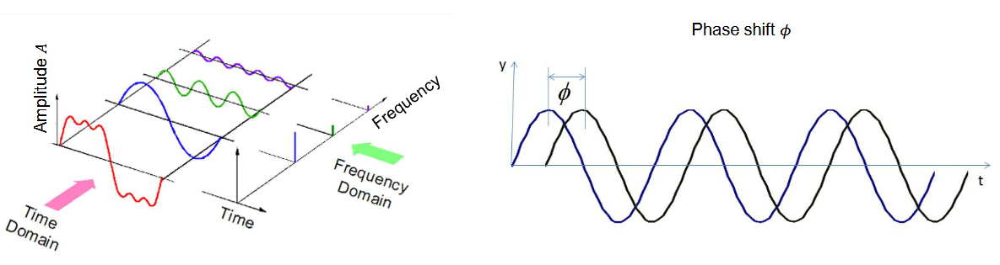
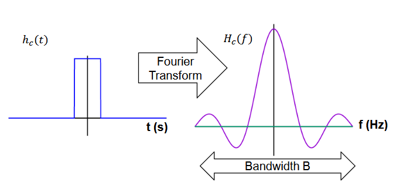
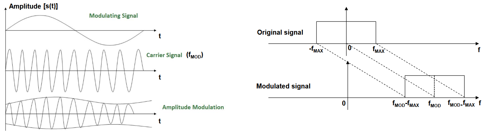
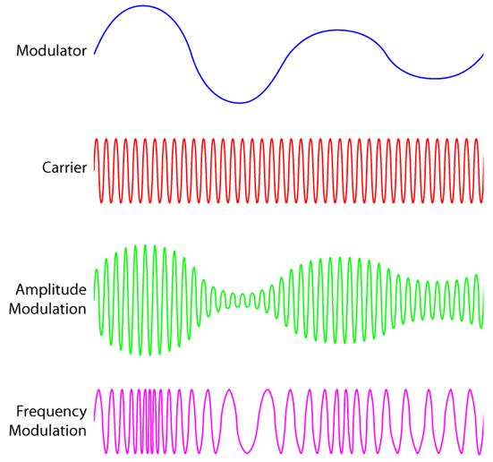
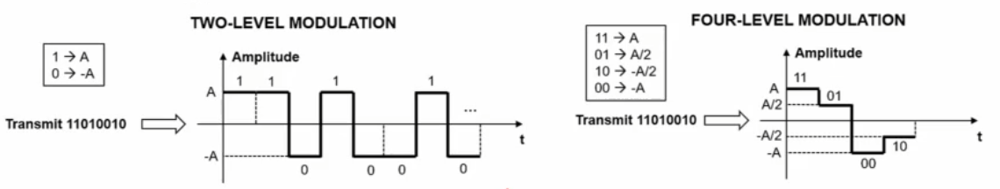

## Canale di Trasmissione

Ci concentriamo sulla **Comunicazione Digitale**.

Come abbiamo sempre visto, il tutto si riduce ad avere una sequenza di bit **0** e **1**. In che modo questa sequenza si può trasmettere sul canale di comunicazione? È fondamentale che venga **codificata in un segnale fisico** che possa essere propagato in maniera efficace sul mezzo trasmissivo: abbiamo bisogno di una **forma d'onda** elettrica o ottica.

Il punto è che ho necessità di avere un **segnale analogico** che possa essere trasferito.

:::note[Esempio]
Voglio trasmettere la sequenza `1101001`: posso dire che, se devo trasmettere il bit con valore **1**, allora avrò un'onda di ampiezza $A$, mentre se il bit è **0**, l'onda sarà di ampiezza $-A$.
:::

.png)

In questo esempio, questo è il nostro segnale $s(t)$ al variare del tempo. Possiamo vederlo come un segnale analogico che posso trasmettere sul canale di comunicazione.

:::caution
Nella realtà, questo particolare segnale **non può essere trasmesso** perché ha delle **discontinuità**: i segnali non possono avere discontinuità.
:::

Quindi, il **Transmission Channel** è un'astrazione che modella insieme il mezzo di trasmissione e le possibili sorgenti di **rumore**, **distorsione** del segnale e **attenuazione**. Tutti questi *impairments* hanno effetto sul trasferimento del segnale.

## Come Posso Modellare un Canale di Trasmissione?

Posso modellarlo per mezzo di una funzione nel tempo $h_c(t)$ che prende il nome di **Funzione di Trasferimento**.

Questa Funzione di Trasferimento va a modificare il mio segnale $s(t)$, avendo anche una sorgente di rumore $n(t)$, in un nuovo segnale $\hat{s}(t)$.

.png)

| Impairment | Modellato da | Descrizione |
| --- | --- | --- |
| **Attenuazione** | $h_c(t)$ | Indica in che modo il segnale si attenua sulla base del modo in cui il canale di trasmissione lo assorbe. Più vado distante, più il segnale è attenuato. |
| **Distorsione** | $h_c(t)$ | Il segnale che trasmetto potrebbe espandersi e invadere periodi di tempo che sono in realtà utilizzati per trasmettere altri bit. |
| **Rumore** | $n(t)$ | Ha una natura **additiva**, quindi si somma al segnale. |

In questa immagine si vede come l'attenuazione attenua appunto il segnale col passare del tempo, ma è possibile inoltre notare come la distorsione sta dilatando il segnale oltre la soglia del primo bit trasmesso.

Praticamente, la funzione di trasferimento $h_c(t)$ è una funzione matematica che va a modellare in che modo il mio canale **distorce** e **attenua** il segnale.

Cos'è la **Banda** di un canale di trasmissione? Per poter rispondere a questa domanda, è necessario conoscere la **Fourier Transform**.

## Fourier Transform

Ogni segnale nel dominio del tempo può essere visto come una **somma infinita di segnali sinusoidali**, che hanno differente **frequenza**, **ampiezza** e **fase** (*phase shifts*, sfasamento rispetto all'asse y).

La **Fourier Transform** è un operatore che permette di trasformare un segnale dal **dominio del tempo** al **dominio della frequenza**. Quindi, partendo da $s(t)$, ottengo $S(f)$, rappresentando però la stessa cosa.

Per ogni possibile frequenza, vado a indicare qual è l'**ampiezza** e qual è la **fase**.

:::note[Ricapitolando]
Abbiamo un segnale sinusoidale qualsiasi che può essere scomposto in una serie infinita di sinusoidi. La Fourier Transform, per ognuna di queste sinusoidi, per ogni valore $f$ mi dice qual è l'**ampiezza** e la **fase** di quello specifico segnale.
:::

Abbiamo un segnale nel tempo, rappresentato in figura come il segnale **rosso**, che può essere visto come la scomposizione delle altre 3 sinusoidi **blu**, **verde** e **viola**. Ortogonalmente, avremmo anche l'asse della frequenza: guardando l'immagine, per ciascuna delle sinusoidi è rappresentato l'**impulso**, ovvero la loro altezza. In questo caso specifico hanno sfasamento nullo rispetto all'origine, ma potrei anche avere questo sfasamento. Quindi la Fourier Transform indica qual è il valore di questo sfasamento, con simbolo **Ø**.

## Banda

Per questo esempio, la trasformazione viene visualizzata in questo modo, ma non ci interessa sapere nel dettaglio il motivo. Ci interessa solamente sapere che è risultata così.

:::tip[Definizione]
La **banda** corrisponde all'estensione massima delle componenti in frequenza **non nulle**. Potrei arrivare a un punto in cui ho solo valori nulli come valori in frequenza: la mia banda è quanto più si estende il mio segnale per cui esistono valori **non nulli**.
:::

## Capacità di Canale

La **capacità di canale** è il **massimo bitrate** al quale posso trasferire l'informazione sul canale in maniera **affidabile**. Affidabile significa che il bit error rate può essere mantenuto piccolo a piacere.

:::note[Bit Error Rate (Tasso di Errore sui Bit)]
Quanti bit sbaglio rispetto a un determinato riferimento. Se ho, per esempio, un Bit Error Rate pari a $10^{-3}$, significa che sbaglio **1 bit ogni 1000**.
:::

Nel **1948** Shannon dimostra che la capacità massima $C$ di un canale rumoroso è pari a:

$$
C = B \cdot \log_2\left(1 + \frac{S}{N}\right) \quad [bit/s]
$$

Dove:

- $B$ → banda misurata in **Hz**;
- $\frac{S}{N}$ → rapporto **segnale-rumore**:
    - $S$ → potenza del segnale in **W**;
    - $N$ → rumore del segnale in **W**.

In parole semplici: più il segnale ha potenza elevata, meglio è; più il rumore è basso, meglio è.

:::caution[Perché non posso aumentare la capacità a piacere?]
La capacità $C$ **non** dipende solamente dalle caratteristiche del mezzo, perché dipende dalla potenza del segnale, che varia in base a cosa sto trasmettendo. Ma allora perché non posso rendere $C$ grande a piacere trasmettendo segnali con potenza elevatissima?

Perché la componente di segnale $S$ diventerebbe componente di rumore $N$ su altri canali a causa di **interferenze**: non posso sparare segnali a potenza elevatissima, perché danneggerebbero i canali di comunicazione.
:::

Il **signal-to-noise ratio** $\frac{S}{N}$ definisce il **limite** che non possiamo superare: più il rapporto è piccolo, più il canale è poco capiente.

So quindi che a livello logico posso **avvicinarmi** a questo limite teorico. Esistono delle modulazioni che permettono al giorno d'oggi di quasi raggiungerlo? È fondamentale che, una volta conosciuto questo limite, si cerchi di utilizzare una **modulazione appropriata** per avvicinarsi il più possibile ad esso.

## Modulazione Analogica

Il compito della modulazione analogica è **convertire in alta frequenza** il segnale originale (**segnale modulante**).

L'idea è prendere il mio segnale originale e **spostarlo lungo l'asse delle frequenze**.

L'immagine a destra è l'effetto che ottengo se faccio la modulazione di sinistra.

Il segnale di **Carrier** viene scelto in modo opportuno, con l'obiettivo di avere più segnali che possono essere trasmessi sul mio mezzo di comunicazione, centrati su carrier differenti.

:::note[Esempio della radio]
Mi sintonizzo su una specifica frequenza, che corrisponde al **Carrier**. Uso un **band-pass filter** per isolare la frequenza che voglio ascoltare. Quindi, l'obiettivo è incasellare più segnali a livello del mio canale di comunicazione, cercando di **non sovrapporli**.
:::

## Modulazione Digitale

Il compito della Modulazione Digitale è assegnare **forme d'onda** (*waveforms*) a gruppi di bit che vanno trasmessi, con l'obiettivo di generare un segnale **robusto** a distorsione e rumore.

- Ogni waveform prende il nome di **symbol** e dura per un certo periodo di tempo.
- Il numero di symbol che posso trasmettere al secondo prende il nome di **Baud Rate**.

:::tip[Bitrate vs Baud Rate]
Se ho per esempio **2 bit** su ogni simbolo, il **bitrate** sarà il **doppio** rispetto al baud rate, siccome il bitrate è il numero di bit al secondo e il baud rate il numero di simboli al secondo.
:::

Una modulazione a 4 livelli rende possibile la trasmissione di un numero maggiore di bit per secondo. Tuttavia, richiede un $\frac{S}{N}$ più alto per assicurare piccoli tasso di errore di bit.

## Codifica
Consiste nel mappare un gruppo di bit a un altro gruppo di bit.

- **Codifica di Sorgente**:  
compressione delle informazioni per ridurre la ridondanza del segnale originale. Può essere lossless o lossy.
- **Codifica di Canale**:  
protegge informazione rispetto errori di bit introdotti dal canale di trasmissione, di solito richiede l'utilizzo di **error detection** e **correction codes**.