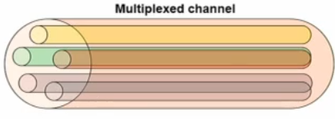
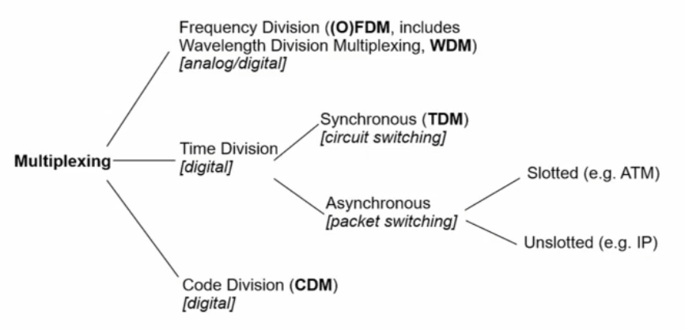
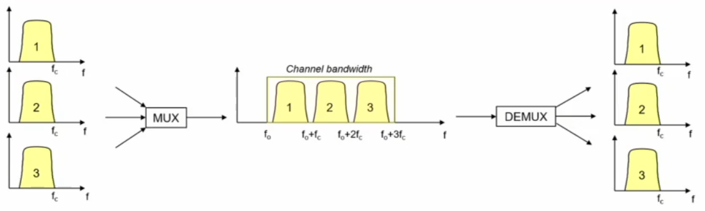
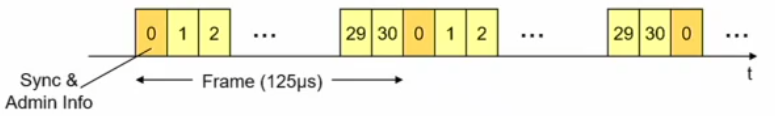
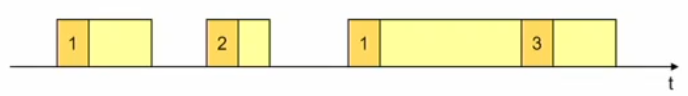
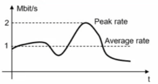
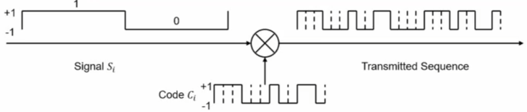
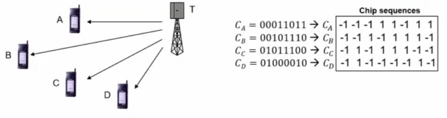
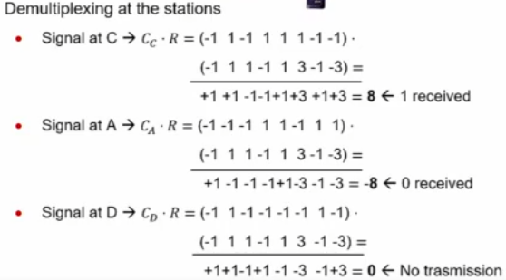
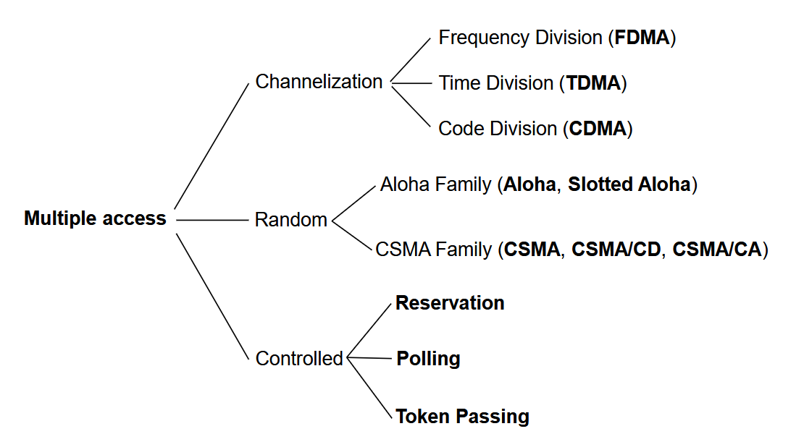

## Multiplexing

La **multiplazione** non è altro che quell'operazione che permette di **condividere la capacità** offerta da un canale di trasmissione tra segnali diversi, combinati in un unico segnale.

Come vado a fare la multiplazione? Devo condividere la capacità del mio canale, suddividendo e assegnando a diverse **sorgenti** (utenti o servizi) una specifica risorsa.

Quando si parla di **risorsa**, si intende una delle seguenti:

- **frequenza**
- **tempo**
- **codice**

:::note[Demultiplazione]
L'operazione inversa della multiplazione è la **demultiplazione**, che permette di estrarre i segnali singoli partendo dal segnale aggregato.
:::

### Classificazione delle Tecniche di Multiplexing

### Frequency Division Multiplexing (FDM)

Abbiamo un canale e vogliamo suddividerlo in **bande di frequenza** differenti, ognuna assegnata a un segnale differente.

Parto da segnali in **banda base** e, per mezzo della modulazione analogica, li porto in **banda passante**: avrò così i miei segnali a cui è assegnata una porzione di banda del mio canale. Con la demultiplazione faccio l'inverso.

### Orthogonal Frequency Division Multiplexing (OFDM)

Vado a suddividere il canale, anche con una banda abbastanza larga, in tante piccole **sottoportanti** con banda molto piccola e con la caratteristica di essere **ortogonali** l'una con l'altra. Significa che, se trasmetto dei bit su ognuna di queste sottoportanti, non si crea interferenza con le trasmissioni effettuate sulle altre, anche vicine.

Ognuna di queste sottoportanti trasmette **in parallelo** e garantisce un bitrate molto ridotto.

:::tip[Quando conviene]
Ha senso adottare questa tecnica quando sto condividendo il canale tra più sorgenti e ho una grossa **variabilità** nella qualità del mio canale.
:::

### Synchronous Time Division Multiplexing (TDM)

In questo caso la risorsa suddivisa è il **tempo**. Significa che ogni singola sorgente può trasmettere solo in determinate porzioni di tempo; quando ha la possibilità di trasmettere nella propria fascia, si trasmette alla **piena banda** disponibile.

Quindi, i bit sono trasmessi dalla sorgente a turni regolari, che prendono il nome di **time slot**.

- La struttura periodica che otteniamo e che si ripete continuamente è chiamata **frame**. La dimensione tipica è **125 microsecondi**.

:::caution[Sincronizzazione]
È necessario che sia chiaro a tutti quando inizia uno specifico frame e uno specifico time slot. L'informazione di sincronizzazione viene riportata nel primo **time slot 0**, che permette di riconoscere quanto dura un frame.
:::

### Asynchronous Time Division Multiplexing (ATDM)

È la più adatta per network a **commutazione di pacchetto**. L'informazione è formattata in **pacchetti** e ho una trasmissione totalmente **asincrona**. Vado comunque a dividere il mio tempo.

I pacchetti possono avere lunghezza fissa o variabile:

| Lunghezza pacchetto | Tempo |
| --- | --- |
| **fissa** | slottato |
| **variabile** | unslottato |

Rispetto al TDM, con l'ATDM è molto più semplice fare multiplexing di sorgenti a bitrate differenti: se ho, per esempio, un'unica sorgente che sta trasmettendo, può utilizzare l'**intera capacità** del canale, senza essere limitata da time slot assegnati.

### Multiplazione Statistica

La multiplazione asincrona abilita la **Multiplazione Statistica**, ovvero quella tecnica che permette di adattare la condivisione del canale sulla base dell'**intensità di traffico istantanea** generata dalle diverse sorgenti. Praticamente: se ho una sorgente, posso sfruttare a pieno la capacità del canale, mentre se ho $n$ sorgenti, dovrò dividerla.

:::note[Esempio]

Immaginiamo di voler multiplexare diverse sorgenti con **2 Mbit/s di picco** che in media trasmettono **1 Mbit/s**, su un canale da **100 Mbit/s**.

La domanda è: quanti flussi posso multiplare? Non esiste una risposta univoca. Abbiamo due possibilità estreme:

- **Niente multiplazione statistica → 50 sorgenti**: assegnando 2 Mbit/s a ciascuna sono tranquillo, quindi accetto 50 sorgenti. Il problema è che in media il canale è **sotto-utilizzato** (in media 50 Mbit/s occupati, ovvero il 50% della capacità), sprecando l'altro 50% per garantire che non ci siano perdite.
- **Multiplazione statistica → 100 sorgenti**: il problema è che se contemporaneamente le 100 sorgenti trasferiscono alla **Peak Rate**, avrò 200 Mbit/s su un canale da 100 Mbit/s, ovvero un tasso di perdita del **50%** (un valore enorme: nelle reti significa che la rete non sta funzionando).
:::

### Code Division Multiplexing (CDM)

Altra tecnica molto utilizzata in contesto wireless; per esempio la rete **3G** usa CDM.

Il segnale da trasmettere è $S_i$, e viene moltiplicato per un **codice** $C_i$. Un codice è una sequenza di bit anch'essa codificata con modulazione a 2 livelli, il cui tempo di trasmissione del singolo bit è molto più piccolo rispetto al singolo bit del segnale che voglio trasmettere.

In questo caso ho una sequenza di **12 bit**, codificata da una modulazione a 2 livelli (**+1** e **-1**), che prende il nome di **Chip Sequence**.

Quando trasmetto il segnale, moltiplico la Chip Sequence per il segnale che sto trasmettendo, ottenendo la frequenza effettiva che viene trasmessa.

:::note[Esempio]

Immaginiamo di avere un trasmettitore **T** e 4 ricevitori **A, B, C, D**. Ho inoltre 4 codici $C_n$ e le relative sequenze di Chip.

I codici sono tutti **ortogonali**, e.g.: $C_B \cdot C_D = 1-1-1+1-1-1+1+1 = 0$. La somma vale 0 per tutte le coppie di codici.

Immaginiamo che T voglia trasmettere allo stesso tempo 3 segnali:

- `0`, modulato come **-1**, ad A
- `1`, modulato come **1**, a B
- `1`, modulato come **1**, a C
- niente a D

Allora cosa succede?

- Sequenza trasmessa ad A ($-1 \cdot C_A$) → `1 1 1 -1 -1 1 -1 -1`
- Sequenza trasmessa a B ($1 \cdot C_B$) → `-1 -1 1 -1 1 1 1 -1`
- Sequenza trasmessa a C ($1 \cdot C_C$) → `-1 1 -1 1 1 1 -1 -1`
- **Somma finale** → `-1 1 1 -1 1 3 -1 -3`

Questo è il segnale aggregato **R** che verrà ricevuto da tutti: A, B, C e D.

A questo punto, ogni singolo ricevitore deve fare la **demultiplazione**:

- Se ottengo un valore **alto** (vicino al massimo della lunghezza della Chip Sequence), significa che mi è stato trasmesso un **1**.
- Se ottengo un valore **basso** (vicino al minimo), significa che mi è stato trasmesso uno **0**.

Cosa succede a D? Facendo la moltiplicazione esce valore **0**, quindi non è stato trasmesso nulla. Chiaramente potrebbero esserci errori nella trasmissione, ma assumiamo che non ce ne siano.
:::

## Multiple Access

Anche in questo caso si tratta della **condivisione della capacità** offerta da un canale trasmissivo, ma in maniera **concorrente** tra sorgenti diverse.

Ho varie sorgenti che voglio utilizzare in modo concorrente: non ho un multiplatore che decide come assegnare le risorse sul canale, ma ho le sorgenti che vogliono accedere alle risorse offerte dal canale in maniera concorrente.

:::note
Anche queste tecniche sono solitamente utilizzate in sistemi **wireless**, ma non solo. Per esempio, le reti ottiche passive per reti di accesso a banda larga usano tecniche di Multiple Access.
:::

### Classificazione delle Tecniche di Multiple Access

### Channelization

Queste tecniche sono molto simili alle controparti del Multiplexing:

| Tecnica | Funzionamento |
| --- | --- |
| **(O)FDMA** | I carrier (o sub-carrier) sono assegnati **dinamicamente** alle sorgenti. |
| **TDMA** | I time slot sono assegnati **dinamicamente** alle sorgenti. |
| **CDMA** | I segnali, moltiplicati per i diversi codici, sono trasmessi da varie sorgenti sul mezzo condiviso. |
