## Introduzione

Vedremo principalmente **2 tipi** di mezzi trasmissivi:

- **guidato**
- **radio**

## Trasmissione Guidata

La trasmissione **guidata** necessita sempre di un supporto. Abbiamo un segnale elettromagnetico che si propaga nei dintorni del nostro mezzo di comunicazione.

I mezzi di comunicazione fisici di supporto possono essere:

- **cavo coassiale**
- **doppino in rame** (twisted pair)
- **cavo elettrico**
- **fibra ottica**

:::note[Cosa vediamo nel corso]
Di questi 4 mezzi ci soffermiamo sul **doppino** e sulla **fibra ottica**: il cavo elettrico non viene usato nel concetto di reti di accesso, mentre il cavo coassiale non è un mezzo utilizzato per implementare le reti a banda larga qui in Italia.
:::

### Doppino in Rame (Twisted Pair)

Due fili in rame **attorcigliati** per evitare la **cross-talk** (diafonia), ricoperti da materiale isolante.

:::caution[Cross-talk (diafonia)]
Sorgente di interferenza che esiste perché, quando ho 2 coppie di cavi paralleli, questi **irradiano energia elettromagnetica** nell'ambiente: disturbano comunicazioni esterne e ne vengono disturbati. Per risolvere, i 2 cavi in rame vengono attorcigliati tra di loro, creando la cosiddetta **Destructive Interference**, che limita il più possibile la diafonia.
:::

Tuttavia, la situazione non è così semplice. Solitamente, quando abbiamo dei doppini in rame, abbiamo dei **fasci** di doppini in rame:

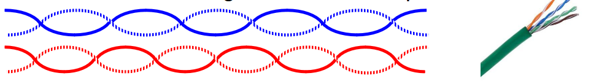

Dentro la guaina ci sono vari doppini assegnati a utenti diversi. Se attorcigliassi tutti i doppini allo stesso modo, sposterei solamente il problema: le varie coppie attorcigliate funzionerebbero a loro volta da **antenna**, riproponendo il problema della cross-talk.

:::tip[La soluzione]
Attorcigliare i doppini con **passi differenti**, creando Interferenza Distruttiva.
:::

### Fibra Ottica (Optical Fiber)

È una fibra molto sottile, generalmente fatta di **pasta vitrea** (vetro).

I principali **vantaggi**:

- **Attenuazione molto bassa**: si può propagare la luce anche per distanze molto elevate, senza forte attenuazione.
- **Bandwidth teorica estremamente alta** (> 100 GHz).

La fibra ottica è composta da due parti principali:

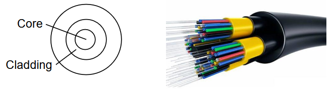

- **core**: parte interna, in pasta vitrea
- **cladding** (mantello): esterno al core, anch'esso in pasta vitrea
- **guaina esterna**

### Fibra Multi-Mode

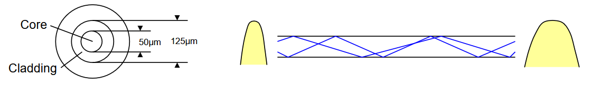

Core di dimensioni più elevate, pari a **50 µm**. Presenta **molteplici modi** di propagazione.

### Fibra Single-Mode

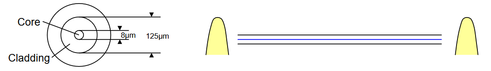

Core di dimensioni più ridotte, pari a **8-10 µm**. Molto più pregiata della Multi-Mode e molto più costosa da produrre. Presenta un **singolo modo** di propagazione.

:::note[Cos'è un "modo"]
Il **modo** è il percorso che segue la luce all'interno della fibra ottica, visibile nelle immagini a destra. Nella prima immagine si vedono varie repliche, ovvero vari modi che seguono percorsi differenti.
:::

:::caution[Dispersione Modale]
Se trasmetto un segnale in un determinato intervallo temporale e ho più modi che si propagano, il mio segnale si **dilata nel tempo**. Questo non ci piace perché è simile al problema della **Distorsione**, in cui i segnali invadono tempi successivi.

Quindi, nel caso della **Multi-Mode**, posso trasmettere ad alta capacità solo per **distanze brevi**. Se mi accontento di bitrate più bassi, posso trasmettere per distanze più lunghe.
:::

## Trasmissione Radio

Caratteristiche fondamentali della trasmissione radio:

- **Wavelength**: $\lambda = \frac{c}{f}$ $(m)$
- **Frequency**: $f$ $(Hz)$
- **Light speed**: $c = 3 \cdot 10^8 \, \frac{m}{s}$

$$
s(t) = A \cdot \cos(2\pi f + \phi)
$$

### Spettro Radio

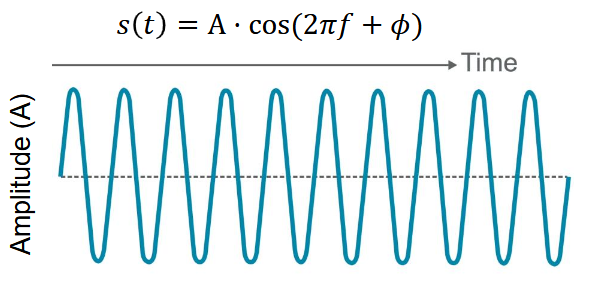

Questa immagine rappresenta lo **spettro radio**, suddiviso in sottobande. I nomi sono molto banali:

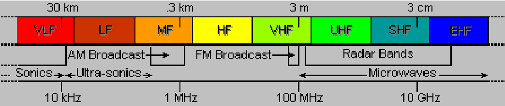

| Sigla | Significato |
| --- | --- |
| **VLF** | Very Low Frequency |
| **LF** | Low Frequency |
| **MF** | Medium Frequency |
| **HF** | High Frequency |
| **VHF** | Very High Frequency |
| **UHF** | Ultra High Frequency |
| **SHF** | Super High Frequency |
| **EHF** | Extremely High Frequency |

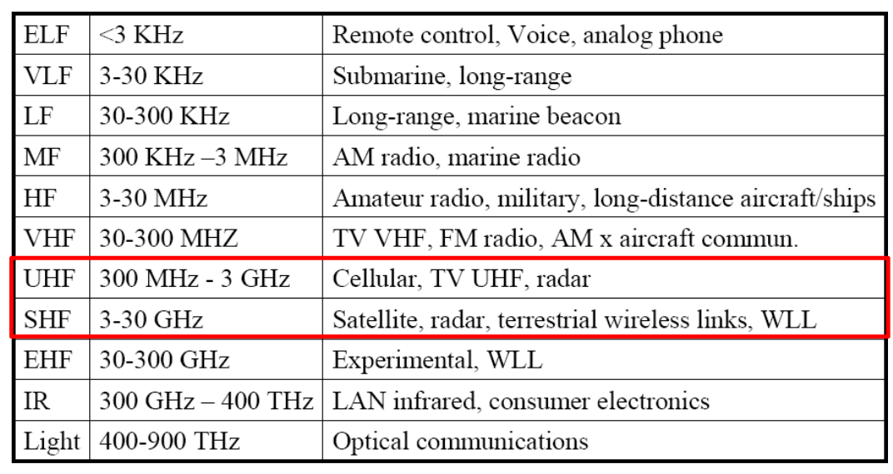

Nel corso ci focalizzeremo sulle **UHF** e **SHF**:

| Tecnologia | Banda |
| --- | --- |
| **WLAN & FWA** | 2.4 GHz - 5 GHz (unlicensed band, SHF) |
| **Mobile Radio Networks** (2G, 3G, 4G, 5G) | 700 MHz - 2.6 GHz (UHF) |
| **Satellite Networks & 5G Mobile Radio** | 3 - 30 GHz (SHF) |

### Antenne

Sono conduttori in grado di **irradiare** energia elettromagnetica nello spazio e **ricevere** energia elettromagnetica dallo spazio.

Vediamo 3 tipi di antenna, che si distinguono in base al modo in cui irradiano energia.

### Radiatore Isotropo

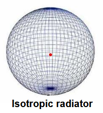

Non esiste in natura: è una sorgente **puntiforme** di energia elettromagnetica che si irradia nello spazio in **tutte le direzioni**. Più mi allontano, più la densità di energia sarà scarsa. Non esiste nella pratica, ma è utile per fare i conti.

### Antenna Omnidirezionale

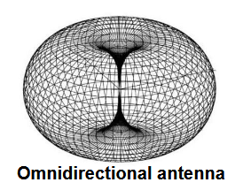

Irradia nella direzione **perpendicolare** alla direzione dell'antenna stessa.

Comunemente chiamato **"Diagramma a Ciambella"**: se sto esattamente sopra o sotto la mia antenna, non capto il segnale.

### Antenna Direzionale

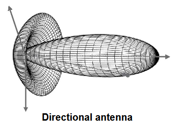

In grado di **concentrare** l'energia irradiata in determinate direzioni nello spazio. Molto utili perché posso raggiungere distanze più elevate, ma solo nella specifica direzione che sto raggiungendo.

:::caution[Effetto collaterale]
Si crea dell'energia anche in **altre direzioni** in cui non vorrei irradiare.
:::

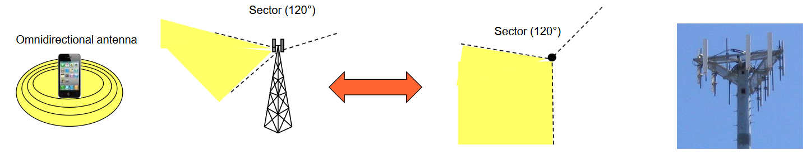

### Canale Broadcast

Inutile dirlo, ma il canale radio è **Broadcast** per sua stessa natura: se uno trasmette, chiunque da un punto di vista fisico può captare quel segnale.

Nel corso consideriamo un'**architettura centralizzata** per la comunicazione: nonostante gli utenti possano percepire il segnale trasmesso dagli altri, abbiamo un nodo, che prende il nome di **Coordinator** (coordinatore), che governa la comunicazione tra utenti diversi.

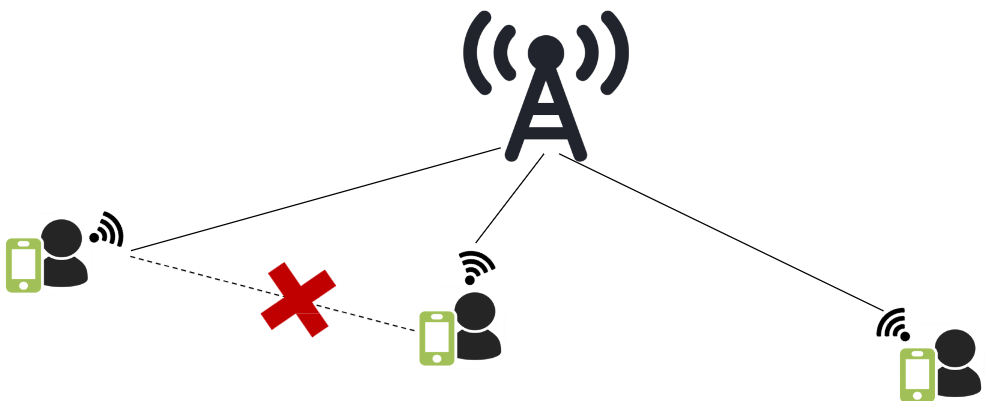

:::note[Esempio]
Se voglio effettuare una chiamata a qualcun altro, anche se è di fianco a me, la chiamata deve prima passare dalla **stazione radio base**, che funge da coordinatore: non esiste comunicazione diretta tra utenti.
:::

Questo è il principio che adotteremo sempre per tutte le tipologie di reti che sfruttano il mezzo radio viste in questo corso.

### Impairments della Trasmissione Radio

Nel momento in cui viene trasmesso un segnale, questo è soggetto a vari difetti:

- **attenuazione** dovuta alla distanza;
- **variazioni** nelle caratteristiche del canale col passare del tempo (la qualità del canale radio può essere piuttosto instabile).

### Free-Space Attenuation (Path Loss)

In inglese si chiama anche **Path Loss**. È l'attenuazione dovuta semplicemente al fatto che mi allontano dalla sorgente.

$$
P_r = P_t \left( \frac{\lambda}{4\pi d} \right)^2
$$

Attenuazione dell'energia dovuta a distanza e lunghezza d'onda (in spazio libero):

- $P_r$ → received power (potenza ricevuta)
- $P_t$ → transmitted power (potenza trasmessa)
- $d$ → distanza tra trasmettitore e ricevitore
- $\lambda = \frac{c}{f}$ → signal wavelength (lunghezza d'onda del segnale)

Quindi, l'attenuazione **diminuisce quadraticamente** all'aumentare della lunghezza d'onda, o **aumenta quadraticamente** all'aumentare della frequenza.

:::note[Altri fattori di attenuazione]
Atmosfera, riflessione, diffrazione, shadowing e scattering.
:::

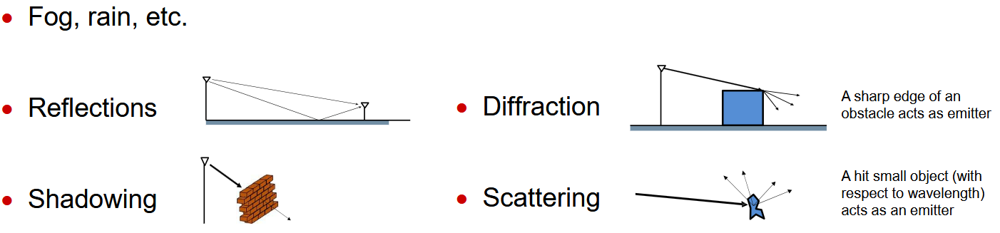

### Tecniche per Evitare gli Impairments

- **power control**
- **adaptive modulation/coding**

### Power Control

Tecnica che permette di adeguare la **potenza** delle trasmissioni sulla base delle condizioni del mio canale.

:::note[Esempio del cellulare]
Se mi trovo molto distante da un'antenna, il segnale prende male e si consuma la batteria più velocemente: questo perché il controllo di potenza **spara potenza più elevata** per cercare di avere maggiore segnale. Vale il contrario: se sono vicino all'antenna, **abbasso la potenza** trasmessa per evitare di creare interferenze ad altri utenti.
:::

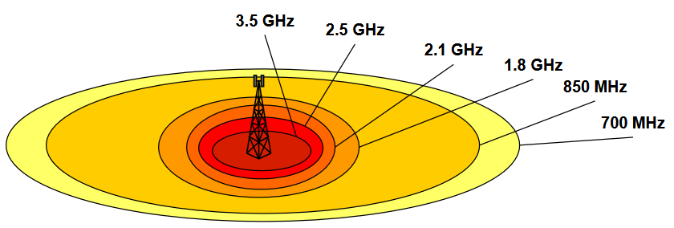

### Multiplexing e Multiple Access nella Trasmissione Radio

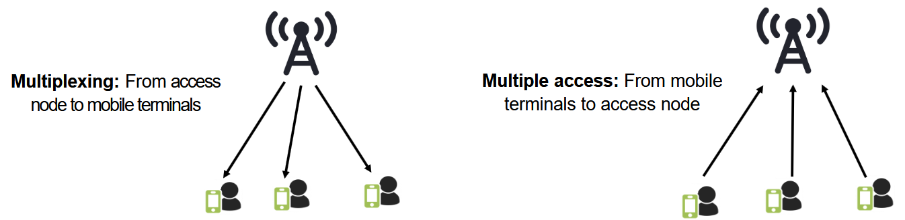

- **Multiplexing** è usato nella direzione **downlink**: una stazione che trasmette e molteplici terminali che ricevono.
- **Multiple Access** è usato nella direzione **uplink**: molteplici stazioni che trasmettono e un ricevitore.

### Duplexing

C'è però un problema nelle trasmissioni radio: come posso **separare** la direzione **downlink** dalla direzione **uplink**? Devo poter comunicare in entrambe le direzioni utilizzando il mezzo radio.

Questo si fa tramite una tecnica di nome **Duplexing**: si suddivide una risorsa (tempo o frequenza), assegnandola a una direzione oppure all'altra (downlink o uplink).

| Tecnica | Come funziona |
| --- | --- |
| **Time-Division Duplexing (TDD)** | Si adotta una tecnica TDM per separare downlink e uplink. Il tempo è suddiviso in trame (frame): invece di averle in sequenza, avrò una trama destinata all'uplink, poi una al downlink, ecc. In questo modo divido il tempo tra le due direzioni. |
| **Frequency-Division Duplexing (FDD)** | Divisione dello spettro: alcune frequenze sono usate per il downlink, altre per l'uplink. |

### Multiple Input Multiple Output (MIMO)

Il MIMO sfrutta la cosiddetta **multiplazione spaziale** con l'obiettivo di aumentare il rate trasmissivo oppure di rendere il canale più robusto al rumore / multipath fading.

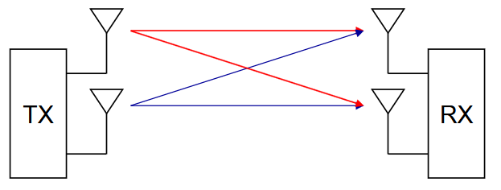

Ho un trasmettitore e un ricevitore, ognuno con **più antenne**. Ciascuna di queste antenne trasmette lo stesso identico segnale, però costruito in modo tale che, conoscendo quanto sono distanti le antenne al ricevitore, si va a creare un'**Interferenza Costruttiva**.

:::tip
Se posso garantire di avere **Interferenza Costruttiva**, la qualità del segnale **migliora**.
:::
