## Struttura Gerarchica delle Reti

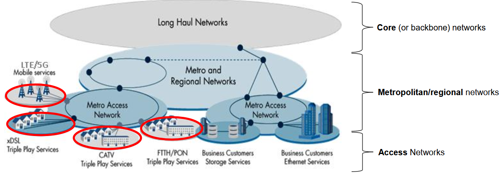

:::note[Banda Larga (broadband)]
Il termine deriva dal fatto che il nostro canale di comunicazione ha una banda con una buona estensione.
:::

## Tipologie di Broadband Access Networks

| Tipologia | Descrizione | Mobilità utente |
| --- | --- | --- |
| **Fixed Access Network** | Un cavo arriva fino a casa dell'utente. | NON prevista |
| **Fixed Wireless Access Network** | Cablaggio in fibra fino a un **Point of Presence (PoP)**, poi comunicazione radio fino a casa dell'utente. | NON prevista |
| **Satellite Access Network** | Fibra ottica per cablare fino a una stazione di terra, che poi continua la comunicazione fino a casa dell'utente tramite **satellite**. | Tipicamente NON prevista |
| **Mobile Radio Access Network** | Cablaggio fino a una **base station**, poi comunicazione radio fino al terminale mobile. | Prevista |

## Fixed Access Network

Per capire come è fatta, dobbiamo prima capire com'è fatta l'infrastruttura di rete in rame che prevede il cablaggio da una centrale fino a casa di un utente. A partire da questa si sono sviluppate le varie architetture per la rete di accesso a Internet.

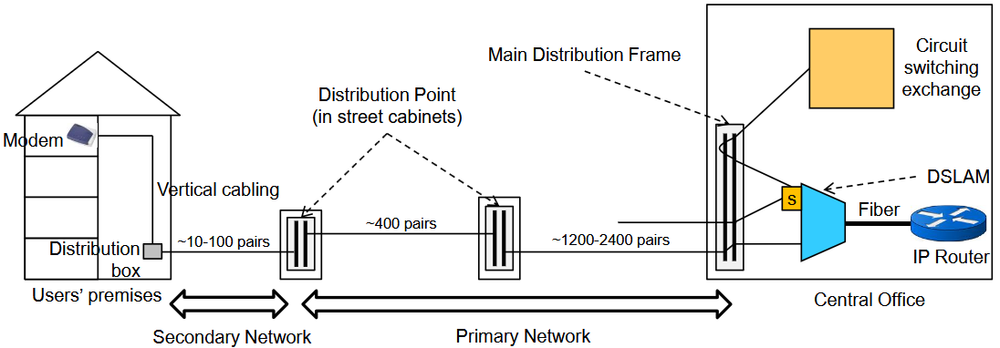

Vediamo esclusivamente com'è fatto il **cablaggio passivo in rame**, nel percorso tra centrale e casa dell'utente.

- Solitamente nella casa dell'utente c'è una presa, di nome **Borchia di Utente**; questa presa ha un doppino in rame che raggiunge un punto, che si trova di solito negli scantinati delle abitazioni, chiamato **Distribution Box** (Punto di Distribuzione).
- In questo punto di distribuzione c'è un **nodo passivo** dove entrano un certo numero di doppini in rame ed esce lo stesso numero di doppini. Se ne entrano $n$, ne escono al più $n$.
- La parte di cablaggio che va da casa dell'utente fino al punto di distribuzione prende il nome di **Cablaggio Verticale** (perché solitamente i cavi prendono direzione verticale).
- Usciti da casa dell'utente, raggiungiamo il **Ripartitore** (Distribution Point), che si trova negli armadi stradali. Anche questi sono nodi passivi (non devono essere alimentati): sono pannelli da cui, da un lato, arrivano i doppini degli utenti e, dall'altro, escono verso la centrale. Con dei "cavallotti" bisogna creare un collegamento dentro il pannello tra cavo in ingresso e cavo in uscita.

:::note[Cavallotti]
Cavi in rame piccolini che uniscono due porte, una in ingresso e una in uscita. Piccolo segmento di cavo.
:::

:::danger[Traduzione]
La traduzione in italiano fa cacare, perché:
- Punto di Distribuzione = Distribution Box
- Ripartitore = Distribution Point
:::

La zona che va da casa fino alla prima cabina in strada prende il nome di **Rete Secondaria** (Secondary Network).

Avere due ripartitori aiuta perché è possibile gestire segmenti di doppini in rame più corti. Peggiora però la comunicazione digitale.

Arrivati alla centrale, abbiamo un altro dispositivo passivo simile ai Ripartitori, che si chiama **Main Distribution Frame** (Permutatore in italiano). Il funzionamento è fondamentalmente lo stesso del ripartitore.

I doppini che escono dal Main Distribution Frame vanno a finire in un nodo centrale che prende il nome di **DSLAM** (DSL Access Multiplexer). Svolge due compiti fondamentali:

- **demodulazione del segnale**: il segnale viene modulato dal modem a casa dell'utente, arriva il segnale analogico al DSLAM che lo riconverte in digitale;
- **demultiplazione dei flussi**.

Lo **Splitter** (S nell'immagine), o più lungo **POTS** (Plain Old Telephone Service), separava i dati analogici (telefonia) dai segnali digitali (dati), in modo da inviare quelli analogici al Circuit Switching Exchange e quelli digitali al DSLAM.

:::tip[Situazione italiana]
In Italia la distanza tra casa degli utenti e i Central Offices è in media più corta rispetto al resto del mondo:

- **Fortunatamente**, perché questa rete è stata fin da subito adeguata per le comunicazioni a banda larga.
- **Sfortunatamente**, perché per via di questo abbiamo ritardato di molto l'introduzione delle reti di accesso in fibra o in fibra mista a rame.
:::

Ovviamente anche la qualità dei Ripartitori influisce sulla qualità della rete. Il fatto di avere questi ripartitori non sempre di altissima qualità (anche perché questa infrastruttura nacque con obiettivi di telefonia) non sempre impatta positivamente sulla qualità della rete.

Questa infrastruttura è utilizzata per le soluzioni tecnologiche **xDSL** (Digital Subscriber Line).

## Tecnologia xDSL

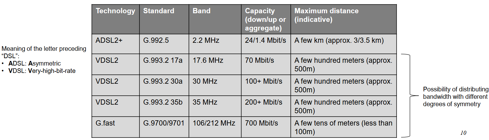

L'obiettivo di queste tecnologie è sfruttare il più possibile la banda disponibile per mezzo dei doppini in rame già dispiegati.

:::caution[Tradeoff banda / distanza]
Esiste un tradeoff tra la banda disponibile e la lunghezza di un doppino: più la distanza tra centrale e casa dell'utente è breve, migliore è la qualità che posso avere per la comunicazione.
:::

Esistono varie tecnologie xDSL: quelle più aggressive in termini di banda vanno bene solo se ho distanze molto brevi, altrimenti si creano problemi di distorsione e attenuazione e diventa controproducente, portando un degrado.

La colonna degli standard non è da sapere.

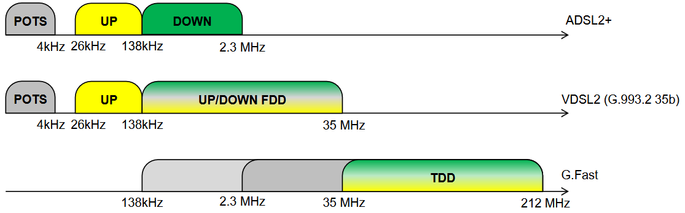

In che modo, guardando le righe di VDSL2, riesco ad aumentare la capacità semplicemente cambiando standard ma mantenendo una distanza più o meno sempre uguale? La tecnologia utilizzata è chiamata **Vectoring**.

### Vectoring

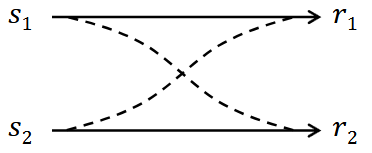

Tecnica utilizzata per cercare di eliminare completamente la **crosstalk** (diafonia) tra doppini adiacenti. Già intrecciando i doppini possiamo ridurla, ma non la elimino completamente. Con il Vectoring, invece, posso proprio **cancellarla**, aumentando le prestazioni.

Immaginiamo che a destra ci sia l'utente e a sinistra la centrale. Vengono trasmessi i segnali $s_1$ e $s_2$ che creano una **mutua interferenza**: parte di un segnale diventa rumore per l'altro. Quindi il segnale ricevuto per ognuno dei due utenti corrisponde a:

$$
\begin{aligned}
r_1 &= s_1 + k_2 s_2 \\
r_2 &= s_2 + k_1 s_1
\end{aligned}
$$

Dove $k_1$ e $k_2$ rappresentano l'**intensità dell'interferenza**.

Per non diventare matti con le notazioni, rappresentiamo tutto in forma matriciale:

$$
\overrightarrow{r} = T \overrightarrow{s}
\qquad\text{con}\qquad
T = \begin{bmatrix} 1 & k_2 \\ k_1 & 1 \end{bmatrix}
$$

### Vectoring in Downstream

Guardando alla direzione **downstream**, dove il DSLAM deve mandare i segnali agli utenti, il Vectoring effettua una **precodifica** con l'obiettivo di cancellare totalmente le componenti di interferenza.

Quindi, se invece di trasmettere il vettore $\overrightarrow{s}$ trasmetto $\overrightarrow{s}^{*} = T^{-1}\overrightarrow{s}$, questa è la mia operazione di precodifica: modifico il segnale che invio sulla base della conoscenza della mutua interferenza tra i due doppini, e quello che ottengo al ricevitore è esattamente il segnale che voglio trasmettere.

$$
\overrightarrow{r} = T \overrightarrow{s}^{*} = T(T^{-1} \overrightarrow{s}) = (T T^{-1}) \overrightarrow{s} = \overrightarrow{s}
$$

Come si fa è un altro discorso nel quale non entriamo, ma posso fare questa operazione che mi cancella completamente l'interferenza. È importante perché questa operazione di **inversione della matrice** deve essere effettivamente svolta.

### Vectoring in Upstream

Nella direzione di **upstream**, il Vectoring viene comunque fatto dal DSLAM, ma **a posteriori**: l'utente trasmette il segnale e il DSLAM, a posteriori, cancella l'interferenza.

$$
\overrightarrow{r} = T^{-1}(T \overrightarrow{s}) = \overrightarrow{s}
$$

## Limiti del Vectoring

- La matrice $T$ deve essere **invertita** per un grandissimo numero di doppini. Inoltre, una volta calcolata, devo continuare a **ricalcolarla e reinvertirla**: serve una grossa capacità computazionale.
- Se nei vari fasci i doppini sono gestiti da **Internet Service Provider differenti**, è necessario conoscere l'interferenza di tutti i doppini, anche di quelli gestiti dagli altri operatori, per poter cancellare completamente la diafonia. Spesso questa è un'informazione che agli operatori non piace condividere; se non la si condivide, ogni operatore può cancellare la diafonia solo per i propri doppini.

:::note[In Italia]
Non è un grosso problema, perché l'ultimo miglio nella rete di accesso in rame è solitamente gestito sempre e solo da TIM.
:::

## Hybrid fiber-copper Access Networks

Come già discusso, c'è un tradeoff tra la banda disponibile e la lunghezza dei doppini in rame. I cavi in fibra ottica offrono una bandwidth molto maggiore rispetto ai doppini. Quindi, come facciamo a ridurre la lunghezza dei doppini?

**Risposta**: spostando la fibra il più vicino possibile a casa dell'utente.

Nascono quindi diverse architetture **ibride** tra fibra e rame, che si distinguono l'una dall'altra sulla base di dove avviene lo "swap" tra rame e fibra. Vengono chiamate **"Fiber-to-the-X"**.

### Fiber To The Exchange (FTTE)

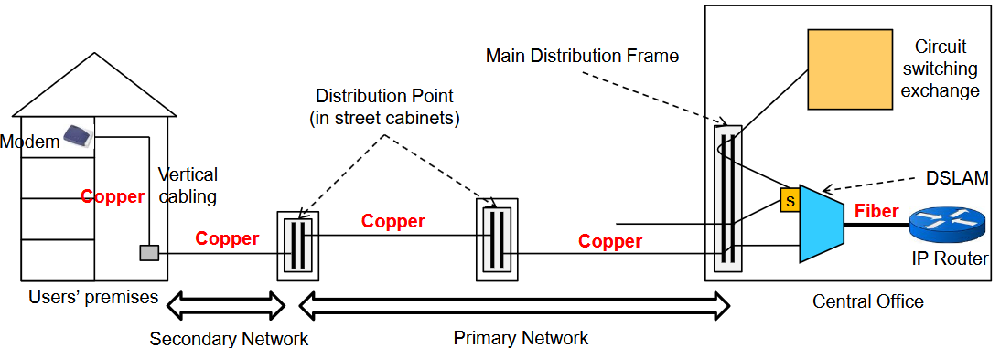

La fibra raggiunge il Central Office. Il resto è tutto rame, esattamente come visto precedentemente. Cambia solo che la parte di fibra è posta tra il **DSLAM** e l'**IP Router** del Central Office.

### Fiber To The Cabinet (FTTC)

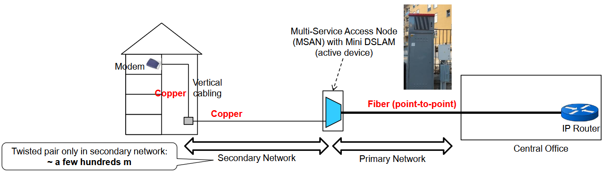

Ho una fibra punto-punto che dall'IP Router della centrale raggiunge il **Cabinet**, ovvero l'armadio stradale più vicino all'utente.

Nel Cabinet devo aggiungere un nuovo nodo, che prende il nome di **Mini DSLAM**: è un DSLAM più piccolo, perché gestisce un numero di utenti inferiore rispetto a quello in centrale.

:::caution[Il problema: alimentazione]
Il DSLAM è un dispositivo **attivo**, non passivo: devo portare la corrente nel Cabinet, che è uno dei grossi costi delle tecnologie FTTC. Quando un Cabinet viene convertito per l'accesso in fibra, si aggiunge quell'appendice (visibile nell'immagine) con la striscia rossa e le prese d'aria, il cui nome è **"Zainetto"**. All'interno c'è il DSLAM alimentato e, avvicinandosi, si sente un ronzio dovuto proprio all'alimentazione.
:::

Il nodo funzionale all'interno del Cabinet prende il nome di **MSAN** (Multi-Service Access Node). Significa che continuiamo ad avere dei ripartitori, poi un collegamento, quando serve, con un DSLAM.

Da qui ho sempre il cablaggio in rame fino al Punto di Distribuzione e poi il Cablaggio Verticale.

### Fiber To The Building (FTTB)

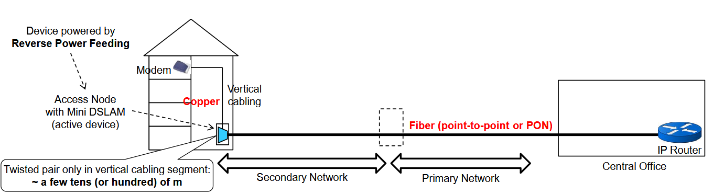

Ho una fibra che va dal Router della centrale fino al Punto di Distribuzione nello scantinato dell'utente. Questa fibra può essere di due tipi:

- **punto-punto**: una fibra per ogni singolo Punto di Distribuzione raggiunto;
- **rete ottica passiva**: la rivediamo più avanti con la Fiber To The Home (FTTH).

Quello che si fa in questo caso è installare un Mini DSLAM, ancora più piccolo rispetto a quello del Cabinet, dove prima c'era il Punto di Distribuzione.

:::note[Reverse Power Feeding]
La particolarità di questa infrastruttura è che agli operatori non piace operare all'interno degli edifici. Qual è quindi la tecnica adottata per alimentare questo DSLAM? Non viene alimentato tramite energia elettrica collegata a una presa, bensì tramite una tecnica chiamata **Reverse Power Feeding**: l'alimentazione alla porta su cui si attesta l'utente viene fornita direttamente dal doppino dell'utente. Oltre a trasferire dati, ciascun doppino trasferisce anche corrente per alimentare la porta del relativo utente.
:::

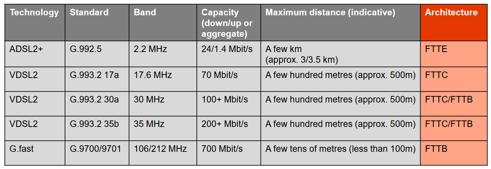

## Fiber Access Networks

### Fiber To The Home (FTTH)

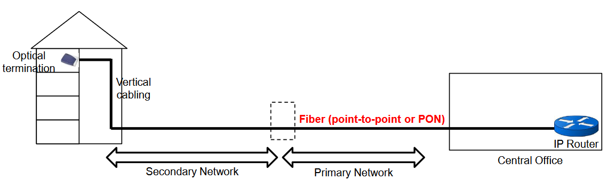

Sono quelle architetture di rete che portano la fibra fino a casa dell'utente. Esistono 2 possibilità per offrire FTTH:

1. fibre **point-to-point (P2P)**, architettura chiamata anche **Active Optical Network (AON)**: tipicamente più utilizzata per gli utenti business;
2. **Passive Optical Network (PON)**: tipicamente più utilizzata per gli utenti residenziali.

### FTTH P2P

In questo caso abbiamo una fibra ottica per utente, dalla Centrale a casa dell'utente.

Il problema è che ho la necessità di dispiegare un grande numero di fibre, **1 per utente**.

È presente un nuovo nodo nella centrale, chiamato **MPoP**, che svolge un compito analogo al DSLAM, ovvero multiplazione e demultiplazione dei segnali degli utenti.

Offre bande molto elevate in **entrambe le direzioni**.

### FTTH PON

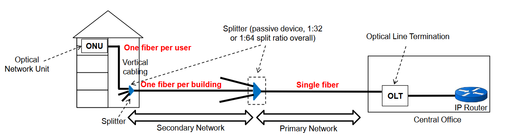

Viene dispiegato un **albero ottico passivo**: abbiamo questa struttura ad albero con dispositivi passivi tra utente e centrale che distribuiscono il segnale su vari rami in uscita.

Dalla centrale esce una singola fibra che arriva a uno **Splitter**, dal quale escono un certo numero di fibre. Ognuna di queste arriva a un altro Splitter nello scantinato dell'utente, da cui escono un certo numero di fibre, una per utente.

Nell'esempio in foto la **OLT** è collegata a 1 albero, ma chiaramente possono essercene di più connessi.

Solitamente, soprattutto in Italia, abbiamo **2 livelli di Splitting**, con un rapporto di splitting complessivo pari a **1/64**: con una fibra posso servire 64 utenti.

| | |
| --- | --- |
| ✅ **Vantaggio** | Risolvo il problema dell'alto numero di fibre da posizionare. |
| ⚠️ **Svantaggio** | Gli splitter sono nodi passivi non alimentati. Con un rapporto di splitting 1/64, ripartisco la potenza in 64 parti sui vari rami in uscita. Più è alto il rapporto di splitting, più il segnale che arriva agli utenti è attenuato → bitrate ridotti. |

:::tip[GPON Technology]
Su queste architetture ad albero, la tecnologia utilizzata è chiamata **GPON**: in **downstream** si ha una banda condivisa fino a **2.488 Gb/s**, mentre in **upstream** si usa TDMA gestito dall'OLT fino a un massimo di **1.24 Gb/s**.
:::

## Fixed Wireless Access Networks - FWA
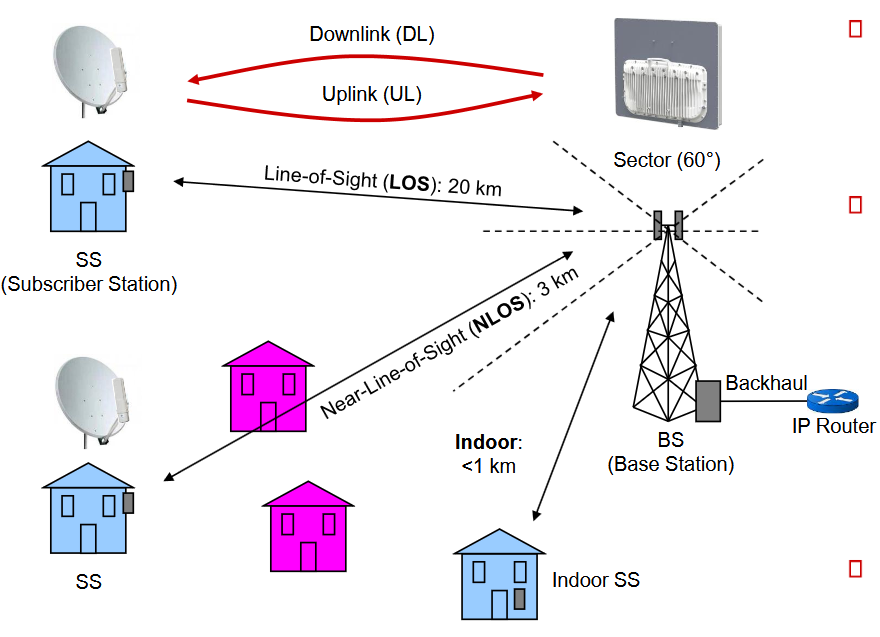

Questo genere di infrastruttura prende anche il nome di **Fiber to the Tower (FTTT)**.

Abbiamo una **Base Station**, alla quale arriva un collegamento che prende il nome di **Backhaul**. La Base Station è equipaggata con antenne usate per comunicare via radio con le **Subscriber Stations**, ovvero le stazioni poste a casa degli utenti iscritti. Bypassiamo la necessità di un cablaggio costoso: è quindi un'alternativa più economica, solitamente adottata in **aree rurali** dove è difficile cablare. Buona quindi per ridurre il Digital Divide.

:::tip[Digital Divide]
Disuguaglianza nell'accesso alle tecnologie dell'informazione e della comunicazione. Separa chi può beneficiare delle opportunità del digitale da chi ne rimane escluso, con gravi conseguenze sull'inclusione sociale, economica e culturale.
:::

Si verificano **3 possibili tipi di propagazione** del segnale:

| Tipo | Descrizione | Antenne |
| --- | --- | --- |
| **LOS** (Line of Sight) | Percorso diretto senza ostacoli tra il trasmettitore della Base Station e il ricevitore a casa dell'utente (e viceversa): casa dell'utente è visibile dall'antenna senza ostacoli. La SS può essere anche molto lontana dalla BS. | direzionali |
| **NLOS** (Near Line of Sight) | Esistenza di ostacoli tra trasmettitore e ricevitore che però non inficiano totalmente la trasmissione. | direzionali |
| **Indoor** | Adottabile solo se la BS (Base Station) e la SS (Subscriber Station) sono vicine. | omnidirezionali |

## Satellite Networks

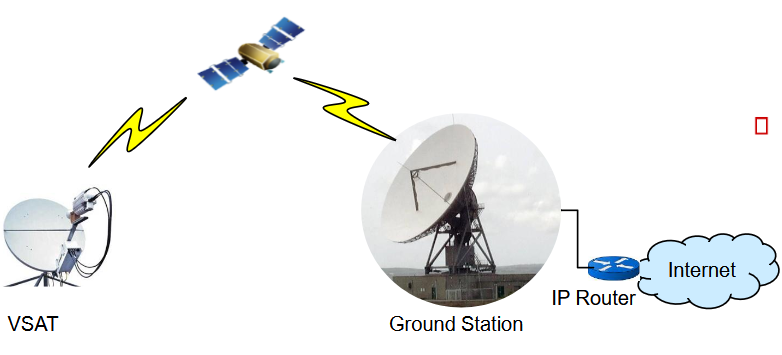

Possono potenzialmente garantire **copertura globale**, ottime per ridurre il Digital Divide.

In una rete satellitare ci sono fondamentalmente **3 elementi**:

| Elemento | Descrizione |
| --- | --- |
| **Satellite** | Si trova in orbita e funge da **relay** per la comunicazione. |
| **VSAT** (Very Small Aperture Terminal) | Terminale posizionato a casa dell'utente. Si chiama così perché adotta un'antenna parabolica. |
| **Ground Station** | Paraboloidi con ampia apertura posizionati in certi punti. |

Sia il VSAT che il Ground Station puntano verso il **Satellite**.

### Problemi

:::caution[Latenza]
Le reti satellitari aggiungono una **latenza non trascurabile**: il dato deve essere inviato al satellite e/o ricevuto a terra alla Ground Station. Il problema principale è la **distanza** tra Satellite e Ground Station, quindi non posso garantire servizi **realtime** a causa delle latenze troppo elevate.
:::

### Tipi di Satelliti
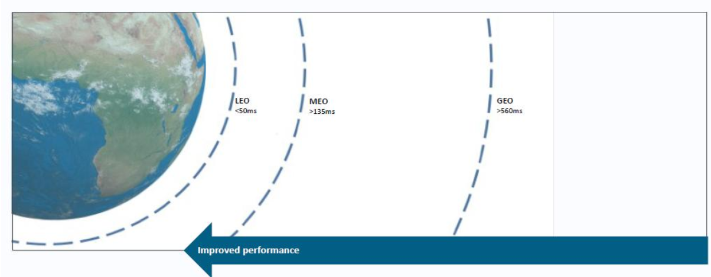

## Satellite Networks with GEO Satellites
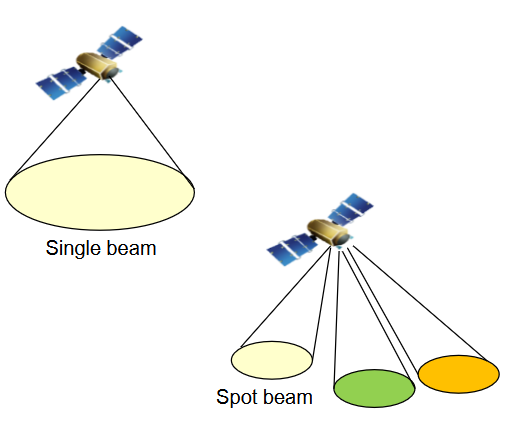

Con un satellite posso coprire un'area della Terra molto ampia, anche fino a **1/3** dell'area totale terrestre. Può essere un vantaggio, ma anche uno svantaggio: la banda deve essere condivisa tra un numero di utenti potenzialmente elevatissimo.

A questo proposito, esistono **2 tipologie di copertura** servibili tramite Satellite Geostazionario:

1. **Single Beam**: un'area è servita con un singolo segnale alla stessa frequenza per tutti gli utenti. Quindi un canale piuttosto largo condiviso tra tutti gli utenti. Il problema è sempre la condivisione della banda.
2. **Multibeam**: successore della Single Beam. Si hanno più antenne direzionali verso determinate aree, ognuna coperta da un segnale differente. Ogni area prende il nome di **Spot Beam**; ogni Spot Beam deve usare bande di frequenza diverse, altrimenti avrei interferenze. Posso però **riutilizzare** le frequenze su Spot Beam distanti tra loro.

**Multiplexing / Multiple Access** nelle reti con GEO Satellites:

| Direzione | Tecnica |
| --- | --- |
| **Downstream** | TDM multiplexing |
| **Upstream** | TDMA o CDMA multiple access |

## Satellite Networks with LEO Satellites

**LEO**: Low Earth Orbit.

Tecnologia molto recente in ambito civile, a partire dal **2019**. I fornitori più popolari sono **Starlink** e **Eutelsat/OneWeb**.

Richiedono l'esistenza di **Ground Stations** in giro per il mondo per garantire connettività.

La connettività è garantita da un insieme di satelliti, che prende il nome di **Costellazione**, mandati in orbita da provider diversi. L'obiettivo è avere **copertura globale** attorno alla Terra:

- **Starlink**: ha pianificato 42.000 satelliti complessivi, ma al momento solo ~10.000 sono attivi.
- **OneWeb**: 654 satelliti.

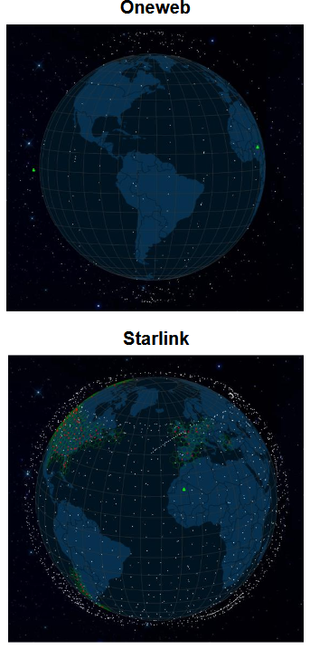

:::note[Mappa interattiva]
[satellitemap.space](https://satellitemap.space)
:::

**Principi di funzionamento:** la mia antenna identifica e si collega a un satellite nel cielo. Finché questo satellite è visibile, resto collegato; quando esce dalla mia visibilità, cerco un altro satellite e faccio una procedura chiamata **Handover**, che consiste nel collegamento a un altro satellite senza che l'utente percepisca il cambiamento.