## Recap

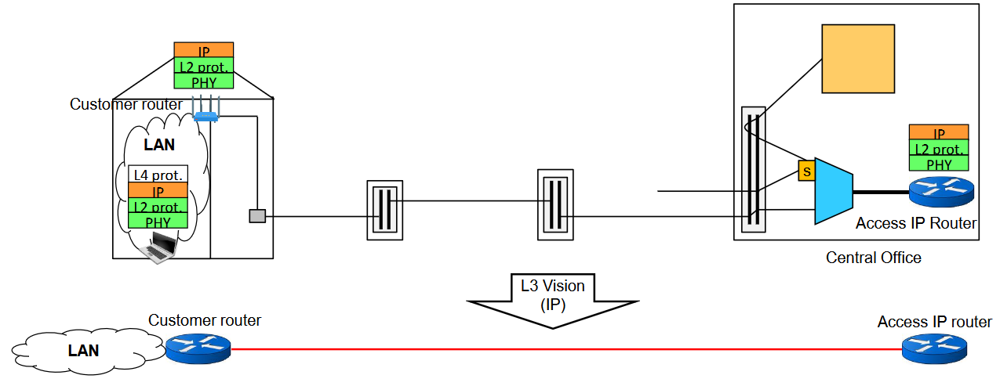

Le reti di accesso introdotte nella precedente lezione permettono agli utenti di interconnettere la loro rete locale a una **rete IP pubblica**, per poter accedere a Internet.

## Connettività Generalizzata & Connettività Dedicata

### Connettività Generalizzata

L'accesso alla rete IP pubblica (Internet) è fornito dagli **Internet Service Provider (ISP)**. Offre connettività agli utenti **residenziali**.

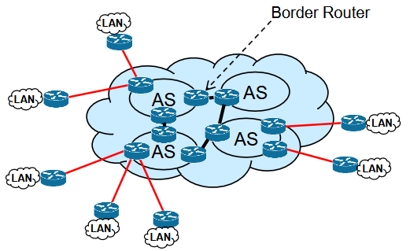

Organizzazione **gerarchica** (AS = Autonomous Systems).

### Connettività Dedicata

C'è però un'altra faccia della medaglia: tutto ciò che viene fornito agli utenti **business** che vogliono connettere differenti filiali o uffici dell'azienda. In questo caso si adotta una **Dedicated Connectivity**, non una Generalized Connectivity.

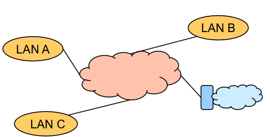

In questo tipo di connettività vado a connettere i vari **branch** dell'azienda. Anche qui la connettività è offerta da ISP, che però operano in ambito business.

:::caution
Questo genere di soluzione è molto più **costosa** di quella Generalizzata. Prende anche il nome di **WAN**.
:::

## Wide Area Network (WAN)

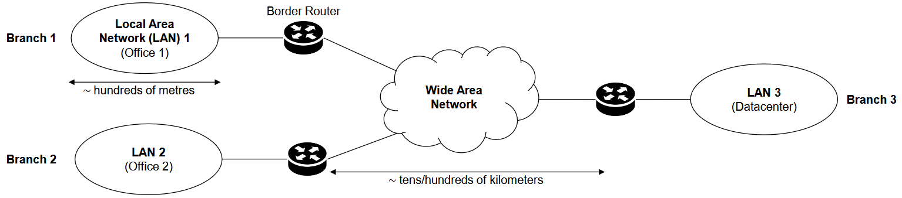

Diverse reti locali in branch diversi, che hanno solitamente un'estensione geografica di al più qualche centinaio di metri.

Troviamo il **Border Router** (router di bordo), il cui compito è connettere le reti di branch alla WAN. La WAN viene quindi utilizzata per **interconnettere** tutti i vari branch tra di loro.

Perché si chiama WAN? Perché è geograficamente **estesa**: decine/centinaia di km.

:::note[Qualità del servizio]
Il servizio di connettività fornito all'utente business è solitamente **stringente** in termini di qualità: si usa una rete WAN perché garantisce **Availability > 99.99%** e **latenza < 5 ms**. Soluzioni più pregiate.
:::

Ma quali sono le soluzioni per dispiegare una WAN? Ce ne sono diverse.

## WAN - Solutions

### Dedicated Physical WAN

L'azienda possiede **tutta** l'infrastruttura di rete: le fibre, i router, i sistemi di gestione, eccetera. L'azienda gestisce e dispiega la rete.

| | |
| --- | --- |
| ✅ **Vantaggi** | Pieno controllo sulla rete WAN e grandissima disponibilità di banda. La sicurezza è responsabilità dell'azienda. |
| ⚠️ **Svantaggi** | Costa tantissimo: solo poche compagnie (aziende veramente enormi) possono andare in questa direzione. |

### Leased Lines

La rete utilizzata a livello WAN è di proprietà di un **operatore**. La mia azienda va da un operatore e stabiliscono contratti per definire uno o più **circuiti privati** tra i branch.

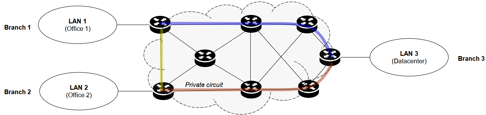

L'operatore mi destina delle risorse in maniera **esclusiva**. Queste risorse possono essere una lunghezza d'onda dedicata sulla mia fibra ottica, oppure dei circuiti di tipo TDM. Una volta dedicate, sono a uso esclusivo dell'utente.

**Problemi:**

- costoso;
- è responsabilità dell'azienda richiedere tutte le varie interconnessioni, quindi pianificare di quali linee ha bisogno (se l'azienda deve chiedere, deve sapere cosa chiedere).

### Multiprotocol Label Switching (MPLS) WAN

L'azienda va da un ISP e stipula un contratto per ottenere una **Mesh Connectivity** con una certa **QoS guarantee**.

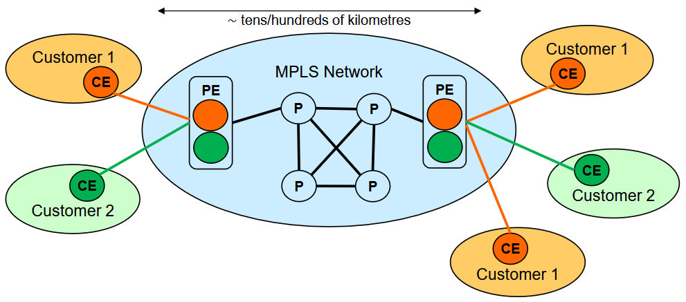

Immaginiamo di essere il customer 1, con 3 siti da interconnettere. L'operatore mi dice: ti do un dispositivo che si chiama **Customer Edge Router (CE)**, che metti ai bordi della tua rete locale; partendo da questo router, creo connettività con un nodo all'interno della rete MPLS (rete indipendente da quella IP, una cosa a parte). Questo nodo dentro la MPLS prende il nome di **Provider Edge Router (PE)**. Garantita questa cosa per tutti i branch dell'azienda, l'operatore garantisce **interconnettività mesh** tra i branch.

La MPLS è **condivisa** tra più utenti: ci sono quindi risorse condivise, gestite però per garantire una determinata qualità del servizio per i vari branch.

:::tip
Soluzione più economica (ma comunque dispendiosa, **~$500 per Mbps al mese**) ed è una delle più diffuse oggi per l'interconnessione delle aziende.
:::

## Protocollo MPLS

Vediamo il funzionamento del protocollo MPLS per la creazione di una rete MPLS WAN.

### Routing IP

La cosa fondamentale da portare a casa è che il routing IP è basato sul **Destination-Based Forwarding**.

Quindi, inoltro basato sulla destinazione: leggo l'indirizzo IP di destinazione, cerco un match nelle tabelle di routing del router e inoltro verso la relativa interfaccia di uscita.

Serve saperlo perché **MPLS funziona in modo diverso**.

### Architettura di MPLS

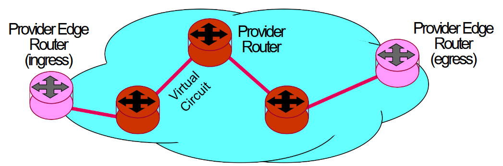

Vengono stabiliti dei **circuiti virtuali** per i vari flussi di traffico.

:::note[Circuito Virtuale]
Stabilito tra il Provider Edge Router in ingresso e quello in uscita. È necessario stabilire questo circuito **prima** di avere comunicazione.
:::

### Label Swapping Forwarding

Paradigma adottato da MPLS, differente rispetto al Destination-Based Forwarding usato da IP.

Cosa fa? Il pacchetto IP viene incapsulato in un **header MPLS di 32 bit**. Questo header viene aggiunto **tra** l'header del pacchetto IP e l'header del protocollo di livello 2. Motivo per cui spesso si dice che MPLS è un protocollo di **livello 2.5**.

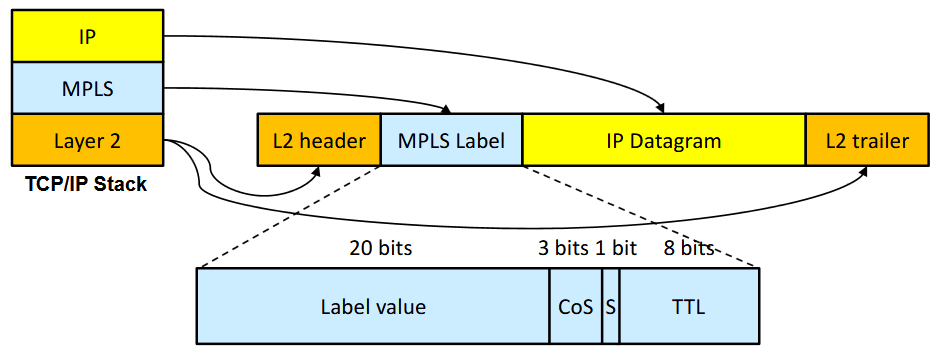

Ma quindi, come funziona il Label Swapping? Viene effettuato dai Router MPLS, sfruttando un'opportuna tabella di nome **MPLS Forwarding Table**:

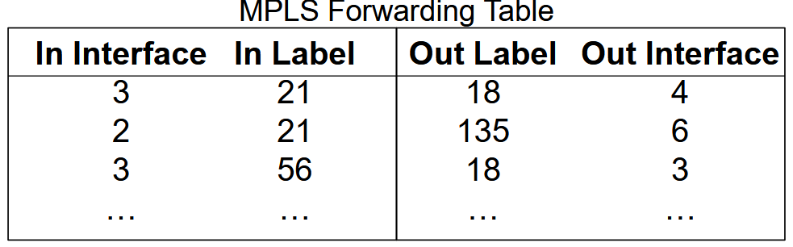

Interfaccia e label in ingresso, interfaccia e label in uscita.

Quindi quello che fa il router MPLS è: sulla base del pacchetto ricevuto sull'interfaccia, leggendo la specifica etichetta e seguendo quanto scritto nella tabella di inoltro, **sostituisce l'etichetta** e inoltra sull'interfaccia di uscita.

### Nomenclatura

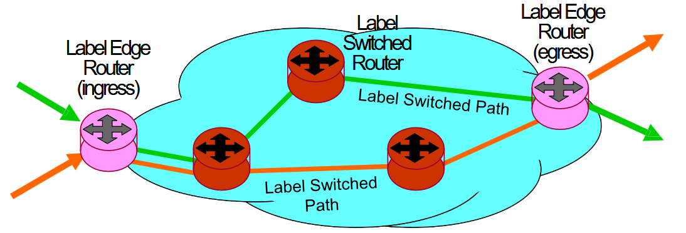

| Termine generico | Termine MPLS |
| --- | --- |
| Provider Edge Router (PE) | **Label Edge Router (LER)** |
| Provider Router (P) | **Label Switched Router (LSR)** |
| Virtual Circuit | **Label Switched Path (LSP)** |

### Path Binding

Un'altra cosa importante che possiamo fare con MPLS, e che aiuta a migliorare la gestione dei percorsi, è l'operazione di **Path Binding**: aggregare diversi flussi in un Label Switched Path unico.

Per capire come funziona è più facile vedere l'esempio:

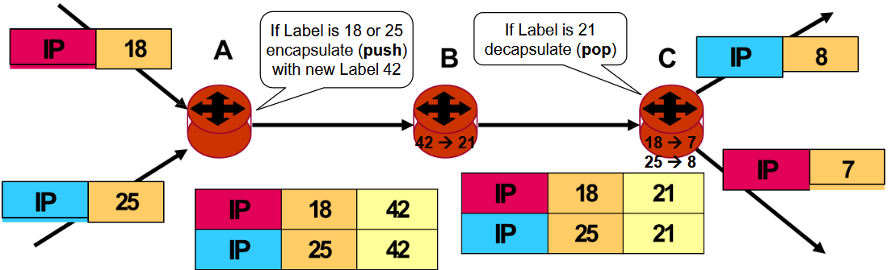

:::note[Esempio]
Abbiamo dei pacchetti MPLS che arrivano al router A con due etichette diverse. Dopo C prenderanno due percorsi differenti (rosso e blu), ma condividono una stessa parte di percorso: **A-B-C**.

Invece di fare Label Swapping, in questo caso specifico, una volta che i pacchetti raggiungono A faccio il **pushing** di una nuova label: inserisco una nuova etichetta (nell'esempio `42`). Il pacchetto viaggia verso B, dove la tabella di forwarding ha uno swapping tra l'etichetta `42` e un'altra. Arrivato a C faccio il **popping**: rimuovo l'etichetta `42` e prendo decisioni basandomi sull'etichetta più interna.

Il risultato? Tra A e C è come se avessi un Label Switched Path **aggregato unico**, in cui non distinguo tra pacchetti blu e rossi. Questo mi permette di avere una **scalabilità maggiore**: i router più interni della rete MPLS devono fare Swapping su un numero inferiore di etichette, quindi le tabelle di forwarding MPLS hanno dimensioni più piccole.

Altrimenti, in questo esempio, all'interno del router B avrei avuto bisogno di due righe diverse (una per il flusso blu e una per il rosso). Col Path Binding mi basta **una sola riga**.
:::

## Forwarding & Control Traffic

Vediamo in che modo posso stabilire i Label Switched Path (questi circuiti virtuali). Non abbiamo ancora detto come si creano.

Abbiamo la necessità di fare una **distribuzione delle etichette** sul percorso che voglio seguire, ma non abbiamo visto come.

:::tip[Perché è importante]
La possibilità di stabilire LSP arbitrari abilita la cosiddetta **Ingegneria del Traffico (Traffic Engineering)**: posso scegliere il modo con cui il traffico viene inoltrato in rete. Con IP non posso farlo, perché il percorso viene scelto dai protocolli di routing.
:::

### Come crearli in modo Automatico?

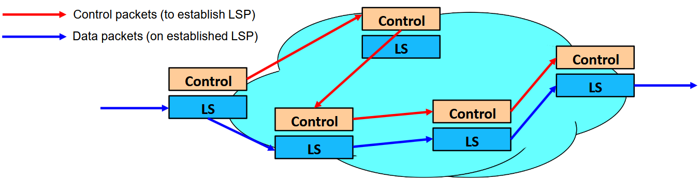

- **Control Packets** → usati per una creazione automatica dei percorsi di Label Switched Path
- **Data Packets** → pacchetti inviati sul Label Switched Path

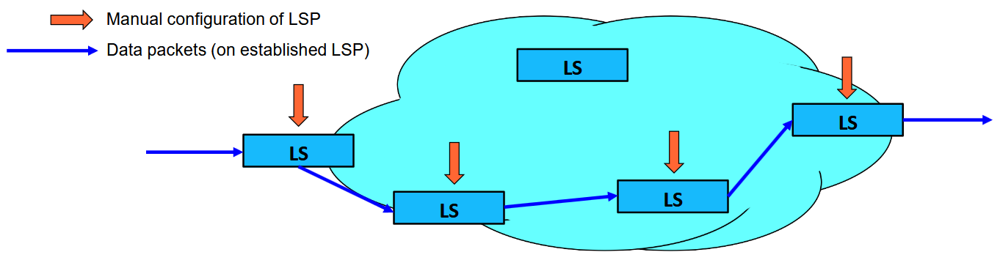

È inoltre possibile creare i LSP tramite **configurazione manuale**: entro nei vari router coinvolti nel percorso e inserisco manualmente l'associazione tra Label di Input e Label di Output.

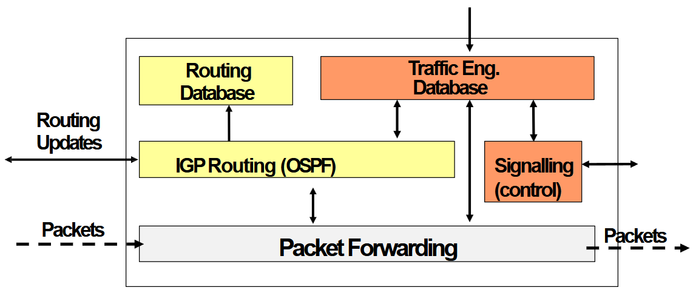

Posso anche fare questa operazione in maniera **automatizzata** tramite protocolli appositi. Per capire come funzionano bisogna capire com'è fatta l'architettura di un router MPLS.

Per quanto riguarda la parte di **controllo** (quadrati gialli e arancioni), un router MPLS ha di base due elementi analoghi ai router IP standard:

- gestione del **routing IGP**, che permette di gestire il traffico a livello IP come nei router IP;
- il **routing database** per la tabella di routing.

Quello che cambia rispetto al router IP sono i quadrati in **arancione**: l'esistenza di un **Traffic Engineering Database** e di un **protocollo di segnalazione** per stabilire i Label Switched Path.

:::note[Traffic Engineering Database]
- include **informazioni topologiche** per capire com'è fatta la topologia di rete, proprio come il Routing Database;
- **informazioni sull'utilizzo delle risorse** di rete (capacità di un collegamento, banda riservata, banda disponibile), ottenibili tramite estensioni dei protocolli di routing standard;
- **dati amministrativi**, ottenuti da configurazione utente.

Tutte queste informazioni permettono la determinazione degli LSP.
:::

**Costruzione del percorso:** MPLS abilita il **Constraint-Based Routing**, ovvero instradamento basato su vincoli. Quando voglio stabilire un LSP devo tenere in considerazione vari vincoli, come la banda richiesta dall'utente, le richieste amministrative, eccetera. In che modo creo gli LSP sulla base dei vincoli posti? Ci sono 2 opzioni:

1. **OFFLINE**: permette un'ottimizzazione globale. Possibile solo se conosco a priori tutti gli LSP da stabilire per tutti gli utenti. Solitamente però questa conoscenza non la ho.
2. **ONLINE**: gli LSP vengono stabiliti dinamicamente in tempi diversi.

Arrivati a questo punto, come posso stabilire **operativamente** gli LSP, una volta stabilito il percorso per ognuno di essi? Tramite un **Signalling Mechanism** che fa uso di pacchetti di controllo: coordina come vengono distribuite le etichette, stabilisce il percorso, riserva/rilascia/rialloca le risorse ed evita i loop.

In particolare, esistono **3 principali Signalling Mechanism** per stabilire gli LSP.

#### Label Distribution Protocol (LDP)

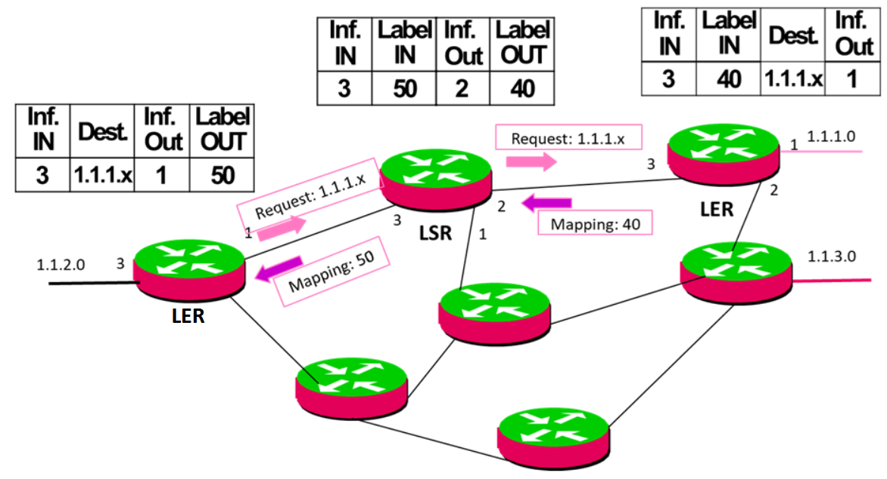

Stabilisce il percorso **hop by hop**; le etichette sono distribuite passo passo. Segue i percorsi così come sono calcolati dai protocolli di routing standard.

:::caution[No good]
Date le premesse, non è una grande idea: noi vogliamo **ingegnerizzare** i percorsi, mentre questo protocollo permette di stabilire LSP esclusivamente sul percorso definito dal routing IP. **Non supporta Traffic Engineering.**
:::

#### Constraint-Based Routing LDP (CR-LDP)

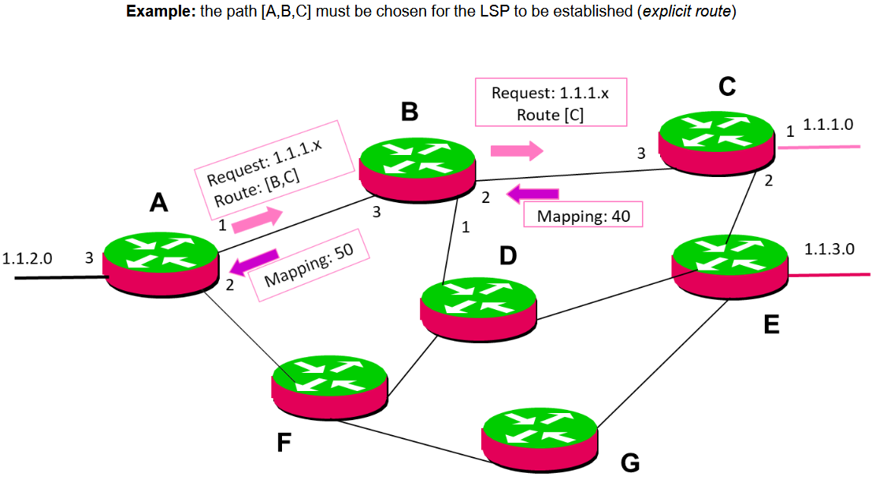

Estensione di LDP per garantire il **Constraint-Based Routing**, ma anche l'**Explicit Routing**, ovvero la possibilità di stabilire alla sorgente il percorso che il traffico dovrà seguire.

#### Resource Reservation Protocol (RSVP-TE)

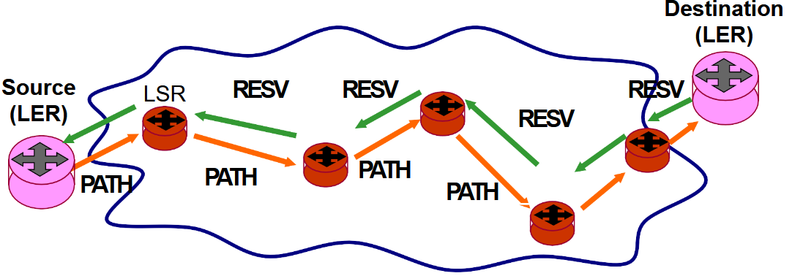

Il protocollo **più utilizzato** oggi tra i 3.

Lo accenniamo solo adesso, lo rivedremo più avanti per la Qualità del Servizio. La cosa importante è che supporta **nativamente** il Constraint-Based Routing e le rotte esplicite.

La differenza con LDP è che le etichette **non** sono distribuite hop-by-hop, ma dal **Destination LER** a tutti i router del percorso scelto.

Esempio che mostra la differenza tra routing IP e routing MPLS tramite RSVP-TE in relazione al problema della bandwidth:

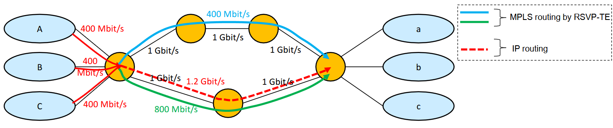

È possibile anche fare **Protection Switching** con un LSP di backup per proteggere gli LSP primari:

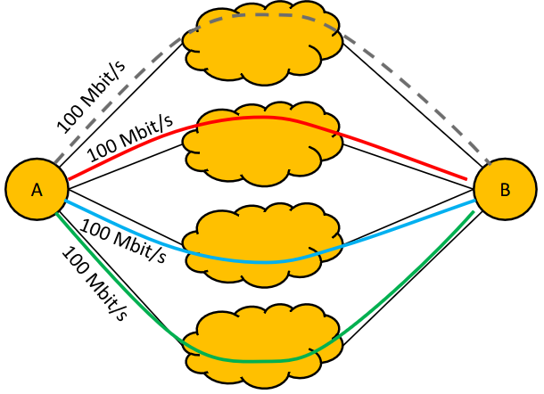

## Virtual Private Networks (VPN)

Quello che vogliono fare le VPN è **estendere geograficamente** le reti private virtuali, costruendo un **overlay** sull'infrastruttura pubblica o sulla rete dell'ISP.

Differenza tra WAN e VPN:

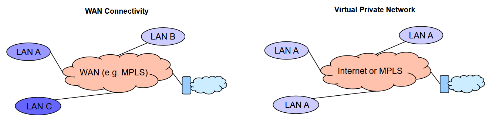

Vogliamo avere dei siti dislocati che condividano tutti lo **stesso spazio di indirizzamento**. Se sono un utente dentro LAN A e voglio comunicare con un altro utente in un'altra LAN A, devo comunicare come se fosse logicamente nella mia stessa rete locale. Motivo per cui, nello schema della VPN, tutte le LAN condividono lo stesso nome.

Fisicamente, devo transitare dalla rete Internet e MPLS per raggiungere il secondo utente. Voglio avere una rete locale **geograficamente distribuita** che si comporti come un'unica rete locale, anche se in realtà non lo è.

Esistono **3 categorie** di VPN:

| Tipo | Caratteristiche |
| --- | --- |
| **Trusted VPN** | Gestite dall'ISP. Garantiscono determinati livelli di qualità del servizio. **Non** prevedono cifratura. |
| **Secure VPN** | Quelle che abbiamo di più in mente quando pensiamo alle VPN. Gestite da VPN provider o configurate dagli ingegneri di rete delle aziende. Solitamente viene fatta cifratura, ma non per i percorsi sulla rete. |
| **VPN ibride** | Cercano di prendere il buono dagli altri tipi; gestite da ISP. |

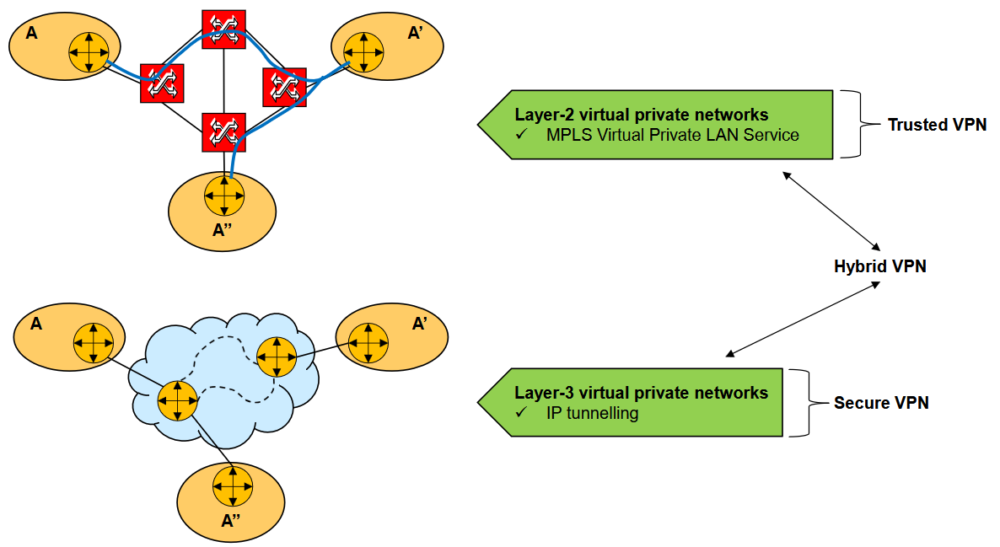

### MPLS Virtual Private Networks

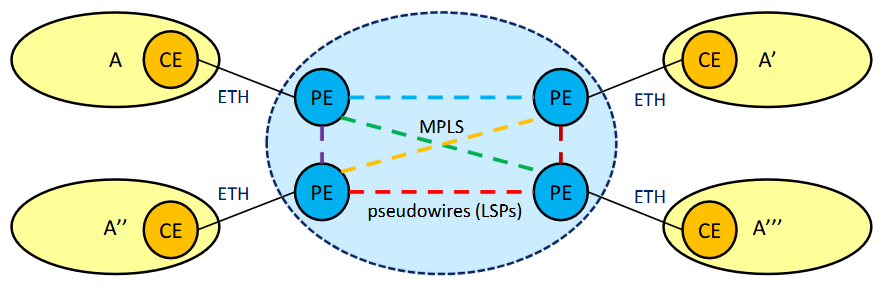

Ovviamente, c'entra MPLS. Immaginiamo la situazione in foto: abbiamo 4 branch che condividono lo stesso spazio di indirizzamento e immaginiamo di voler creare una VPN geograficamente estesa di **livello 2**.

:::note
Questo genere di soluzione si adotta generalmente in un contesto di **Datacenter**.
:::

La rete MPLS si comporta ai bordi, per quanto riguarda i Provider Edge Router (PE), come un insieme di **switch di livello 2** interconnessi. Cosa significa?

- Il funzionamento tra **CE e PE** è diverso da quanto visto prima: tra CE e PE vengono trasportate delle **trame ethernet pure**, che vengono incapsulate nei pacchetti MPLS dal PE. Il CE qui è uno **switch**, non un router.
- Il PE stabilisce dei **LSP** con gli altri PE (linee tratteggiate colorate). Non ho un collegamento fisico, ma un LSP creato sulla rete MPLS. Queste trame ethernet vengono inoltrate sulle **interfacce virtuali**.

I PE quindi si comportano come fossero switch di livello 2: per inoltrare le trame adottano un meccanismo di forwarding analogo a quello degli switch di livello 2.

Quindi, riassumendo: estendo la mia rete locale e la mia rete MPLS si comporta ai bordi (nei PE) come se fosse una semplice porzione della mia rete locale di livello 2.

### IP Tunnelling

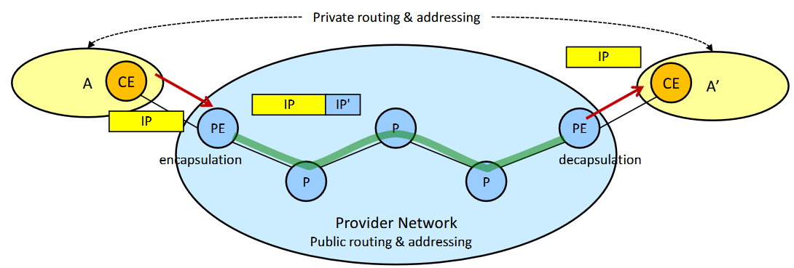

Si sfrutta un meccanismo chiamato **Tunnelling**: ho 2 branch che vogliono condividere lo stesso spazio di indirizzamento. Il CE inoltra al PE un pacchetto IP (con IP di destinazione privato, nell'immagine il rettangolo IP giallo). Il PE **incapsula** il pacchetto aggiungendo un nuovo header IP (rettangolo azzurro), che ha come indirizzo di destinazione quello dell'interfaccia che entra nell'ultimo PE.

Arrivato all'ultimo PE, viene **decapsulato** e inoltrato alla destinazione corretta.

:::tip[Vantaggio]
L'IP Tunnelling posso adottarlo su una **rete IP pubblica**, cosa che non posso fare con la tecnologia precedente. Può essere utile anche in un contesto WAN in cui ho branch dislocati su stati differenti.
:::

## Virtual Local Area Networks (VLAN)

Tecnologia usata all'interno delle reti locali. Fondamentalmente è una **rete locale virtuale** che si può creare all'interno di una rete locale fisica.

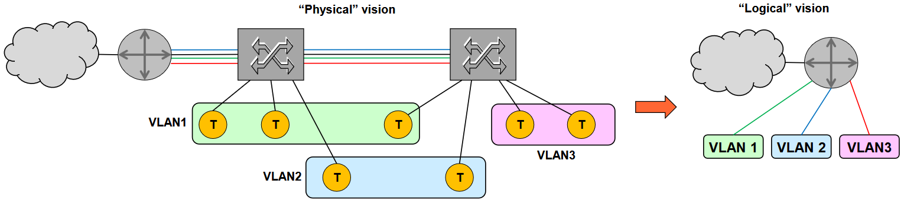

:::note[Esempio]
Immaginiamo di avere un router di bordo e una rete locale con 2 switch e un certo numero di terminali T collegati agli switch. Possiamo suddividere la rete locale fisica in un certo numero di **VLAN**, in cui fondamentalmente ho una **segregazione del traffico**: solo gli utenti che sono parte di quella specifica VLAN possono comunicare tra di loro, e non con gli altri (a meno di comunicazione esplicita).
:::

### Come si Creano le VLAN Ethernet

Parliamo di VLAN ethernet perché è quello che si fa nella stragrande maggioranza dei casi.

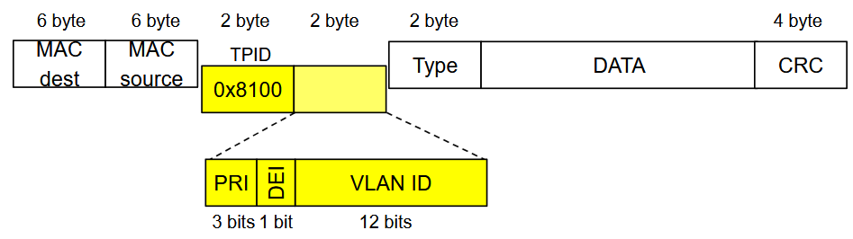

Abbiamo la trama ethernet e, dopo il MAC source, aggiungiamo **4 byte** specifici per la gestione delle dinamiche. Questa parte si chiama **VLAN TAG**.

- I primi 2 byte si chiamano **TPID**, hanno sempre lo stesso valore (`0x8100`) e indicano, nel momento in cui faccio il parsing dei campi, che se presente avrò un VLAN TAG nei 2 byte successivi.
- I 2 byte di **VLAN TAG** includono:
  - **VLAN ID** (12 bit): id unico della VLAN;
  - **PRI** (3 bit): bit di priorità, usati per definire diversi livelli di priorità per le diverse trame;
  - **DEI** (1 bit): bit di *discard eligibility*. Se pari a 1, significa che in uno stato di saturazione della rete posso scartare questa trama.

:::caution
Siccome aggiungo i 4 byte nella trama ethernet, è necessario che gli switch della mia rete siano **VLAN aware**, ovvero che siano in grado di notarli e leggerli.
:::

### Vantaggi delle VLAN

- **sicurezza**
- **controllo del traffico** e QoS enforcement
- **riconfigurabilità**
