## Networking Devices

Sono chiaramente i **mattoni** delle nostre reti di telecomunicazioni.

Abbiamo dispositivi di **inoltro e instradamento**, quali switch e router.

Abbiamo poi un altro insieme di dispositivi che garantiscono altre funzionalità di rete, decisamente non meno importanti. Prendono il nome di **middleboxes**, per esempio:

- firewall
- Intrusion Detection System
- Anti-DDoS
- Load Balancer
- ...

In un contesto aziendale, dove abbiamo delle grosse reti, questi dispositivi possono essere sia **hardware** che **software**.

Esempi presi a caso su Internet di questi dispositivi (cit. Savi):

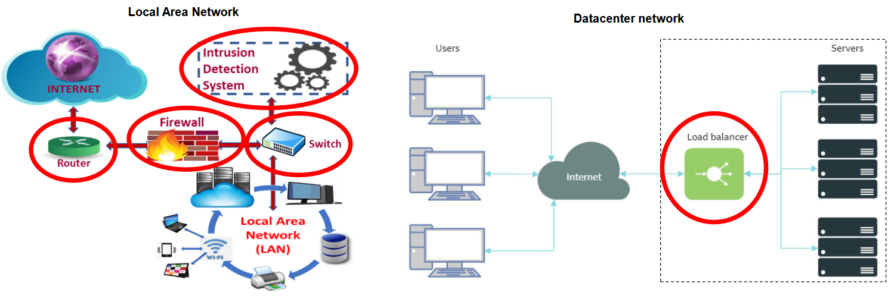

### Aspetti Comuni

Tutti i dispositivi di rete includono **2 elementi**:

| Piano | Compito | Caratteristiche |
| --- | --- | --- |
| **Control Plane** (arancione) | Gestisce le operazioni che fanno funzionare la rete: crea i percorsi in rete (quale percorso deve seguire un pacchetto da sorgente a destinazione?) e individua quali pacchetti vanno filtrati. | Operazioni più complesse, con minori constraint di tempo, che solitamente richiedono **coordinazione** tra vari dispositivi della rete. |
| **Data Plane** (azzurrino) | Gestisce i pacchetti localmente: capisce verso quale interfaccia inoltrare un pacchetto, quali campi dell'header modificare, eventuali decisioni di scarto. È l'insieme delle funzionalità che riguardano l'effettivo movimento dei pacchetti generati dall'utente. | Operazioni **semplici** da applicare **velocemente** a tutti i pacchetti in flusso nella rete. |

:::note
Gli evidenziatori arancione (Control Plane) e azzurrino (Data Plane) sono importanti per le immagini successive.
:::

## Middleboxes

Quando si parla di Middlebox, abbiamo 2 diverse categorie.

### Middlebox Relativi al Control Plane

- Authentication
- Dynamic Host Configuration Protocol (DHCP)
- Domain Name Server (DNS)
- Content Delivery Network (CDN)

### Middlebox Relativi al Data Plane

- Network Address Translator (NAT)
- Firewall
- Intrusion Detection System (IDS)
- Anti-Distributed-Denial-of-Service (Anti-DDoS)
- Load Balancer

:::caution
Solitamente questi Middlebox con funzionalità peculiari relative al **Piano Dati** richiedono hardware specializzato per ragioni di prestazioni.
:::

## Firewall

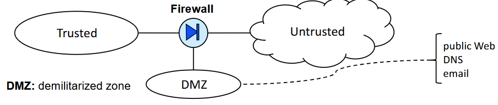

Dispositivo che fornisce sicurezza **in-line**, ovvero posto in una posizione tale per cui tutto il traffico che arriva o va verso la rete passa attraverso il dispositivo.

| Zona | Significato |
| --- | --- |
| **Trusted** | La mia rete, che voglio proteggere. |
| **Untrusted** | La rete IP pubblica. |
| **DMZ** (Demilitarized Zone) | Rete in cui vengono posti i servizi che per loro natura devono poter essere raggiunti dall'esterno (es. il sito web dell'azienda hostato nel loro webserver). |

Il Firewall ha il compito di permettere al traffico di passare o meno verso una o l'altra zona.

:::note[Default deny]
Di default il Firewall **scarta tutto**: devo inserire delle regole per consentire un determinato passaggio di traffico.
:::

Ad alto livello, la sintassi usata dal Firewall è di questo tipo:

```text
set policy id <#> from <zonein> to <zoneout> <addin> <addout> <protocol/port> <action>
```

Dove:

- `<zonein>` e `<zoneout>` → porte fisiche del Firewall
- `<addin>` e `<addout>` → range di indirizzi IP
- `<action>` → accept, discard, reject (o drop), syslog

Esempio:

```text
set policy id 1 from Untrusted to Trusted any any TCP/22 discard
```

I Firewall sono dispositivi **Stateful**: mantengono lo stato del sistema, il che permette di implementare regole complesse (es. *accetta SYNACK solo da porte TCP che hanno già ricevuto un SYN*).

Essendo un dispositivo in-line, richiede hardware molto performante per operare sul data plane.

## Intrusion Detection System

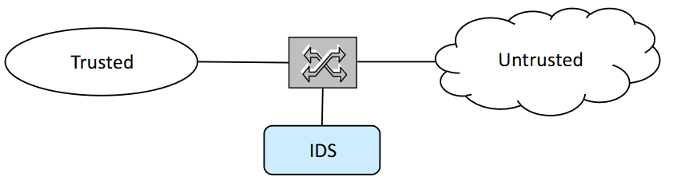

Dispositivo che **NON** è in-line. Tuttavia, si comporta in maniera simile al Firewall: implementa un set di regole per rilevare attacchi.

Questo dispositivo può fare **mirroring** del traffico verso l'IDS, che si trova su un percorso differente, in modo da non influenzare le operazioni prese sul traffico, potendo invece fare un'analisi dettagliata di cosa sta avvenendo.

:::note
In questa immagine, al posto dello switch potremmo tranquillamente avere anche un Firewall. Potrebbero anche lavorare **insieme**.
:::

## Anti-DDoS

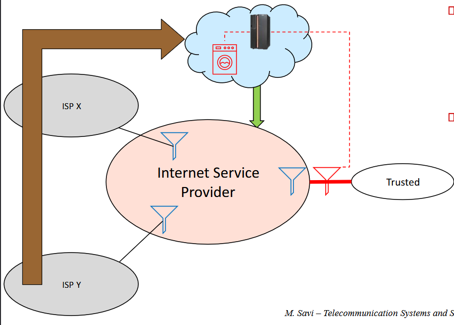

:::note[DDoS]
Attacco che ha come obiettivo **esaurire le risorse** della vittima. Le risorse potrebbero essere varie: banda, code, eccetera.
:::

:::note[DDoS vs DoS]
Mentre il **DoS** ha una grandissima quantità di traffico che proviene sempre dalla **stessa sorgente** (quindi facilmente identificabile), il **Distributed DoS** è più difficile da rilevare.
:::

Esistono 2 sistemi anti-DDoS:

1. **ISP-based**: offerti nativamente dall'ISP, solitamente a pagamento (imbuti nell'immagine).
2. **Cloud-based**: tutto il traffico in ingresso viene deviato verso il cloud provider che offre il servizio e lo "pulisce" (nuvola con lavatrice; freccia marrone = traffico sporco, freccia verde = traffico pulito; imbuto rosso = eventuale filtro nella rete trusted per garantire che il traffico pulito non venga sporcato durante il viaggio verso la trusted).

## Load Balancing

Il Load Balancing è un problema tipico in rete: **bilanciare e distribuire il carico** tra diverse possibili destinazioni. Nelle reti è un grosso problema dover gestire miliardi di utenti che devono contattare una determinata destinazione per ottenere una risposta.

Quando dobbiamo fare Load Balancing ci sono principalmente **3 possibilità**:

| # | Tipo | Soluzioni |
| --- | --- | --- |
| 1 | **Network-Based** | Caching, CDN (offerte da provider esterni); DNS load balancing |
| 2 | **Application-Based** | Reverse Proxy |
| 3 | **Hardware-Based** | Load Balancer Middleboxes (tipici nelle reti dei datacenter) |

Le opzioni 1 e 2 le vedremo più avanti nel capitolo CDN; adesso ci soffermiamo sulla 3.

### Load Balancer

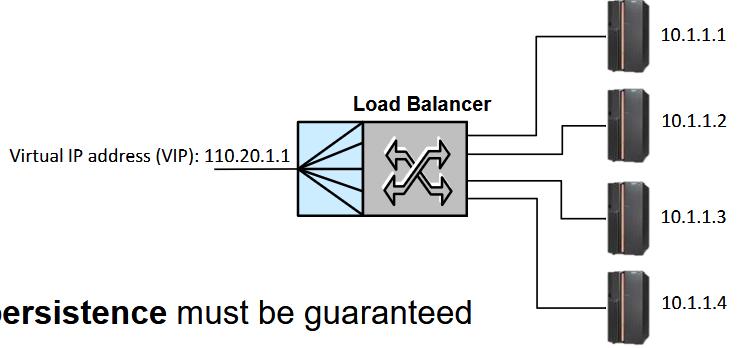

Da un lato è esposto verso la rete pubblica con un **indirizzo IP virtuale**, ovvero quello che viene specificato quando si vuole usufruire di un servizio. Dall'altro lato il Load Balancer si interfaccia con una rete locale dove posso avere varie **repliche** del mio webserver, e ha il compito di decidere su quale interfaccia di uscita mandare il traffico (verso una delle repliche).

Il Load Balancer deve garantire la **Persistenza di Sessione**: tutto il traffico che appartiene a una stessa sessione deve essere sempre direzionato verso lo stesso webserver. Questo aggiunge un certo livello di complessità.

:::note[Esempio di Persistenza di Sessione]
Se sono su Amazon e aggiungo un prodotto al carrello, e dopo 1 minuto ne aggiungo un altro, ovviamente non deve essere scomparso quello aggiunto precedentemente.
:::

Come posso garantire la persistenza della sessione?

1. **Discriminare il traffico sulla base dell'IP di sorgente**: tutti i pacchetti che arrivano dallo stesso IP vengono sempre indirizzati verso lo stesso webserver.
   - Lo svantaggio è che non è detto ci sia sempre un host dietro un IP! Per esempio il NATting può avere influenza: le reti mobili agiscono sotto NATting.
2. **Cookies**.

Altro aspetto importante è il modo con cui i Load Balancer agiscono per bilanciare il traffico sulle interfacce di uscita. Ci sono vari metodi:

- **Tecniche Rigide**, come il **Round Robin**: mando il primo traffico al primo server, il secondo al secondo, e così via, poi ricomincio da capo. Ho Balancing, ma non in maniera efficace, dato che potrei comunque trovarmi con alcuni server più carichi di altri.
- **Tecniche Adattive**: si adeguano al reale livello di carico sui singoli webserver.
  - **misurazione del carico** sui diversi server, interrogandoli per capire il loro stato di occupazione e agire di conseguenza. Il problema è l'**overhead** aggiunto dalla comunicazione necessaria.
  - decisione **passiva** del Load Balancer, basata sui **tempi di risposta** del server: più questo tempo è alto, più significa che il server è sovraccarico.

## Software-Defined Networking (SDN)

Uno dei due paradigmi fondamentali di epoca recente che hanno preso piede nelle reti (l'altro sarà la Network Function Virtualization). Parliamo quindi di cose piuttosto attuali.

Prima di parlare del paradigma SDN, dobbiamo partire da questo argomento.

### Commonalities in Networking Devices

Tenendo in considerazione tutti i dispositivi di rete visti fino ad ora (middlebox o routing e forwarding), ci rendiamo conto che abbiamo effettivamente un **modello uguale** per tutti.

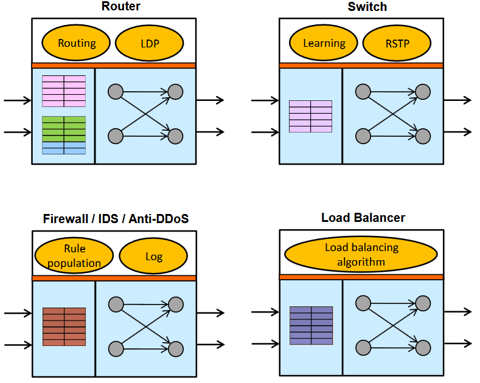

Abbiamo quindi un **Data Plane** (azzurrino), in cui ci sono delle tabelle e la necessità di interconnettere porte di ingresso a porte di uscita. La parte di Data Plane è simile in tutti i dispositivi: l'obiettivo è ricevere traffico in ingresso su un'interfaccia e inoltrarlo su una porta in uscita.

Il **Control Plane** è invece un po' più specifico per ognuna delle soluzioni. Innanzitutto può essere distribuito oppure no:

- **router**: distribuito, perché richiede comunicazione tra router;
- **switch**: distribuito, per il Rapid Spanning Tree Protocol;
- gli altri **NON** sono distribuiti.

:::tip[Concetto chiave]
Il Control Plane è **logicamente separato** dal Data Plane, ma sono **fisicamente co-locati**.
:::

### SDN

Quello che fa l'SDN è **stravolgere** questo paradigma.

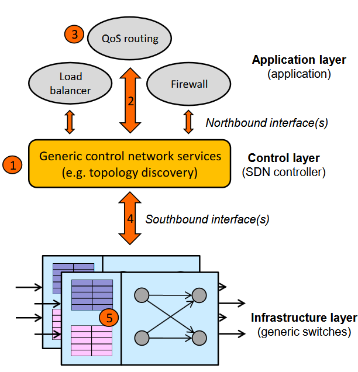

Nato in ambito accademico, ma poi adottato in ambito industriale.

:::note[Aspetto fondamentale]
In SDN abbiamo un disaccoppiamento **TOTALE** tra Control e Data Plane: non solo logico, ma anche **fisico**!
:::

Questo disaccoppiamento fa in modo che la logica del Control Plane possa essere **centralizzata** in un nodo chiamato **Controllore**, che diventa di fatto il **cervello** della rete e migliora il modo in cui posso programmarne il comportamento. Già potevo specificare come la rete si comporta, ma aumento di molto la flessibilità con cui porto avanti questa programmabilità.

Guardando l'immagine, vediamo un nodo centrale arancione che risiede nel Control Layer e corrisponde all'**SDN Controller**. Questo controller è il cervello che gestisce tutto ciò che concerne il control plane della rete.

Il controllore ha **piena visibilità** sui dispositivi di rete che effettuano l'instradamento del traffico: può conoscere esattamente la topologia della rete e prendere di conseguenza le decisioni.

:::caution
Il Controllore SDN è **software**, non hardware.
:::

- Il controllore si interfaccia **verso l'alto** con le **Applicazioni**, per mezzo di interfacce chiamate **Northbound Interfaces (NBI)**. Queste NBI sono fondamentalmente delle **API** che le applicazioni soprastanti possono usare per specificare ad alto livello quale deve essere il comportamento della rete. Nell'esempio in immagine abbiamo 3 applicazioni: il programmatore ne specifica la logica, usa le NBI per interfacciarsi col Controllore e dirgli "ho bisogno di questo comportamento per questa applicazione", solitamente con linguaggi di alto livello.
- **Verso il basso**, ci sono le **Southbound Interfaces (SBI)**, che interfacciano il Controllore ai dispositivi di rete (switch generici) e li istruiscono con comandi di basso livello sul loro comportamento, specificando le regole da inserire nelle loro tabelle.

L'interfaccia di Southbound su cui ci focalizziamo è **OpenFlow**.

## OpenFlow Switch - Control Channel

:::note
"Switch" qui è un termine generico con molte più funzionalità: non ci si riferisce al solito dispositivo di livello 2.
:::

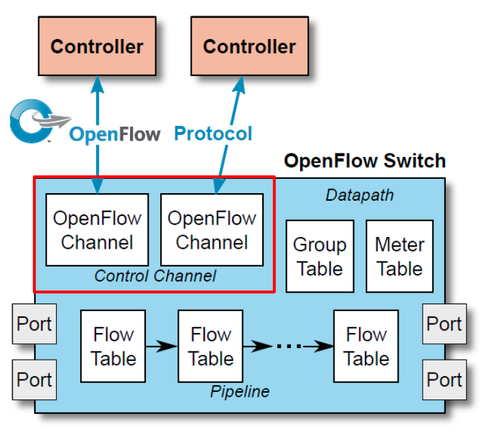

Questa è l'architettura di uno Switch OpenFlow.

L'**OpenFlow channel** gestisce la comunicazione con uno o più Controllori. Prende le **Flow Rules** e le inserisce nelle tabelle di flusso. Genera inoltre messaggi che possono essere inviati al Controller SDN.

:::note[Flow]
Insieme di pacchetti che **matchano lo stesso insieme di campi**. Se ho più pacchetti che matchano lo stesso insieme di campi, allora è un flusso.
:::

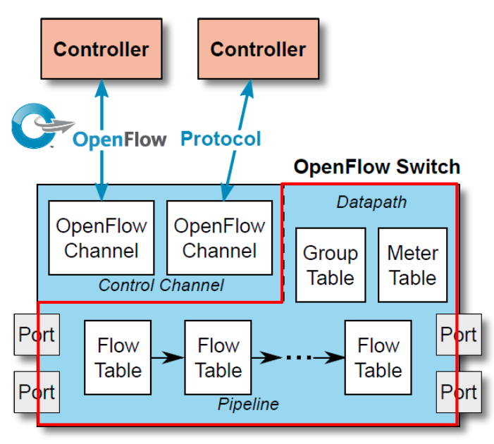

Quest'altra parte è invece composta da tabelle:

- **group table**: implementa comportamenti di inoltro avanzati;
- **meter table**: colleziona statistiche che includono i "meter". Un meter è un'entità che permette di collezionare diverse tipologie di statistiche; grazie a questa tabella abbiamo le informazioni che ci servono per implementare **QoS operations**;
- **flow tables**: permettono di prendere determinate decisioni sui pacchetti. Di queste tabelle ce n'è un certo numero concatenate in quella che prende il nome di **Pipeline**.

### Flow Tables

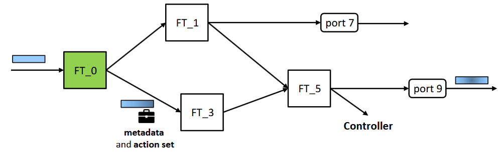

Necessità di avere **almeno 1** Flow Table (FT). Posso averne di più, attraversabili seguendo percorsi diversi.

:::caution[Regola di attraversamento]
Le FT sono numerate e posso attraversarle solo in **numero crescente**: posso andare avanti ma non indietro. Esempio: `0-3-5`, ma **non** `0-3-0-3-5`.
:::

Entità fondamentali connesse al pacchetto che deve attraversare la Pipeline per raggiungere un'interfaccia di uscita:

- **metadata**: campo speciale associato al pacchetto, che posso popolare con le informazioni che voglio. Informazione di servizio utile per fare operazioni, ma nel momento in cui il pacchetto viene inoltrato in uscita il metadato **scompare**. Non viene scritto nell'header del pacchetto!
- **action set**: lista di azioni che verranno presumibilmente eseguite **più tardi** nella pipeline, ma non adesso. Man mano che il pacchetto viaggia, questo insieme di azioni si popola, e ci sarà poi un'istruzione che dirà cosa fare con le azioni raccolte.

## Applicare i Principi SDN alla WAN: SD-WAN

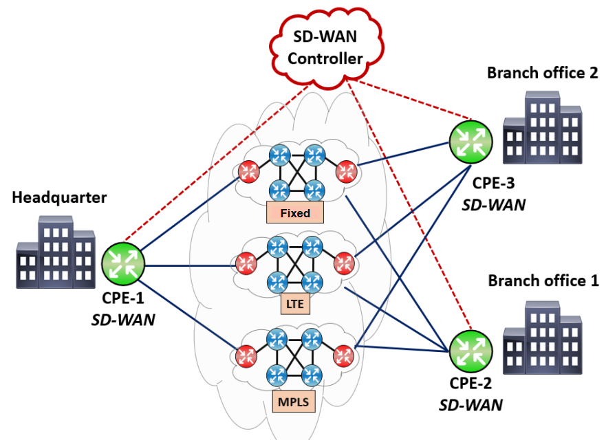

Tecnologia nata nel **2014**.

Vuole sfruttare i principi dell'SDN per **ridurre i costi** della connettività WAN; nasce quindi in ambito industriale. L'obiettivo è: *MPLS costa troppo, come possiamo ridurre i costi?*

In SD-WAN ho i vari branch da interconnettere come al solito, ma voglio spendere meno. Come faccio?

Inserisco dei dispositivi di bordo che prendono il nome di **CPE** (Customer Premises Equipment). Da un lato si interfacciano con la rete locale del branch, dall'altro hanno varie interfacce di uscita verso Internet. Vado a sfruttare le varie connessioni di connettività generalizzata verso Internet, garantendo una certa QoS del servizio.

I **componenti** della SD-WAN sono:

- **SD-WAN box**, ovvero i CPE;
- **SD-WAN controller**: gestisce le interfacce e i flussi di traffico tra i vari branch dell'azienda. Definisce in che modo inoltrare il traffico in rete per le varie tipologie di traffico generato.

### Data Plane Programming

Ci siamo focalizzati sul Control Plane. C'è però un piccolo problema: con OpenFlow, la rappresentazione della Pipeline a livello Data Plane non è flessibile, ma **fissa e immutabile**.

:::caution[La rigidità di OpenFlow]
Immaginiamo di adottare uno switch e di voler fare matching su un nuovo campo che prima non supportavo: dovrei **cambiare hardware**. Stessa cosa se volessi supportare un nuovo protocollo.
:::

Recentemente si è pensato di migliorare la **programmabilità del Data Plane**.

:::note[Data Plane Programming]
Possibilità di programmare la Pipeline Data Plane dello switch.
:::

Sono nate 2 nuove architetture per ottenere questa cosa (non le vedremo nel dettaglio):

- **PISA**: Protocol Independent Switch Architecture, 2014
- **PSA**: Portable Switch Architecture, 2018

Vediamo però in che modo migliorano ciò che c'era già in OpenFlow.

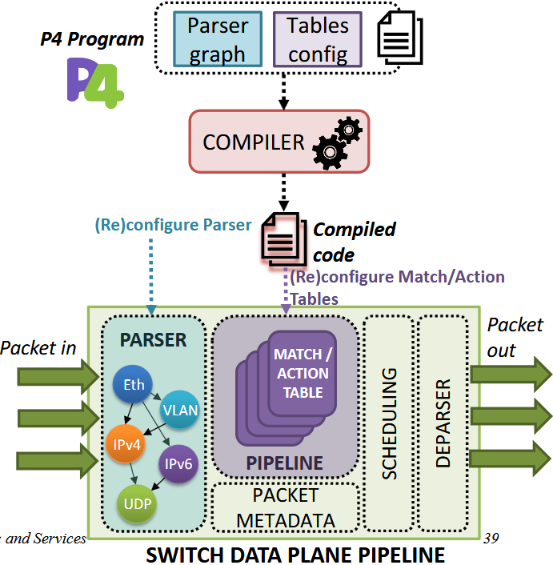

Innanzitutto, tutto quello che si poteva fare con OpenFlow rimane ancora valido. In più:

- posso **customizzare il parser** dei pacchetti: posso specificare in maniera esplicita come sono fatti gli header e, se volessi supportare un nuovo protocollo, basta riscrivere il modo in cui è fatto il Parser;
- la **struttura delle tabelle** può essere definita flessibilmente, seguendo la struttura che preferisco;
- gli **header** possono essere modificati, aggiunti o rimossi;
- è possibile fare **operazioni Stateful**.

## Network Function Virtualization (NFV)

Mentre SDN ha il compito di disaccoppiare Control e Data Plane, NFV va a disaccoppiare **hardware da software** nelle implementazioni delle funzioni di rete.

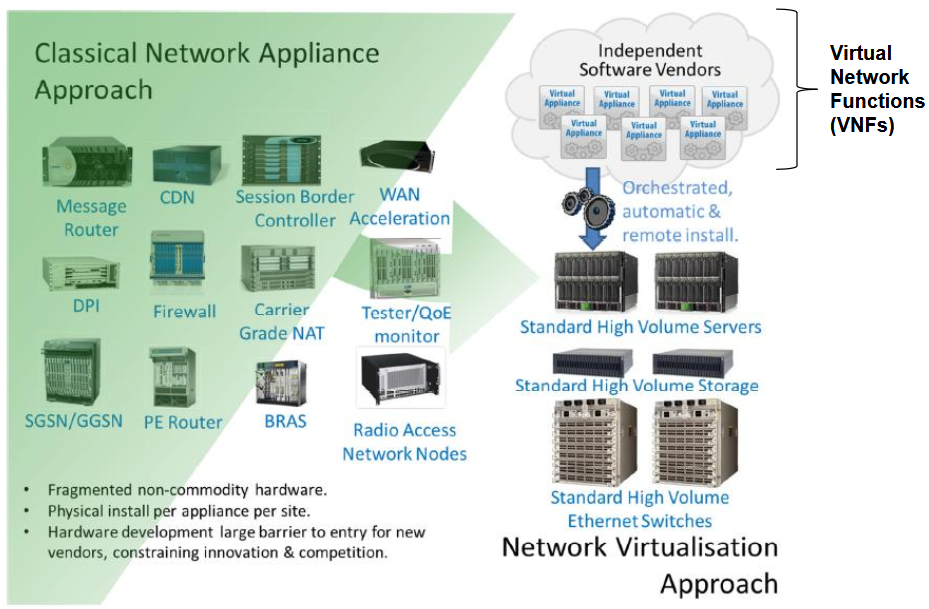

Andiamo a definire delle funzioni di rete **software** che possono essere eseguite su **hardware generico**: ho varie funzioni di rete che vengono virtualizzate e poi eseguite su hardware generico, non specifico.

Il **vantaggio** è la forte **riduzione dei costi**: il ciclo di vita delle funzioni è molto breve e dover cambiare ogni volta l'hardware è un problema; se invece implemento la funzione via software, cambio semplicemente il software.

:::caution[Quando si può applicare]
La NFV è una bellissima idea, ma applicabile solo in determinati casi. Si adatta bene alla virtualizzazione delle funzionalità del **Control Plane**, molto meno a quelle del **Data Plane**: queste ultime richiedono velocità di elaborazione elevate, difficilmente garantibili dal software.
:::

:::tip[In sintesi]
**NFV** è il primo step verso la **cloudificazione** della rete, mentre **SDN** è il primo step verso la **softwarizzazione** della rete.
:::
