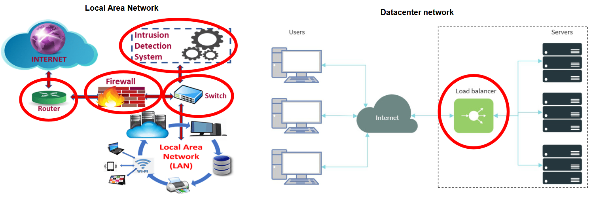
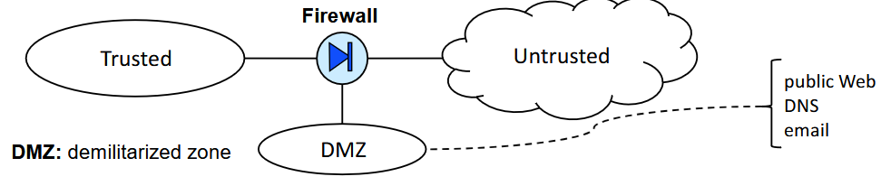
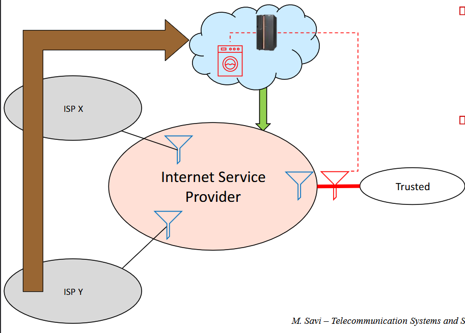

## Networking Devices
Sono chiaramente i mattoni delle nostre reti di telecomunicazioni.

Abbiamo dispostivi di inoltre e instradamento, quali switch e router.

Abbiamo un altro insieme di dispositivi che garantiscono altre funzionalità di rete, decisamente non meno importanti. Prendono il nome di middleboxes e sono per esempio:
- firewall
- Intrusion Detection System
- Anti DDoS
- Load Balancer
- ...

In un contesto aziendale dove abbiame delle grossi reti, questi dispositivi possono essere sia hardware che software. 

Esempi presi a caso su internet di questi dispositivi (cit. Savi):


### Aspetti Comuni
Tutti i dispositivi di rete includono 2 elementi:
- Control Plane (arancione, importante per le immagini successive):

    Ha il compito di gestire le operazioni che permettono di far funzionare la rete come dovrebbe funzionare. Quindi:
    - crea i percorsi in rete. Qual è il percorso in rete che deve seguire un pacchetto da sorgente a destinazione?
    - individua quali sono i pacchetti che vanno filtrati

    Operazioni più complesse con minori constraints di tempo che solitamente richiedono coordinazione tra vari dispositivi della rete.

- Data Plane (azzurrino, importante per le immagini successive):


    Ha il compito di gestire i pacchetti localmente. Quindi:
    - capire verso quale interfaccia un pacchetto va mandato e poi lo inoltra
    - quale campi nell'header modificare
    - prendere eventuali decisioni di scarto.

    Quindi è l'insieme di quelle funzionalità che riguardano l'effettivo movimento dei pacchetti in rete generati dall'utente.

    Operazioni semplici che vanno applicate velocemente a tutti i pacchetti che sono in flusso nella rete.

## Middleboxes
Quando si parla di Middlebox, abbiamo 2 diverse categorie:

### Middlebox Relativi al Control Plane
- authentiation
- Dynamic Host Configuration Protocol (DHCP)
- Domain Name Server (DNS)
- Content Delivery Network (CDN)

### Middlebox Relativi al Data Plane
- Network Address Translator (NAT)
- Firewall
- Intrusion Detection System (IDS)
- Anti-Distributed-Denial-of-Service (Anti-DDoS)
- Load Balancer

Solitamente questi Middlebox con funzionalità peculiarei relative al Piano Dati, richiedono dell'hardware specializzato per ragioni legate a prestazioni.

## Firewall


Dispositivo che fornisce sicurezza in-line, ovvero che viene posto in una posizione tale per cui tutto il traffico che arriva o va verso la rete passi attraverso il dispositivo.

La rete trusted è la mia rete che voglio proteggere, la untrusted è la rete IP pubblica, mentre la DMZ è la Demilitarized Zone.

DMZ: rete in cui vengono posti i servizi che per loro natura devono poter essere raggiunti dall'esterno. Per esempio, il sito web dell'azienda hostato nel loro webserver.

Il Firewall ha il compito di permettere al traffico di passare o non passare verso una o l'altra zona.

Di default il Firewall scarta tutto; devo inserire delle regole per consentire determinato passaggio di traffico.

Ad alto livello, la sintassi usato dal Firewall è di questo tipo:
```
set policy id <#> from <zonein> to <zoneout> <addin> <addout> <protocol/port> <action>
```

Dove:
- ```<zonein>``` e ```<zoneout>``` -> porte fisiche del Firewall
- ```<addin>``` e ```<addout>``` -> ranges di indirizzi IP
- ```<action>``` -> accept, discard, reject (o drop), syslog

Esempio:
```
set policy id 1 from Untrusted to Trusted any any TCP/22 discard
```

I Firewall sono dispositivi Stateful; mantengono lo stato del sistema e mi permette di implementare regole complesse. Esempio: accetta SYNACK solo da porte TCP che hanno già ricevuto un SYN.

Essendo un dispositivo in-line, richiede hardware molto performante per operare sul data plane.

## Intrusion Detection System


Dispositivo che NON è in-line. Tuttavia, si comporta in maniera simile al Firewall: implementa un set di regole per rilevare attacchi.

Questo dispositivo può fare **mirroring** del traffico verso l'IDS, che si trova su un percorso differente in modo da non influenzare le operazioni che vengono prese sul traffico, potendo invece fare analisi dettagliato su cosa sta avvenendo nel traffico.

In questa immagine, al posto dello switch potremmo tranquillamente avere anche un Firewall. Potrebbero anche lavorare insieme.

## Anti-DDoS


:::note[DDoS]
Attacco che ha come obiettivo esaurire le risorse della vittima. Le risorse potrebbero essere varie, come la Banda, code, eccetera...
:::

:::note[DDoS vs Dos]
Mentre il DoS ha una grandissima quantità di traffico che proviene sempre dalla stessa sorgente che va a destinazione, quindi facilmente indentificabile, il Distributed DoS è più difficile da rilevare.
:::


Esistono dunque 2 sistemi anti-DDoS:

1. ISP-based:
    
    offerti nativamente dall'ISP, solitamente a pagamento (imbuti nell'immagine)
2. Cloud-based:

    tutto il traffico in ingresso viene deviato verso il cloud provider che offre il servizio e lo pulisce (nuvola con lavatrice, freccia marrone=traffico sporco, freccia verde=traffico pulito. Imbuto rosso=eventuale filtro nella rete trusted per garantire che il traffico pulito non venga sporcato durante il viaggio verso la trusted).


