## QoS

Con il termine **Qualità del Servizio** mi riferisco al termine associato ai servizi di rete e ai flussi di traffico in rete.

In termini generali, la QoS è un **indicatore di qualità** che misura il livello del servizio rispetto alle aspettative dell'utente, relativamente ai servizi di rete.

La QoS è strettamente dipendente da un set di **parametri di performance**:

- Available bandwidth
- delays
- packet dropping
- eccetera

:::note[QoS vs QoE]
La **Quality of Experience** è un indicatore importante ma diverso, nonostante ci sia una relazione tra i due. La QoE misura in termini **soggettivi** il valore del servizio offerto all'utente.

**QoS è oggettivo, mentre QoE è soggettivo.**
:::

Possiamo definire la QoS in:

| Definizione | Significato |
| --- | --- |
| **Termini Assoluti** | Definisco determinati valori che devono essere garantiti per un insieme di parametri di performance (es. *end-to-end delay < 20 ms*). Ogni singolo pacchetto deve rispettare questi valori. |
| **Termini Relativi** | Definisco il modo in cui tratto determinati flussi di traffico rispetto agli altri. Alcune classi di traffico vengono trattate meglio di altre in base a varie policy. |

La QoS è importante perché **IP è best-effort**, mentre al giorno d'oggi ho la necessità di trattare il traffico sulla base dei diversi servizi.

:::caution[Traffico Bursty]
Per sua natura, il traffico di rete è **Bursty**: dobbiamo tenerne conto quando vogliamo garantire qualità del servizio.
:::

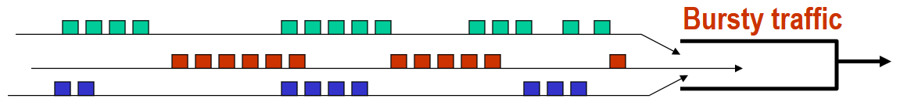

Abbiamo già visto che esistono due tipi di servizio:

| Tipo | Sensibilità | Esempio |
| --- | --- | --- |
| **real-time** | molto sensibile al **delay**, non alle perdite | VoIP |
| **elastic** | molto sensibile alle **perdite**, non al delay | Web Browsing |

## Metodi per garantire QoS

Per garantire QoS in una rete IP, ho bisogno di almeno un sottoinsieme dei metodi qui sotto:

1. **Identificazione del tipo di traffico**, ad esempio le label nella rete MPLS.
   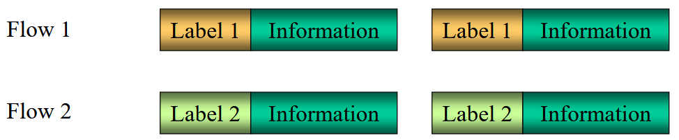
2. **Traffic Engineering** per fare enforcement di determinati percorsi in rete: posso scegliere percorsi arbitrari per il mio traffico, garantendo determinati livelli di qualità del servizio.
3. **Call Admission Control (CAC)**: meccanismi che valutano se posso ammettere nel sistema del traffico fatto in un determinato modo.
4. **Network Resource Signalling**, utile per prendere le migliori decisioni in termini di CAC.
5. **Traffic Regulation**: assicura che il traffico ammesso in rete sia fatto in un determinato modo e rispetti gli accordi stipulati.
   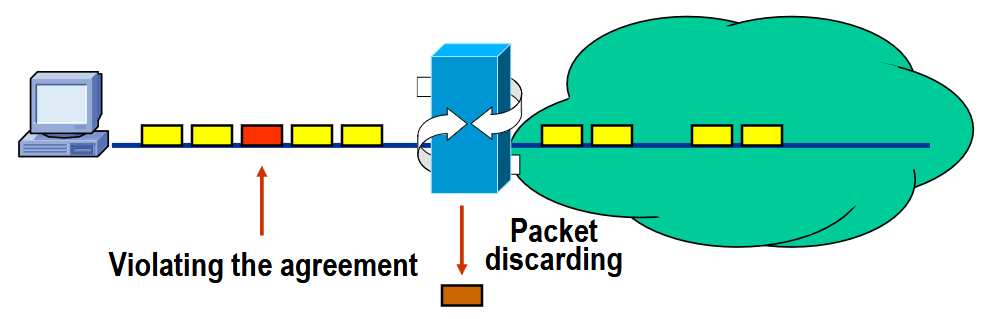
6. **Scheduling Techniques** per prioritizzare il traffico in uscita tra i dispositivi di rete.
7. **Over-provisioning**: una delle cose più semplici per garantire QoS è dimensionare la rete molto più della media necessità, per mantenere basso l'utilizzo delle risorse. Così non avrò congestioni, ma mi trovo con una rete **sottoutilizzata** quando potrei avere ricavi maggiori se usata a pieno.

## Traffic Regulation

Ci muoviamo nel contesto di un ISP che deve, su richiesta dei clienti (utenti business), offrire una connettività con una determinata qualità. È necessario che l'ISP stipuli con i clienti **due tipi di contratti**:

1. **Service Level Agreement (SLA)**
2. **Traffic Conditioning Agreement (TCA)**

### Service Level Agreement (SLA)

Ha il compito di specificare la **QoS che l'ISP deve garantire** per il traffico.

Un SLA viene definito in base a parametri oggettivi chiamati **metriche**:

- end-to-end delay
- throughput
- loss ratio
- availability
- eccetera

Un SLA include alcuni **SLO (Service Level Objectives)** che specificano la qualità di un servizio da garantire in uno specifico intervallo temporale, indicando anche i valori delle metriche da garantire.

### Traffic Conditioning Agreement (TCA)

L'ISP stipula lo SLA col cliente impegnandosi solo su **determinato traffico fatto in un determinato modo**, non indipendentemente dalla quantità o tipologia di traffico generato dall'utente.

Bisogna quindi specificare la forma e la tipologia del traffico generato dall'utente sul quale effettivamente ha validità lo SLA. Non possiamo immaginare che un utente generi traffico fuori dalle possibilità dell'ISP: serve un contratto che dica *"mi impegno a garantirti QoS sul traffico, ma il traffico deve essere fatto in un determinato modo"*.

Quindi, il **TCA specifica il profilo di traffico** per l'utente. Solo sul traffico fatto in questo determinato modo viene poi effettivamente garantito lo SLA.

| Categoria | Significato |
| --- | --- |
| **IN** | traffico **compliant** al TCA |
| **OUT** | traffico **non-compliant** |

I parametri che caratterizzano il profilo di traffico sono:

- **Peak rate**: velocità massima con cui può essere emesso il traffico in rete
- **Average rate**
- **Maximum burst length**: numero massimo di pacchetti consecutivi trasmissibili al rate di picco (in alternativa, il tempo massimo per cui si può trasmettere alla velocità di picco)
- **Maximum packet length**
- **Minimum packet length**

## Traffic Treatment

Qual è il problema se io operatore (che ho stipulato TCA e SLA) immetto in rete traffico non-compliant? Se accetto traffico non caratterizzato come mi aspetto, vado a **consumare più risorse** del previsto e rischio di compromettere la mia capacità di garantire QoS, non solo con questo utente ma anche con tutti gli altri.

Il traffico non-compliant può essere gestito tramite **3 politiche** diverse:

| Politica | Trattamento del traffico OUT |
| --- | --- |
| **Policing** | viene **scartato** |
| **Shaping** | viene **ritardato** per ottenere un comportamento compliant col TCA |
| **Marking** | viene **marchiato**, in modo da poter essere riconosciuto ed eliminato se necessario |

Nella pratica, la regolazione del traffico viene fatta **sui bordi** per mezzo di un dispositivo chiamato **Regolatore**, che distingue traffico compliant da non-compliant e decide come trattare quello non-compliant secondo le 3 modalità. Tutto il traffico deve passare da questo regolatore per essere "condizionato".

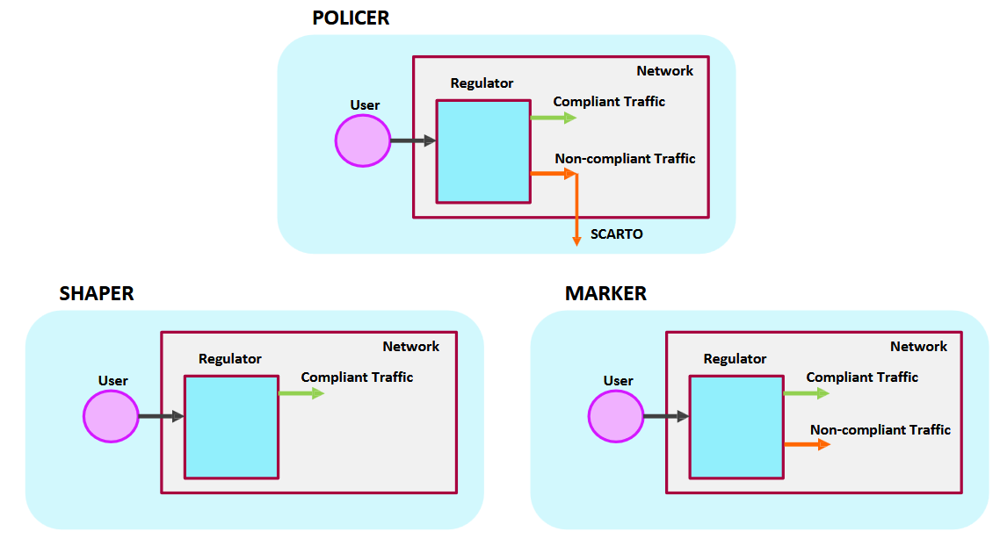

Ci sono vari algoritmi per fare regolazione del traffico. Quelli che vediamo sono il **Token Bucket** e il **Leaky Bucket**.

## Token Bucket

È il più complicato dei due. È un algoritmo usato dal Regolatore per discriminare il traffico conforme da quello non conforme, controllando **3 parametri**:

- (Peak Rate in uscita dal Token Bucket $p\ [bit/s]$) - tra parentesi perché solitamente non viene misurato
- Average Rate $b\ [bit/s]$
- Burst Length $L\ [s]$

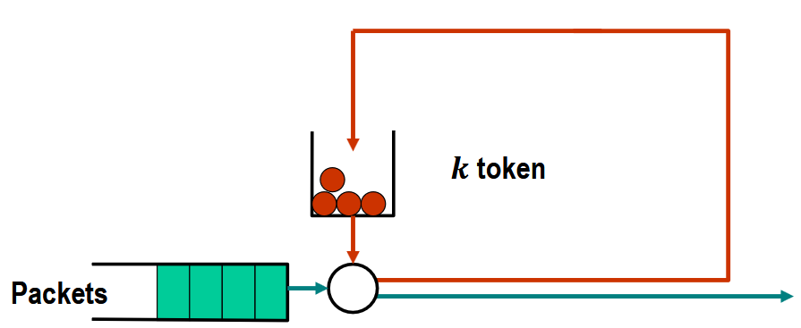

In ingresso possiamo avere o meno un buffer per i pacchetti. L'aspetto fondamentale è il **serbatoio di token** (i pallini rossi). Questo bucket può contenere al massimo $k$ token, consumati al passaggio di unità di traffico attraverso il Regolatore: ogni volta che passa un'unità di traffico, viene consumato un token. Mentre si svuotano, i token vengono **rigenerati** a un determinato Token Rate. Raggiunta la dimensione massima $k$, non vengono inseriti nuovi token.

Consumo i token a velocità di picco $p$; perché tutto funzioni deve risultare $r < p$. Da un lato consumo i token a velocità $p$, dall'altro li rigenero a velocità inferiore: avrò un periodo di tempo in cui posso trasmettere a velocità di picco, svuotando il serbatoio a un rate netto pari a $p - r$.

Una volta svuotato il serbatoio, posso far passare 1 unità di traffico solamente ogni $\frac{1}{r}$ unità di tempo. Se smetto di trasmettere, il bucket si riempie nuovamente.

### Policing con Token Bucket

Per fare policing **NON** ho un buffer in ingresso: se non ho crediti da consumare, il traffico viene semplicemente **scartato**.

Il funzionamento è lo stesso del Token Bucket generico: il regolatore fa passare un'unità di traffico solo se il serbatoio contiene almeno 1 token. L'effetto: se parto con bucket pieno, per un certo periodo posso trasmettere a velocità di picco, poi al più a velocità $r$; il resto del traffico viene scartato.

### Shaping con Token Bucket

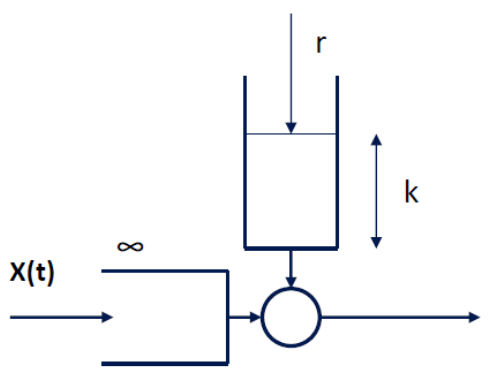

L'algoritmo funziona allo stesso modo, ma il traffico in ingresso si accumula in un **buffer**, solitamente considerato di dimensione **infinita**. Il traffico in eccesso **non viene scartato**: un'unità di traffico passa se il bucket ha almeno 1 token e il buffer è vuoto.

Se il buffer **non** è vuoto e/o il bucket dei crediti è vuoto, l'unità di traffico viene accodata all'input buffer.

### Average and Peak Rate

- $p$ → indica il massimo rateo di traffico offerto alla rete (spesso ci si riferisce ad esso come "line rate").
- il **token rate** $r$ e il **token bucket size** $k$ influenzano l'average rate $b$ del traffico offerto alla rete:
  - un $k$ alto rende possibile la trasmissione a peak rate $p$ per tempo più lungo, quindi $b$ aumenta;
  - un $r$ alto rende possibile la trasmissione a un rate maggiore quando la pool diventa vuota, quindi $b$ aumenta.
- risulta sempre che $b < p$.

### Bursty Traffic

Assumiamo sempre che $p \gg r$ ($p$ molto maggiore di $r$).

Un token bucket si sposa bene con un **traffico bursty**, dove trasmetto tanto traffico in intervalli ridotti e poi resto inattivo a lungo.

Il regolatore controlla la durata massima del burst $L$, calcolabile con la formula:

$$
L = \frac{k}{p - r}
$$

:::note[Perché?]
$k$ è la dimensione del serbatoio; ipotizziamo di partire con serbatoio pieno ($k$ token). Questi token li consumo a un rate pari a $p - r$ ($p$ è il rate con cui sparo fuori il traffico, $r$ è il rate con cui riempio il serbatoio). Con questo calcolo ottengo per quanto tempo al massimo posso trasmettere alla velocità di picco.
:::

### Constraint Function con il Token Bucket

Spesso i regolatori permettono una **funzione di vincolo**. Per capire cosa significa, osserviamo questo grafico:

Sull'asse X ho il tempo che scorre, sull'asse Y il **traffico cumulativo** visto fino a quel punto: mi dice, a un determinato istante, quanto traffico è passato fino ad allora.

In grigio ho un andamento a scalino, che indica dei burst di traffico. Su questo grafico posso mostrare una retta $k + rt$ che indica la quantità massima di unità di traffico **compliant** transitate in rete fino a quel punto. Tutto il traffico grigio sopra questa retta è traffico **OUT** (non-compliant).

| Caso | Immagine |
| --- | --- |
| **Policer** | 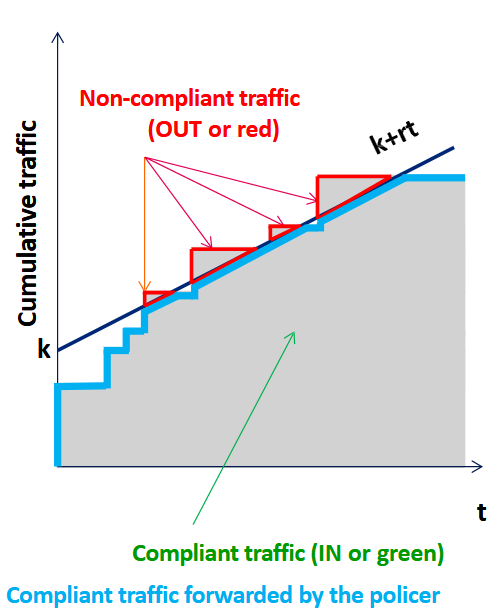 |
| **Shaper** | 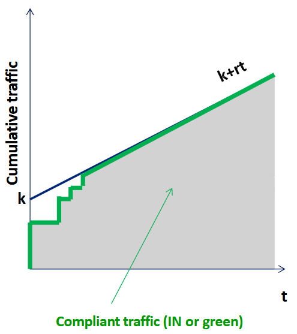 |
| **Marker** |  |

## Leaky Bucket

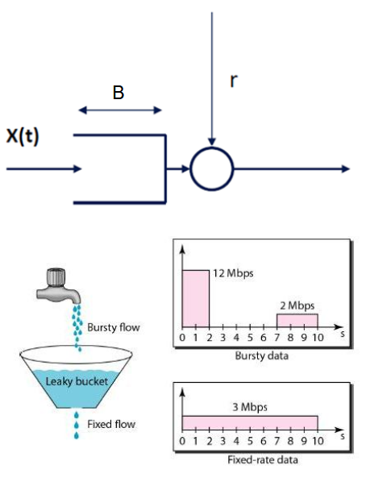

Si chiama così perché, indipendentemente da quanta acqua butto in ingresso, lascerà cadere delle gocce d'acqua a un ritmo costante.

Il Leaky Bucket ha anch'esso il meccanismo di generazione di token, ma **non** ha un serbatoio di token: o il token viene consumato, oppure viene perso. Un credito è generato ogni $\frac{1}{r}$ unità di tempo.

In ingresso ho sempre un **buffer** del traffico, che solitamente **NON** è considerato infinito (a differenza del Token Bucket). Il regolatore permette il passaggio di un'unità di traffico ogni $\frac{1}{r}$.

:::caution
Il Leaky Bucket **NON preserva la burstiness** in alcun modo. Al più fa passare il traffico alla velocità pari al token rate: il traffico è quindi **smooth**, appiattito.
:::

Molto facile da capire guardando l'esempio in basso a destra dell'immagine: il grafico sopra è il traffico in ingresso, quello sotto in uscita.

## Resource Allocation

In che modo le tecniche viste permettono di migliorare l'allocazione delle risorse? Immaginiamo questa situazione:

Molteplici flussi in ingresso, con un multiplatore che ne genera uno in uscita. Regolando il traffico in ingresso, posso avere dei benefici nell'allocare le risorse in rete.

Ci sono **2 tipi di allocazione**:

| Tipo | Caratteristica |
| --- | --- |
| **Deterministic Allocation** | Splitto le risorse tra i flussi in ingresso in maniera deterministica. Posso garantire di **non avere perdite**. |
| **Statistical Allocation** | Abilita la multiplazione statistica. Ho delle perdite, so che posso averle, ma è importante che siano **controllate**. |

Ci soffermiamo su due tecniche di **Deterministic Allocation**:

1. Peak Allocation
2. Dual Leaky Bucket algorithm

## Peak Allocation

Per evitare perdite, con la Peak Allocation garantiamo che il nostro traffico possa essere accomodato senza problemi.

Abbiamo un multiplatore con capacità $C$ e vari flussi in ingresso a velocità di picco $p$. La domanda è: al massimo quanti flussi posso ammettere per evitare perdite con una Deterministic Peak Allocation?

$$
N_p = \frac{C}{p}
$$

### Dual Leaky Bucket Allocation

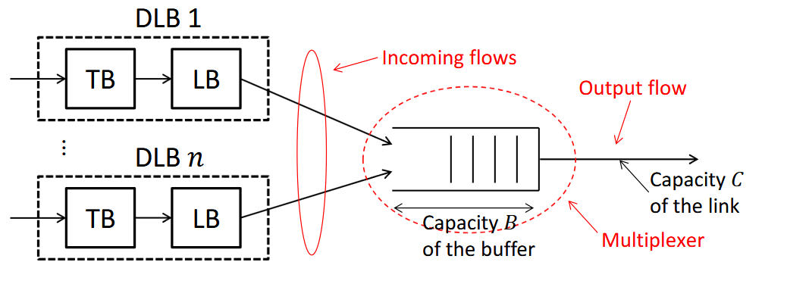

Invece di dare in input al multiplatore del traffico non regolato, faccio passare il traffico in una catena **Token Bucket + Leaky Bucket**. In uscita ho del traffico regolato. Vogliamo vedere: facendo così, potrò ammettere più o meno utenti?

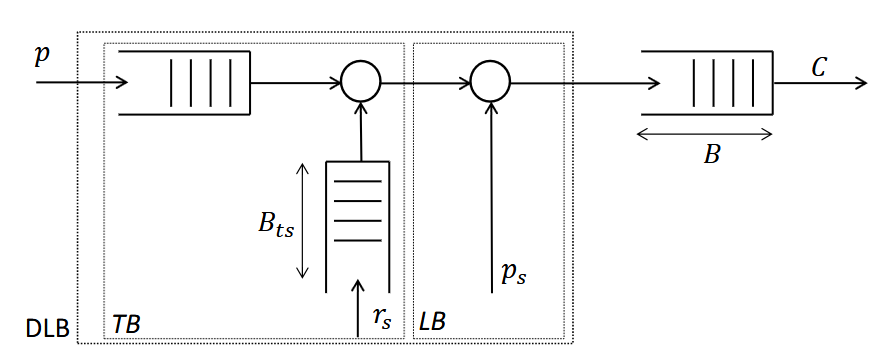

- $r_s\ [bit/s]$: token rate
- $B_{ts}\ [bit]$: token buffer size (dimensione serbatoio dei token)
- $p_s > r_s\ [bit/s]$: peak rate

Ho 3 parametri che definiscono il profilo di traffico che ammetto in rete. Posso calcolare la durata massima del burst, ovvero il tempo nel quale posso trasmettere alla velocità massima in uscita:

$$
T_{peak} = L = \frac{B_{ts}}{p_s - r_s}
$$

**Obiettivo**: esprimere con una formula quanti utenti posso ammettere. Se $N_{DLB}$ è il numero di utenti che voglio ammettere sfruttando questa allocazione deterministica, voglio esprimerne il valore sulla base dei parametri $r_s$, $p_s$ e $B_{ts}$.

Per fare questo facciamo **2 assunzioni**:

1. tutti i flussi generati dalla sorgente sono regolati da un DLB con gli stessi parametri $r_s$, $p_s$ e $B_{ts}$;
2. vogliamo allocare in maniera **ferrea** le risorse del multiplatore: assegno una porzione di capacità $c < C$ e una porzione di buffer $b < B$, uguali per tutti gli utenti.

Date queste assunzioni, risulta che $B = N_{DLB} \cdot b$ e $C = N_{DLB} \cdot c$.

Definiamo ora **due condizioni**, una sul ritardo e una sulle perdite. Vogliamo garantire un ritardo massimo per i flussi immessi in rete, evitando perdite.

**1. Condizione sul ritardo** - dobbiamo definire una dimensione $B$ del buffer del multiplatore che garantisca un ritardo massimo $D_{max}$ per ogni pacchetto di ogni flusso:

$$
D_{max} = \frac{B}{C} = \frac{N_{DLB}\, b}{N_{DLB}\, c} = \frac{b}{c}\ [s] \implies B = C \cdot D_{max}
$$

**2. Condizione sulle perdite** - dobbiamo allocare a ogni flusso una quantità $b$ di buffer in grado di accomodare tutto il traffico generato durante il tempo di picco $T_{peak}$. La quantità di dati generati nel periodo $T_{peak}$ (la durata del burst) è:

$$
b = (p_s - c) \cdot T_{peak}
$$

Moltiplicando entrambi i termini per $N_{DLB}$, ottengo:

$$
B = (N_{DLB}\, p_s - C) \cdot T_{peak}
$$

Otteniamo dunque un **sistema a due equazioni**:

$$
\begin{cases}
B = C \cdot D_{max} \\
B = (N_{DLB}\, p_s - C)\, T_{peak}
\end{cases}
$$

È possibile calcolare $N_{DLB}$:

$$
N_{DLB} = \frac{C}{p_s} \left( 1 + \frac{D_{max}}{T_{peak}} \right) = \frac{C}{p_s} \left( 1 + \frac{D_{max}(p_s - r_s)}{B_{ts}} \right)
$$

:::tip
Regolando il traffico (aggiustando $r_s$, $p_s$ e $B_{ts}$) posso ottenere valori più o meno grandi di $N_{DLB}$, ovvero accettare più o meno utenti nel sistema **senza perdite**.
:::

## Peak Allocation Vs Dual Leaky Bucket

Riprendendo le formule, confrontiamo $N_p = \frac{C}{p}$ con $N_{DLB} = \frac{C}{p_s} \left( 1 + \frac{D_{max}}{T_{peak}} \right)$.

Considerando che $p > p_s$, risulta:

$$
N_{DLB} > N_p
$$

Significa che il **DLB** rende possibile la multiplazione di **più flussi senza perdite** rispetto a una Peak Allocation Strategy.

## Scheduling

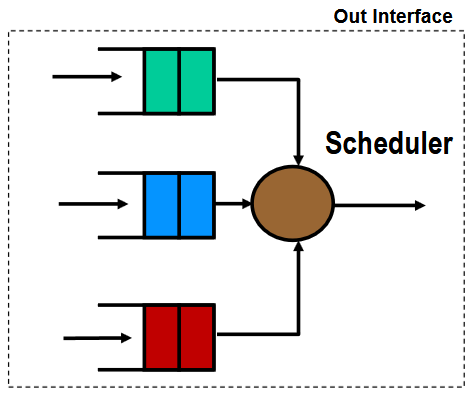

Le tecniche di **Scheduling** sono adottate per suddividere tra i flussi di traffico la banda delle interfacce di uscita dei router. La bandwidth è condivisa tra i pacchetti immagazzinati in diverse **queue**, e lo **scheduler** determina come la banda deve essere suddivisa.

Esistono diverse strategie.

### Time Division Multiplexing

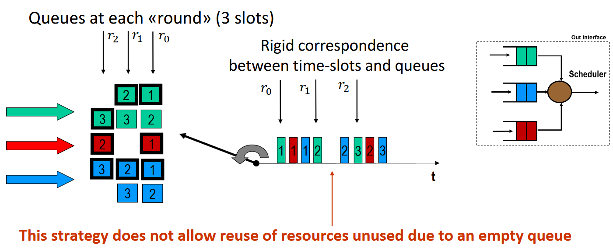

Può sembrare complessa a primo impatto, ma è in realtà la più semplice. Ci riferiamo all'esempio con le tre code e lo scheduler che deve decidere come pescare i pacchetti.

A sinistra abbiamo una fotografia temporale dello stato delle code: due pacchetti verdi (1 e 2, con 1 davanti a 2), un pacchetto nella coda rossa e due nella coda blu. In mezzo vediamo come vengono trasmessi i pacchetti sulle interfacce di uscita.

Il TDM ha una **corrispondenza rigida** tra time-slot e queue. Se non ho pacchetti accodati per una coda, quel time-slot rimane **vuoto** (e quindi sprecato).

Funzionamento passo-passo:

- **Round 0**: pesco il primo pacchetto da ogni coda (1 verde, 1 rosso, 1 blu). I bordi spessi identificano i pacchetti trasmessi per round.
- **Round 1**: si accodano un pacchetto verde 2 e un blu 2. Non ho pacchetti nella coda rossa, quindi lascio il time-slot vuoto.
- **Round 2**: stessa cosa.

:::caution[Svantaggio]
Spreco di banda se non ho pacchetti in una coda.
:::

### Round Robin (Fair Queuing)

L'approccio è analogo al TDM: controllo se ci sono pacchetti nella coda da trasmettere, ma in questo caso, se non ho un pacchetto, **passo alla coda successiva** a cercarne un altro.

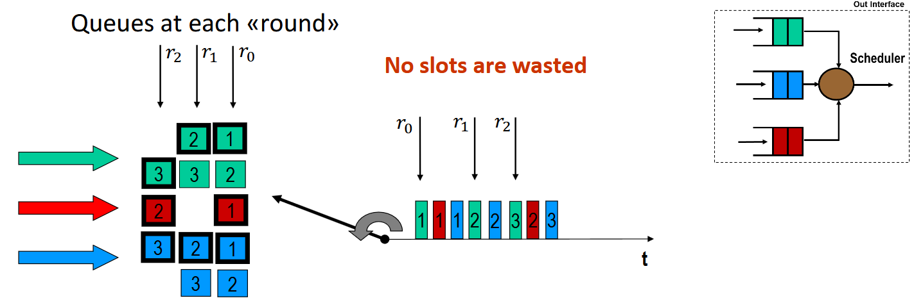

### Weighted Fair Queuing

Partiziono in modo **proporzionale** la banda tra le varie code, trasmettendo al più $k_i$ pacchetti per ognuna delle code, sempre in modo pseudo-ciclico. Invece di 1 singolo pacchetto per coda, ne posso trasmettere più di uno.

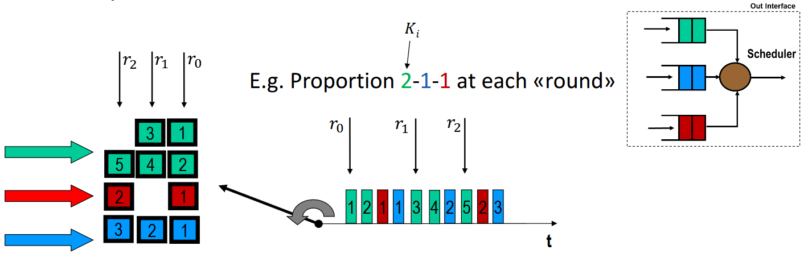

Posso suddividere la banda in modo **non necessariamente equo**.

### Service Priority

Finora non abbiamo parlato di priorità; qui invece le code hanno **priorità differenti**.

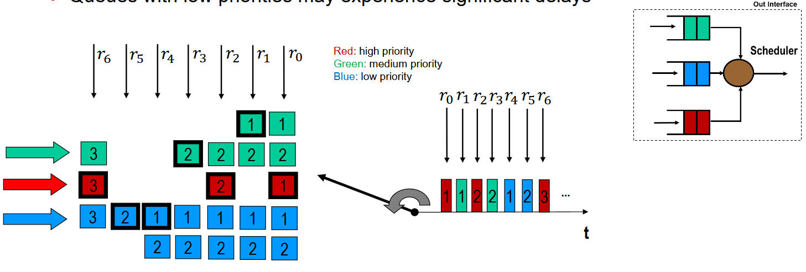

I round durano esattamente la trasmissione di un singolo pacchetto. Controllo le code: se ho almeno un pacchetto nella coda a priorità più alta, trasmetto da quella coda, altrimenti trasmetto dalla coda a priorità immediatamente inferiore, e così via.

:::caution[Problema]
Se ho pacchetti accodati nelle code a bassa priorità che sono però **più lunghi** dei pacchetti ad alta priorità, si verifica un ritardo sulla trasmissione dei pacchetti ad alta priorità.
:::

In una situazione del genere posso **frammentare** i pacchetti lunghi a bassa priorità. Si potrebbe frammentare a livello IP, ma in tal caso la ricombinazione avviene solo a livello del destinatario: avere tanti frammenti in rete non ci piace (se si perde un frammento devo ritrasmettere tutto da capo, oltre al tempo computazionale). Quello che si fa è frammentare a **livello 2**, che permette frammentazione e ricombinazione ai due capi della comunicazione. Il protocollo usato era **PPP** (Point-to-Point).

## Call Admission Control

È una delle tecniche per garantire QoS. Consiste in un insieme di azioni per stabilire o rinegoziare una connessione.

Verifico se ho **sufficienti risorse** per accettare la richiesta senza danneggiare le altre già ammesse. Se la valutazione è positiva, riservo le risorse sul percorso (porzioni di banda sui collegamenti e porzioni di buffer nei router).

L'entità che esegue la CAC deve conoscere:

- quante risorse allocare per garantire una richiesta;
- quante risorse sono attualmente allocate sui vari nodi e collegamenti.

Sulla base di queste conoscenze decide se ammettere o no. La procedura può essere portata avanti in **3 modi**:

| Modalità | Chi esegue la CAC |
| --- | --- |
| **Centralised** | un nodo centralizzato (server) |
| **Distributed** | ogni nodo della rete contribuisce |
| **Hybrid** | solo i nodi edge (bordo) della rete |

### Centralised Mode

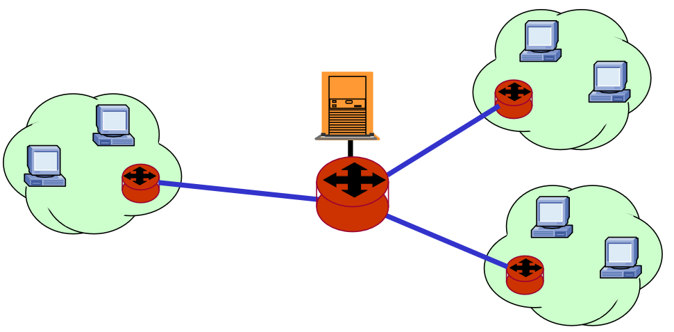

Server centrale che riceve le richieste di ammissione e conosce le info necessarie per decidere; i vari router devono comunicare col server centrale. Questa architettura è simile a quella vista nel Software Defined Networking.

- ✅ **Vantaggi**: la segnalazione verso i nodi è semplice (i nodi comunicano col server centrale il loro stato); il cammino ottimo per il flusso può essere facilmente determinato.
- ⚠️ **Svantaggi**: scalabilità e affidabilità (se cresce il numero di router è un problema, e se il server va in down pure); non ben tollerato da IP, perché la CAC definisce anche il percorso dei flussi, andando a sovrascrivere le decisioni dei protocolli di routing (che in IP sono distribuite).

Questa strategia viene adottata solo in reti piccole o in Software Defined Networking.

### Distributed Mode

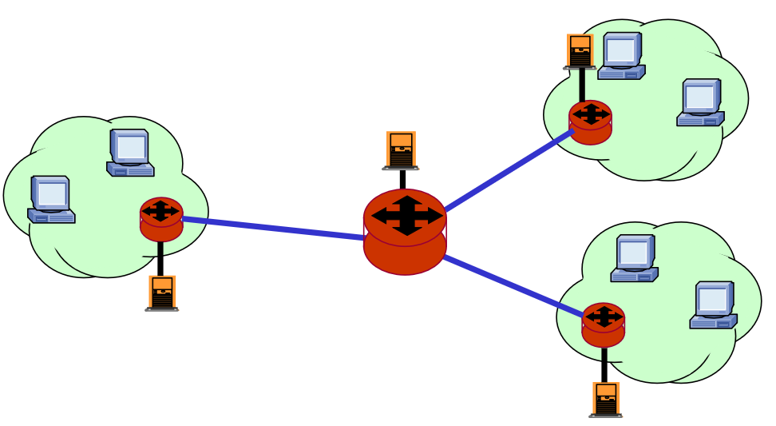

Ogni router conosce lo stato di occupazione delle proprie risorse e contribuisce alla CAC tramite scambio di messaggi.

- ✅ **Vantaggi**: più robusto e affidabile.
- ⚠️ **Svantaggi**: sistema complesso, servono protocolli distribuiti per lo scambio di messaggi che distribuiscono lo stato dei nodi; servono algoritmi per riservare le risorse sui percorsi (uno di questi è **RSVP**, che vedremo tra poco).

### Hybrid Mode

La CAC è effettuata solo dai **nodi edge** della rete: ha senso, perché è in quella posizione che vanno prese le decisioni sull'ammettere o meno un flusso. È comunque necessario che gli altri router comunichino ai router di bordo il loro stato di occupazione, ma le decisioni vengono prese solo sui router edge.

- ✅ **Vantaggi**: sistema distribuito ma meno complesso, perché meno nodi sono coinvolti nella CAC.
- ⚠️ **Svantaggi**: anche qui serve RSVP e servono protocolli di comunicazione degli stati tra i router.

## Integrated Services (IntServ)

IntServ è il **primo modello** progettato per fornire QoS nelle reti IP (**1994**). Al giorno d'oggi non viene più utilizzato. Utilizza il protocollo **RSVP** come base.

L'aspetto fondamentale è che la QoS viene definita in **termini assoluti per ogni flusso**, sfruttando un meccanismo di CAC: voglio garantire QoS per un flusso, e una procedura di CAC mi dice sì o no (usando a sua volta RSVP).

:::caution[Perché è stato abbandonato]
IntServ ha enormi problemi di **scalabilità**: devo mantenere lo stato nei router per ogni singolo flusso, cosa molto onerosa in termini di memoria. Viene sostituito da **DiffServ** (1998).
:::

IntServ specifica **3 classi di servizio**, ma poi riservo le risorse per ogni singolo flusso all'interno di quella classe:

| Classe | Descrizione |
| --- | --- |
| **Best Effort** | - |
| **Guaranteed Service** | Emula un circuit service con delay garantiti. Sperimenti una qualità paragonabile a quella di una rete a commutazione di circuito. |
| **Controlled Load Service** | Emula una Best Effort mode ma in un network **non congestionato**. Finché la rete non è congestionata, i flussi Guaranteed Service e Best Effort si comportano allo stesso modo; quando la rete inizia a congestionarsi, il Controlled Load continua a funzionare come prima. Dà una QoS inferiore al Guaranteed Service ma superiore al Best Effort. |

- ✅ **Vantaggi**: è possibile prendere decisioni sui **singoli flussi** (quali e quante risorse allocare per ogni flusso).
- ⚠️ **Svantaggi**: sistema molto complesso, deve mantenere lo stato per diversi flussi; richiede router con architettura modificata (se i router non sono RSVP-compliant, non posso adottare IntServ: enorme limitazione).

### Router di tipo IntServ

Come devono essere fatti i router di tipo IntServ (RSVP-compliant)?

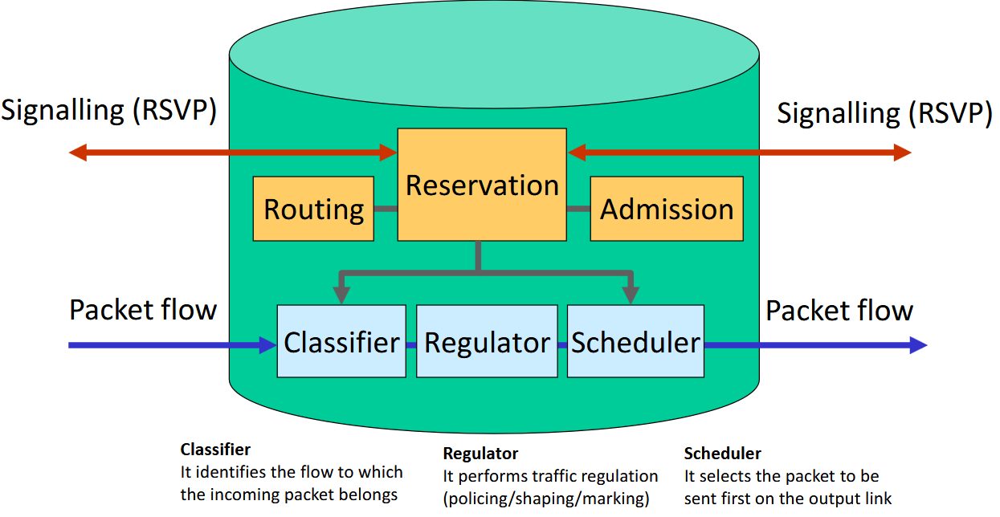

A livello di **piano dati**:

- **Classifier**: classifica il traffico, ovvero capisce a quale flusso appartiene uno specifico pacchetto;
- **Regolatore**: fa traffic regulation;
- **Scheduler**: seleziona i pacchetti da inviare per primi sul collegamento in output.

Questa parte di Data Plane non è particolarmente diversa dai router standard. Quello che cambia è la parte di **controllo**: oltre al routing IP (presente anche nei router standard), i router RSVP-compliant hanno:

- **Reservation**: scambio di messaggi RSVP con gli altri nodi RSVP-compliant, per prendere decisioni su CAC e allocazione delle risorse;
- **Admission**: decide, sulla base delle informazioni note al router, se ammettere o meno il flusso.

## RSVP

Protocollo di livello 3 incapsulato direttamente in IP. Un aspetto fondamentale è che c'è la necessità di allocare una porzione di banda per limitare la congestione dei pacchetti di signalling.

Con RSVP posso **riservare risorse** su dei percorsi per garantire un determinato QoS. Viene adottato in contesti **distribuiti**: i vari router valutano autonomamente se ammettere un flusso è fattibile; se ogni router dice sì, la richiesta viene accettata e le risorse riservate.

Due messaggi fondamentali: **PATH** e **RESV**.

### PATH Message

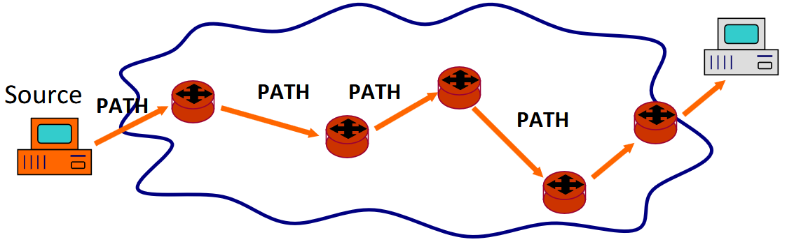

Il PATH definisce il **percorso** sul quale le risorse devono essere riservate. Segue il routing: la sorgente manda un PATH verso la destinazione e questo segue il percorso del routing IP. I PATH vengono inviati **periodicamente** per rilevare cambiamenti nel percorso di routing.

Ogni volta che un PATH transita da un router, questo deve mantenere il **PATH state**, che include:

- indirizzo dell'interfaccia di uscita del nodo precedente attraversato dal messaggio;
- caratteristiche del flusso in termini di parametri Token Bucket;
- interfaccia locale di input e output del PATH message.

:::caution
Mantenere queste informazioni è il **grosso problema** di IntServ: al giorno d'oggi non è una situazione scalabile.
:::

Quali informazioni sono incluse nel PATH message?

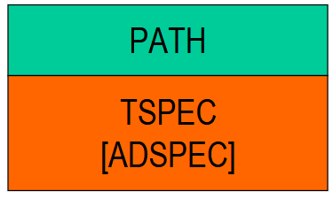

In RSVP abbiamo il concetto di **oggetto**: un insieme di campi suddivisi in intestazione dell'oggetto e oggetto vero e proprio. Nel PATH trasporto due oggetti fondamentali:

| Oggetto | Obbl./Opz. | Descrizione |
| --- | --- | --- |
| **TSPEC** (Traffic SPECification) | obbligatorio | Trasporta le caratteristiche dei flussi (parametri Token Bucket). Viene trasportato dalla sorgente alla destinazione **senza** poter essere modificato in rete. |
| **ADSPEC** (ADvertising SPECification) | opzionale | Se presente, colleziona lungo il percorso informazioni preliminari sul livello di QoS garantibile. Viene tendenzialmente modificato a ogni hop. Comunica anche se ci sono router non-RSVP-compliant. |

### RESV Message

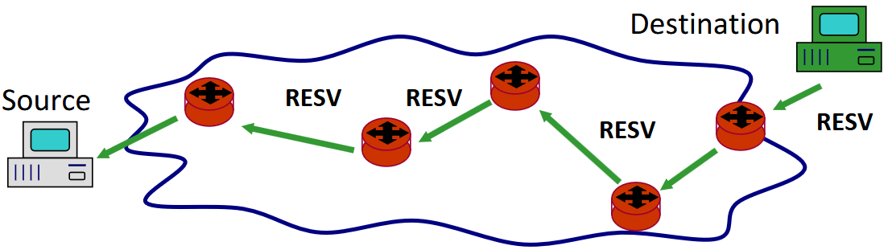

Quando il PATH raggiunge la destinazione, questa risponde alla sorgente con un **RESV message**, che porta all'**allocazione delle risorse** sul percorso. A differenza del PATH, il RESV non segue il routing IP standard, ma un approccio **source-based routing**: mentre il PATH attraversa i router, registra nel messaggio i nodi attraversati; questa info arriva alla destinazione che, invertendone l'ordine, conosce esattamente il percorso da seguire a ritroso.

Questo perché nella rete il **routing asimmetrico** è molto frequente: non è detto che il percorso da A a B sia uguale a quello da B ad A. Vogliamo che il RESV segua esattamente il PATH all'indietro, dato che su quel percorso ho collezionato informazioni utili per l'allocazione delle risorse.

Sulla base dei valori di TSPEC e ADSPEC ricevuti, la destinazione definisce quante risorse destinare sul percorso (banda e buffer) per garantire la QoS.

Nel RESV abbiamo un oggetto **FLOWSPEC**, composto da due sotto-oggetti **TSPEC** e **RSPEC** (Reservation SPECification).

:::note
Il TSPEC nel PATH non può essere modificato dai router, **ma può essere modificato dalla destinazione**! La sorgente dice di voler regolare il traffico con certi parametri, ma la destinazione potrebbe non poterlo fare con quei parametri.
:::

**RSPEC** (facoltativo) include i parametri di QoS per la specifica tipologia di servizio (es. la quantità di banda da riservare sui singoli collegamenti).

### RESV Message & Call Admission

Con RSVP, il meccanismo di Call Admission viene effettuato da **ogni singolo router** sul percorso nel momento in cui riceve un RESV message. Ricevendo il messaggio, il router ottiene informazioni su flusso e QoS (TSPEC & RSPEC) e sa quante risorse sono già destinate ai flussi ammessi. A questo punto può:

1. **accettare** il flusso (ci sono abbastanza risorse per garantire la QoS): accetta e invia RSPEC a ritroso verso la sorgente;
2. **rifiutare** la richiesta, con messaggio di errore.

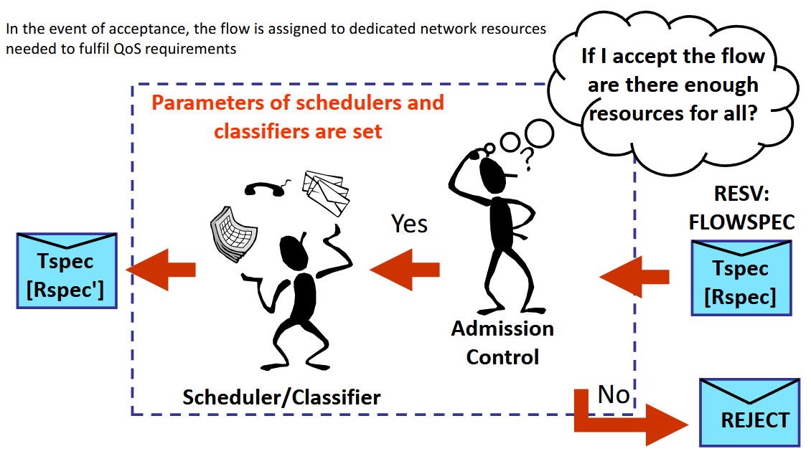

:::note
RSPEC, se presente, può essere **modificato a ritroso**, mentre TSPEC non viene modificato.
:::

### RSVP & Traffic Control

Con RSVP abbiamo 2 tipi di router (edge e core interni), che svolgono operazioni diverse.

**Edge Routers**: regolazione del traffico (policing, shaping, marking) sulla base dei parametri dichiarati, trasportati nel RESV message.

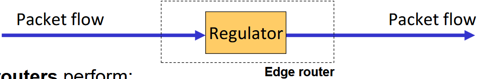

**Core Routers**:

1. classificazione dei pacchetti (per capire a quale flusso appartiene il pacchetto);
2. traffic regulation (anche se non è tipico);
3. scheduling basato sulla QoS richiesta.

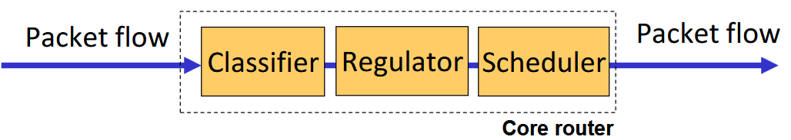

### Soft State

Siccome il mantenimento dello stato è oneroso (soprattutto in memoria), lo stato per i flussi viene mantenuto solo per un **tempo limitato**. Alla scadenza del timer, le risorse vengono disallocate e bisogna riscambiare PATH e RESV per riallocarle.

- ✅ **Vantaggio**: più facile recuperare in caso di errore; le risorse vengono disallocate automaticamente se la comunicazione non è più attiva.
- ⚠️ **Svantaggio**: grosso signalling nel traffico, perché periodicamente devo rifare la negoziazione delle risorse.

:::note
L'approccio Soft State è stato creato per cercare di "salvare" IntServ, ma non è servito.
:::

### Formato dei Messaggi RSVP

Abbiamo una concatenazione di vari oggetti; ogni oggetto ha lunghezza multipla di 32 bit.

### RSVP Message Header

- **Msg Type**: identifica la tipologia di messaggio trasportato (PATH, RESV, ecc.);
- **RSVP Checksum**: controllo di integrità sul messaggio;
- **Send_TTL**: stessa valenza del TTL in IP; importante perché, confrontando questo valore con quello dell'header IP, posso capire se ci sono router RSVP non-compliant nel percorso (se il TTL dell'header IP è più basso, alcuni router non sono in grado di parlare RSVP);
- **RSVP Length**: fondamentale perché posso avere oggetti di dimensioni differenti.

### RSVP Objects

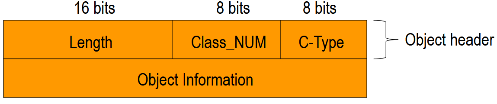

- **Class_NUM**: identificatore che specifica la tipologia dell'oggetto (ADSPEC, TSPEC, FLOWSPEC, ecc.);
- **C-Type**: tipo del formato utilizzato per un object type (1 IPv4, 2 IPv6, 7 MPLS, ...).

### Resource Allocation con GS & CLS

Vediamo come funziona l'allocazione delle risorse quando dobbiamo allocare un flusso di tipo **Guaranteed Service (GS)** o **Controlled Load Service (CLS)**.

### Guaranteed Service (GS)

Nel caso GS voglio emulare una rete a commutazione di circuito, ovvero garantire che non ci siano perdite e che il ritardo end-to-end non superi un valore stabilito.

Quali informazioni devo trasportare negli oggetti per i messaggi PATH e RESV?

**PATH:**

- **TSPEC** definisce le caratteristiche del traffico (specificate dal sender e possibilmente modificate dal destinatario). Contiene:
  1. Token Bucket Size $k\ [bit]$
  2. Token Rate $r\ [bit/s]$
  3. Peak Rate $p > r\ [bit/s]$
- **ADSPEC** (sempre presente in GS, nonostante sia opzionale): trasporta parametri aggiornati da ogni nodo del percorso per stimare il ritardo end-to-end e la banda disponibile. Ogni nodo registra il tempo che passa dall'arrivo del pacchetto sull'interfaccia in ingresso al suo inoltro sull'interfaccia di uscita, sommando questo ritardo a quello dei nodi precedenti; così a destinazione avrò una stima del ritardo end-to-end (stessa cosa per la banda disponibile).

**RESV:**

- **RSPEC** include:
  - la banda $B\ [bit/s]$ da riservare sul percorso (sulla base dei parametri trasportati da ADSPEC);
  - uno **Slack Term** $S\ [\mu s]$.

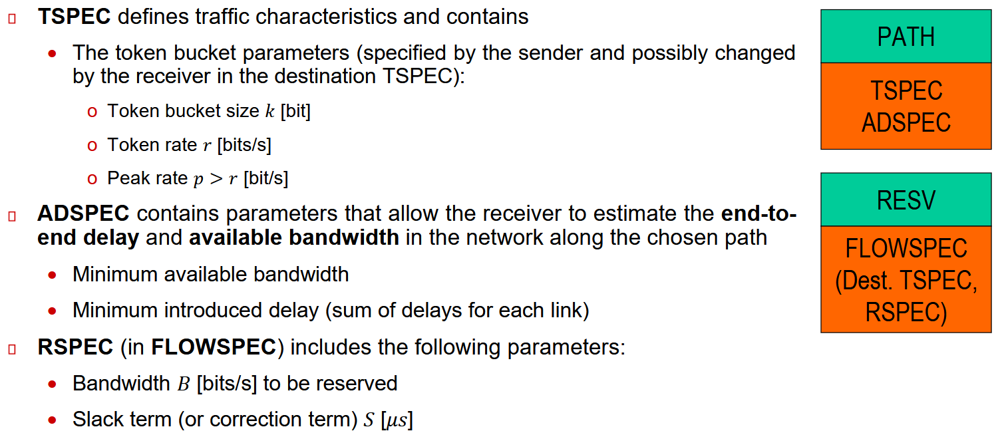

:::note[Workflow di RSPEC con Slack Term e B]
Tutto funziona considerando che tanta più banda riservo sul percorso, tanto più il ritardo end-to-end si riduce.

1. Il ricevitore, basandosi su quanto ricevuto da ADSPEC, determina la banda $B_j$ che i router devono allocare per il flusso $j$ e il termine di slack $S$. Lo **slack** corrisponde alla differenza tra il ritardo end-to-end massimo tollerabile (upper bound) e il ritardo end-to-end che ho riservando una banda $B_j$. Finché il ritardo tollerabile è maggiore di quello ottenuto riservando $B_j$, ho uno slack positivo.
2. Il ricevitore invia $B_j$ e $S$ in RSPEC; se $S$ è positivo, i router riducono la banda $B_j$ e aggiornano RSPEC. Se invece $B_j$ non è disponibile in un router sul percorso e non può essere ridotta (perché $S$ diventerebbe negativo), il flusso viene rifiutato.

Questo meccanismo assicura che una porzione di banda $B_j$ venga riservata sul percorso e che il delay end-to-end non superi un valore massimo di tolleranza.
:::

### Controlled Load Service (CLS)

Offre un servizio che emula best-effort in una rete non congestionata. Risulta più semplice rispetto a Guaranteed Service.

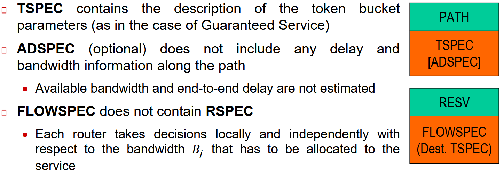

### Problemi di IntServ

Come già detto, non viene utilizzato al giorno d'oggi per varie problematiche:

- necessità di mantenere lo stato nei router per ciascun flusso, sia per GS che per CLS;
- bassa scalabilità e livello di segnalazione molto pesante (per ogni flusso vanno inviati PATH e RESV);
- problema dell'architettura router.

Tutti questi problemi rendono IntServ adottabile solamente in **reti piccole**.

## DiffServ

Più semplice, scalabile e meno costoso di IntServ. Rinunciamo a un controllo flusso per flusso: DiffServ è una tecnica a **maglia più grossolana**. Il concetto fondamentale è la **Class of Service**: in DiffServ ce ne sono diverse, trattate in maniera diversa all'interno dei router.

All'interno di una classe di servizio ho flussi appartenenti a diverse sorgenti verso diverse destinazioni, tutti trattati allo stesso modo. Dal punto di vista della QoS **perdo l'identità del singolo flusso** una volta che è stato immesso in rete. Si dice quindi che con DiffServ garantisco la QoS in **termini relativi**: non tratto più i singoli flussi, ma le classi di servizio.

:::caution
Uno dei problemi è accettare in rete del traffico in eccesso per ogni flusso della classe di servizio. Bisogna stare attenti a non ammettere traffico non regolato: se in IntServ la traffic regulation era fondamentale, in DiffServ lo è **ancora di più**.
:::

### Funzionamento di DiffServ

La regolazione del traffico viene effettuata **solo ai bordi** della rete (router di bordo): qui immetto il traffico da regolare e specifico a quale classe di servizio appartiene.

Fatto questo, i **core router** devono solo fare **Differentiated Forwarding**: differenzio il modo con cui tratto il traffico sulla base della classe di servizio a cui appartiene.

:::tip[Grande vantaggio]
DiffServ **non** richiede cambiamenti architetturali nei router: bastano code diverse che differenziano le classi di servizio, algoritmi di scheduling che pescano in modo opportuno da queste code e meccanismi di classificazione. Inoltre, non richiede il mantenimento dello stato per ogni singolo flusso.
:::

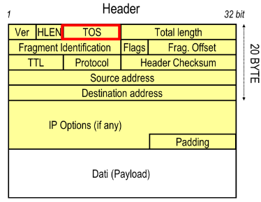

Nell'header del pacchetto IP viene utilizzato il **Differentiated Service (DS) Field** per discriminare le classi di servizio. Questo campo corrisponde al byte **TOS** (Type of Service) di IPv4.

Sono utilizzati **6 bit** per specificare il **Differentiated Service Code Point (DSCP)**, mentre gli altri 2 non sono usati. In base al valore del DSCP, ogni core router agisce in modo differente, effettuando un **Per-Hop-Behaviour** in base alla classe di servizio.

Anche qui, come per IntServ, c'è differenza tra router edge e core.

A livello di **router di bordo** devo fare classificazione e regolazione del traffico: definisco quale valore DSCP assegnare a un pacchetto (sulla base della classe di servizio a cui appartiene) e faccio regolazione del traffico a livello di micro-flusso. Una volta in rete, il pacchetto non è più trattato come appartenente a un micro-flusso, ma come appartenente a una specifica classe di servizio.

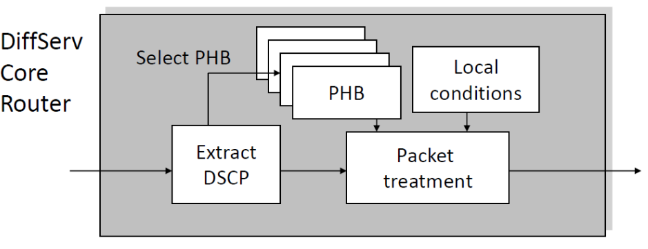

I **router di core** trattano il traffico aggregato nelle diverse classi: estraggono il valore DSCP, capiscono quale Per-Hop-Behaviour applicare e processano il pacchetto, anche sulla base di condizioni locali specifiche.

### Per-Hop-Behaviour

I PHB più importanti sono:

| PHB | Uso |
| --- | --- |
| **Expedited Forwarding (EF)** | Traffico con requisiti di QoS molto stringenti che richiedono **latenza bassa**. |
| **Assured Forwarding (AF)** | Insieme di PHB per applicazioni che richiedono **garanzie di consegna**, con QoS che richiede un tasso di perdita più o meno ridotto. |
| **Best Effort (BE)** | Traffico **senza garanzie** di consegna. |

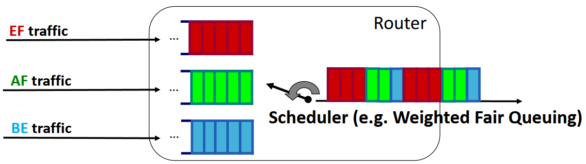

### Expedited Forwarding

L'obiettivo è emulare una **linea dedicata** (servizio a commutazione di circuito), mantenendo ritardi e perdite molto bassi. Il traffico deve essere condizionato e controllato, e il traffico in eccesso rispetto al TCA **non** è ammesso nella rete.

È il PHB con **priorità più alta**.

### Assured Forwarding

Con AF abbiamo **4 livelli di priorità**. Si usa il termine **classe** per associare i livelli di priorità, portando ad avere 4 code con priorità differenti.

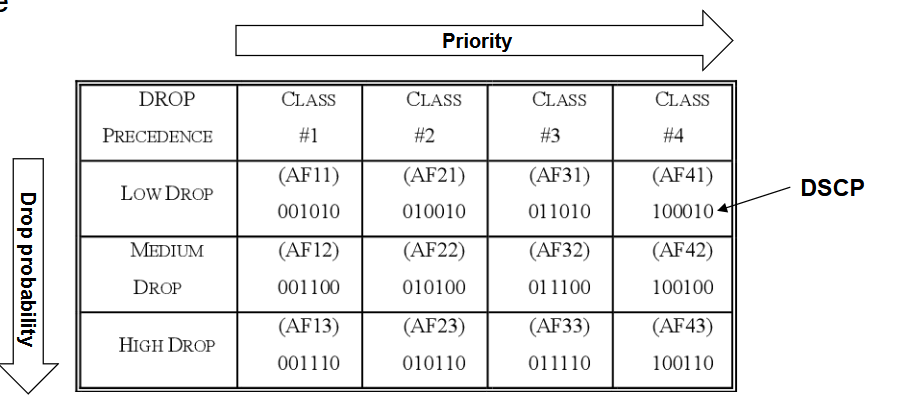

Per ognuna di queste classi ho **3 livelli di probabilità di scarto** (low, medium, high): risulta di fatto una matrice **3×4**. I codici nella tabella sono i vari DSCP per ognuno dei PHB (ogni cella corrisponde a un PHB).

:::caution[Tail Drop]
Una cosa da evitare quando accodo i pacchetti è inserirli in coda di continuo, fino a ritrovarmi con la coda piena e scartare tutti i pacchetti successivi. Questa politica si chiama **Tail Drop** e il problema è che non ho alcun controllo su cosa scarto.
:::

Con Assured Forwarding si evita questa situazione, scartando i pacchetti in maniera **controllata**. Si può adottare un algoritmo di nome **Random Early Discard (RED)**:

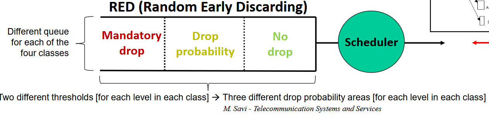
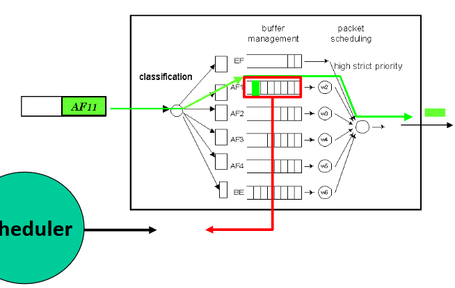

Possiamo definire delle porzioni di coda tali per cui:

- se l'occupazione della coda è **sotto una prima soglia**, continuo ad accumulare pacchetti;
- se **supero la soglia**, scarto con una certa **probabilità** i pacchetti in arrivo;
- raggiunta un'**ulteriore soglia**, scarto **tutti** i pacchetti in arrivo.

Queste due soglie devono essere specificate per ogni livello in ogni classe.

### Random Early Discarding (RED)

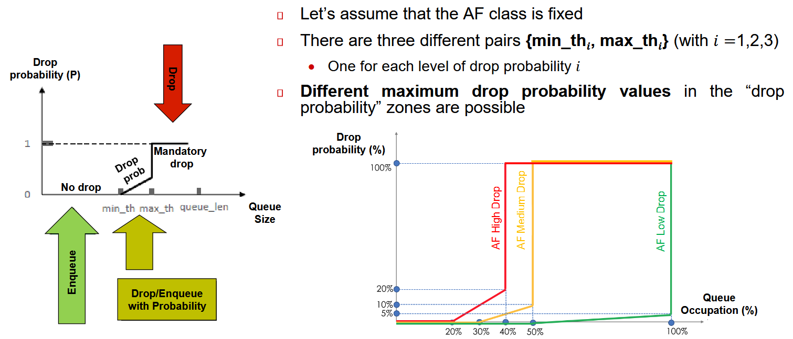
