## QoS
Con il termine Qualità del Servizio mi riferisco al termine associato ai servizi di rete e ai flussi di traffico in rete.

In termini generali, la QoS è un indicatore di qualità che ha il compito di misurare il livello del servizio rispetto a quelle che sono le aspettative dell'utente, relativamente ai servizi di reti.

La QoS è strettamente dipendente da un set di parametri di performance:
- Available bandwith
- delays
- packet dropping
- eccetera

:::note[QoS vs QoE]
Quality of Experience è un indicatore importante ma diverso, nonostante si ha una relazione tra le due. La QoE è un indicatore che misura in termini soggettivi il valore del servizio offerto all'utente.

QoS è oggettivo, mentre QoE è soggettivo.
:::

Possiamo definire la QoS in:
- Termini Assoluti:

    definisco dei determinati valori che devono essere garantiti per un insieme di parametri di performance che sto misurando. Per esempio, end-to-end delay < 20ms. Ogni sinoglo pacchetto deve rispettare questi determinati valori.

- Termini Relativi:

    definisco il modo in cui tratto determinati flussi di traffico rispetto agli altri. Alcune classi di traffico vengono trattate meglio di altre in base a varie policy adottate.

QoS è importante perché IP è best effort. Al giorno d'oggi ho la necessità di trattare il traffico sulla base dei diversi servizi.

Per sua natura, il traffico di rete è Bursty:

Dobbiamo tenerne in considerazione quando vogliamo garantire qualità del servizio.

Abbiamo già visto che esistono due tipi di servizio:
- real-time: molto sensibili al delay ma non alle perdite (es.: VoIP)

- elastic: molto sensibili alle perdite ma non al delay (es.: Web Browsing)

## Metodi per garantire QoS

Per garantire QoS in una rete IP, ho bisogno di avere almeno un sottoinsieme dei vari metodi qua sotto elencati:

1. Meccanismi che permettono di identificare il tipo di traffico. Ad esempio, le etichette labels nella rete MPLS.
    
2. Strumenti di Traffic Engineering con l'obiettivo di fare enforcement di determinati percorsi in rete. Posso scegliere percorsi arbitrari per il mio traffico, garantendo determinati livelli di qualità del servizio.

3. Call Admission Control (CAC): tutti quei mecccanismi che hanno il compito di valutare se posso ammettere del traffico fatto in un determinato modo nel sistema. 

4. Meccanismi di Network Resource Signalling, utili per prendere le migliori decisioni in termini di CAC

5. Meccanismi di Traffic Regulations: assicurano che il traffico ammesso in rete è fatto in un determinato modo e che quindi rispetta gli accordi che chi sta mettendo il traffico in rete ha stipulato con me.
    

6. Scheduling Techniques per prioritizzare il traffico in uscita tra i dispositivi di rete

7. Over-provisioni: in realtà, per garantire QoS, una delle cose più semplici da fare è andare a dimensionare la rete in modo molto maggiore rispetto alla media necessità, quindi con l'obiettivo di mantenere le risorse in rete il più basso possibile. Facendo ciò, non avrò congestioni, e basso utilizzo. Si fa, però mi trovo ad avere una rete sottoutilizzata quando potrei avere dei ricavi maggiori se usata a pieno. Se ho delle risorse a disposizione mi piacerebbe utilizzarle.

## Traffic Regulation

Ci muoviamo nel contesto di un ISP che deve, su richiesta da parte dei clienti, offrire una connettività con una determinata qualità.

A questo punto è necessario che l'ISP stipuli con i clienti (ci riferiamo a utenti business) due tipi di contratti:
1. Service Level Agreement (SLA)
2. Traffic Conditioning Agreement (TCA)

### Service Level Agreement (SLA)
Ha il compito di specificare la QoS che ISP deve garantire per il traffico.

Un SLA viene definito in base a parametri oggettivi chiamati metriche:
- end-to-end delay
- throughput
- loss ratio
- availability
- eccetera

Un SLA include alcuni SLO (Service Level Objectives) che vanno a specificare la qualità di un servizio da garantire in uno specifico intervallo temporale e specifica anche quali sono i valori per le metriche che devono essere garantite. Quindi abbiamo un contratto formato in questo modo, con queste informazioni.

### Traffic Conditioning Agreement (TCA)

L'ISP stipula il SLA col cliente, impegnandosi solo su del determinato traffico che va fatto in un determinato modo, non indipendentemente dalla quantità o dalla tipologia di traffico che viene generato dall'utente.

Quindi, fondamentalmente, bisogna specificare come deve essere fatta la forma e la tipologia di traffico generato dall'utente sul quale effettivamente ha validità il SLA. Non possiamo immaginarci che un utente generi un traffico assolutamente fuori dalle possibilità dell'ISP, bisogna anche stipulare un contratto che dica: ok, io mi impegno a garantirti QoS sul traffico, ma il traffico deve essere fatto in un determinato modo.

Quindi, il TCA specifica il profilo di traffico per l'utente.

Il profilo di traffico per l'utente è caratterizzato da un certo numero di parametri. Solo sul traffico che è fatto in questo determinato modo viene poi effettivamente garantito il SLA che è stato stipulato.

- IN: traffico compliant al TCA
- OUT: traffico non-compliant

Quali sono i parametri che caratterizzano il profilo di traffico?
- Peak rate: velocità massima con cui può essere emesso il traffico in rete
- Average rate
- Maximum burst length:
    - numero massimo di pacchetti consecutivi che possono essere trasmessi al rate di picco.
    - in alternativa, analogamente: il tempo massimo a cui chi deve trasmettere può trasmettere alla velocità di picco.
- Maximum packet length
- Minimum packet length

## Traffic Treatment
Qual è il problema se io operatore che ho stipulato TCA e SLA immetto in rete traffico non-compliant? Ovviamente ho dei rischi nel fare questa cosa, perché se accetto in rete del traffico che non è caratterizzato come mi aspetto, vado a consumare più risorse di quelle che mi aspetto e rischio di compromettere la mia capacità di garantire QoS, non solo con questo utente, ma anche con tutti gli altri.

Traffico non compliant può essere gestito tramite 3 politiche diverse:
1. Policing: il traffico OUT è scartato
2. Shaping: il traffico OUT è ritardato per ottenere un comportamento compliant con il TCA
3. Marking: il traffico OUT viene marchiato in modo da poter essere riconosciuto ed eliminato se necessario

Nella pratica, la regolazione del traffico viene fatto sui bordi per mezzo di un dispositivo che prende il nome di Regolatore, il quale ha il compito di distinguere traffico compliant da non-compliant. Può decidere di trattare il traffico non-compliant sulla base delle 3 modalità appena viste. Per mezzo di algoritmi eseguiti da un regolatore io posso andare a far si che il traffico immesso in rete segua il profilo di traffico stabilito in TCA. Tutto il traffico deve passare da questo regolatore per essere "condizionato".

Ci sono 3 modalità diverse di gestione del traffico:

Ci sono vari algoritmi usati per fare regolazione del traffico. Quelli che vediamo sono il Token Bucket e il Leaky Bucket.

## Token Bucket
È tra i due il più complicato. È un algoritmo usato dal Regolatore per discriminare il traffico conforme da quello non conforme, controllando 3 diversi parametri:
- (Peak Rate in uscita dal Token Bucket $p [bit/s]$) tra parentesi perché solitamente non viene misurato
- Average Rate $b [bit/s]$
- Burst Length $L [s]$

In ingresso possiamo avere o meno un buffer per i pacchetti. L'aspetto fondamentale del Token Bucket è che abbiamo un serbatoio di token, che corrispondono ai pallini rossi. Questo bucket può contenere al massimo k token, consumati al passaggio di unità di traffico attravero il Regolatore. Quindi, ogni volta che passa un'unità di traffico attraverso il regolatore viene consumato un toket. Questi token, mentre si svuotano, vengono rigenerati a un determinato Token Rate. Raggiunta la dimensione massima k non vengono inseriti nuovi token.

I token li consumo a velocità di picco $p$; per fare in modo che tutto funzioni il rate $r$ deve risultare $r < p$. Da un lato consumo i token a velocità di picco $p$, dall'altro li rigenero a velocità inferiore: avrò un periodo di tempo in cui posso trasmettere a velocità di picco e sto svuotando il serbatorio di token a un rate netto di svuotamento pari a $p-r$.

Una volta svuotato tutto il serbatoio, posso far passare 1 unità di traffico solamente ogni $\frac{1}{r}$ unità di tempo. Siccome non ho più token, sto continuando a trasmettere, il bucket non si riempie ma posso trasmettere al più a $r$. Se smetto di trasmettere, il bucket si ripemie nuvoamente.

### Policing con Token Bucket
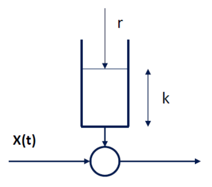

Per fare policing NON ho un buffer in ingresso. 
Quindi, se non ho crediti da consumare, il traffico viene semplicemente scartato.

Il funzionamento è lo stesso di quanto spiegato per il Token Bucket generico, l'importante è che il regolatore fa passare un'unità di traffico solo se il serbatoio contiene almeno 1 token. L'effetto ottenuto è una situazione per un certo periodo di tempo, se parto con bucket pieno, posso trasmettere a velocità di picco, ma poi basta. Dopo un certo periodo di tempo al più trasmetto a velocità $r$, il resto del traffico viene scartato.

### Shaping con Token Bucket
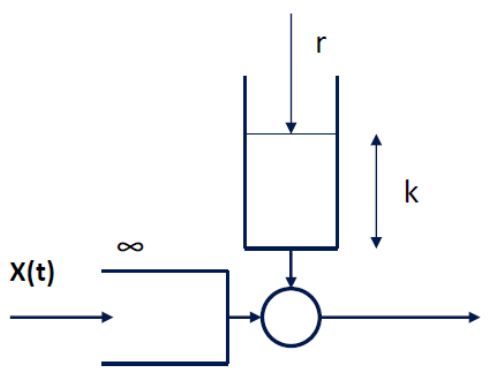

Fondamentalmente l'algoritmo funziona allo stesso modo, ma come possiamo vedere dall'immagine, il traffico in ingresso al token bucket si accumula in un buffer, solitamente considerato di dimensione infinita. Il resto funziona allo stesso modo, se non per il fatto che il traffico in eccesso non viene scartato; un'unità di traffico passa se il mio bucket ha almeno 1 token e il buffer è vuoto.

Se il buffer NON è vuoto e/o il bucket dei crediti è vuoto, l'unità di traffico viene accodata all'input buffer.

### Average and Peak Rate
- $p$ -> indica il massimo rateo di traffico che può essere offerto alla rete. Solitamente ci si riferisce come "line rate"
- il token rate $r$ e il token bucket size $k$ influenzano l'average rate $b$ del traffico offerto alla rete.
    - un $k$ alto rende possibile la trasmissione a un peak rate $p$ per tempo più lungo, quindi $b$ aumenta
    - un $r$ alto rende possibile la trasmissione a un rate maggiore quando la pool diventa vuota, quindi $b$ aumenta
- risulta sempre che $b < p$

### Bursty Traffic
Assumiamo sempre che $p >> r$ (p è molto maggiore di r).

Un token bucket si sposa bene con un traffico di tipo bursty, dove trasmetto tanto traffico in intervalli di tempo ridotti, poi sto inattivo a lungo tempo.

- Il regolatore controlla la durata massima del burst $L$
- è possibile calcolare la maximum burst $L$ duration con la seguente formula:
$$L = \frac{k}{p - r}$$.

    Perché? k è la dimensione del mio serbatoio e ipotizziamo di partire con serbatorio pieno di crediti, quindi k token. Questi token li vado a consumare a un rate pari a $p-r$, perché $p$ è il rate con cui sparo fuori il traffico in uscita, che quindi mi fa andare a consumare i token, mentre $r$ è il rate con cui ri riempio il serbatoio. Con questo calcolo ottengo per quanto tempo al massimo posso trasmettere alla velocità di picco.

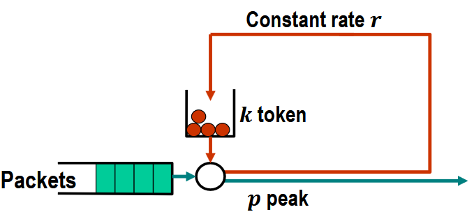

### Contraint Function con il Token Bucket
Spesso i regolatori permettono una funzione di vincolo.

Per capire cosa significa possiamo osservare questo grafico:
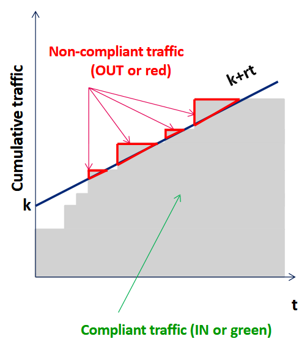

Lungo l'asse delle X ho il tempo che scorre, lungo asse Y ho il traffico cumulativo che si è visto fino a questo punto. Di fatto, mi dice a un determinato istante di tempo quanto traffico è passato fino a quell'istante di tempo.

In grigio ho un andamento a scalino, che indica dei burst di traffico. Sul questo grafico posso mostrare una retta $k + rt$ che va ad indicare la quantità massima di unità di traffico compliant che è stato fatto transitare in rete fino a questo punto. Tutto il traffico grigio che sta sopra questa retta è traffico OUT (non-compliant).

Caso Policer:

Caso Shaper:
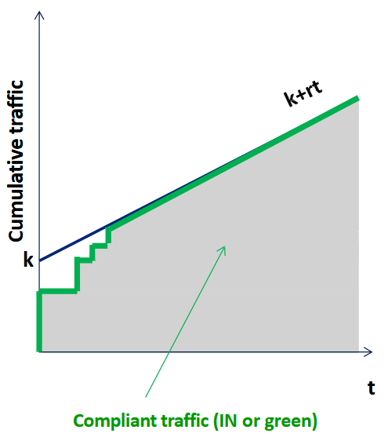

Caso Marker:
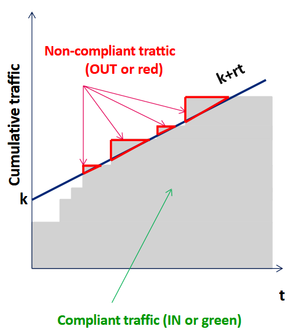

## Leaky Bucket

Si chiama così perché indipendentemente da quanta acqua vado a buttare in ingresso, lascerà cadere delle gocce d'acqua.

Il Leaky Bucket ha anche lui il meccanismo di generazione di token, ma non ha un serbatoio di token.

O il token viene consumato, oppure viene perso. Un credito è generato ogni $\frac{1}{r}$ unità di tempo.

In ingresso ho sempre un buffer del traffico, che solitamente NON è considerato infinito, a differenza del Token Bucket. Il regolatore permette quindi passaggio di unità di traffico ogni $\frac{1}{r}$.

Quindi, significa che il Leaky Bucket NON preserva la burstiness in alcun modo. Al più, fa passare un traffico alla velocità pari al token rate. Il traffico è quindi smooth, appiattito.

Molto facile da capire guardando l'esempio in basso a destra dell'immagine. Il grafico sopra è il traffico in ingrasso, quello sopra in usita.

## Resource Allocation
In che modo le tecniche viste permettono di migliorare l'allocazione delle risorse? Immaginiamo una situazione del genere:

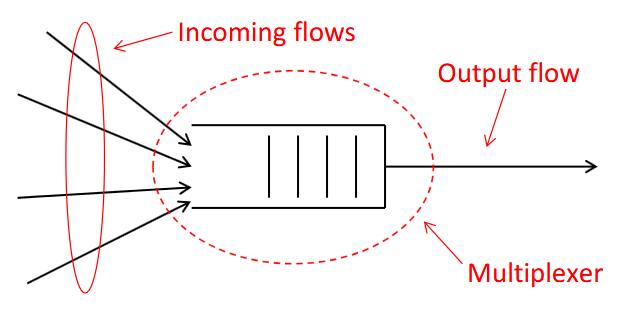
Molteplici flussi in ingresso con un multiplatore che ne genera uno in uscita. Nel momento in cui vado a regolare il traffico in ingresso, posso avere dei benefici nell'allocare le risorse in rete.

Ci sono 2 tipi di allocazioni:
1. Deterministic Allocation: possiamo splittare le nostre risorse tra flussi in ingresso diversi in maniera determinista. Posso garantire di non avere perdite nel sistema.

2. Statistical Allocation: abilita la multiplazione statistica. Ho delle perdite, so che posso averle, ma è importante che siano controllate.

Ci soffermiamo sul due tecniche di Deterministic Allocation:
1. peak allocation
2. Dual Leaky Bucket algorithm

## Peak Allocation
Per evitare perdite, se noi andiamo a fare Peak Allocation garantiamo che il nostro traffico può essere accomodato senza problemi. 

Abbiamo un multiplatore con capacità pari a $C$, e vari flussi in ingresso a velocità di picco $p$. La domanda è: al massimo quanti flussi posso ammettere al sistema per evitare che ci siano perdite se faccio una Deterministic Peak Allocation? 
$$
N_p = \frac{C}{p}
$$

### Dual Leaky Bucket Allocation

Invece di dare in input al multiplatore del traffico non regolato, faccio passare il traffico all'interno di una catena Token Bucket + Leaky Bucket. In uscita ho del traffico regolato. Vogliamo andare a vedere: facendo una cosa del genere, potrò ammettere nel sistema più o meno utenti?

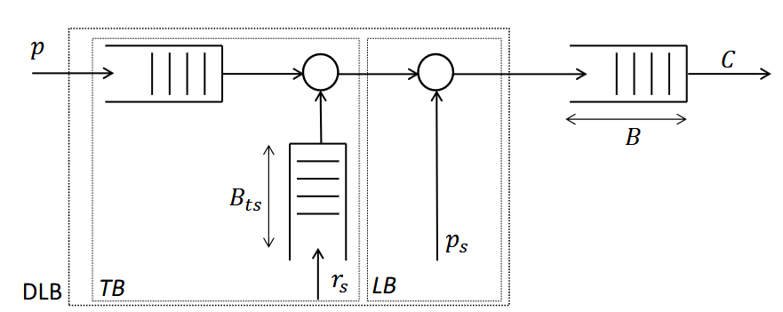

- $r_s [bit/s]$: token rate
- $B_{ts} [bit]$: token buffer size (dimensione serbatoio dei token)
- $p_s > r_s [bit/s]$: peak rate

Ho 3 diversi parametri che mi permettono di definire qual è il profilo di traffico che ammetto in rete.

Posso calcolare la durata massima del burst, ovvero la quantità di tempo nel quale posso trasmettere alla velocità massima in uscita:

$$ 
T_{peak} = L = \frac{B_{ts}}{p_s - r_s}  
$$

Obiettivo: esprimere per mezzo di una formula quanti utenti posso ammettere nel sistema. Se $N_{DLB}$ è il numero di utenti è il numero di utenti che voglio ammettere nel sistema sfruttando allocazione deterministica di questo tipo, voglio esprimerne il valore sulla base dei parametri $r_s$, $p_s$ e $B_{ts}$.

Per fare questo facciamo 2 assunzioni:
1. tutti i flussi generati dalla sorgente sono regolati da un DLB che ha gli stessi parametri $r_s$, $p_s$ e $B_{ts}$.

2. quello che vogliamo fare è allocare in maniera ferrea le risorse del mio multiplatore. Voglio assegnare una porzione di capacità del multiplatore pari a $c < C$ e una porzione di buffer pari a $b < B$; questi due valori sono gli stessi per tutti gli utenti. Sto implicitamente dicendo che voglio assegnare in maniera ferrea le risorse del mio multiplatore.

Date queste due assunzioni, risulta che $B = N_{DLB} * b$ e che $C = N_{DLB} * c$.

Quello che noi facciamo adesso è definire due condizioni, una sul ritardo e una sulle perdite. Vogliamo garantire un ritardo massimo per i flussi immessi in rete, evitando che ci siano perdite.

1. Relativamente al ritardo, dobbiamo definire una dimensione $B$ del buffer del multiplatore che ci garantisca un ritardo $D_{max}$ massimo per ogni pacchetto di ogni flusso. Quindi, voglio garantire al più un ritardo massimo e quanto vale questo ritardo? Posso calcolarlo in questo modo:
    
    $$ 
    D_{max} = \frac{B}{C} = \frac{N_{DLB} * b}{N_{DLB} * c} = \frac{b}{c} [s] 
    \\ => \\
    B = C * D_{max} 
    $$

2. Vogliamo garantire che non ci siano perdite.Quindi, dobbiamo fare in modo che andiamo ad allocare all'interno del nostro buffer una quantità $b$ di buffer a ogni flusso, che sia in grado di accomodare tutto il traffico che viene generato durante un periodo pari dal tempo di picco $T_{peak}$. 

    Quanto è la quantità di dati generati nel periodo $T_{peak}$, ovvero nel tempo della durata del burst?

    $$ 
    b = (p_s - c) * T_{peak} 
    $$

    Moltiplicando entrambi i termini per $N_{DLB}$, ottengo la seguente relazione:

    $$ 
    B = (N_{DLB} * p_s - C) * T_{peak} 
    $$

Otteniamo dunque un sistema a due equazioni:
$$
\begin{cases}
B = C \cdot D_{max} \\
B = (N_{DLB}\, p_s - C)\, T_{peak}
\end{cases}
$$

È possibile calcolare $N_{DLB}$:

$$
N_{DLB} = \frac{C}{p_s} \left( 1 + \frac{D_{max}}{T_{peak}} \right) = \frac{C}{p_s} \left( 1 + \frac{D_{max}(p_s - r_s)}{B_{ts}} \right)
$$

Andando a regolare il traffico, aggiustando quindi i parametri $r_s$, $p_s$ e $B_{ts}$, posso ottenere valori più o meno grandi di $N_{DLB}$; posso ovvero accettare più o meno utenti nel sistema, senza perdite.

## Peak Allocation Vs Dual Leaky Bucket

Riprendendo le formule, possiamo paragonare $ N_p = \frac{C}{p} $ con $ N_{DLB} = \frac{C}{p_s} \left( 1 + \frac{D_{max}}{T_{peak}} \right) $.

Considerando che $p > p_s$, risulta che:
$$
N_{DLB} > N_p
$$

Significa che DLB rende possibile la multiplazione di più flussi senza perdite, piuttosto che con una Peak Allocation Strategy.

## Scheduling

Le tecniche di Scheduling sono adottate per suddividere tra flussi di traffico la banda dell'interfacce di uscita dei router.

La bandwidth è condivisa tra pacchetti immagazzinati in diverse queues.

Lo scheduler determina come la banda deve essere suddivisa.

Esistono diverse strategie di Scheduling:

### Time Division Multiplexing

Può sembrare complessa a primo impatto, ma è in realtà quella più semplice.

Ci riferiamo all'esempio di prima con le tre code e lo scheduler che deve decidere come pescare i pacchetti dalle tre code (mettere qui link a immagine image-22.png ovvero quella nel capitolo ## Scheduling).

A sinistra abbiamo una fotografia temporale dello stato delle mie diverse code. Ho due pacchetti verdi 1 e 2 in coda, dove 1 è accodato davanti al pacchetto 2, un pacchetto nella coda rossa e due nella coda blu. 

In mezzo, invece, è come vengono trasmessi i vari pacchetti nelle interfacce di uscita.

Il Time Division Multiplexing, ha una corrispondenza rigida tra time-slots e le queues. Al primo round trasmetto in uscita un pacchetto dalla coda verde, 1 dalla rossa e 1 dalla blu. Se non ho pacchetti accodati per una specifica coda, quel time-slot rimane vuoto e quindi sprecato.

Funzionamento passo-passo:
- Siamo al round 0: pesco il primo pacchetto da ognuna delle code: 1 verde, 1 rosso, 1 blu. I bordi spessi identificano per ogni round i pacchetti trasmessi. 

- Secondo giro con round 1: si accoda un pacchetto verde 2 e pacchetto blu 2. Non ho nessun pacchetto nella coda rossa, lascio quindi il time-slot vuoto. 

- Terzo giro: stessa roba.

Svantaggio: spreco di data se non ho pacchetti in una coda.

### Round Robin (Fair Queuing)
L'approccio è analogo al Time Division Multiplexing. Controllo se ci sono pacchetti nella coda da trasmettere, ma in questo caso se nella coda non ho un pacchetto, passo alla coda successiva a cercarne un altro.

### Weighted Fair Queuing

Vado a partizionare in modo proporzionale la banda tra le varie code, trasmettendo al più $k_i$ pacchetti per ognuna delle codi, sempre in modo pseudo-ciclico. Invece di avere 1 singolo pacchetto per coda, ne posso trasmettere più di uno.

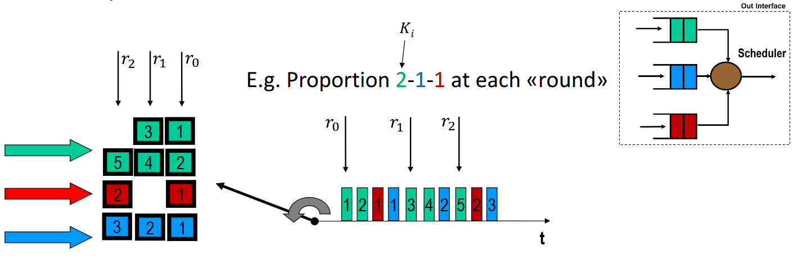

Posso suddividere la banda in modo non per forza equo.

### Service Priority

Fin ora non abbiamo parlato di priorità; in questo caso, invece, le code hanno priorità differenti.

I round durano esattamente la trasmissione di un singolo pacchetto. Controllo le mie code; se ho almeno un pacchetto nella coda con priorità più alta, trasmetto pacchetto da quella coda, altrimenti trasmetto un pacchetto per la coda a seconda più alta priorità e così via.

C'è però un problema: se ho dei pacchetti trasmetti accodati nelle code a più bassa priorità che sono però più lunghi dei pacchetti ad alta priorità, si verifica un ritardo sulla trasmissione dei pacchetti a priorità più alta.

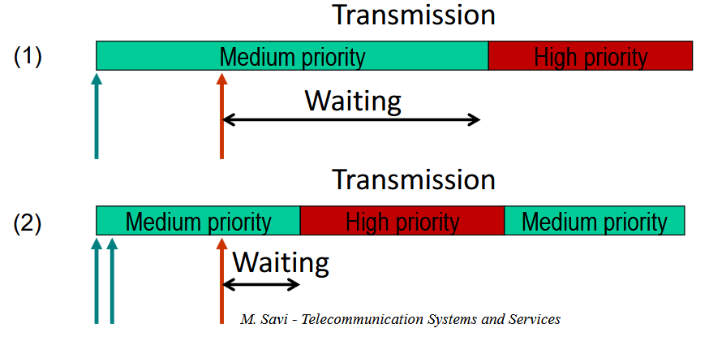

In una situazione del genere, posso andare a frammentare i pacchetti lunghi che hanno priorità più bassa. Per fare ciò, si potrebbero adottare tecniche di frammentazione tramite IP, ma se frammento a livello IP il problema è che la ricombinazione avviene solamente a livello del destinatario. Avere tanti frammenti di pacchetto in rete non ci piace; se viene perso un frammento devo ritrasmettere tutto quanto da capo e aggiungo anche tempo computazionale. Quello che si fa è frammentare a livello 2 che permette la frammentazione e la ricombinazione ai due capi della comunicazione. Il protocollo che si utilizzava era PPP, Point-to-Point.

## Call Admission Control
È una delle varie tecniche che possiamo adottare per garantire qualità del servizio. Consiste in un insieme di azioni che intraprendiamo per stabilire o rinegoziare una connessione che abbiamo.

Verifico se ho sufficienti risorse per poter accettare questa richiesta senza danneggiare le altre richieste già ammesse in rete. Se questa valutazione risulta positiva, vado a riservare le risorse sul percorso. Quando si parla di risorse si intendono porzioni di banda sui collegamenti e porzioni di buffer nei router.

L'entità che esegue la CAC (Call Admission Control) deve conoscere:
- quante risorse devo allocare per garantire una richiesta
- quante risorse sono attualmente state allocate sui vari nodi e collegamenti

Sulla base di queste conoscenze, decide ammetto si, ammetto no.

La procedura della CAC può essere portata avanti in 3 modi differenti:
- Centralised Mode: CAC è fatto da un nodo centralizzato server
- Distributed Mode: ogni nodo nella rete contribuisce alla CAC
- Hybrid Mode: CAC viene eseguita solamente ai nodi edge (bordo) della rete

### Centralised Mode

Server centrale che riceve le richeiste di ammissione in rete e conosce le info necessarie per prendere la decisione; si ha quindi la necessità che i vari router comunichino con il server centrale per conoscere le info e prendere le decisioni. Questa architettura simile la abbiamo vista nel Software Defined Networking.

Vantaggi:
- segnalazione verso i nodi è semplice; i nodi comunicano col server centrale il loro stato
- il cammino ottimo per il flusso può essere facilmente determinato

Svantaggi:
- scalabilità e affidabilità; se cresce il numero di router è un problema e se il server va in down pure.
- non ben tollerato da IP, perché la procedura di CAC va a definire anche il percorso che va seguito dai flussi in rete. Questo è un problema perché in IP il routing è deciso in maniera distribuita dai protocolli di routing, quindi sto in qualche modo andando a sovrascrivere le loro decisioni. Questa cosa non ci piace per niente.

Questa strategia viene adottata solo in reti piccole o in Software Defined Networking.

### Distributed Mode

Ho che ogni router conosce lo stato di occupazione delle proprie risorse e contribuisce alla CAC, tramite scambio di messaggi.

Vantaggi:
- più robusto e affidabile

Svantaggi:
- sistema complesso, dove abbiamo la necessità di protocolli distribuiti per lo scambio di messaggi che permettono di distribuire tra i vari nodi lo stato dei singoli nodi.
- necessitano di algoritmi che permettono di riservare le risorse sui percorsi. Uno di questi protocolli è il RSVP, che vedremo tra poco.

### Hybrid Mode
In questa modalità il CAC è effettuato solo dai nodi edge della rete, cosa che ha senso fare perché è effettivamente in quella posizione che vanno prese le decisioni sull'ammettere o meno un flusso in rete.

In questo caso è comunque necessario che anche gli altri router possano comunicare con i router di bordo per dirgli qual è il loro stato di occupazione, ma le decisioni vengono prese solo sui router edge.

Vantaggi:
- sistema distribuito, ma meno complesso perché meno nodi sono coinvolti nella procedura della CAC

Svantaggi:
- anche in questo caso serve RSVP
- anche in questo caso servono protocolli di comunicazione degli stati attuali tra i router

## Integrated Services (IntServ)
IntServ è il primo modello progettato per fornire QoS nelle reti IP (1994). Al giorno d'oggi non viene più utilizzato.

Utilizza il protocollo RSVP come base.

L'aspetto fondamentale di IntServ è che la QoS viene definita in termini assoluti per ogni flusso per il quale voglio garantire QoS, sfruttando un meccanismo di CAC. Quindi: voglio garantire QoS per un flusso in rete e c'è una procedura di CAC che mi dice si o no, che a sua volta usa RSVP.

IntServ non è più utilizzato in quanto ha problemi enormi di scalabilità. Come vedremo tra un attimo, devo mantenere lo stato nei router per ogni singolo router; cosa molto onerosa e che richiede molta memoria, considerando il traffico moderno. Viene sostituito da DiffServ (1998).

IntServ specifica 3 diverse classi di servizio, ma poi riservo le risorse per ogni singolo flusso all'interno di quella specifica classe di servizio. Le classi mi dicono in che modo devo trattare un determinato flusso.
- Best Effort Class
- Guaranteed Service Class

    Emula un circuit service con dei delay garantiti. Sperimenti una qualità paragonabile a quella che ho su una rete a commutazione di circuiti.
- Controlled Load Service Class

    Emula una Best Effort mode ma in un network uncongested. Finché ho rete non congestionata i flussi Guaranteed Service e Best Effort si comportano allo stesso modo, nel momento in cui ho invece che la rete inizia a essere congestionata, Controlled Load Service continua a funzionare come ha funzionato fino a quel momento.
    In questo modo posso dare un QoS inferiore rispetto al caso dei flussi di tipo Guaranteed Service, ma superiore al tipo Best Effort.

Vantaggi di IntServ:
- è possibile prendere decisioni sui singoli flussi; posso decidere quali e quante risorse allocare per ogni singolo flusso

Svantaggi:
- sistema molto complesso, deve mantenere traccia dello stato per diversi flussi in rete
- per adottare IntServ devo avere dei router con architettura modificata rispetto a router standard. Se i router non sono RSVP compliant, non posso adottare IntServ: enorme limitazione.

### Router di tipo IntServ
Come devono essere fatti i router di tipo IntServ, ovvero RSVP compliant?

Sotto, a livello di piano dati abbiamo:
- Classifier: abbiamo la necessità di classificare il traffico, ovvero capire a quale flusso uno specifico pacchetto appartiene.

- un regolatore che fa regolazione del traffico tramite tecniche di traffic regulation.

- uno scheduler che seleziona i pacchetti che vanno inviati per primi sul collegamento in output

Questa parte di Data Plane non è particolarmente differente dai router stardand. Quello che cambia, è la parte di controllo: chiaramente ho la necessità di fare routing a livello IP, quindi il blocco di routing lo ho anche nei router standard. Tuttavia, gli altri due sono specifici dei router RSVP compliant. In particolare:
- Reservation: riguarda lo scambio di messaggi di tipo RSVP con gli altri noti RSVP compliant, per poi prendere decisioni relative alla CAC e alla allocazione delle risorse in rete.

- Admission: si occupa di decidere sulla base delle informazioni conosciute dal router se omettere o meno il flusso.

## RSVP
Protocollo di livello 3 che viene incapsulato direttamente in IP. Uno degli aspetti fondamentali è che si ha la necessià di allocare una porzione di banda per la limitazione della congestione dei pacchetti di signalling. 

### Reservation of Resources
Con RSVP posso riservare delle risorse su dei percorsi per garantire un determinato QoS.

Quindi, RSVP viene adottato in contesti distribuiti: i vari router, autonomamente, valutano se ammettere un determinato flusso in rete è fattibile o no. Se ogni singolo router dice di si, allora la richiesta viene accettata e vengono riservate le risorse per far sì che la richiesta venga inserita.

Due messaggi fondamentali utilizzati da RSVP sono PATH e RESV. Adesso li vediamo nel dettaglio.

#### PATH Message

Il PATH definisce qual è il percorso sul quale le risorse devono essere riservate per il flusso. Il PATH segue il routing, quindi la sorgente manda un PATH message verso la destinazione e questo messaggio segue il percorso tramite routing IP. Questi PATH messages vengono inviati periodicamente per rilevare dei possibili cambiamenti nel percorso di routing.

Ogni qualvolta un PATH transita da un router lungo il percorso, il router deve mantenere il PATH state. Il PATH state include:
- indirizzo dell'interfaccia di uscita del nodo precedente, attraversato dal messaggio
- caratteristiche del flusso in termini di parametri relativi al Token Bucket
- interfaccia locale di input e output del PATH message

Mantenere queste informazioni è il grosso problema di IntServ. Al giorno d'oggi, non risulta una situazione scalabile.

Quali informazioni sono incluse nel PATH message?

In RSVP abbiamo il concetto di oggetto, ovvero un insieme di campi che sono suddivisi in campi relativi all'intestazione dell'oggetto e campi relativi all'oggetto vero e proprio. Nel PATH message trasporto due oggetti fondamentali:
- TSPEC (Traffic SPECification) -> obbligatorio. Oggetto che trasporta le informazioni relative alle caratteristiche dei flussi, ovvero i parametri Token Bucket. Viene trasportato dalla sorgente alla destinazione senza che possa essere modificato in alcun modo in rete.
- ADSPEC (ADvertising SPECification) -> opzionale. Se presente, colleziona lungo il percorso dell'informazione preliminare sul livello di QoS che si potrebbe garantire lungo il percorso. Tendenzialmente viene modificato a ogni hop. Tra le varie informazioni che comunica alla destinazione, comunica anche se ci sono o meno router non-RSVP-compliant. 

#### RESV Message

Nel momento in cui il PATH message raggiunge la destinazione, questa risponde alla sorgente con un RESV message che porta alla allocazione delle risorse sul percorso. A differenza del PATH message, il RESV non segue il routing IP standard, ma segue un approccio di tipo source-based routing: mentre il PATH message attraversa tutti i vari router, va a registrare nel messaggio i nodi che sono stati attraversati. Questa info arriva alla destinazione, che, invertendone l'ordine, conosce i nodi da attraversare per conoscere esattamente lo stesso percorso tra attraversare per raggiungere la sorgente. Questo viene fatto perché nella rete i casi in cui ho routing asimmetrico sono molto frequenti; non è detto che per andare da A a B, il percorso da B a A sia uguale. Qui vogliamo che il RESV segua esattamente il PATH all'indietro, dato che ho collezionato informazioni utili per l'allocazione delle risorse su quel determinato percorso. Si chiama source-based routing perché è la sorgente che sta istruendo il percorso da seguire.

Sulla base dei valori di TSPEC e ADSPEC che sono stati ricevuti dalla sorgente, la destinazione definisce quante sono le risorse che devono essere destinate sul percorso, in termini di banda e di buffer, per garantire che la QoS possa essere garantita per questo flusso.

Nel caso di RESV, all'interno abbiamo un oggetto di nome FLOWSPEC, che a sua volta è composto da due sotto oggetto TSPEC e RSPEC (Reservation SPECification).

Sappiamo che il TSPEC nel PATH message non può essere modificato dai router, ma può essere modificato dalla destinazione! Questo perché la sorgente dice che vuole regolare il traffico con determinati parametri, ma la destinazione dice che con quei parametri non può farlo.

RSPEC, che è facoltativo, include i parametri di QoS per la specifica tipologia di servizio che stiamo considerando. Ad esempio, potrebbe includere la quantità di banda che devo riservare sui singoli collegamenti.

### RESV Message & Call Admission
Quando abbiamo a che fare con RSVP, il meccanismo di Call Admission viene effettuato da ogni signolo router sul percoroso nel momento in cui riceve un RESV message. Quando un router riceve questo messaggio, riceve in input informazioni relative al flusso e alla QoS (TSPEC & RSPEC), sa quante risorse sono state destinate ai flussi che sono già state ammesse in rete. A questo punto può:
1. accettare il flusso perché ci sono abbastanza risorse per poter garantire QoS al flusso; accetta e invia RSPEC a ritroso verso la sorgente.
2. richiesta rifiutata e messaggio di errore.

Immagine di riassunto:

Notare come RSPEC, se presente, può essere modificato a ritroso, mentre TSPEC non viene modificato.

### RSVP & Traffic Control

Quando adottiamo un protocollo di tipo RSVP abbiamo 2 tipi di router, quelli edge e quelli interni di core. Le operazioni che devono essere effettuate da questi due tipi di router sono diverse.

- Edge Routers: regolazione del traffico (policing, shaping, marking) sulla base dei parametri dichiarati, trasportati nel RESV message.

- Core Routers: 
    1. classificazione dei pacchetti, per capire a quale flusso appartiene il pacchetto
    2. traffic regulation, anche se non è tipico
    3. scheduling basato sulla QoS richiesta
    

### Soft State
Siccome in RSVP il mantenimento dello stato è una cosa onerosa, soprattutto in termini di memoria, lo stato per i flussi viene mantenuto solo per un tempo limitato. Nel momento in cui si ha la scadenza di questo timer, le risorse vengono disallocate e bisogna scambiare nuovamente messaggi PATH e RESV per riallocare le risorse.

Il grosso vantaggio di questo approccio è che risulta più facile recuperare in caso di errore. Inoltre le risorse vengono disallocate automaticamente se la comunicazione nella rete non è più attiva.

Lo svantaggio è il grosso signalling nel traffico in rete, perché periodicamente devo rifare la negoziazione delle risorse.

Questo approccio Soft State è stato creato per cercare di "salvare" IntServ, ma non è servito.

### Formato dei Messaggi RSVP

Abbiamo una concatenazione di vari oggetti, ogni singolo oggetto ha lunghezza di multipli di 32 bit.

#### RSVP Message Header

- Msg Type: identifica la tipologia di pessaggio trasportato (PATH, RESV, etc)
- RSVP Checksum: controllo di integrità sul messaggio
- Send_TTL: stessa valenza del TTL in IP, importante averlo perché, controllando questo valore e il valore analogo all'interno dell'header IP, posso rendermi conto se ho o meno dei router RSVP non-compliant nel percorso. Se il TTL dell'header IP è più basso di questo, capisco che alcuni router non sono in grado di parlare RSVP.
- RSVP Length: fondamentale perché posso avere oggetti di dimensioni differenti.

#### RSVP Objects

- Class_NUM: identificatore che specifica la tipologia dell'oggetto (ADSPEC, TSPEC, FLOWSPEC, ecc)
- C-Type: tipo del formato utilizzato per un object type (1 IPv4, 2 IPv6, 7 MPLS, ...)

### Resource Allocation con GS & CLS
Vediamo come funziona l'allocazione delle risorse quando abbiamo da allocare un flusso di tipo Guaranteed Service (GS) o Controlled Load Service (CLS).

#### Guaranteed Service
Come detto precedentemente, nel caso GS voglio andare a emulare una rete a commutazione di circuito, ovvero garantire che non ci siano perdite per i pacchetti e che non sperimenti un ritardo end-to-end più alto di un valore stabilito.

Quali sono le informazioni che devo trasportare nei vari oggetti che ho sia per i messaggi PATH e RESV?

Partiamo dai messaggi di PATH:
- PATH
    - TSPEC definisce le caratteristiche del traffico. Come detto prima, questi parametri sono specificati dal sender e possibilmente modificati dal destinatario. Contiene:
        1. Token Bucket Size $k [bit]$
        2. Token Rate $r [bit/s]$
        3. Peak Rate $p > r [bit/s]$
    - ADSPEC
        - Sempre presente in GS, nonostante sia opzionale. Trasporta dei parametri che vengono aggiornati da ogni singolo nodo del percorso del messaggio PATH per stimare un ritardo end-to-end e la banda disponibile sul percorso.
        - fondamentalmente, ogni nodo registra il tempo che passa dal momento in cui il pacchetto arriva sull'interfaccia in ingresso al momento in cui viene inoltrato sull'interfaccia di uscita, sommando questo ritardo al valore dei nodi precedenti. In questo modo, a destinazione avrò una stima del ritardo end-to-end
        - stessa cosa per la banda disponibile. 
- RESV
    - RSPEC
        - include la banda $B [bit/b]$ che deve essere riservata sul percorso, sulla base chiaramente dei parametri che sono stati trasportati da ADSPEC
        - include uno Slack Term $S [µs]$

:::note[Workflow di RSPEC con Slack Term e B]

Tutto funziona andando a considerare il fatto che tanta più banda vado a riservare sul percorso, tanto più il ritardo end-to-end si ridurrà.

1. Il ricevitori, basandosi su quanto ricevuto da ADSPEC, determina qual è la banda $B_j$ che deve essere allocata dai router per il flusso $j$ e il termine di slack $S$.

    Il termine di slack corrisponde alla differenza tra il ritardo end-to-end massimo tollerabile (upper bound del delay end-to-end) e il ritardo end-to-end che ho se riservo una banda $B_j$. Fintanto che il ritardo tollerabile è maggiore del ritardo end-to-end che ho riservando una banda $B_j$, ho un valore di slack positivo.

2. il ricevitore invia $B_j$ e $S$ in RSPEC; se S è positivo, i router riducono la banda $B_j$ e aggiornano RSPEC. Se, invece, la banda $B_j$ non è disponibile in un router sul percorso e non può esserer ridotta perché S diventerebbe negativa, il flusso viene rifiutato.

Questo meccanismo assicura che una porzione di banda $B_j$ viene riservata sul percorso e che il delay end-to-end non supera un determinato valore massimo di tolleranza. 
:::

#### Controlled Load Service

Offre un servizio che emula best-effort in una rete non congestionata.

Risulta più semplice rispetto a Guaranteed Service.

### Problemi di IntServ

Come già detto, non viene utilizzato al giorno d'oggi in quanto presenta varie problematiche.

Ho la necessità di mantenere lo stato nei router per ciacun flusso, sia per GS che per CLS.

Ha una scalabilità bassa e richiede un livello di segnalazione molto pesante, dato che per ogni singolo flusso c'è bisogno di inviare messaggi PATH e RESV.

Infine, abbiamo anche il problema dell'architettura router.

Tutti questi problemi rendono IntServ adottabile solamente in reti piccole.

## DiffServ

Più semplice, più scalabile e meno costoso di IntServ. Rinunciamo a un controllo flusso per flusso, DiffServ è una tecnica a maglia più grossolana. Il concetto fondamentale è il concetto di Class of Service. In DiffServ ce ne sono diverse che vengono trattate in maniera diversa all'interno dei router.

All'interno di una classe di servizio ho flussi appartenenti a diverse sorgenti verso diverse destinazioni, e tutti questi flussi sono trattati allo stesso modo. Quindi dal punto di vista di QoS perdo l'identità del singolo flusso, una volta che è stato immesso in rete.

Quindi si dice che con DiffServ vado a garantire la qualità del servizio in termini relativi.

Non vado più a trattare i singoli flussi, ma tratto le classi di servizio.

La cosa fondamentale è che uno dei problemi che posso avere è se vado ad accettare in rete del traffico in eccesso per ogni flusso appartenente alla classe di servizio. Bisogna stare attenti a non ammettere in rete traffico non regolato; se in IntServ era fondamentale fare traffic regulation era fondamentale, in DiffServ lo è ancora di più.

### Funzionamento di DiffServ
La regolazione del traffico viene effettuata solo ed esclusivamente ai bordi della rete, quindi dai router di bordo. Qui vado a immettere il traffico che deve essere regolato e specifico a quale determinata classe di servizio questo traffico appartiene.

Fatto questo, i router interni (core router) devono solamente fare quello che prende il nome di Differtiated Forwarding: differenzio il modo con cui tratto il traffico, sulla base della classe di servizio alla quale il traffico appartiene.

Uno dei grossi vantaggi di DiffServ è che non abbiamo la necessità di cambiamenti architetturali nei router: devo solo avere delle code diverse che differenziano le classi di servizio, avere algoritmi di scheduling che vanno a pescare in modo opportuno da queste code e avere dei meccanismi di classificazione per capire ogni singolo pacchetto a quale classe di servizio appartiene. Inoltre, non richiede il mantenimento dello stato per ogni singolo flusso.

Nell'header del pacchetto IP, viene utilizzato il Differentiated Service (DS) Field per discriminare le diverse classi di servizio. Questo campo corrisponde al byte TOS (Type of Service) di IPv4.

Sono utilizzati 6 bit per specificare il Differentiated Service Code Point (DSCP), mentre gli altri 2 bit non sono usati. In base al valore di questo DSCP, ogni singolo router di core agisce in modo differente, effettuando quindi un Per-Hop-Behaviour in base alla specifica classe di servizio.

Anche in questo caso, come per IntServ, si ha una differenza tra il funzionamento dei router edge e router core.

A livello di router di bordo devo fare classificazione e regolazione del traffico. Devo definire quale valore DSCP assegnare a un pacchetto, sulla base di quale classe di servizio appartiene quel pacchetto. Poi devo fare regolazione del traffico a livello di micro-flusso. A questo punto, una volta mandato in rete, non tratto più il pacchetto come appartenente a micro-flusso, ma semplicemente come appartentente a una specifica classe di servizio.

Quindi, i router di core, devono trattare il traffico aggregato nelle diverse classi andando ad estrarre il valore DSCP, capire di conseguenza quale Per-Hop-Behaviour applicare per questo specifico pacchetto e, anche sulla base di condizioni locali specifiche, vado a trattare e processare il pacchetto.

### Per-Hop-Behaviour
I PHB più importanti sono:
- Expedited Forwarding (EF): relativo a del traffico per il quale è necessario avere requisiti di QoS molto stringenti che richiedono latenza bassa
- Assured Forwarding (AF): insieme di PHBs usati per applicazioni che richiedono garanzie di consegna, con QoS che richiede un tasso di perdita più o meno ridotto
- Best Effort (BE): usato su traffico senza garanzie di consegna

### Expedited Forwarding
L'obiettivo è emulare una linea dedicata, quindi un servizio a commutazione di circuito, mantenendo ritardi e perdite molto basse. Il traffico deve essere condizionato e controllato e il traffico in eccesso w.r.t. TCA non è ammeso nella rete.

Chiaramente è il PHB con priorità più alta.

### Assured Forwarding
Con AF, abbiamo 4 diversi livelli di priorità. Viene utilizzato in questo caso specifico il termine classe per associare i livelli di priorità, che portano quindi ad avere 4 diverse code con priorità differenti. 

Per ognuna di queste classi ho tre diversi livelli di probabilità di scarto: low, medium & high. Risulta di fatto una matrice 3x4. I codici mostrati nella tabella sono i vari DSCP per ognuno dei diversi PHB, dove ogni cella corrisponde a ogni PHB.

Una cosa che voglio evitare quando accodo i pacchetti è che inserisco i pacchetti in coda di continuazione, fino a ritrovarmi con coda piena e tutti i pacchetti successivi vengono scartati. Questa politica prende il nome di Tail Drop. Il problema di questa politica è che non ho alcun controllo su quello che vado a scartare.
Con Assured Forwarding si evita una situazione del genere: vado a scartare i pacchetti in maniera controllata per evitare una situazione come quella introdotta poco fa.

Si può adottare un algoritm di nome Random Early Discard (RED):

Possiamo definire delle porzioni di coda tali per cui se ho un'occupazione della coda sotto a una determinata soglia, continuo ad accumulare pacchetti in coda. Se supero la soglia, invece, scarto con una certa probabilità i pacchetti che mi arrivano nella coda. Raggiunta un'ulteriore soglia, scarto tutti i pacchetti che arrivano in coda.

Queste due soglie devono essere specificate per ogni livello in ogni classe.

### Random Early Discarding (RED)

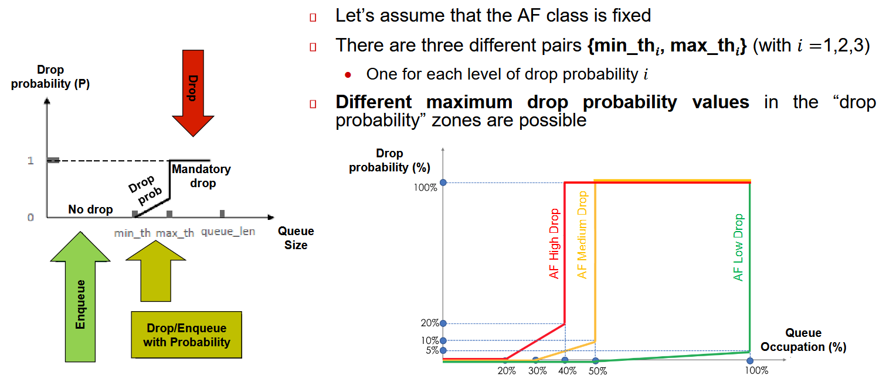