**VoIP** è un metodo per gestire le chiamate telefoniche su Internet invece che tramite il tradizionale metodo telefonico (**PSTN**, Public Switch Telephone Network).

La differenza è che la PSTN è una rete a **commutazione di circuito**, mentre la rete Internet è a **commutazione di pacchetto**. Con VoIP si trasmette la voce in **formato completamente digitale**, prendendo segmenti di voce e inserendoli in pacchetti da inviare.

:::note[Nota sulla PSTN]
In rete PSTN la comunicazione è **digitale tra centrale e centrale** (oggi non è più analogica). Nell'ultimo miglio, tra casa dell'utente e la centrale, si ha una comunicazione **analogica**. Solo negli anni '70 era completamente analogica. In ogni caso, **non è a pacchetto**.
:::

## Operatori VoIP

Esistono 2 tipi di operatori VoIP:

1. **Over-the-Top VoIP (OTT VoIP)**: permettono di effettuare chiamate VoIP con app al di sopra delle reti degli operatori. A meno di stipulare Service Level Agreement, **non** garantiscono livelli di QoS.
2. **Network Operators** che adottano tecnologie VoIP.

## Tipologie di chiamate VoIP

Esistono diversi tipi di chiamate:

1. VoIP - VoIP
2. VoIP - PSTN / PSTN - VoIP
3. VoIP - Mobile Radio Network / Mobile Radio Network - VoIP

### VoIP-VoIP - Pure VoIP

Comunicazione tra terminali VoIP, di tipo **VoIP puro**. Mette in comunicazione terminali che supportano nativamente VoIP, come telefoni o computer con client VoIP.

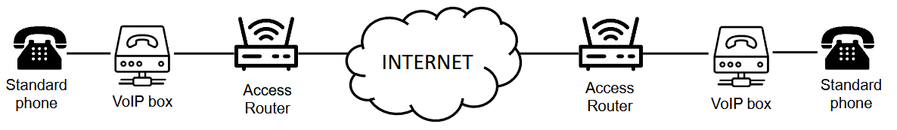

La cosa importante è che in questo caso i terminali VoIP prendono la voce e la **pacchettizzano**, ovvero la trasformano in pacchetti IP che contengono la voce codificata, **bypassando** completamente la rete telefonica standard.

### VoIP-VoIP - Adapted Terminals

Si ha un nodo funzionale di nome **VoIP box** che prende la voce, la digitalizza e la pacchettizza, per poi inviarla in Internet. Solitamente si trova all'interno del router.

Nelle tratte tra Standard Phone e VoIP box si ha una comunicazione **analogica**, il resto è tutto digitale.

### VoIP-PSTN

Comunicazione tra un device VoIP e un telefono standard collegato alla rete telefonica standard. Al giorno d'oggi è sempre meno frequente.

Ho una comunicazione **ibrida**: tecnologia VoIP fino all'**Interworking Point**, poi rete PSTN. In questo Interworking Point bisogna fare operazioni di traslazione di voce e tecnologie per passare dall'una all'altra.

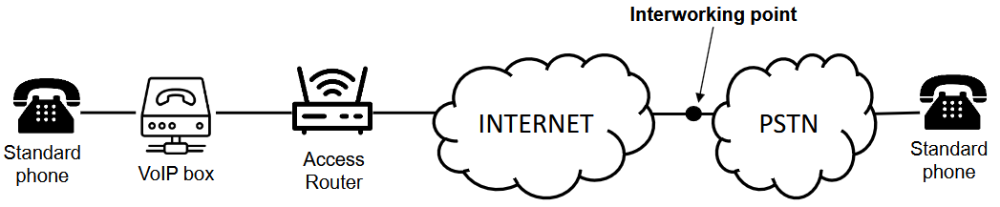

### VoIP-Mobile Radio Network

Situazione che si verifica più frequentemente, perché la rete mobile a commutazione di circuito esiste tutt'ora.

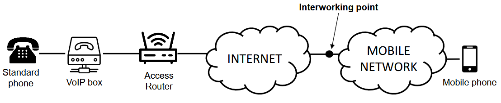

## Perché VoIP?

Perché usare VoIP quando ho una rete telefonica che funziona da sempre? Qual è il motivo di trasportare tutto su IP?

**Per l'operatore:**

- È una questione di **costi**: c'è convenienza nel mantenere una sola rete "universale" di tipo dati, sulla quale far affluire anche la fonia. È nell'interesse dell'operatore dismettere la rete telefonica.

**Per l'utente:**

- È più facile configurare alcuni **servizi di chiamata aggiuntivi**, come il **Call Forwarding** (inoltra la chiamata a un terminale, se non c'è risposta inoltra alla voicemail). Non che prima non si potesse fare, ma risulta più semplice.
- Mentre nella rete telefonica standard il numero di telefono identifica anche il chiamato, con VoIP si può avere un **disaccoppiamento** tra l'identità dell'utente e l'indirizzo IP associato al terminale.
- Possibilità di **migliorare la comunicazione** con:
  - integrazione di email, voice mail, SMS;
  - scambio di dati durante la chiamata;
  - sessioni video e multi-conference.
- Possibilità di **aggiustare la qualità** della chiamata.

## Aspetti Principali di VoIP

Prossimamente vedremo:

- **Voice Encoding**: come codificare la voce per trasmetterla al meglio tramite VoIP;
- **Voice Degradation**: le principali cause di degrado in VoIP;
- **Signalling**: come le chiamate possono essere stabilite tramite VoIP.

## Voice Encoding

Codificare un segnale audio significa trasformarlo in un **flusso di bit** che porti ad avere una rappresentazione più o meno fedele del segnale originale. Come passiamo da una rappresentazione analogica a una digitale? Ci sono varie tecniche.

:::note[Banda della voce]
La voce ha un'estensione di banda di circa **4 kHz**. Non è proprio così in verità, ma la stragrande maggioranza dell'energia è concentrata nel range dei 4 kHz.
:::

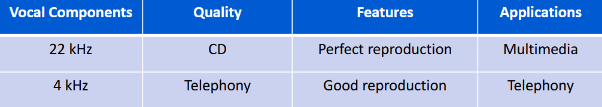

Ovviamente il segnale vocale risulterà un minimo degradato. Posso codificare la voce per mezzo di **3 tipologie** di codificatori:

1. Waveform Codecs
2. Speech Codecs
3. Hybrid Codecs

### Waveform Codecs

I primi codificatori della voce a nascere. Prendono la forma d'onda e codificano direttamente la **waveform** del segnale. Se ho un segnale vocale con estensione di banda $B = 4\ kHz$, posso codificare senza perdite, potendo ricostruire il segnale perfettamente al netto di un errore sistematico chiamato **Quantization Error**.

Le due operazioni da eseguire sono:

**Sampling** - trasforma un segnale time-continuous in un segnale time-discrete. Avendo il segnale continuo (verde), a tempi regolari prendo un campione del segnale analogico:

:::tip[Teorema di Nyquist-Shannon]
Il campionamento deve seguire un criterio preciso per poter ricostruire perfettamente la voce. Se ho un segnale con estensione pari a $B$ e campiono a una frequenza pari a $2B$, sono sicuro di poter ricostruire il segnale senza perdite. Prendo quindi campioni a una frequenza regolare pari a $\frac{1}{2B}$. Se ho banda pari a $4\ kHz$, devo usare una frequenza di campionamento pari a $8\ kHz$.
:::

**Quantization** - dopo aver ottenuto un segnale discretizzato lungo l'asse dei tempi, ho ancora un problema: i valori assunti da ogni campione lungo l'asse Y sono ancora valori reali ($\in \mathbb{R}$). Si **quantizza**: si discretizzano i valori della forma d'onda lungo l'asse dell'ampiezza, rappresentando i campioni con un numero discreto finito di livelli.

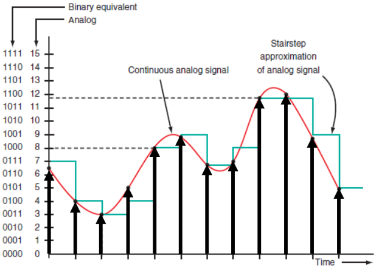

Voglio rappresentare i valori dei campioni in un certo numero discreto di **livelli**, in questo caso diciamo 16. Se ho un segnale nullo lo codifico con quattro `0`; se ha valore di ampiezza tra 0 e 1 lo codifico con `0001`, e così via. Devo definire i livelli di quantizzazione sulla base del valore massimo dell'ampiezza del segnale.

Così facendo, introduco in maniera **irreversibile** un errore di quantizzazione: guardando il primissimo valore del grafico, originariamente ha valore tra 6 e 7, ma viene codificato a 7.

:::danger[Errore di Quantizzazione]
Tanto più piccolo quanti più livelli di quantizzazione ho. Con tanti livelli fitti l'errore è molto ridotto, ma più il numero di livelli è elevato, più ho bisogno di **bit** per codificarli.
:::

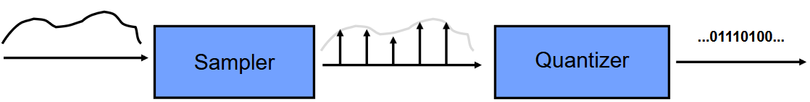

## Pulse Code Modulation (PCM)

Codifica adottata nelle reti telefoniche standard.

Nel caso di PCM abbiamo una **Logarithmic Quantization** non uniforme: livelli più fitti per valori di ampiezza bassi, meno fitti man mano che cresce l'ampiezza. Questo perché tale quantizzazione si adatta molto bene alla dinamica di **loudness** dell'orecchio umano: percepiamo molto meglio le variazioni di intensità quando il volume è basso, molto meno quando è alto. Con livelli più ravvicinati alle ampiezze basse, riproduco più fedelmente il segnale per il nostro orecchio.

## Differential PCM (DPCM)

Una delle varianti di PCM, che cerca di **ridurre il bitrate** senza compromettere la qualità della voce.

DPCM sfrutta gli stessi principi di PCM, ma si basa sull'osservazione che **campioni temporalmente vicini sono fortemente correlati**. Possiamo sfruttare questa correlazione per ridurre la quantità di bit da trasmettere: si adottano metodi predittivi alla sorgente per stimare quale sarà il campione successivo, codificando solo la **differenza** tra il campione reale e quello predetto.

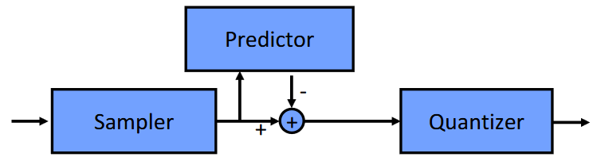
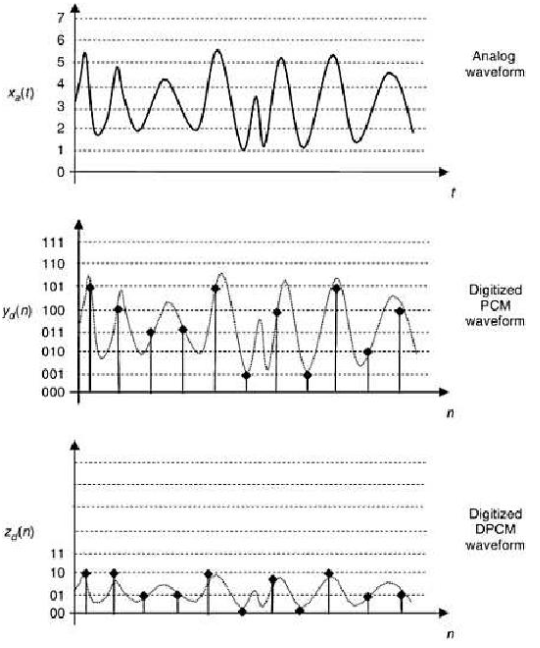

Perché farlo? Perché la **varianza** nel segnale differenza è più bassa rispetto a quella del segnale originale: è possibile codificare con meno bit rispetto ai sample individuali.

## Adaptive DPCM (ADPCM)

Ottengo miglioramenti delle prestazioni se considero una quantizzazione di tipo **adattivo**.

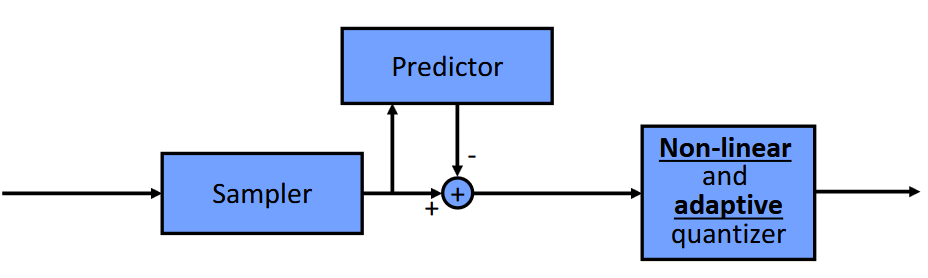

Adatto il numero dei livelli di quantizzazione sulla base del **trend del segnale** (se è più o meno ampio).

## Speech Codecs

Chiamati anche **Vocoder**. A differenza dei codificatori a forma d'onda, i Vocoder cercano di codificare la voce sulla base delle sue **caratteristiche intrinseche**, riducendo il più possibile la ridondanza. Aspetti fondamentali:

- efficienza molto elevata;
- complessità molto elevata;
- ritardi elevati;
- sensibili al rumore di fondo, in quanto fatti apposta per codificare la voce umana.

Il tipo di Speech Codec più adottato sono i **Linear Vocoders (LPC)**.

### Voice Signal Characteristics

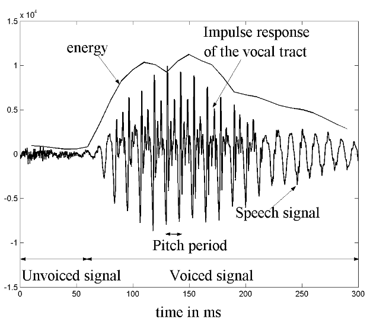

Il segnale vocale è composto da due tipologie di suono:

| Tipo | Caratteristiche |
| --- | --- |
| **Voiced** | Suoni tipici delle vocali. Hanno una forma d'onda che si ripete periodicamente secondo una frequenza chiamata **pitch frequency**. |
| **Unvoiced** | Più tipici delle consonanti, molto diversi dai voiced. Hanno ampiezza molto più bassa e sono caratterizzati da **alte frequenze**. |

Guardando il grafico, è visibile un segnale Unvoiced e due segnali Voiced a destra. Gli speech codec sfruttano proprio questa forte differenza nella generazione tra i due tipi di suoni.

### Voice Production

Lezione di anatomia, perché in questo corso vediamo tutto. Però, a parte le cacate, è importante capire come funziona la produzione della voce: ci permette di capire come la si modella nei Vocoder.

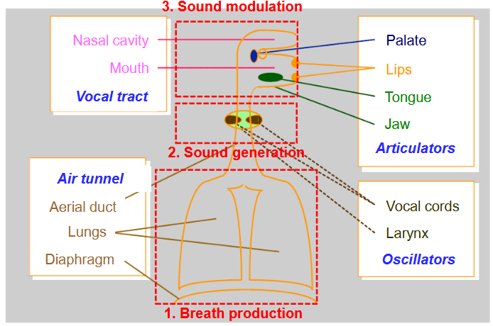

Quando dobbiamo produrre la voce entrano in gioco **3 fasi**:

1. **Produzione del fiato**: genera aria.
2. **Generazione del suono**: quando l'aria raggiunge la laringe, questa vibra producendo il suono effettivo.
3. **Modulazione**: il suono attraversa il "tratto vocale", dove avviene la modulazione. Sulla base delle posizioni di palato, bocca e naso, vado a modulare il suono.

Nei Vocoder, la modellazione della voce viene fatta tramite un **Phoneme Model**.

:::note[Phoneme]
Basic unit of sound.
:::

L'obiettivo è definire un **filtro riverberante** caratterizzato da un insieme di parametri. Con il Phoneme Model cerchiamo di capire quali sono questi parametri per riprodurre la voce al meglio.

### Phoneme Model

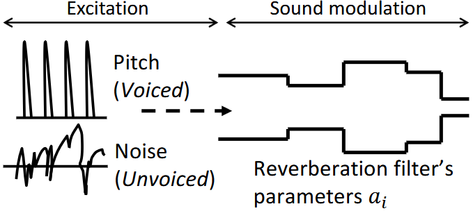

Nel modello Phoneme abbiamo **2 fasi**:

1. **Fase di eccitazione** - modella le due fasi precedenti (produzione del fiato e generazione del suono) in un'unica fase. Si genera un segnale di eccitazione, in 2 modi possibili:
   1. **treno di impulsi** con un determinato pitch, se sono di fronte a un suono **Voiced** (Periodic);
   2. **white noise**, se sono di fronte a un phoneme **Unvoiced** (Stochastic).
2. **Modulazione del Suono** - il segnale di eccitazione generato viene dato in input a un **filtro riverberante** che modella la fase di modulazione del suono. Questo filtro ha un numero $a_i$ di parametri; dobbiamo capire quali, in modo che in uscita si ottenga un segnale il più simile possibile al phoneme originale.

## Linear Vocoders (LPC)

Considerando un Vocoder Lineare, abbiamo due fasi.

### Fase di Analysis

Viene fatta alla **sorgente**.

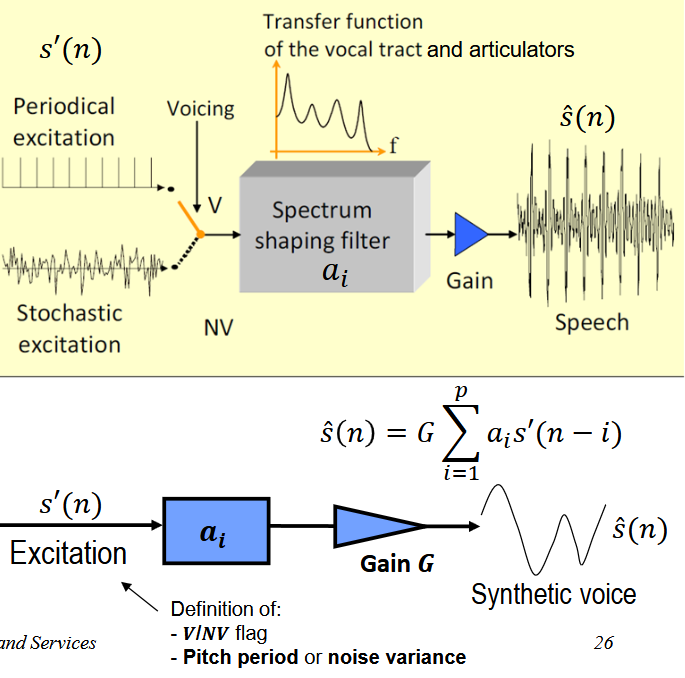

Prende a intervalli regolari la waveform (solitamente circa 10-20 ms) e deve capire come devono essere i parametri del filtro affinché in uscita si abbia un segnale il più simile possibile al phoneme analizzato.

1. Prima cosa: analizzare se la waveform è **Voiced** o **Unvoiced**, tramite un flag opportuno.
   - se **Voiced**: definire un Segnale di Eccitazione con una determinata **frequenza di pitch** (da stimare);
   - se **Unvoiced**: generare un **White Noise** con una determinata **varianza** (da stimare).
2. Fornisco in input il Segnale di Eccitazione al **filtro lineare**, del quale devo stimare i coefficienti $a_i$.

Il punto chiave: do in input al filtro un segnale $S'(n)$ e in uscita voglio un segnale $\hat{s}(n)$ il più possibile simile al segnale originale. Cerco quindi di minimizzare una funzione di errore $e(n) = |\hat{s}(n) - s(n)|$, con $s(n)$ il segnale da riprodurre; nel farlo cerco i parametri del filtro che minimizzano l'errore.

Ma cosa invio effettivamente in rete? Invio i **parametri**, usati poi nella fase di decodifica:

- parametri $a_i$ del filtro
- flag Voiced/Unvoiced
- varianza del rumore / frequenza di pitch
- gain $G$

Con questi valori posso fare, dall'altro lato, la **synthesis**, ovvero generare la voce.

### Fase di Synthesis

Viene fatta alla **destinazione**. Consiste nella decodifica: un **synthesiser** utilizza i parametri ricevuti per riprodurre il segnale (questa riproduzione prende il nome di **Synthesis**).

I parametri utilizzati sono:

- parametri $a_i$ del filtro
- flag Voiced/Unvoiced
- varianza del rumore / frequenza di pitch
- gain $G$

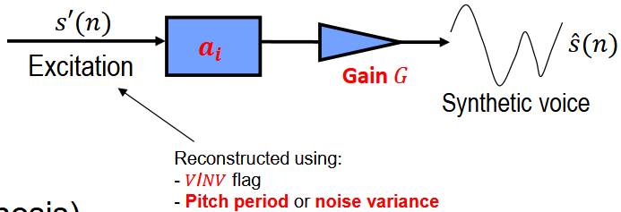

:::caution[Curiosità che sconvolge]
Quello che ascolto non è la voce reale dell'altra persona, ma una voce **totalmente sintetica** ricostruita a partire dai parametri.
:::

| | |
| --- | --- |
| ✅ **Vantaggi** | Bitrate molto ridotto, **< 5 kbit/s**. |
| ⚠️ **Svantaggi** | Ritardi molto elevati (segmentation, analysis, synthesis); la voce ricostruita è comprensibile e buona, ma **non naturale** ed eccellente, con problemi sui rumori di fondo. |

### Esempio

Utile per capire i vantaggi della riduzione della ridondanza. I valori non sono reali, ma realistici. Immaginiamo di avere un phoneme ogni 30 ms da analizzare:

- $G = 5$ bit
- $a_i = 8$ bit ciascuno ($i = 1, \dots, 10$) → 10 parametri da 8 bit
- $V \,|\, NV = 1$ bit → 1 bit per Voiced o Unvoiced
- Pitch period / Noise Variance $= 6$ bit

Il bitrate corrisponde a:

$$
\frac{92\ bit}{30\ ms} = 3.067\ kbit/s
$$

## Hybrid Codec

Usano le stesse tecniche dei Vocoder Lineari, ma ne ottimizzano ulteriormente alcuni aspetti. Ci sono diverse famiglie:

- **MultiPulse-Excited Linear Prediction (MPELP)**: invece di 2 diverse tipologie di segnali di eccitazione, ce n'è una sola, ovvero una sequenza di $N$ campioni non equispaziati e con ampiezze variabili. Non c'è più distinzione tra Voiced e Unvoiced.
- **GSM encoder (RPE-LTP)**: i bit codificati appartengono a diversi livelli di protezione (maximum, medium, no protection).
- **Code Excited Linear Prediction (CELP)**: modifico ulteriormente la fase di eccitazione, definendo un **codebook**, ovvero un insieme di sequenze di eccitazione predeterminate codificate con un certo numero di bit. La scelta ha sempre l'obiettivo di minimizzare la funzione di errore $e(n)$. Può portare a elevate efficienze, ma è **oneroso computazionalmente**.

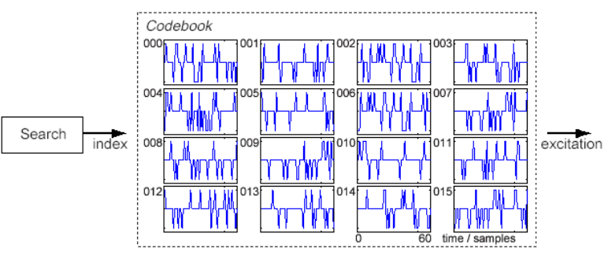

## Voice Quality Assessment

In che modo posso valutare la qualità di queste diverse codifiche?

La qualità può essere valutata tramite una metrica chiamata **Mean Opinion Score (MOS)**, che in maniera **soggettiva** dice se una codifica è migliore o peggiore. Il MOS è un numero da **1 a 5**: 1 = qualità pessima, 5 = qualità eccellente.

I vari codificatori sono associati a determinati MOS, ma come si ottiene questo valore? È un problema, perché devo coinvolgere un alto numero di **ascoltatori**, far ascoltare loro lo stesso segmento audio con diverse codifiche e raccogliere opinioni da 1 a 5.

È una procedura che dal punto di vista tecnico non ha nulla di complesso, ma è complessa da un punto di vista **logistico**.

| | |
| --- | --- |
| ✅ **Vantaggi** | La metrica riflette la percezione reale delle persone. |
| ⚠️ **Svantaggi** | Costoso e complesso (logisticamente, non tecnicamente); è un **one-off method** (una tantum): se domani esce una nuova codifica, devo rifare tutto includendo anche quelle vecchie. |

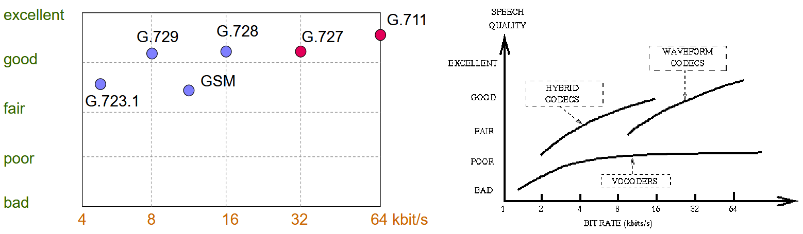

## Voice Degradation

Ci sono sorgenti di ritardo **intrinseche**, a prescindere dal tipo di rete (pacchetto o circuito) usata per trasmettere la voce.

Con la commutazione di pacchetto ci sono però **ulteriori problematiche** non presenti nel caso di commutazione di circuito: introduzione di ritardi e perdita dei segmenti vocali.

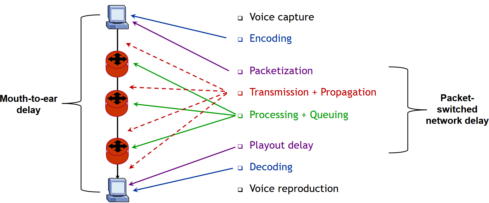

Abbiamo un certo numero di ritardi che si sommano per formare il **Mouth-To-Ear Delay**. Dopo aver catturato la voce ho un segnale analogico e devo codificarlo; poi inserisco in pacchetti i bit che rappresentano i segmenti vocali, che vengono inviati in rete sperimentando tutti i ritardi della commutazione di pacchetto; infine un ritardo di playout e uno di decodifica.

### Packetization Delay

La **pacchettizzazione** raggruppa più segmenti vocali in una rete a commutazione di pacchetto. Si fa per evitare di introdurre pacchetti troppo piccoli in rete: avere troppi pacchetti piccoli non è positivo, perché devo elaborare l'header di ogni singolo pacchetto.

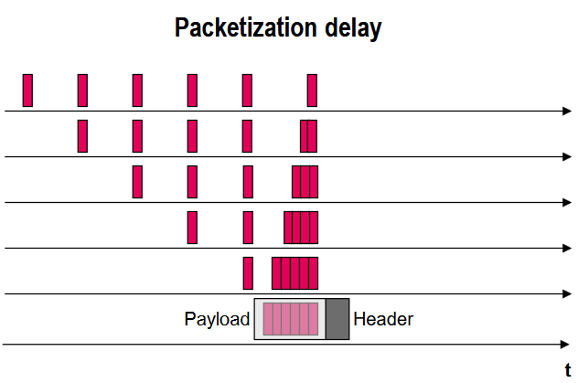

Questo ritardo dipende molto dalla lunghezza dei segmenti vocali e dal numero di segmenti raggruppati.

### Transmission & Propagation Delay

Il ritardo di trasmissione dipende dalla lunghezza dei pacchetti e dalla capacità del collegamento.

### Processing Delay

Ritardo solitamente **trascurabile** (nell'ordine dei ns), necessario per elaborare i pacchetti: lookup, capire verso quale interfaccia inoltrare, operazioni sull'header (es. decremento del TTL), ecc.

### Queuing Delay

Può invece essere **significativo**. Dipende dall'intensità di traffico, perché in reti a commutazione di pacchetto più pacchetti si accodano nelle code di uscita dei nodi.

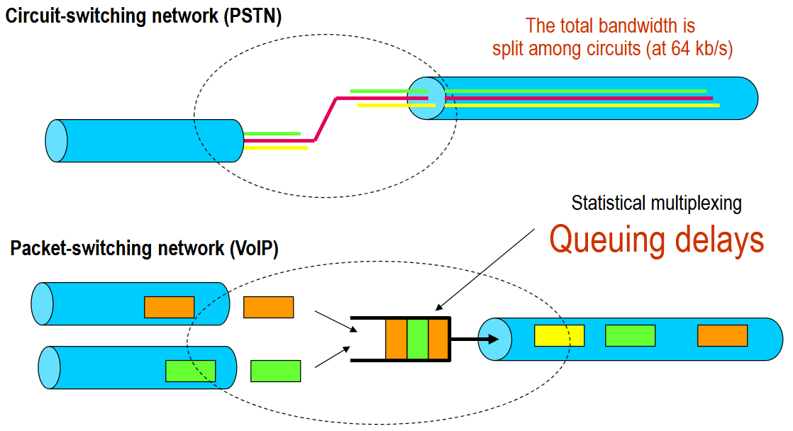

### Playout Delay - Jitter Compensation

Il ritardo di **Playout** è un delay introdotto consapevolmente alla destinazione per compensare il **Jitter**.

:::note[Jitter]
Variazione nello spaziamento dei pacchetti ricevuti alla destinazione, rispetto allo spaziamento che avevano alla sorgente. Se invio i pacchetti ogni tempo $t$, durante la comunicazione questo intervallo potrebbe non rimanere uguale (pacchetti più vicini o più lontani).
:::

I pacchetti sono accodati in un **Playout Buffer**. Il primo pacchetto deve essere riprodotto dal ricevitore dopo un delay che compensa il Network Jitter (playout delay $T_{out}$). Questo $T_{out}$ può essere **costante** oppure **adattivo**, in base alle condizioni della rete osservate nell'ultimo periodo.

## Silence Suppression

Tecnica adottata nelle reti a commutazione di pacchetto per ridurre la quantità di dati da inviare nelle chiamate VoIP.

Nasce da una considerazione: in una conversazione bidirezionale, in media ogni utente parla per circa il **50% del tempo**. Se non si sta parlando, non ha senso occupare banda inviando segmenti vocali vuoti: sopprimendo i silenzi si occupa meno banda.

:::caution[Sensazione di caduta linea]
Se non si fa in maniera opportuna questa soppressione, dall'altro lato si verifica la **sensazione di caduta di linea**: un silenzio totale può dare l'impressione che la linea sia caduta.
:::

Per questo si introduce localmente un **background noise** che dà la sensazione che la linea sia ancora attiva. Questo rumore è generato **localmente**, senza necessità di trasmissione.

Bisogna però capire come identificare se si è in un periodo di silenzio: se ne occupano delle tecniche chiamate **Silence Detection**.

## VoIP Signalling Protocols

Sono i protocolli che permettono di controllare i flussi dati. Servono a fare in modo che la **chiamata** possa essere instaurata, quindi anche a riservare le risorse.

Esistono due tipi di protocolli di segnalazione:

| Tipo | Descrizione |
| --- | --- |
| **In-band signalling** | Utilizza lo stesso canale usato per la voce / i flussi dati, per scambiare i messaggi di segnalazione. |
| **Out-band signalling** | Adotta un canale **separato** rispetto a quello usato per trasportare flussi dati o voce. |

### Signalling in the PSTN Network

Breve digressione sulla segnalazione nella rete telefonica standard. Nella PSTN la segnalazione coinvolgeva:

- **chiamante**
- **rete telefonica**, che instrada la chiamata e riserva le risorse (circuiti)
- **chiamato**

La rete PSTN fa **Access Control**, **Call Admission Control** e **Charging** (tariffare la chiamata).

Il signalling nella rete PSTN si chiama **SS7** (Signalling System No. 7), sviluppato dal 1975.

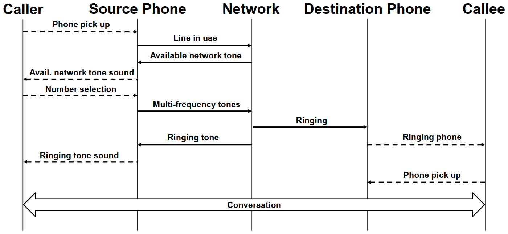

Le frecce continue indicano messaggi scambiati, quelle tratteggiate delle azioni.

### VoIP Signalling

Sulla rete IP il signalling può essere **minimizzato**, perché possiamo usare tecnologie già esistenti, come il **DNS** per tradurre un nome nell'indirizzo IP del chiamante/chiamato. Inoltre, il data flow routing viene eseguito dal protocollo IP.

Potrebbe essere sufficiente aggiungere:

- un protocollo per **avvisare il chiamato**;
- un protocollo per **negoziare i parametri di sessione** (codec, numero e tipo di media stream supportati, ...).

Purtroppo non è sufficiente. I protocolli di segnalazione sono tendenzialmente più complessi, perché si vuole arricchire la segnalazione per renderla quanto più simile (se non migliore) a quella della rete PSTN. Si cerca quindi di implementare:

- Access Control
- Call Admission Control
- Charging
- Control of multi-party sessions

Ci sono varie architetture per la segnalazione VoIP; le due più conosciute sono **H.323** e **Session Initiation Protocol (SIP)**. Ci focalizziamo su SIP.

### SIP

:::tip[Spoiler]
Ritroveremo quasi tutte le cose già viste in **HTTP**, perché è molto simile come protocollo.
:::

SIP è nato nel **2002**, apposta per risolvere l'esigenza di effettuare chiamate sia audio che audio-video sulla rete IP.

L'identificatore associato agli utenti prende il nome di **SIP Uniform Resource Identifier (URI)**. Sintatticamente e semanticamente è identico agli indirizzi email: `user@domain.tld`.

L'identificativo è relativo all'**utente**, non al terminale: è quindi possibile avere la cosiddetta **Personal Mobility**. Un utente può accedere al servizio VoIP da diversi terminali, anche temporaneamente (disaccoppiamento tra id del terminale e dell'utente). Per garantire questa mobility, servono due funzionalità:

- **registration**
- **user location**

#### Metodi SIP

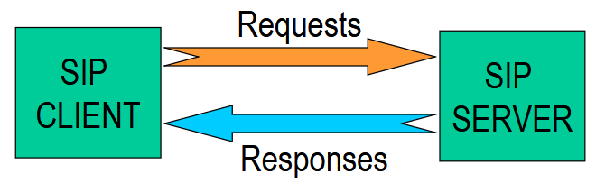

Essendo simile a HTTP, SIP è un protocollo di tipo **client-server**, in cui ogni nodo ha una funzionalità client e una server: il client invia richieste, il server risponde.

In SIP ci sono diversi metodi (come in HTTP, ma differenti). In totale SIP ha **14 metodi**, ma i più importanti sono i seguenti:

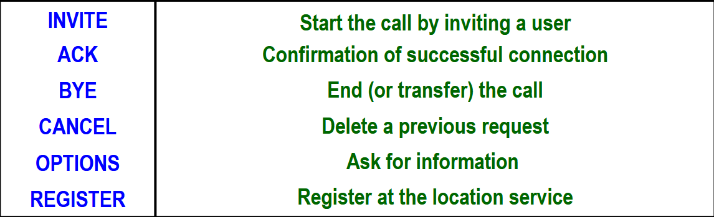

:::note[SIP e trasporto]
SIP **non** garantisce consegna. HTTP si basa su TCP, ma SIP può girare sia su **TCP** che su **UDP**. Di gran lunga, la situazione più tipica è SIP su **UDP**.
:::

#### SIP Response Codes

75 possibili codici raggruppati in **6 categorie**. Nulla di più da dire rispetto a HTTP.

#### SIP Transactions

Abbiamo un protocollo client-server in cui si inviano richieste e si restituiscono risposte. Richieste e risposte vengono raggruppate in **SIP Transactions**, il cui obiettivo è stabilire una **sessione**.

:::note[Sessione]
Scambio di media (dati generati di tipo call, video call, video conference, ...).
:::

Una transaction consiste in:

- una **richiesta**;
- un qualsiasi numero di **risposte informative** (1xx);
- una **risposta finale**.

Ogni volta che si invia un messaggio **INVITE**, è necessario inviare un ulteriore messaggio di **ACK**, che in SIP costituisce una transazione indipendente, per confermare che la sessione è stata stabilita.

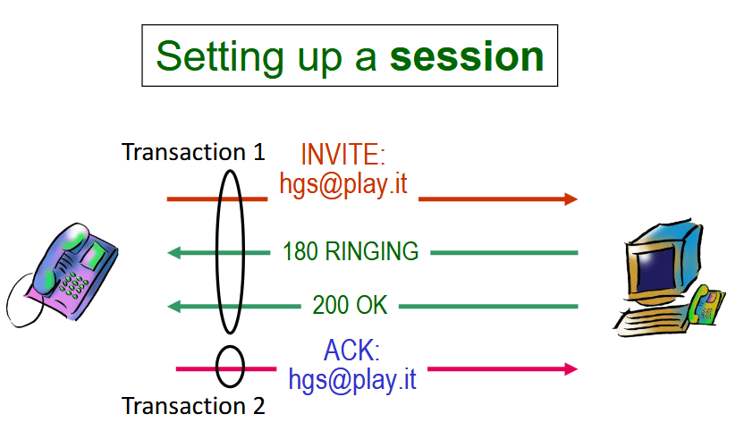

#### Formato delle Richieste del SIP Message

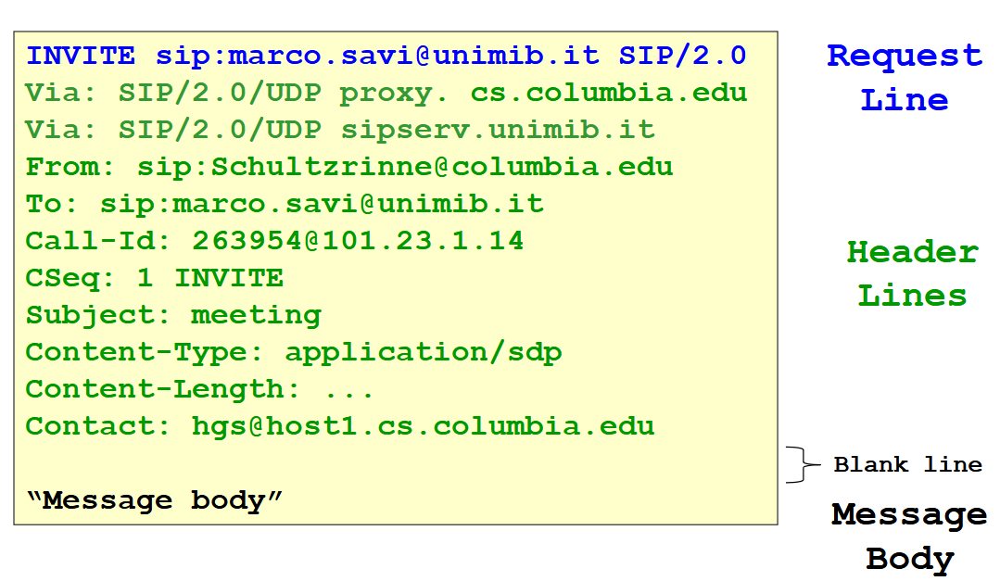

#### Formato delle Risposte del SIP Message

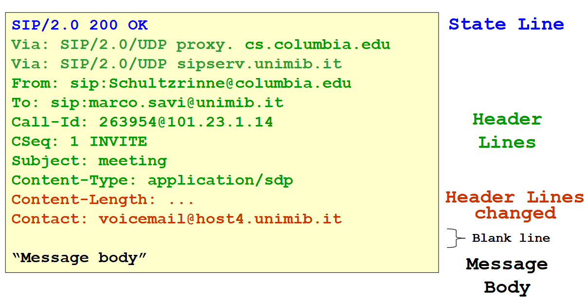

#### Network Elements

:::danger[Attenzione]
Questo argomento è **spesso richiesto in esame**!
:::

Vediamo l'architettura per la segnalazione di SIP e quali sono gli elementi che ne fanno parte.

La rete nel caso di SIP è divisa in diversi **domini**. Questo termine non ha niente a che vedere con i sistemi autonomi visti in triennale. Ogni dominio include:

- un certo numero di **User Agent**
- **Proxy Server**
- **Registrar**
- un certo numero di **Redirect Server**

I nodi fondamentali per garantire la comunicazione tra domini differenti sono i **Proxy Server**. Siamo in un contesto applicativo: il Proxy Server è un vero e proprio server che riceve le richieste e le invia a un altro Proxy Server che le elabora.

##### User Agent (UA)

Ha una parte Client e una parte Server (**UA-client** e **UA-Server**); vogliamo stabilire una sessione tra UA.

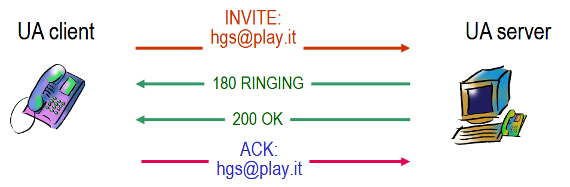

##### Registrar

È coinvolto nell'operazione di **registrazione**. Un registrar associa un **URI SIP** (di un utente) con l'**indirizzo IP** dello User Agent su cui l'utente può essere rintracciato.

Se voglio essere raggiungibile su uno specifico terminale, devo registrare l'associazione sul Registrar inviando una richiesta **REGISTER** periodicamente, dato che queste associazioni sono **temporanee** e vengono eliminate dal database del Registrar ogni tot.

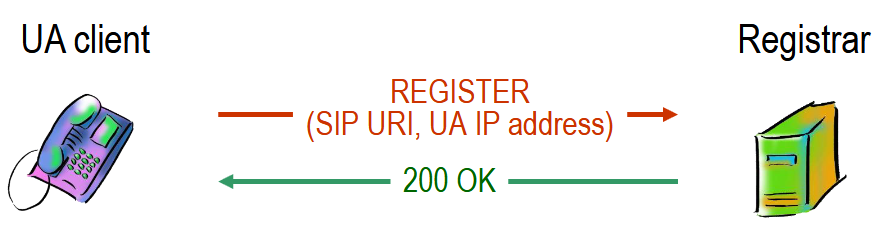

###### Registrar Localization

Come posso conoscere l'indirizzo del Registrar per contattarlo? Ci sono 3 possibilità:

1. configurazione **statica**;
2. utilizzo del **DNS**;
3. inviare la REGISTER request a un indirizzo di **multicast**.

##### Proxy Server

Sono degli instradatori, ma di **livello applicativo**. Fanno instradamento di richieste e risposte tra i diversi domini. Come funziona quando voglio chiamare un utente su un altro dominio?

In questo esempio, la richiesta INVITE raggiunge il Proxy Server che interroga un **Database** dal quale reperisce l'indirizzo IP del Proxy Server di destinazione, sulla base del dominio specificato (`henning@columbia.edu`). Nella migliore delle ipotesi ho già il dominio nel Database; nella peggiore si scatena la gerarchia del **DNS** per ottenere l'IP associato al dominio.

Ottenuto l'IP del proxy di destinazione, inoltro l'INVITE verso di esso. Il Proxy di Destinazione riceve l'INVITE rivolto a un utente del suo dominio, ma deve **localizzarlo** (c'è il disaccoppiamento tra utente e terminale): interroga quindi il **Registrar** e l'INVITE viene inviato a quello specifico User Agent.

Praticamente questa slide mostra il funzionamento di SIP.

##### Redirect Server

Il Redirect Server riceve le richieste e risponde specificando una **differente localizzazione** per l'utente: fornisce un'indicazione su quale sia l'effettivo User Agent su cui trovare temporaneamente l'utente, perché si è temporaneamente spostato.

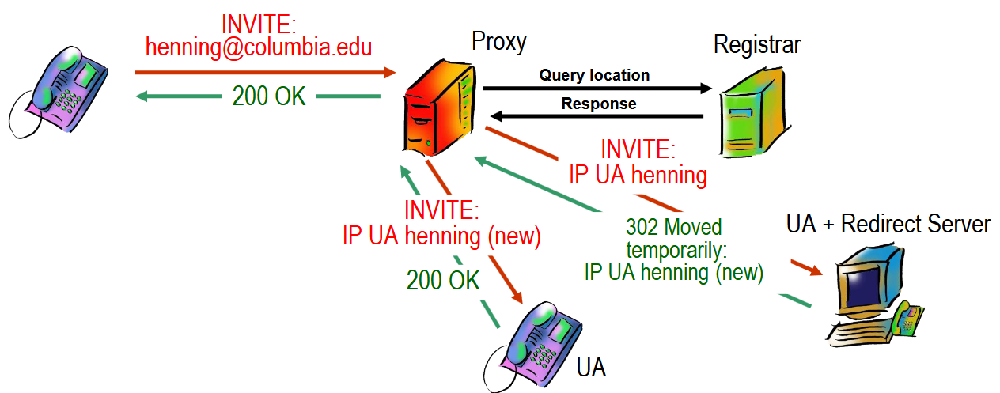

#### SIP Forking

Un altro meccanismo fondamentale. Per via del disaccoppiamento tra indirizzi dei terminali e degli utenti, un utente può essere registrato su più terminali: posso quindi inoltrare una richiesta verso più terminali. Questa operazione prende il nome di **Automatic Call Distribution**.

Può essere effettuata in 2 modi:

1. **in sequenza**;
2. **in parallelo**: invio più richieste e, una volta che l'utente risponde da uno dei terminali, invio un **CANCEL** agli altri terminali.

#### Session Description Protocol

Ha il compito di **descrivere le sessioni**. Cosa significa?

Con SIP vogliamo instaurare una sessione, e i parametri vanno stabiliti e accordati dagli utenti. Il **Session Description Protocol (SDP)** fa in modo che gli utenti raggiungano un **consenso** su *come* la sessione deve essere fatta, ovvero sui suoi parametri identificativi.

Importante: il messaggio SDP viene trasportato come **corpo** delle richieste e risposte SIP.

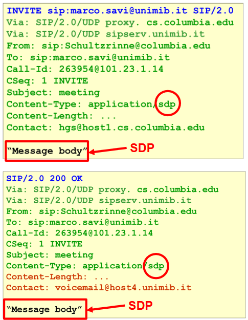

Il corpo SDP è solitamente presente in un messaggio di richiesta **INVITE**. Il server include il corpo SDP nella risposta finale **200 OK**. Se per qualche ragione non lo includo nell'INVITE, posso includerlo nel corpo del messaggio **ACK** finale.

##### SDP - Message Body

Il corpo del messaggio SDP include un certo numero di campi:

- nome e purpose della sessione;
- session duration;
- **used media** (quello su cui ci focalizziamo);
- information to correctly receive such media (ports, addresses);
- contact information.

**Used Media**: un certo numero di campi che permette di negoziare le caratteristiche del flusso audio, video e dati tra sorgente e destinazione.

Com'è fatto il corpo del messaggio SDP? È un protocollo **Character Oriented**, con formato del tipo `<Parameter> = <Value>`, analogo a SIP.

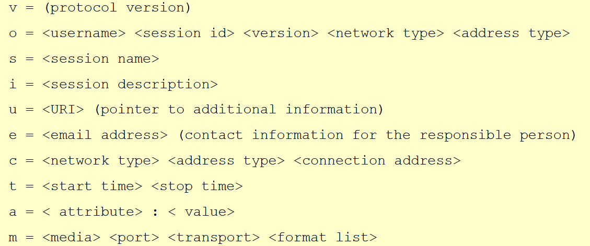

Tutti questi campi non vanno imparati a memoria, ma ce n'è uno particolare: il campo `m = <media> <port> <transport> <format list>`. Vediamo un esempio:

Con questo messaggio SDP stiamo dicendo che vogliamo instaurare una sessione con due media: un flusso **audio** e uno **video**. I dati audio me li aspetto sulla porta `49170`, il video sulla `51372`. Subito dopo è specificato `RTP/AVP` e un numero per il transport. **RTP** (Realtime Transport Protocol) è un ulteriore protocollo che non vediamo, usato per il trasporto di voce, audio, video o dati. Con RTP possiamo specificare vari **audio/video profile**: i numeri sono associati a una diversa codifica per audio e video. Per l'audio, il valore `0` è associato a **PCM**; per il video, `31` è associato a **H.261**.

La cosa importante: in questo modo posso avere uno scambio di messaggi tra mittente e destinatario per **negoziare la codifica** da utilizzare per audio e video.

#### Call Setup: Example

Non interessa imparare a memoria i campi del messaggio, ma vedere quali sono e come vengono usati.

Immaginiamo di trovarci in questo caso.

##### Messaggio di INVITE

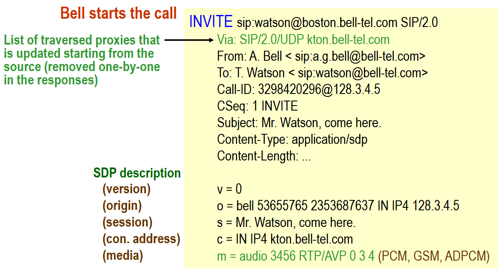

Il campo **Via** lo vediamo più avanti. Abbiamo:

- mittente
- destinatario
- **Call-ID**
- **CSeq**: numero di sequenza che identifica la transazione
- **Content-Type**: stiamo dicendo che il corpo trasporta un messaggio SDP
- l'ultima riga dice che vogliamo fare una chiamata audio, pronti a ricevere messaggi sulla porta `3456`, e che supportiamo le codifiche audio `0, 3, 4`, che corrispondono a **PCM, GSM, ADPCM**. Ho a disposizione uno qualsiasi di questi codificatori.

##### Messaggio di TRYING & RINGING

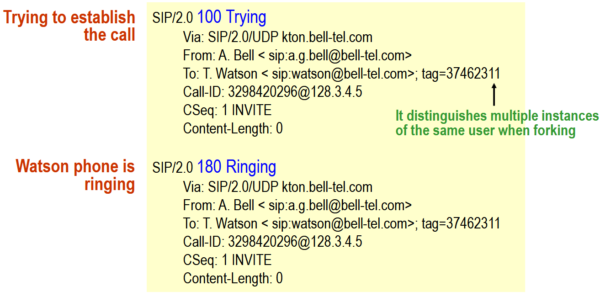

Importante notare come dentro il campo **CSeq** sia salvato il valore `1 INVITE`: questo perché i messaggi TRYING e RINGING sono associati al precedente INVITE con ID 1.

Inoltre, nel campo **TO** posso specificare un **TAG**: stringa numerica casuale, fondamentale ad esempio col forking, quando invio INVITE a terminali differenti. Quando ho le risposte, posso discriminare tra i vari terminali.

##### Messaggio di OK

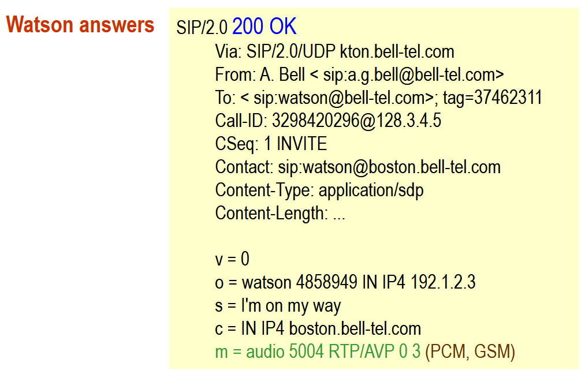

Anche qui il campo **m** dice di stabilire un flusso di tipo audio in ascolto sulla porta `5004`, RTP come protocollo e codifiche supportate `0` e `3`. Siccome non è presente il `4` (come invece nell'INVITE del mittente), quella codifica non potrà essere utilizzata.

##### Messaggio di ACK & BYE

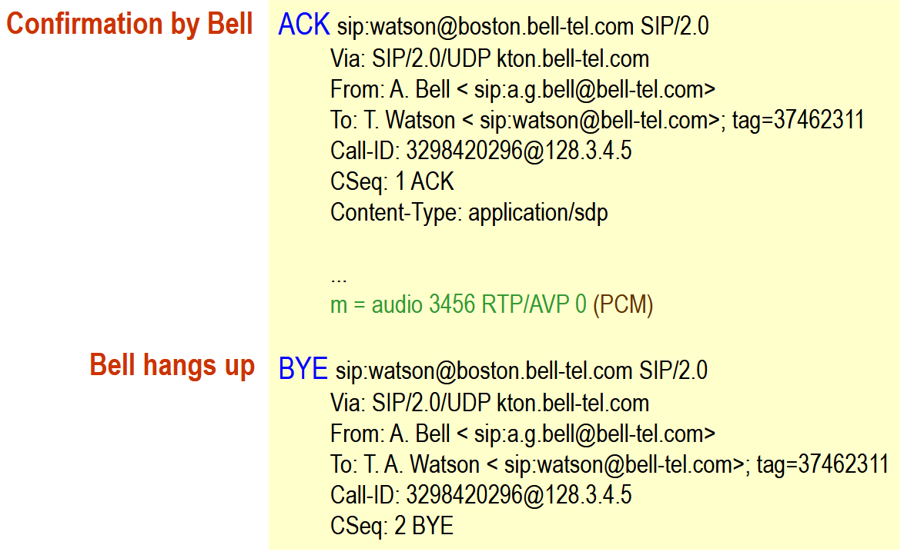

#### Response Routing

Alcuni campi molto importanti nelle richieste e risposte SIP per ottenere un comportamento specifico.

Per varie ragioni, quasi sempre vogliamo che le richieste e le risposte associate seguano **lo stesso percorso** in rete, ovvero che attraversino gli stessi Proxy. Questo si fa tramite il campo **Via**.

È utile soprattutto per la **tariffazione**: assicurando che i messaggi seguano lo stesso percorso in entrambe le direzioni, ho piena visibilità su quanto succede quando si instaura la chiamata.

- Per le **richieste**, tramite **Via** inserisco nell'header campi relativi ai Proxy Server attraversati.
- Per le **risposte**, si segue un approccio di tipo **Source-Based Routing**, per far seguire alle risposte lo stesso percorso delle richieste.

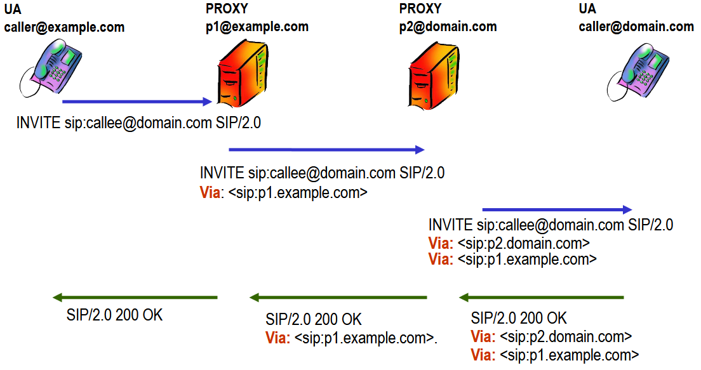

Quando l'INVITE raggiunge il primo Proxy, questo inserisce il campo Via che ne specifica l'attraversamento. L'INVITE è inoltrato al secondo Proxy, che aggiunge un nuovo campo Via. A questo punto, con la risposta posso fare Source-Based Routing per seguire lo stesso percorso in direzione opposta. Non introduce una latenza importante.

##### Routing of Subsequent Requests

E se volessi che anche **richieste successive** seguano lo stesso percorso, oltre alla risposta di una richiesta?

Posso adottare due campi: **Record-Route** e **Route**. Col primo registro l'informazione relativa alla rotta (stessa filosofia di Via), mentre il campo **Route** permette di fare Source-Based Routing a partire dal mittente.

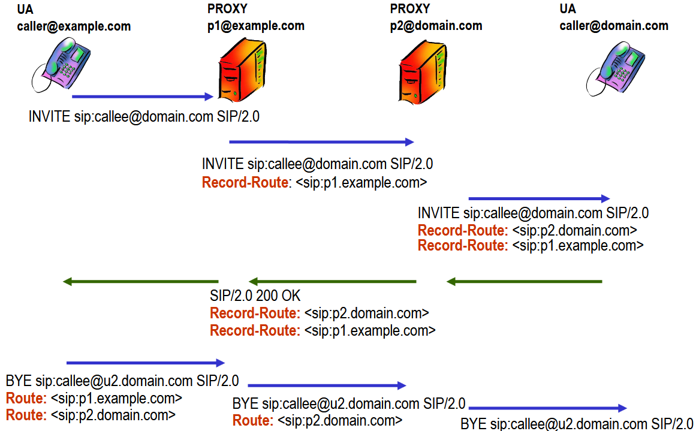

La prima parte è uguale a Via, ma salviamo sotto il nome di **Record-Route**. Raggiunta la destinazione, questa riceve i due campi Record-Route nella risposta senza alterarli. I due campi raggiungono la sorgente, che può invertirne l'ordine per poi fare Source-Based Routing, dove ogni Proxy sul percorso rimuove il campo relativo a se stesso. In questo modo mi assicuro che ognuno segua lo stesso percorso.

#### Metodi Aggiuntivi

- **PRACK**: Provisional Acknowledgement
- **UPDATE**: Information update during setup
- **REFER**: indica che il chiamante deve contattare un third party. Può essere usato per fare **Call Forwarding**
- **NOTIFY**: usato per implementare notifiche per eventi

Con questi metodi è possibile **sospendere o modificare** la fase di Call Setup quando è necessario eseguire azioni aggiuntive prima del completamento.

##### PRACK

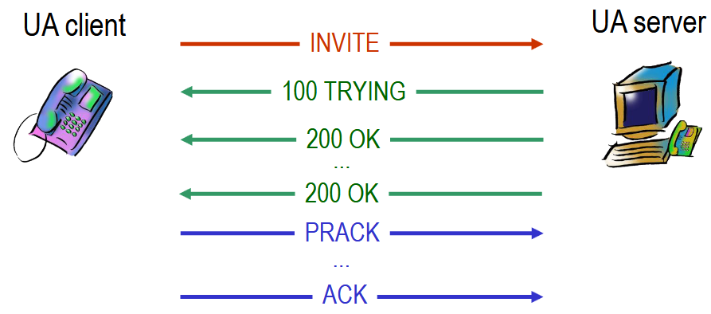

Funziona così: a un certo punto, dall'altro capo si arriva al `200 OK` (pronti per concludere il SETUP). Però, perché sia concluso davvero, il mittente deve inviare un **ACK** finale. Se l'ACK finale non arriva, il destinatario inizia a bombardare di `200 OK` il mittente.

Potrebbe succedere che il mittente non invii l'ACK non per problemi di comunicazione, ma perché deve eseguire **operazioni aggiuntive** (es. preparare il codificatore in tempo per la chiamata). Allora il Client invia un **PRACK** al Server che dice, in sostanza: *"aspetta, so che ti devo rispondere con un ACK, ma non sono ancora pronto; te lo invio appena posso."*

##### UPDATE

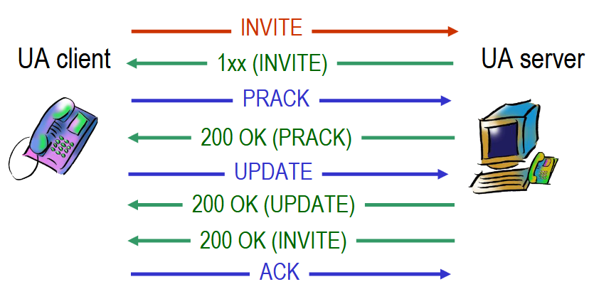

Può essere usato per **rinegoziare in tempo reale** i media coinvolti nella comunicazione. Se voglio modificare i parametri in senso lato della sessione (e anche i media), posso fare una nuova richiesta **INVITE**; se invece voglio modificare **solo i media** (es. cambiare codifica), uso un messaggio **UPDATE**.

UPDATE può essere inviato anche **durante il setup** della chiamata: se nel primo scambio di messaggi non si è trovato un accordo sulla codifica, si usa l'UPDATE per cercarne un'altra.

##### REFER

Esempio di **Call Forwarding** tramite REFER:

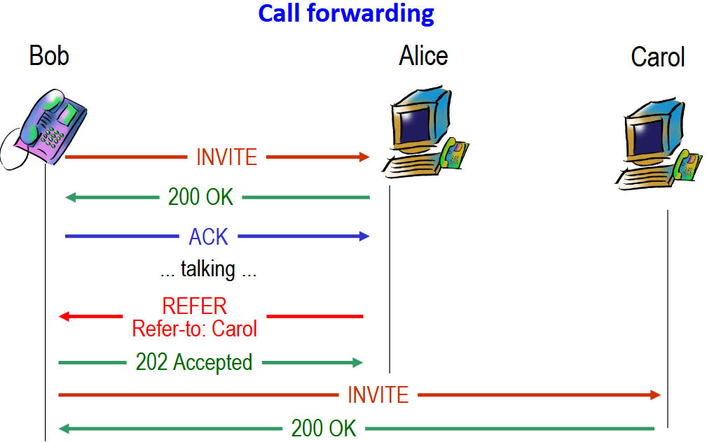

Il nuovo campo **Refer-To** contiene un SIP URI per puntare all'altra entità (Carol).

##### NOTIFY

Quando un REFER è accettato, si potrebbe (non obbligatoriamente) impostare un sistema di notifica tramite il metodo **NOTIFY**. Qualsiasi evento accada nella nuova sessione viene notificato al vecchio chiamato (nell'esempio, Alice):

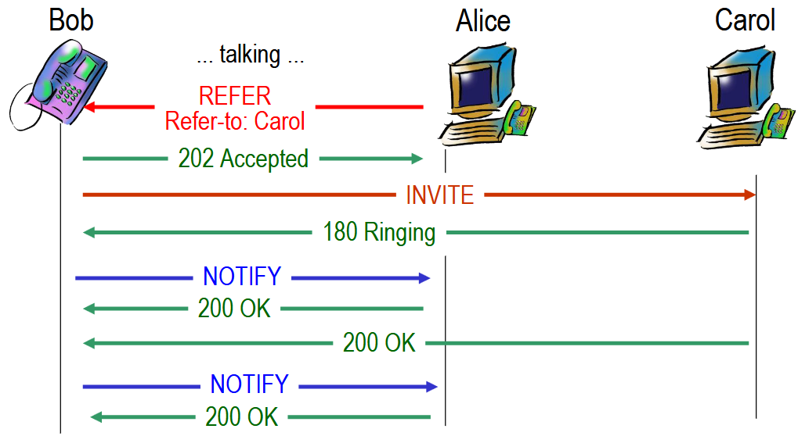

#### Adozione di SIP

SIP è molto utilizzato in reti mobili radio di generazione recente (**4G** e **5G**), dove VoIP è adottato nativamente.

Viene adottato uno standard di comunicazione VoIP: **VoLTE** (Voice-over-LTE):

- i pacchetti header sono ottimizzati per consumare meno bandwidth rispetto alla tecnologia VoIP standard;
- il signalling è basato su **SIP**.
