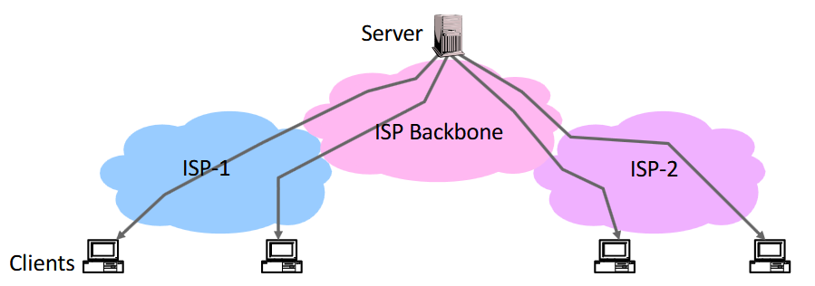
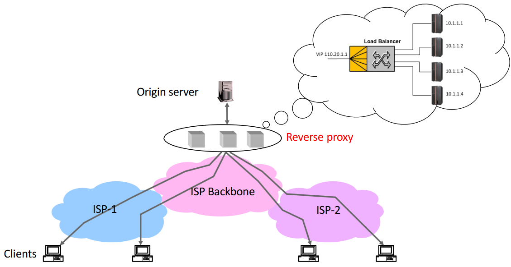
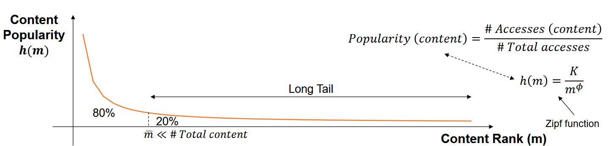

Prima di andare nel dettaglio della tecnologia, facciamo un esperimento.

Apriamo il terminale Windows e facciamo un ping verso un operatore australiano www.ventraip.com.au: otteniamo un time di circa 255ms, come ci aspettiamo dato che si trova in Australia. Proviamo invece a pingare il sito del governo australiano www.australia.gov.au e leggiamo un time medi di 5ms. Ma come è possibile? Significa che molto probabilmente questo sito è hostato da un CDN provider per fornire il sito vicino agli utenti che lo accedono.

Andiamo a vedere come funzionano le CDN, ma prima capire cosa significa replicare contenuti e come si può fare.

## New Needs
Ci stiamo focalizzando sul Web. Come era originariamente fatto il web? 



Fondamentalmente si avevano certi server di nome **Origin Server** che hostano contenuti, centralizzati nella rete di backbone.

Il problema è che con l'esplosione del traffico Web, questi server si sono trovati in difficoltà nel gestire un quantitativo di traffico sempre maggiore. 

Il problema può essere risolto ridistribuendo il traffico in maniera intelligete; sono nate alcune strategie che riducono la latenza e permettono di usare meglio le risorse.

### Use of Proxies
Utilizzo di Proxy a livello applicativo che permettono di hostare contenuto originato dall'**Origin Server**, che si trovano tra il client e l'Origin Server stesso.

Se voglio adottare dei proxy nella mia rete, possso adottare 2 strategie:
1. reverse proxies
2. forward proxies

#### Reverse Proxy
Insieme di server di tipo Front-End rispetto al server di origine che hanno il compito di alleviarne il carico, ma si trovano a loro volta nella rete di Backbone. Una situazione tipica è questa:



Ci sono un certo numero di Reverse Proxy e il server di origine: il contenuto è replicato nei Reverse Proxy per alleviare il carico al Server di Origine.

Il problema di questa soluzione è che non risolve il problema del bottleneck della rete che si verifica nella zona di collegamento tra rete Backbone e l'insieme dei Reverse Proxy: ho aggiunto i Reverse Proxy, ma le "linee" che entrano nel nuovo gruppo causano bottleneck come prima. 

#### Forward Proxy
Migliora ulteriormente la soluzione: i proxy vengono posizionati più vicini agli utenti, o nelle reti di accesso, o addirittura in alcuni casi anche nella rete locale della compagnia.


I contenuti vengono quindi replicati localmente all'interno dei proxy. In questo caso non è necessario effettuare **Load Balancing**.

:::tip[Cache / Replica Server]
D'ora in avanti, ci riferiamo ai Proxies Forward/Reverse tramite il termine generico **CACHE** (oppure **REPLICA SERVER**).
:::

Molto benefici in rete perché portano riduzione del carico e riducono la latenza, perché posso servire gli utenti da una posizione più vicina a loro, proprio come nell'esempio a inizio capitolo.

## Content Replication (caching)
La capacità storage delle cache è limitata. Quindi, devo definire la strategia di caching per fare in modo che posso massimizzare i benifici nell'adozione di una cache.

La strategia adottata per fare Caching è replicare i contenuti che sono più popolari. Questi sono i contenuti verso i quali sono dirette le maggior parti delle richieste.

Il motivo del cachare i contenuti più popolari è che una piccolissima porzioni dei contenuti più popolari causa una grandissima percentuale di accessi rispetto agli accessi totali. Vediamo questo esempio:



**m** è il rank del contenuto, ottenuto da una classifica stipulata tramite la formula di Popularity.

Se faccio il caching degli m contenuti più popolari sono sicuro che sto facendo una cosa intelligente.

I contenuti hanno una correlazione solitamente di località:
- località temporale: un contenuto acceduto adesso, verrà probabilmente acceduto nuovamente tra poco
- località spaziale: stesso concetto ma con aree geografiche

Questi aspetti vengono tenuti in considerazione per fare il caching.

### Problema della Consistenza
Nel momento in cui replico un contenuto nella Cache, devo ovviamente garantire che sia allineato con quello contenuto nell'Origin Server. Il problema è che questo contenuto nell'Origin Server potrebbe cambiare.

Esistono due diverse tipologie di consistenza che posso garantire:
- consistenza forte: il sistema garantisce che non fornirò mai agli utenti un contenuto non consistente. Garantire questo tipo non è facile.
- consistenza debole: posso consegnare una copia non consistente con probabilità bassa.

Quando parliamo di consistenza, esistono 3 meccanismi che vanno adottati:
- invalidation

    le repliche vengono invalidate dopo la scadenza di un **Expected Expiry Time**, definito per il contenuto dall'Origin Server.
- freshness

    si assicura che una replica possa essere considerata "fresh", ovvero non obsoleta. Necessaria perché un contenuto può essere cambiato anche prima dell'Expected Expiry Time.
- validation

    valuta, una volta che l'Expected Expiry Time è scaduto, se il contenuto può ancora essere considerato buono. 

### Caching Cooperativo

È possibile avere dei meccanismi per i quali se dentro la mia cache non ho contenuto (**Cache Miss**), invece di andare a prenderlo dall'Origin Server, lo prendo da un'altra Cache.

### HTML & HTTP Directives
Sia HTML che HTTP usano delle direttive per gestire opportunamente il caching. Ci focalizziamo maggiormente su quelle HTTP in quanto sono quelle più utilizzate.

Comunque, le HTML permettono di inserire codice specifico tramite META tag per forzare il ritiro della web page dall'Origin Server. 

#### Direttive HTTP
Sono dei campi inseriti nelle richieste HTTP. 

##### Direttive HTTP Imperative
Sono quelle direttive HTTP che hanno priorità su qualsiasi controllo che viene effettuato dalle cache. 

Direttive nelle richieste e anche risposte:
- ```Cache-control: no-store```: utilizzato per evitare che venga effettuato caching
- ```Cache-control: no-transform```: evita che il contenuto possa essere trasformato dalla cache.

Direttive solo nelle richieste:
- ```Cache-control: only-if-cached```: sto richiedendo di ottenere un contenuto solo ed esclusivamente se è stato cachato. Se il contenuto non è immagazzinato nella cache, si ottiene un errore ```504 gateway timeout```, utile per gli oggetti che voglio esclusivamente reperire con bassa latenza.

##### Direttive HTTP per la gestione del ciclo di vita dei contenuti


Asse temporale con diversi nomi di campi relativi alle direttive. In rosso ci sono determinate azioni compiute.

- Date: direttiva che specifica il timestamp in cui il contenuto è stato inviato dall'Origin Server alla cache
- Last-modified: quando è stata effettuata l'ultima modifica al contenuto che si trova nell'origin server. Ovviamente, se $Last-modified < Date$ allora la replica è consistente.

- Age: tempo speso dall'oggetto dentro la Cache.

- Expires: corrisponde all'Expected Expiry Time, ovvero alla previsione di quando il contenuto va rimpiazzato nella cache.

##### Direttive HTTP per il timing


Anche qui asse temporale, i pallini neri indicano il riferimento temporale attuale, mentre le direzioni delle frecce se mi muovo verso il passato o verso il futuro.

- Max-age: indica che il client può accettare un contenuto che non è più vecchio del valore specificato. Se un contenuto si trova a sx di max age va bene, altrimenti no. Sono più stringente dell'expires.

- Min-fresh: tempo che deve passare per considerare il contenuto fresh. Il contenuto è fresh se è a sx del min fresh, mentre non va bene se sono troppo vicino all'expires. 

- Max-stale: posso dire che il client è disposto ad accettare un contenuto che ha superato il valore Expires, e max-stale indica di quanto può aver superato questo expiry time.

#### Validation by the Client
Il valore specificato da Expires è una predizione fatta dall'Origin Server e *potrebbe* risultare errata. Per garantire una forte consistenza, devo adottare un meccanismo di validazione per assicurarmi di poter fornire al client un contenuto NON obsoleto.

Vediamo come funziona il meccanismo di validazione.

Il Client vuole ovviamente ottenere un contenuto valido, questo meccanismo deve quindi garantire se l'expected expiry time è scaduto oppure no.

Il workflow:
1. La cache invia una richiesta GET con uno dei seguenti fields:
    - ```if-none-match```: viene specificato l'ETag della replica cachata. Se confronto l'ETag del contenuto cachato con quello contenuto nell'Origin Server, posso capire se il contenuto è differente in caso non dovessero coincidere.
    - ```if-modified-since```: fa più o meno la stessa cosa, ma si specifica la data della replica che è stata cachata. Si confronta con la data di ultima modifica del contenuto sul server per capire se il contenuto corrisponde.
2. Il server risponde con uno dei seguenti:
    - se l'oggetto è modificato: new object -> ```HTTP/1.0 200 OK```
    - se l'oggetto NON è modificato: ```HTTP/1.0 304 Not Modified```

:::note[ETag]
Prendo il contenuto e ne faccio l'hash.

Ottenuto in uscita il digest, questo identifica univocamente il contenuto.
:::

#### Eterogenità del Contenuto
Tipi di contenuti:
- statico: stabili nel tempo
- volatili: cambiati frequentemente, periodicamente o a causa di eventi
- dynamic: creato dinamicamente sulla base delle richieste del client

Quale di queste tipologie di contenuti si presta meglio al caching? Quella statica, perché gli altri 2 se vado a farne il caching ho problemi perché cambiano facilmente.

La brutta notizia è che la stragrande maggioranza (> 50%) dei contenuti in rete NON può essere cachata perché è volatile, dinamica, oppure richiede encryption.

La buone notizie sono:
1. i contenuti volatili e dinamici hanno solitamente dimensione ridotta, quindi l'impatto in rete è a sua volta solitamente ridotto. Ergo l'impatto sulla rete di Backbone non è così marcato
2. i contenuti statici hanno invece solitamente dimensione molto maggiore

Risulta evidente che cachare questi contenuti statici portano un effettivo risparmio di banda in rete.

## CDN
Una CDN garantisce una distribuzione intelligente dei contenuti.

La CDN distribuisce contenuti che vengono creati dal Content Provider, che a sua volta possiene l'Origin Server.

Un terzo attore è l'ISP: i CDN Provider possono disseminare le cache in vari punti della rete, come reti locali di determinate organizzazioni o nelle reti di accesso degli ISP. In questo secondo caso, che ci interessa maggiormente, il tipico modello di business adottato:
- CDN Provider stipulano accordi con gli ISP in modo da posizionare le cache all'interno delle loro reti (CDN Provider -> $$$ -> Network Operator ISP)

- Il CDN Provider offre il servizio CDN ai vari Content Providers che hanno del contenuto popolare da sparpagliare (Content Provider -> $$$ -> CDN Provider)

L'obiettivo della CDN è migliorare la performance riducendo la latenza, benefico ai Content Providers, e la bandwidth consumata nella rete, benefico agli ISP.

### CDN Architecture


Due cerchi, uno più interno e uno esterno. Quello più interno rappresenta l'architettura della CDN, mentre quello esterno è ciò che concerne il mondo del Content Provider. Chiaramente quest ultimo ha il proprio server di origine e il proprio sistema di billing.

Le 3 componenti principali sono quelle in rosa:
- Content Distribution System:

    sistema che ha il compito di effettuare una replica dei contenuti dall'Origin Server verso i Replica Server (caches)

- Request Routing System:

    una volta posizionati i contenuti nelle cache si ha la necessità di instradare questi contenuti, ovvero fa in modo che le richieste vengano eseguite da un determinato Replica Server o dall'Origin Server.

- Accounting System:

    componente di gestione che immagazzina varie informazioni, come i log di accesso degli utenti. Componente fondamentale per fare in modo che i Content Provider possano fare la fatturazione verso i loro utenti.

#### Request Routing System
Un ruolo fondamentale è ricoperto dal DNS.

Sfruttando i principi del DNS, abbiamo 2 meccanismi alternativi che possono essere adottati per fare Request Routing:
1. DNS redirection
2. URL rewriting

Per capire questi 2 meccanismi, è importante che sia chiaro come funziona il DNS.

##### Ripasso del DNS


Ogni qualvolta vogliamo fare la risoluzione di un hostname in un indirizzo IP, il browser coinvolge il DNS Resolver, a cui viene inviata una richiesta di risoluzione hostname, come per esempio www.google.com. Il compito del DNS Resolver è interrogare i server che effettuano la traslazione.

Questi server sono posti in gerarchia e prendono il nome di Domain Name Server.
- DNS Root Name Server
- Top Level Domain Name Server
- Authoritative Name Server

Invio la richiesta per www.google.com al Root Name Server; questo restituisce l'indirizzo IP del Name Server che si occupa della risoluzione del Top Level Domain ```.com```. Le parentesi in alto indicano che questo primo passaggio può essere bypassato dal DNS Resolver, soprattutto per i TLD più tipici dato che il Root Name Server tiene le info di questi in memoria.

A questo punto si interroga il TLD Name Server, che analizza la richiesta e si rende conto che bisogna interrogare l'Authoritative Name Server che si occupa della risoluzione di tutti gli indirizzi del dominio google; risponde col suo IP.

Infine, l'Authoritative Name Server restituisce l'IP della pagina web.

##### DNS Redirection
Meccanismo usato dalle CDN.

Per fare questa DNS Redirection, dobbiamo mettere in piedi un meccanismo per il quale a un certo punto un DNS server restituisce l'informazione relativa all'indirizzo IP della Replica Servver da cui replicare il contenuto, anziché l'IP dell'Origin Server. 

Si possono fare 2 diverse cose:
1. delego la risoluzione dell'hostname a un nameserver controllato direttamente dal CDN Provider
2. fare in modo che il DNS Server Autoritativo del Content Provider risolva direttamente l'hostname in un indirizzo IP che punta a una cache del CDN Provider.

    Questo secondo caso richiede, a differenza del primo, la necessità che il CDN Provider abbbia accesso al DNS Server Autoritativo del Content Provider.


Nel caso 1, invece di DNS Server Autoritativo, invece di rispondere con l'IP del webserver, risponde con l'IP di un ulteriore DNS Server che è il DNS server del CDN. Di conseguenza, una nuova interrogazione va fatta verso questo nodo e il Name Server restituisce un'IP di una cache da cui reperire il contenuto. Abbiamo solo aggiunto 1 livello aggiuntivo nel procedimento del dns.

Nel caso 2, il procedimento risulta più semplice, l'immagine è infatti identica a quella del DNS normale. La differenza è che il DNS Server Autoritativo deve essere configurato in modo tale per cui possa restituire IP differenti relativamente alle cache gestite dal CDN Provider.

Tra i due casi, il primo è di gran lunga quello più adottato, perché i Content Provider non sono contenti di dar accesso al proprio DNS Server Autoritativo a un third party, che sarebbe il CDN Provider. Motivo per cui il caso 1 è molto più diffuso.

##### URL Rewriting

Piuttosto semplice concettualmente. In una pagina HTML ci sono diversi oggetti Embedded che riguardano risorse differenti e ognuno di questi oggetti è associato a risorse differenti.

Si prendono gli oggetti statici e si riscriver l'URL per questi oggetti per fare in modo che il DNS, nel momento in cui vengono effettuate delle richieste, vada direttamente a risolvere l'hostname nell'indirizzo IP corretto.

Esempio:
```
https://my.origin-domain.com/path/to/img.jpg → https://my.cdn-domain.com/path/to/img.jpg
```