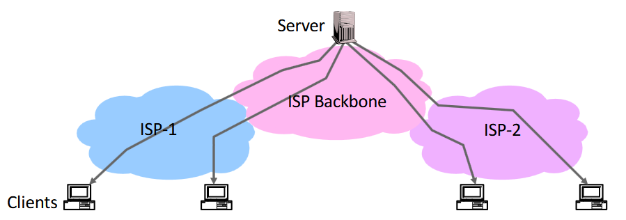
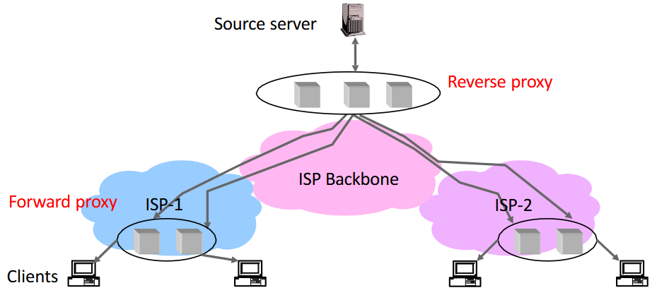
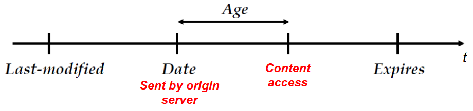
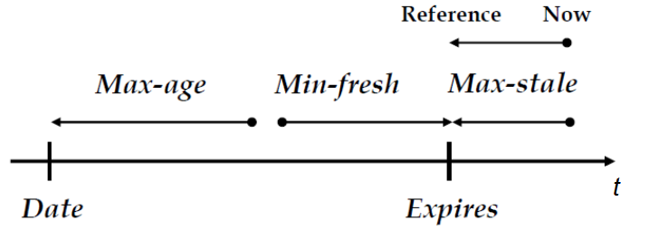
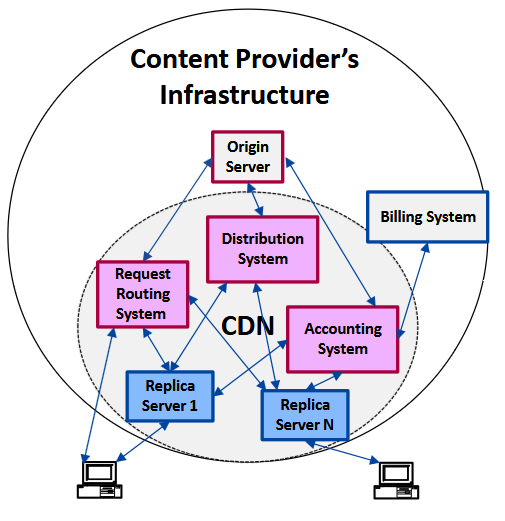
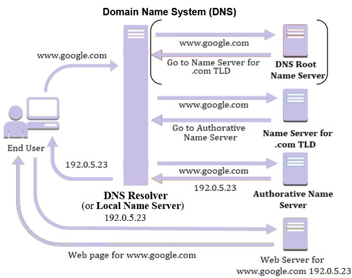
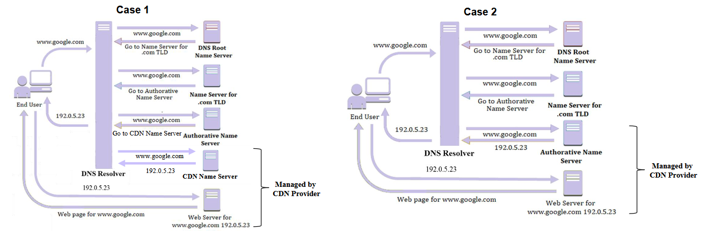

Prima di andare nel dettaglio della tecnologia, facciamo un esperimento.

:::note[Esperimento: due ping a confronto]
Apriamo il terminale Windows e facciamo un `ping` verso un operatore australiano `www.ventraip.com.au`: otteniamo un time di circa **255 ms**, come ci aspettiamo dato che si trova in Australia. Proviamo invece a pingare il sito del governo australiano `www.australia.gov.au` e leggiamo un time medio di **5 ms**.

Ma com'è possibile? Significa che molto probabilmente questo sito è hostato da un **CDN provider**, per fornire il sito vicino agli utenti che lo accedono.
:::

Andiamo a vedere come funzionano le CDN, ma prima capiamo cosa significa **replicare contenuti** e come si può fare.

## New Needs

Ci stiamo focalizzando sul **Web**. Com'era originariamente fatto il web?



Fondamentalmente si avevano certi server di nome **Origin Server**, che hostano contenuti, centralizzati nella rete di **backbone**.

Il problema è che, con l'esplosione del traffico Web, questi server si sono trovati in difficoltà nel gestire un quantitativo di traffico sempre maggiore.

Il problema può essere risolto **ridistribuendo il traffico** in maniera intelligente: sono nate alcune strategie che riducono la latenza e permettono di usare meglio le risorse.

### Use of Proxies

Utilizzo di **Proxy** a livello applicativo, che permettono di hostare contenuto originato dall'**Origin Server** e si trovano tra il client e l'Origin Server stesso.

Se voglio adottare dei proxy nella mia rete, posso adottare 2 strategie:

1. reverse proxies
2. forward proxies

#### Reverse Proxy

Insieme di server di tipo **Front-End** rispetto al server di origine, che hanno il compito di alleviarne il carico, ma si trovano a loro volta nella rete di Backbone. Una situazione tipica è questa:


Ci sono un certo numero di Reverse Proxy e il server di origine: il contenuto è **replicato** nei Reverse Proxy per alleviare il carico al Server di Origine.

:::caution[Limite del Reverse Proxy]
Non risolve il problema del **bottleneck** della rete, che si verifica nella zona di collegamento tra rete Backbone e l'insieme dei Reverse Proxy: ho aggiunto i Reverse Proxy, ma le "linee" che entrano nel nuovo gruppo causano bottleneck come prima.
:::

#### Forward Proxy

Migliora ulteriormente la soluzione: i proxy vengono posizionati **più vicini agli utenti** (nelle reti di accesso, o in alcuni casi anche nella rete locale della compagnia).



I contenuti vengono quindi replicati **localmente** all'interno dei proxy. In questo caso non è necessario effettuare **Load Balancing**.

:::tip[Cache / Replica Server]
D'ora in avanti, ci riferiamo ai Proxy Forward/Reverse tramite il termine generico **CACHE** (oppure **REPLICA SERVER**).
:::

Sono molto benefici in rete perché portano **riduzione del carico** e riducono la **latenza**: posso servire gli utenti da una posizione più vicina a loro, proprio come nell'esempio a inizio capitolo.

## Content Replication (caching)

La capacità di storage delle cache è **limitata**. Devo quindi definire la strategia di caching per fare in modo di **massimizzare i benefici** nell'adozione di una cache.

La strategia adottata è replicare i contenuti **più popolari**, ovvero quelli verso i quali sono dirette la maggior parte delle richieste.

Il motivo? Una piccolissima porzione dei contenuti più popolari causa una grandissima percentuale di accessi rispetto al totale. Vediamo questo esempio:


**m** è il rank del contenuto, ottenuto da una classifica stipulata tramite la formula di Popularity. Se faccio il caching degli $m$ contenuti più popolari, sono sicuro di fare una cosa intelligente.

I contenuti hanno solitamente una correlazione di **località**:

- **località temporale**: un contenuto acceduto adesso verrà probabilmente acceduto nuovamente tra poco;
- **località spaziale**: stesso concetto, ma con aree geografiche.

Questi aspetti vengono tenuti in considerazione per fare il caching.

### Problema della Consistenza

Quando replico un contenuto nella Cache, devo garantire che sia **allineato** con quello contenuto nell'Origin Server. Il problema è che il contenuto nell'Origin Server potrebbe cambiare.

Esistono due tipologie di consistenza che posso garantire:

| Tipo | Descrizione |
| --- | --- |
| **Consistenza forte** | Il sistema garantisce che non fornirò mai agli utenti un contenuto non consistente. Garantirla non è facile. |
| **Consistenza debole** | Posso consegnare una copia non consistente, ma con probabilità bassa. |

Quando parliamo di consistenza, esistono **3 meccanismi** da adottare:

- **invalidation**: le repliche vengono invalidate dopo la scadenza di un **Expected Expiry Time**, definito per il contenuto dall'Origin Server;
- **freshness**: si assicura che una replica possa essere considerata "fresh" (non obsoleta). Necessaria perché un contenuto può cambiare anche prima dell'Expected Expiry Time;
- **validation**: valuta, una volta scaduto l'Expected Expiry Time, se il contenuto può ancora essere considerato buono.

### Caching Cooperativo

È possibile avere dei meccanismi per cui, se dentro la mia cache non ho il contenuto (**Cache Miss**), invece di andarlo a prendere dall'Origin Server lo prendo da un'**altra Cache**.

### HTML & HTTP Directives

Sia HTML che HTTP usano delle **direttive** per gestire opportunamente il caching. Ci focalizziamo maggiormente su quelle HTTP, in quanto sono le più utilizzate.

Comunque, le direttive HTML permettono di inserire codice specifico tramite **META tag** per forzare il ritiro della web page dall'Origin Server.

#### Direttive HTTP

Sono dei campi inseriti nelle richieste HTTP.

##### Direttive HTTP Imperative

Sono quelle direttive HTTP che hanno **priorità** su qualsiasi controllo effettuato dalle cache.

Direttive nelle **richieste e risposte**:

- `Cache-control: no-store`: utilizzato per evitare che venga effettuato caching;
- `Cache-control: no-transform`: evita che il contenuto possa essere trasformato dalla cache.

Direttive **solo nelle richieste**:

- `Cache-control: only-if-cached`: richiedo di ottenere un contenuto solo ed esclusivamente se è stato cachato. Se il contenuto non è immagazzinato nella cache, si ottiene un errore `504 Gateway Timeout`. Utile per gli oggetti che voglio reperire esclusivamente con bassa latenza.

##### Direttive HTTP per la gestione del ciclo di vita dei contenuti



Asse temporale con diversi nomi di campi relativi alle direttive. In rosso ci sono determinate azioni compiute.

| Direttiva | Significato |
| --- | --- |
| **Date** | Timestamp in cui il contenuto è stato inviato dall'Origin Server alla cache. |
| **Last-modified** | Quando è stata effettuata l'ultima modifica al contenuto sull'origin server. Se $Last\text{-}modified < Date$, allora la replica è consistente. |
| **Age** | Tempo speso dall'oggetto dentro la Cache. |
| **Expires** | Corrisponde all'**Expected Expiry Time**, ovvero la previsione di quando il contenuto va rimpiazzato nella cache. |

##### Direttive HTTP per il timing



Anche qui un asse temporale: i pallini neri indicano il riferimento temporale attuale, le direzioni delle frecce se mi muovo verso il passato o il futuro.

- **Max-age**: indica che il client può accettare un contenuto non più vecchio del valore specificato. Se un contenuto si trova a sinistra di max-age va bene, altrimenti no. È più stringente dell'expires.
- **Min-fresh**: tempo che deve passare per considerare il contenuto fresh. Il contenuto è fresh se è a sinistra del min-fresh; non va bene se sono troppo vicino all'expires.
- **Max-stale**: il client è disposto ad accettare un contenuto che ha superato il valore Expires; max-stale indica di quanto può aver superato questo expiry time.

#### Validation by the Client

Il valore specificato da **Expires** è una predizione fatta dall'Origin Server e *potrebbe* risultare errata. Per garantire una forte consistenza, devo adottare un meccanismo di **validazione** per assicurarmi di poter fornire al client un contenuto **non obsoleto**.

Il Client vuole ottenere un contenuto valido: questo meccanismo deve quindi garantire se l'expected expiry time è scaduto oppure no.

Il workflow:

1. La cache invia una richiesta **GET** con uno dei seguenti field:
   - `if-none-match`: viene specificato l'**ETag** della replica cachata. Confrontando l'ETag del contenuto cachato con quello dell'Origin Server, capisco se il contenuto è differente (in caso non coincidano).
   - `if-modified-since`: fa più o meno la stessa cosa, ma si specifica la **data** della replica cachata. Si confronta con la data di ultima modifica del contenuto sul server.
2. Il server risponde con uno dei seguenti:
   - se l'oggetto **è** modificato → new object → `HTTP/1.0 200 OK`;
   - se l'oggetto **NON** è modificato → `HTTP/1.0 304 Not Modified`.

:::note[ETag]
Prendo il contenuto e ne faccio l'**hash**. Il digest ottenuto identifica univocamente il contenuto.
:::

#### Eterogeneità del Contenuto

Tipi di contenuti:

| Tipo | Descrizione |
| --- | --- |
| **statico** | stabile nel tempo |
| **volatile** | cambiato frequentemente, periodicamente o a causa di eventi |
| **dynamic** | creato dinamicamente sulla base delle richieste del client |

Quale tipologia si presta meglio al caching? Quella **statica**, perché le altre due, se le cacho, danno problemi dato che cambiano facilmente.

:::caution[Brutta notizia]
La stragrande maggioranza (**> 50%**) dei contenuti in rete **non** può essere cachata, perché è volatile, dinamica, oppure richiede encryption.
:::

Le **buone notizie** sono:

1. i contenuti volatili e dinamici hanno solitamente dimensione **ridotta**, quindi l'impatto sulla rete di Backbone non è così marcato;
2. i contenuti statici hanno invece solitamente dimensione **molto maggiore**.

Risulta evidente che cachare questi contenuti statici porta un effettivo **risparmio di banda** in rete.

## CDN

Una **CDN** garantisce una distribuzione intelligente dei contenuti. Distribuisce contenuti creati dal **Content Provider**, che a sua volta possiede l'Origin Server.

Un terzo attore è l'**ISP**: i CDN Provider possono disseminare le cache in vari punti della rete (reti locali di determinate organizzazioni o reti di accesso degli ISP). In quest'ultimo caso, che ci interessa di più, il tipico **modello di business** è:

- i CDN Provider stipulano accordi con gli ISP per posizionare le cache all'interno delle loro reti (CDN Provider → 💰 → Network Operator ISP);
- il CDN Provider offre il servizio CDN ai vari Content Provider che hanno del contenuto popolare da sparpagliare (Content Provider → 💰 → CDN Provider).

:::tip[Obiettivo della CDN]
Migliorare le performance riducendo la **latenza** (benefico ai Content Provider) e la **bandwidth** consumata nella rete (benefico agli ISP).
:::

### CDN Architecture



Due cerchi, uno interno e uno esterno. Quello interno rappresenta l'architettura della CDN, quello esterno ciò che concerne il mondo del Content Provider (che ha il proprio server di origine e il proprio sistema di billing).

Le **3 componenti principali** (in rosa) sono:

| Componente | Compito |
| --- | --- |
| **Content Distribution System** | Effettua una replica dei contenuti dall'Origin Server verso i Replica Server (cache). |
| **Request Routing System** | Una volta posizionati i contenuti nelle cache, instrada le richieste, facendo in modo che vengano servite da un determinato Replica Server o dall'Origin Server. |
| **Accounting System** | Componente di gestione che immagazzina varie informazioni (es. log di accesso degli utenti). Fondamentale per far fare ai Content Provider la fatturazione verso i loro utenti. |

#### Request Routing System

Un ruolo fondamentale è ricoperto dal **DNS**. Sfruttandone i principi, abbiamo 2 meccanismi alternativi per fare Request Routing:

1. DNS redirection
2. URL rewriting

Per capire questi 2 meccanismi, è importante che sia chiaro come funziona il DNS.

##### Ripasso del DNS



Ogni qualvolta vogliamo fare la risoluzione di un hostname in un indirizzo IP, il browser coinvolge il **DNS Resolver**, a cui viene inviata una richiesta di risoluzione hostname (es. `www.google.com`). Il compito del DNS Resolver è interrogare i server che effettuano la traslazione.

Questi server sono posti in gerarchia e prendono il nome di **Domain Name Server**:

- **DNS Root Name Server**
- **Top Level Domain Name Server**
- **Authoritative Name Server**

1. Invio la richiesta per `www.google.com` al **Root Name Server**; questo restituisce l'IP del Name Server che si occupa della risoluzione del Top Level Domain `.com`. Le parentesi in alto indicano che questo primo passaggio può essere **bypassato** dal DNS Resolver, soprattutto per i TLD più tipici (il Root Name Server tiene queste info in memoria).
2. Si interroga il **TLD Name Server**, che si rende conto che bisogna interrogare l'Authoritative Name Server che si occupa della risoluzione di tutti gli indirizzi del dominio google; risponde col suo IP.
3. Infine, l'**Authoritative Name Server** restituisce l'IP della pagina web.

##### DNS Redirection

Meccanismo usato dalle CDN.

Per fare la DNS Redirection, dobbiamo mettere in piedi un meccanismo per cui a un certo punto un DNS server restituisce l'IP della **Replica Server** da cui replicare il contenuto, anziché l'IP dell'Origin Server.

Si possono fare 2 cose:

1. **delego** la risoluzione dell'hostname a un nameserver controllato direttamente dal CDN Provider;
2. faccio in modo che il **DNS Server Autoritativo del Content Provider** risolva direttamente l'hostname in un IP che punta a una cache del CDN Provider. Questo secondo caso richiede, a differenza del primo, che il CDN Provider abbia accesso al DNS Server Autoritativo del Content Provider.



- **Caso 1**: il DNS Server Autoritativo, invece di rispondere con l'IP del webserver, risponde con l'IP di un ulteriore DNS Server (quello del CDN). Una nuova interrogazione va fatta verso questo nodo, e il Name Server restituisce l'IP di una cache da cui reperire il contenuto. Abbiamo solo aggiunto **1 livello** nel procedimento del DNS.
- **Caso 2**: il procedimento è più semplice (l'immagine è identica a quella del DNS normale). La differenza è che il DNS Server Autoritativo deve essere configurato per restituire IP differenti, relativi alle cache gestite dal CDN Provider.

:::note[Quale si usa di più?]
Il **caso 1** è di gran lunga il più adottato, perché i Content Provider non sono contenti di dare accesso al proprio DNS Server Autoritativo a un third party (il CDN Provider).
:::

##### URL Rewriting

Piuttosto semplice concettualmente. In una pagina HTML ci sono diversi oggetti **Embedded** che riguardano risorse differenti, ognuno associato a risorse differenti.

Si prendono gli **oggetti statici** e si riscrive l'URL per questi oggetti, in modo che il DNS, quando vengono effettuate delle richieste, vada direttamente a risolvere l'hostname nell'indirizzo IP corretto.

Esempio:

```text
https://my.origin-domain.com/path/to/img.jpg → https://my.cdn-domain.com/path/to/img.jpg
```
