## Introduzione Storica

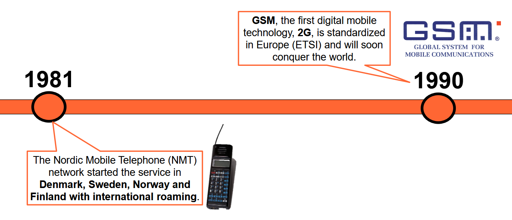
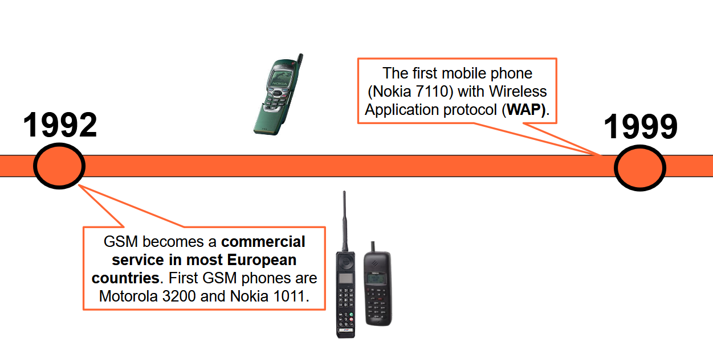
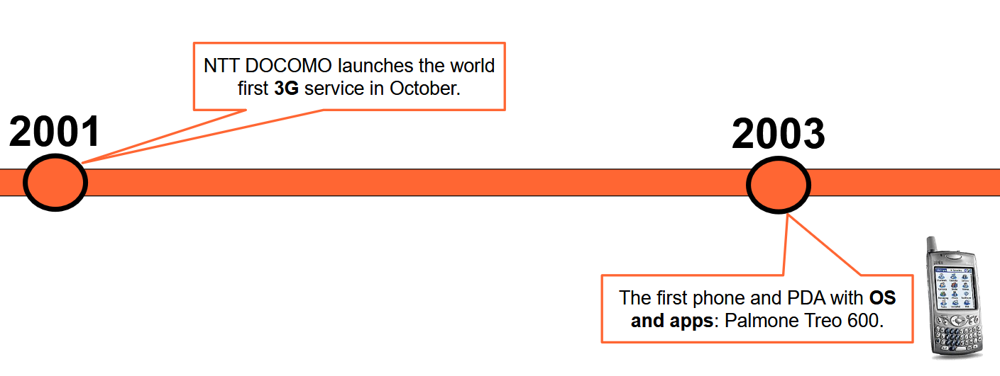
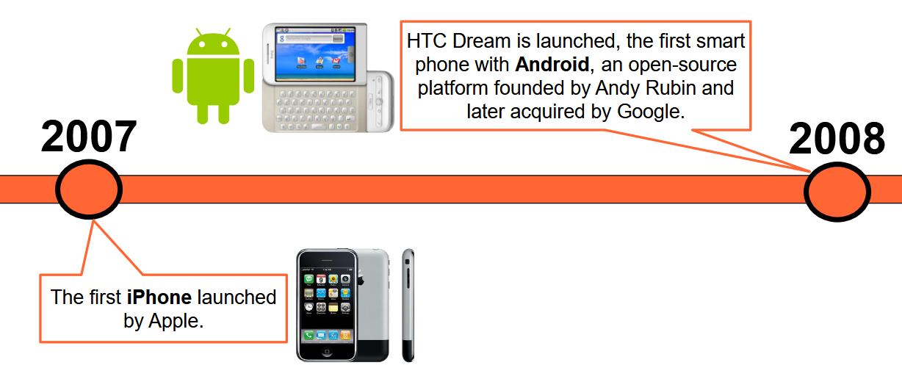
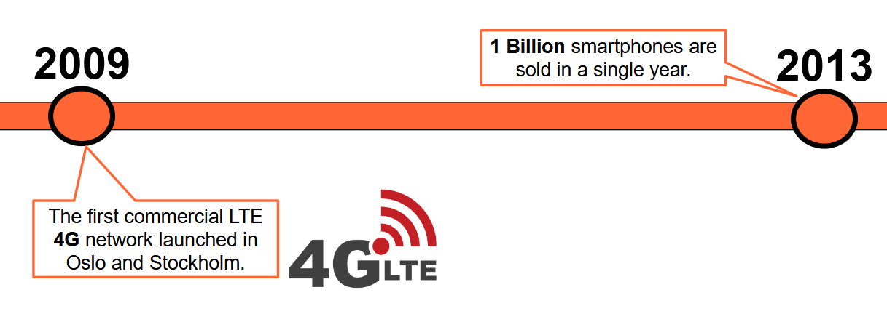

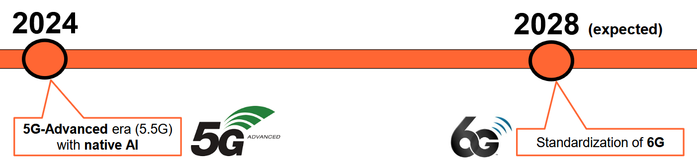

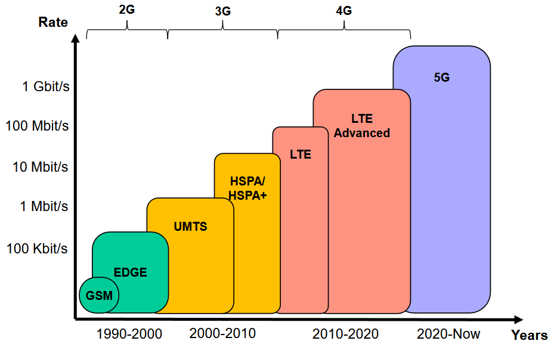

## The Mobile Radio Network Infrastructure

Una **rete radiomobile** è una tipologia di rete di accesso che permette di interconnettere i terminali degli utenti, che in questo contesto prendono il nome di **User Equipment (UE)**, a dei servizi di **Fonia** o **Dati**.

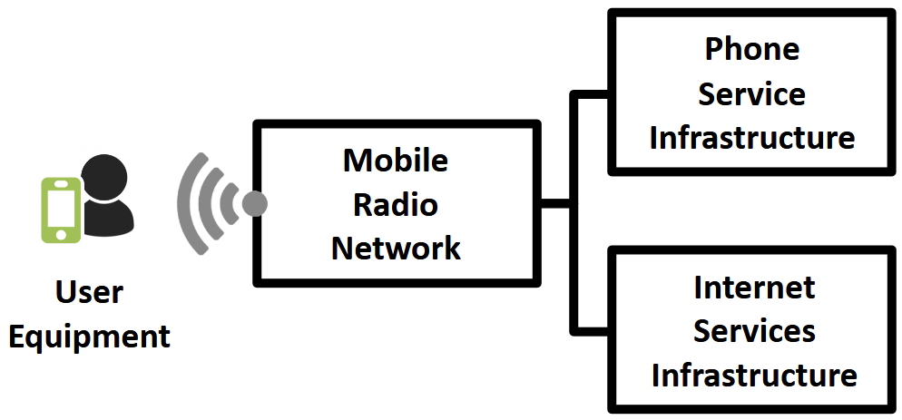

Si parla di un'architettura ben definita, il cui aspetto fondamentale è che **garantisce una comunicazione seamless durante la mobilità dell'utente**.

### Radio Access Network & Core Network

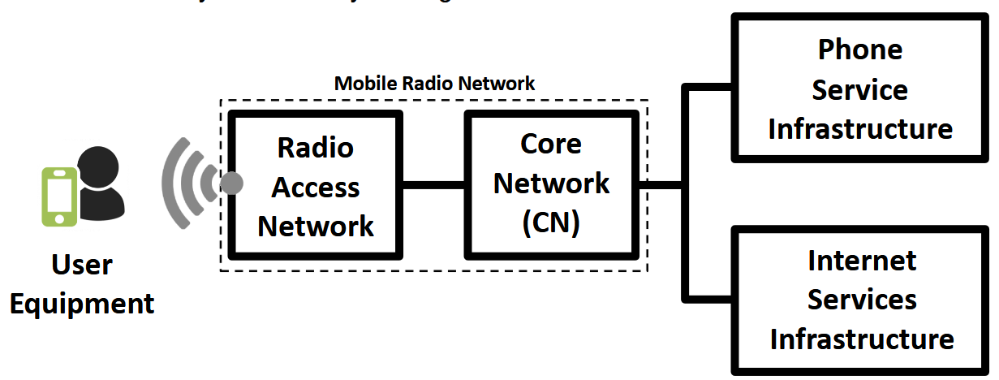

La rete radiomobile si compone di **due parti**:

| Parte | Compito |
| --- | --- |
| **Radio Access Network (RAN)** | Gestisce la connettività radio della rete con i terminali degli utenti. |
| **Core Network (CN)** | Interconnette la RAN a infrastrutture esterne che offrono servizi Phone o Internet. Implementa tutte le funzionalità relative alla connettività e alla gestione della mobilità. È una rete di **accesso**, non di backbone. |

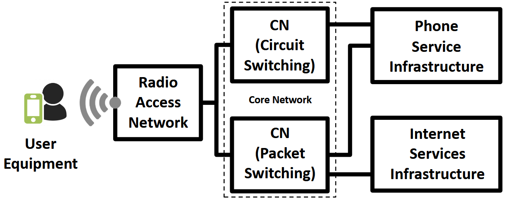

Esistono due tipi di Core Network, che si distinguono per i servizi offerti:

| Tipo | Servizi | Generazioni |
| --- | --- | --- |
| **Commutazione di circuito** | Esclusivamente fonia (chiamate). | 2G, 3G |
| **Commutazione di pacchetto** | Servizi dati (accesso a Internet). | 2G, 3G, 4G, 5G. Dalla **4G** in poi tutto si sposta su commutazione di pacchetto (protocollo IP). |

#### Radio Access Network

La RAN ha come elemento fondamentale quelle che prendono il nome di **Base Stations (BS)**.

Queste antenne interconnettono alla rete gli utenti per mezzo di un'**interfaccia radio**: serve un'antenna sia lato User Equipment che lato BS. L'utente può inviare e ricevere dati per mezzo dell'interfaccia radio.

Le Base Station si interconnettono alla Core Network per mezzo di un insieme di collegamenti chiamato **rete di Backhaul**. Il concetto è lo stesso del Fixed Wireless Access: dietro alle BS c'è un'infrastruttura che le interconnette con la Core Network (fibra ottica, ponte radio, ecc.).

##### Copertura Cellulare

Quando utilizziamo il *telefono* adottiamo una tecnologia basata su **Celle**: si ha una **rete cellulare**.

L'area in cui utilizzo il servizio è suddivisa in celle, dove ciascuna cella è coperta da una specifica Base Station.

:::note[Perché l'esagono?]
Le celle sono solitamente approssimate a una forma **esagonale** per facilità di calcolo: l'esagono è il poligono regolare più simile a un cerchio che **tassella il piano** (lo copre completamente).
:::

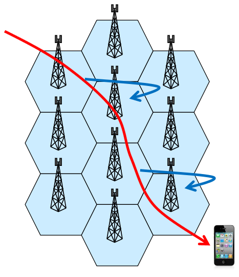

Per la gestione della mobility dell'utente esistono **4 procedure**: Cell Selection, Location Update, Paging, Handover. La scelta dipende dallo stato dello UE:

| Stato | Significato |
| --- | --- |
| **idle** | Terminale non coinvolto in una comunicazione. |
| **active** | Terminale con conversazione / sessione dati attiva. |

###### Cell Selection

Adottata in situazione **IDLE**. Lo UE si collega autonomamente alla BS per la quale presume di avere il miglior segnale.

Ogni BS invia un segnale in broadcast (**beacon**); il terminale li riceve e sceglie autonomamente di collegarsi alla BS con il segnale migliore (solitamente la più vicina).

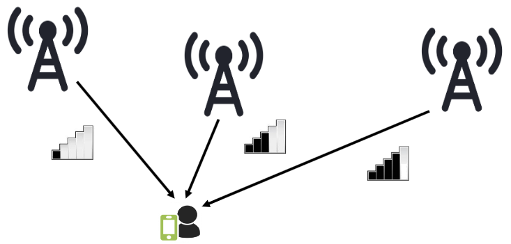

Quando il terminale è IDLE, la sua posizione viene tracciata a granularità di **Location Area (LA)**.

:::note[Location Area]
Insieme di celle contigue, solitamente con pattern più o meno fissati che si ripetono.
:::

In un database specifico si mantiene l'associazione tra il terminale e la LA in cui si trova. Finché mi muovo dentro questa LA l'associazione non cambia; se passo in un'altra LA, viene aggiornata.

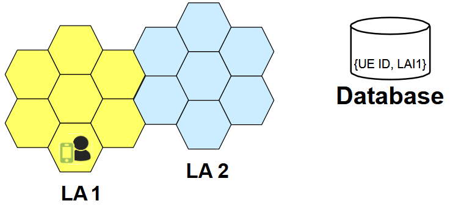

In ogni istante di IDLE, è possibile tracciare la posizione dello UE a livello di **LA**, ma **non** a livello di singola cella.

Si pone un problema: conosco l'area dell'utente, ma quando arriva una chiamata come lo localizzo esattamente nella LA? Si fa tramite la procedura di **Paging**.

###### Paging

Procedura adottata quando c'è una chiamata/sessione **entrante** verso un determinato UE (passaggio da IDLE ad ACTIVE).

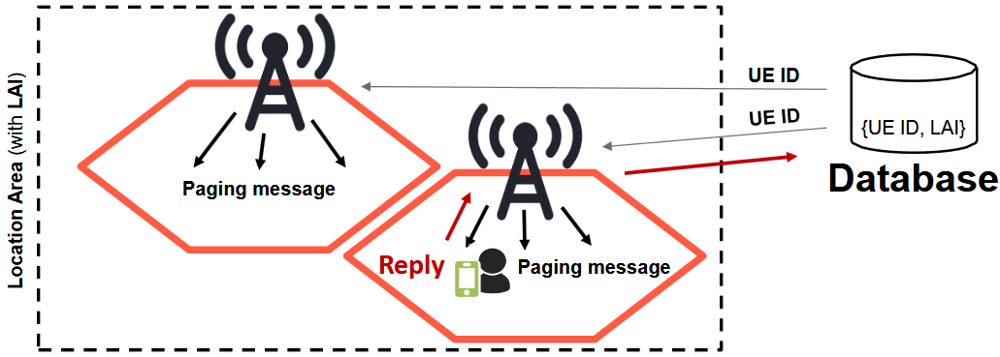

Ogni singola BS all'interno della LA invia un messaggio di **Paging** contenente l'identificativo del terminale. **Tutti** gli utenti nella LA ricevono il messaggio, ma solo uno lo identifica come diretto a sé e risponde. A questo punto è possibile identificare la specifica cella in cui si trova l'utente e si passa allo stato **ACTIVE**: la conversazione è iniziata.

###### Handover

Procedura adottata in situazione **ACTIVE**. In questo caso il tracciamento dell'utente non avviene più a granularità di LA, ma di **singola cella**.

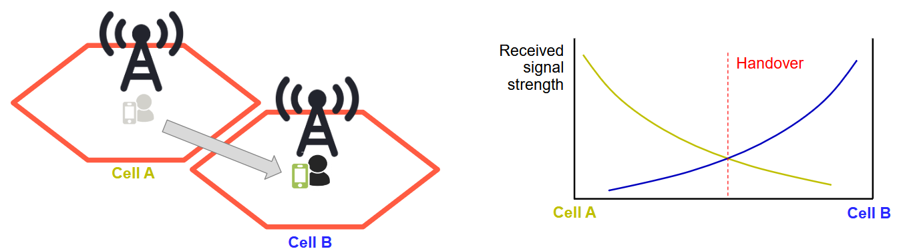

È la **rete** che decide quando l'utente deve fare l'handover, ma è anche **user assisted**: l'utente invia dati per aiutare la rete a decidere.

:::tip[Make-before-break]
Questo approccio **alloca le risorse prima** di effettuare l'handover effettivo, perché al cambio di cella le risorse devono essere già allocate.
:::

Quando si fa handover? Nel grafico (a destra) si vede la potenza dei segnali delle due BS e il momento ideale per l'handover. Nella realtà però la potenza del segnale è **frastagliata**: quindi l'handover viene effettuato quando lo UE sperimenta, per un determinato periodo di tempo, che la qualità della BS B è migliore di quella della BS A.

## Radio Planning

Con **Radio Planning** si intende il processo che decide **dove** posizionare le BS e **come** configurarle quando si vuole mettere in piedi una rete radiomobile. È un'operazione complessa, divisa in 2 fasi:

1. **Coverage Planning**: posizionamento delle BS e scelta della loro configurazione. Fase fondamentale.
2. **Frequency Planning** (o capacity planning): assegnazione delle risorse (frequenze) alle reti radiomobili dispiegate. Era fondamentale per il **GSM (2G)**, ma con le generazioni seguenti non è più necessaria.

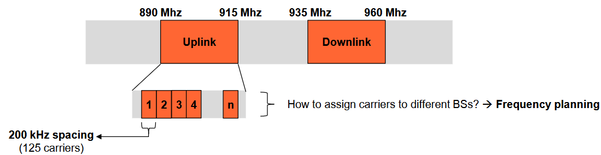

### Coverage Planning

Ci sono 4 aspetti principali da tenere in considerazione:

1. Signal Propagation Prediction
2. Traffic Estimation
3. Base Station Positioning
4. Antenna Configuration

#### Signal Propagation Prediction

Si utilizzano software specifici che permettono di **predire** quale sarà la copertura dell'area, aiutando a stimare l'area coperta dalla Base Station.

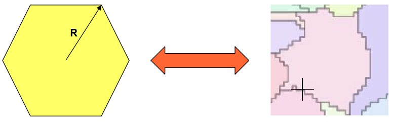

#### Traffic Estimation & Base Station Positioning

Stimare il traffico è complicato, perché dipende da tanti fattori: popolazione nell'area, livello urbano, adozione effettiva della tecnologia (**market penetration**).

Bisogna tenere conto anche di dove le BS possono effettivamente essere posizionate: si definiscono un insieme di **punti candidati**. La posizione delle antenne è definita in base a:

- **aspetti tecnici**: stima del traffico, morfologia del terreno, ecc.;
- **aspetti non-tecnici**: inquinamento elettromagnetico, accordi con i proprietari dell'edificio, autorità locali, ecc.

#### Antenna Configuration

Dopo il posizionamento, le antenne vanno configurate per il funzionamento:

- Radiation diagram
- Tilt
- Maximum Emission Power
- Height
- Base Station Capacity
- ...

Diverse configurazioni possono portare a diverse coperture.

### Coverage Planning - Operativamente

Tutti i punti visti prima aiutano a decidere dove installare le BS e come configurare le antenne.

Operativamente, si definisce un insieme di **Test Points (TP)**, usati per valutare quanto è buona la strategia di copertura scelta. Solitamente si formula un **modello di ottimizzazione matematica**, che tiene conto dei vincoli specificati, con una funzione obiettivo (di solito **minimizzare il costo di deployment**).

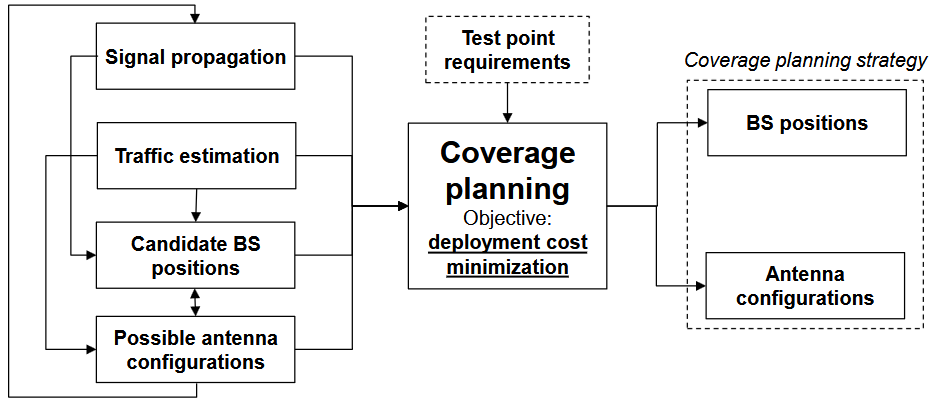

:::caution[Manca un pezzo: l'interferenza]
Finora si assume che ogni cella abbia tutte le risorse radio dedicate. Va bene per le generazioni recenti, ma **non** per il 2G: assegnando le stesse risorse radio ad antenne vicine si verificano interferenze. Per le vecchie tecnologie 2G è quindi necessaria anche la fase di **Frequency Planning**.
:::

#### Frequency Planning

Non è possibile allocare tutte le risorse radio (i **carrier**) a tutte le antenne, perché causerebbe interferenze molto forti e degraderebbe la qualità delle comunicazioni.

Nella pratica si assegnano le frequenze in maniera intelligente, minimizzando le interferenze tra celle vicine ma garantendo un certo grado di **Frequency Reuse**: le frequenze devono essere diverse tra BS in celle vicine, ma possono essere riutilizzate per BS lontane.

Purtroppo, a causa della propagazione del segnale radio non uniforme, la forma reale di una cella è solitamente molto diversa da un esagono:

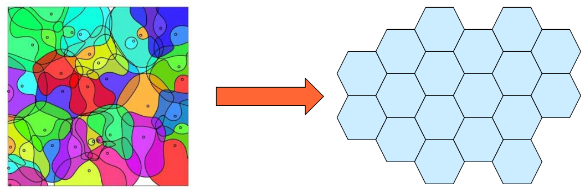

Le celle esagonali sono un'approssimazione per semplificare l'assegnazione delle frequenze.

##### Frequency Reuse

Due scenari diversi:

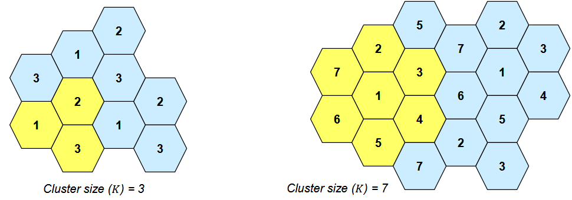

:::tip[Cluster]
Insieme di celle adiacenti che usano ognuna un gruppo di frequenze (carrier) differenti. L'assegnamento delle risorse è **disgiunto** tra le celle dello stesso Cluster.
:::

Nel Cluster a sinistra di dimensione $K = 3$ si leggono i numeri 1, 2, 3: a ciascuna cella è assegnato un gruppo di frequenze differenti (il numero è il nome del gruppo). Lo stesso vale per il Cluster $K = 7$ a destra.

:::caution[Tradeoff sulla dimensione del Cluster]
- **Cluster piccolo** (poche celle): più capacità per cella, ma due celle con lo stesso gruppo di frequenze sono **vicine** (più interferenza).
- **Cluster grande**: meno capacità per cella (i 125 carrier vanno divisi per 7 anziché per 3), ma le celle con stessa frequenza sono **lontane** (meno interferenza).
:::

$K$ non ha valore libero: esistono solo alcuni valori ammissibili, come **1, 3, 4, 7, 9, ...**

La **Reuse Efficiency** è:

$$
ReuseEfficiency = \frac{1}{K}
$$

Quindi è tanto più bassa quanto più grande è il Cluster.

##### Antenne Settoriali

L'utilizzo di **Antenne Settoriali** rende possibile cambiare il layout delle celle, riducendo le interferenze e aumentando il Reuse.

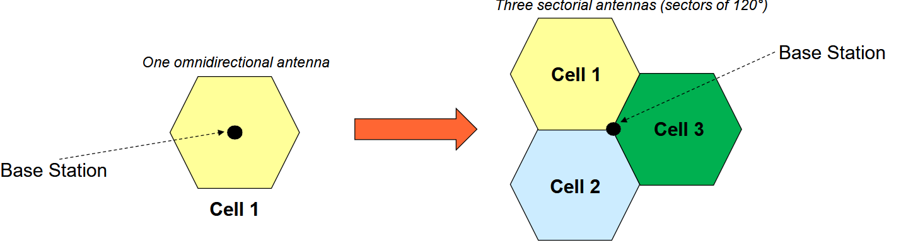

##### Frequency Assignment Constraints

Utilizzando Antenne Settoriali si potrebbe pensare di riutilizzare le frequenze anche tra antenne contigue. Purtroppo non è così: la necessità di assegnare frequenze diverse a celle adiacenti permane. Come visto trattando le Antenne Settoriali, concentrando l'energia verso una direzione si generano **lobi laterali** che causano interferenze con le antenne adiacenti.

Oltretutto, c'è un altro problema: i carrier sono leggermente **sovrapposti** tra loro, cosa che causa interferenza.

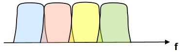

Si cerca quindi di **non** assegnare carrier adiacenti a BS adiacenti.

#### Layout di Cellule Diversi nell'Area

Le celle devono avere sempre quella specifica dimensione? No. Il layout cellulare può essere **adattato** sulla base della densità di traffico stimata.

Dove c'è traffico più elevato, si usano celle più piccole, che permettono di aumentare la quantità di utenti serviti per unità di area.

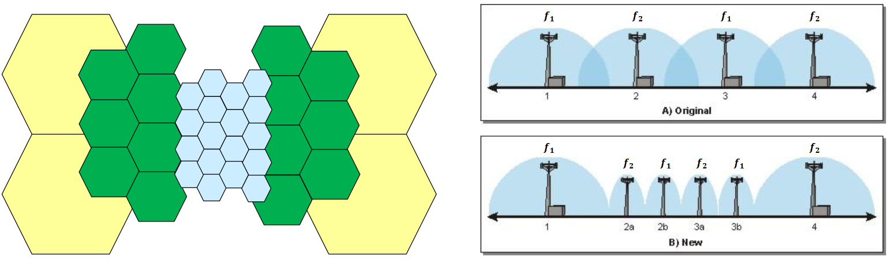

L'immagine sulla destra rappresenta l'operazione di **Cell Splitting**: se le celle sono già state deployate, si possono dividere in celle più piccole per aumentare la capacità di traffico (fase di Coverage Planning).

:::caution[Problema in contesto urbano: troppi Handover]
Con tantissime celle piccole e utenti in mobilità, la quantità di **Handover** aumenta notevolmente. Per mitigare, si adotta una **Umbrella Cell**: una cella di dimensione più grande che comprende il territorio (nel caso 2G le viene assegnata una frequenza che non va in conflitto con le celle piccole). Quando un utente inizia a sperimentare troppi handover, viene spostato sulla cella ombrello, che lo serve mentre si muove. Gli utenti fermi continuano a essere serviti dalle celle piccole.
:::

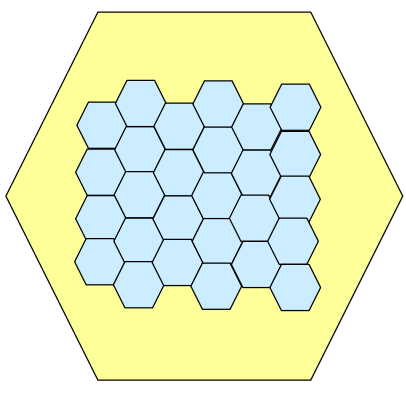
