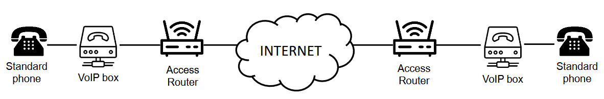

## Introduzione Storica

## The Mobile Radio Network Infrastructure

Una rete radiomobile è una tipoligia di rete di accesso che permette di interconnettere i terminali degli utenti, che in contesto di rete radiomobile prendono il nome di User Equipment, a dei servizi di Fonia o Dati.

Si parla di un'architettura ben definita, il cui aspetto fondamentale è che **garantisce una comunicazione seamless durante la mobilità dell'utente**.

Cerchiamo di capire in termini generali com'è fatta questa rete radiomobile.

### Radio Access Network & Core Network

La rete radiomobile, si compone di due parti:
- Radio Access Network (RAN):

    ha il compito di gestire la connettività radio della rete con i terminali degli utenti

- Core Network (CN):

    una delle due parti della rete radiomobile in quanto rete di accesso, non rete di backbone.

    Ha il compito di interconnettere la rete RAN a delle infrastrutture esterne che offrono servizi di tipo Phone o Internet.

    Implementa tutte le funzionalità relativa alla connettività e la gestione della mobilità.

Esistono due tipi di Core Network, che si distinguono per la tipologia di servizi che possono essere offerti:
- Commutazione di circuito:

    fornisce esclusivamente accesso ai servizi di fonia. Si ha per la generazione 2G e 3G, per quanto riguarda l'effettuare chiamate su rete a commutazioni di circuito.
- Commutazione di pacchetto:

    forniscono accesso a servizi dati, quindi alla possibilità di accedere a Internet. (2G, 3G, 4G e 5G). Dalla 4G in poi si spostano su commutazione di pacchetto, nello specifico sul protocollo IP

#### Radio Access Network
La RAN ha come elemento fondamentale quelle che prendono il nome di Base Stations (BS).

Queste antenne hanno il compito di interconnettere alla rete gli utenti per mezzo di un'interfaccia radio; quindi serve un; antenna sia lato User Equipment che lato BS. L'utente può inviare e ricevere dati per mezzo dell'interfaccia radio.

Le Base Station si interconnettono alla Core Network per mezzo di un insieme di collegamenti che prende il nome di **rete di Backhaul**. Il concetto è lo stesso di Fixed Wireless Access; dietro alle BS c'è un'infrastruttura di rete che interconnette le antenne con la Core Network. Posso usare tecnologie di tipo diverso, come fibra ottica, con un ponte radio, eccetera...

##### Copertura Cellulare
Quando utiliziamo il *telefono* implica che andiamo ad adottare una tecnologie di quelle che prendono il nome di **Celle**; si ha una rete cellulare.

L'area in cui utilizzo il servizio è suddivisa in celle, dove ciascuna cella è coperta da una specifica Base Station.

Le celle sono solitamente approssimate a una forma esagonale, per facilità nel fare i conti: l'esagono è il poligono regolare che ha una forma più possibile simile a un cerchio che tassella il piano, ovvero che posso coprire completamente il piano.

Per la gestione della mobility dell'utente, esistono 4 procedure:
- Cell Selection
- Location Update
- Paging
- Handover

La scelta della procedura da adottare dipende dallo stato dello UE (User Equipment):
- idle -> terminale non è coinvolto in una comunicazione
- active -> terminale con conversazione/sessione dati attiva

###### Cell Selection
Adottata in situazione IDLE. Lo UE si collega autonomamente alla BS per la quali presume di avere il miglior segnale.

Ogni BS invia un segnale in broadcast (beacon), il terminale li riceve e in maniera autonoma sceglie di collegarsi alla BS che ha il segnale migliore.

Ovviamente, solitamente, la più vicina è quella con segnale migliore.

Quando il terminale si trova in una situazione IDLE, la posizione del terminale viene tracciata ad una granularità di Location Area (LA).

:::note[Location Area]
Insieme di celle contigue, solitamente con pattern più o meno fissati che si ripetono.
:::

Quindi, in un database specifico, si deve mantenere nella rete l'associazione tra il terminale e la LA in cui si trova. Fintanto mi muovo dentro questa specifica LA l'associazione non viene modificata, ma se passo in un'altra LA l'associazione viene aggiornata.

Di fatto, in ogni istante in fase di IDLE di un UE, è possibile tracciare la possibile tracciare la sua posizione a livello di LA, ma non a livello di singola cella.

Si pone però un problema: conosco l'area in cui si trova l'utente, ma nel momento in cui arriva una chiamata in entrata/uscita come posso localizzarlo esattamente nella LA? Abbiamo detto che in ogni esagono è presente una BS, quindi devo capire l'utente a quale è collegato.

Questo si fa per mezzo della procedura di Pagin.

###### Paging
Procedura che inizia quando un UE si trova in stato IDLE, ma poi si sposta in ACTIVE, adottata quando c'è una chiamata/sessione entrante verso il determinato UE.

Ogni singola BS all'interno della LA deve inviare un messaggio di Paging che contiene l'identificativo del terminale (utente). TUTTI gli utenti all'interno della LA ricevono il messaggio di paging, ma solo uno identifica come messaggio di Paging a sé diretto, per poi rispondere. A questo punto è possibile identificare la specifica cella in cui si trova l'utente e si passa allo stato di ACTIVE mobility; è iniziata la conversazione.

###### Handover
Procedura adottata in situazione ACTIVE mobility. In questo caso il tracciamento utente non viene fatto più a livello di granularità di LA, ma di singola cella.

È la rete che decide quando l'utente deve fare l'handover, ma è anche user assisted: l'utente invia dati della per aiutare la rete a prendere decisioni. 
Questo approccio segue la logica **make-before-break**: alloca le risorse in rete prima di effettuare l'handover effettivo, perché quando si fa il cambio di cella le risorse necessitano di essere già effettuate.

Quando si fa handover? Vediamo l'esempio nel grafico a destra, che mostra la potenza dei segnali delle due BS e il momento perfetto per effettuare l'handover. Il problema è che nella realtà dei fatti la potenza del segnale è frastagliato; quindi, l'handover viene effettuate quando lo UE sperimenta per un determinato periodo di tempo che la qualità della BS B è migliore della qualità della BS A.

## Radio Planning

Con il termine Radio Planning si intende quel processo che ha il compito di andare a decidere DOVE posizionare le BS e come configurarle quando si vuole mettere in piedi una rete radiomobile.

È un'operazione piuttosto complessa che si divide in 2 fasi:
1. **Coverage Planning**:

    Riguarda il posizionamento e la scelta della loro configurazione. Questa fase è ovviamente fondamentale.
2. **Frequency Planning** (o capacity planning):

    Ha il compito di assegnare le risorse alle varie reti radiomobili, una volta dispiegate. Quando si parla di risorse, in questo caso, si parla di frequenza. Questa fase era fondamentale per la generazione GSM (2G), ma con le generazioni seguenti non è più risultata necessaria.

    

### Coverage Planning
ci sono 4 aspetti principali da tenere in considerazione mentre si fa Coverage Planning:
1. Signal Propagation Prediction
2. Traffic Estimation
3. Base Station Positioning
4. Antenna Configuration

#### Signal Propagation Prediction
Quello da fare, nel momento di Coverage Planning, è utilizzare dei software specifici che permettono di predirre quale sarà la copertura della area.

Questo aiuta a stimare l'area coperta dalla Base Station.

#### Traffic Estimation & Base Station Positioning

Stimare il traffico che ci sarà è abbastanza complicato perché dipende da tanti fattori, come la popolazione nell'area, livello urbano nell'area, l'adozione effettiva della tecnologia da parte delle persone (market penetration).

Bisogna tenere in considerazione anche dove le BS possono effettivamente essere posizionate; si definiscono un insieme di punti candati dove si possono posizionare le antenne. La posizione delle antenne sono definite in base a vari aspetti:
- Tecnici: stima del traffico, morfologia del terreno, ecc...
- non-tecnici: inquinamento elettromagnetico, concordi con i proprietari dell'edificio, autorità locali, ecc...

#### Antenna Configuration
Dopo il posizionamento, vanno configurate per il funzionamento:
- Radiation diagram
- Tilt
- Maximum Emission Power
- Height
- Base Station Capacity
- eccetera...

Ovviamente, diverse configurazioni possono portare a diverse coperture.

### Coverage Planning - Operativamente
Tutti i punti visti primi aiutano a prendere decisioni sul dove installare le BS e come configurare le antenne.

Operativamente, si definisce un insieme di punti di test, che prendono il nome di Test Points (TP), utilizzati per valutare quanto è buona la strategia di copertura scelta.

Solitamente si va a formulare un modello di ottimizzazione matematica, che tiene conto dei vincoli specificati prima e lo si cerca di risolvere con una determinata funzione obiettivo, che solitamente è minimizzare il costo di deployment.

Bene quello che abbiamo detto, ma non abbiamo considerato che dopo aver posizionato l'antenna può esserci interferenza. Si sta assumendo che ogni cella ha tutte le risorse radio dedicate; assunzione ok per le generazioni di reti radiomobili recenti, ma non va bene per il 2G perché si verificano interferenze nel momento in cui si assegnano le stesse risorse radio ad antenne vicine. Ciò significa che, nel caso di vecchie tecnologie 2G, è necessario attuare anche la fare del **Frequency Planning**.

#### Frequency Planning
Non è possibile allocare tutte le risorse radio (carrier nell'immagine di prima) a tutte le antenne, perché causerebbe delle interferenze molto forti e la qualità delle comunicazioni verrebbe degradata moltissimo.

Nella pratica, si assegnano frequenze in maniera intelligente cercando di minimizzare interferenze tra celle vicine, ma andando a garantire un determinato grado di Frequency Reuso: posso assegnare le frequenze a diverse BS, che devono essere diverse tra BS in celle vicine, ma posso riutilizzare per BS lontane.

Ovviamente, e purtroppo, a causa di propagazione del segnale radio non uniforme, la realtà dei fatti è che la forma di una cella è solitamente molto diversa da un esagono:
 

Celle di forma esagonale sono considerate come approccio approssimato per assegnazione di frequenza alle diverse BS, per semplificare la vita.

##### Frequency Reuse
Due scenari diversi:

:::tip[Cluster]
Insieme di celle adiacenti che usano ognuna un gruppo di frequenza (carrier) differenti.

Si ha un assegnamento delle risorse disgiunto tra le celle che appartengono allo stesso Cluster.
:::

Guardando il Cluster a sinistra che ha dimensione $K = 3$, è possibile leggere i numeri 1, 2 e 3. Questi numeri indicano che a ognuna di queste celle è stato assegnato un gruppo di frequenze differenti, dove il numero corrisponde al nome del gruppo di frequenze.

Lo stesso vale per il Cluster con dimensione $K = 7$ rappresentato a destra.

C'è però un tradeoff importante: definendo una dimensione dei Cluster ridotta, quindi un numero di celle per Cluster basso, si ha il vantaggio di avere più capacità assegnata alla mia cella, ma lo svantaggio è che due cella a cui è stata assegnata lo stesso gruppo di frequenza sono abbastanza vicine tra loro; guardando l'immagine a sinistra, la cella 1 gialla è vicina alla cella 1 blu, stessa cosa per le altre. Nel caso del cluster più grande, invece, si ha capacità minore per cella perché i 125 carrier vanno divisi per 7 e non per 3, ma si ha minore interferenza in quanto le celle con stessa frequenza sono più lontane. 

$K$ non ha valore libero, ma esistono solo alcuni valori ammissibili, come 1, 3, 4, 7, 9, ...

Inoltre, $ReuseEfficiency = \frac{1}{K}$.
Quindi la ReuseEfficiency è tanto più bassa quanto più è grande il Cluster.

##### Antenne Settoriali
L'utilizzo di Antenne Settoriali rende possibile cambiare il layout delle celle, riducendo interferenze e aumentando il Reuse.

##### Frequency Assignment Constraints
Utilizzando Antenne Settoriali, è possibile riutilizzare le frequenze anche tra antenne continuge. Purtroppo non è così: la necessità di assegnare frequenze diverse a celle adiacenti permane. Quando abbiamo trattato le Antenne Settoriali, abbiamo detto che uno degli effetti collaterali ottenuto quando si concentra l'energia verso una direzione, si generano dei lobi laterali che causano interferenze con le antenne adiacenti.

Oltrettutto, c'è un altro problema: quando si ha dei carrier, questi sono leggermente sovrapposti tra loro, cosa che causa interferenza.

Si cerca quindi di non assegnare Carrier adiacenti a BS che sono adiacenti.

#### Layout di Cellule Diversi nell'Area
Le celle devono avere sempre quella specifica dimensione? No. Il layout cellulare può essere adattato sulla base della densità di traffico stimata.

Logicamente, dove c'è un traffico generato più elevato, ci sono celle di dimensione più piccola che permettono di aumentare la quantità di utenti che possono essere serviti per unità di area. 

L'immagine sulla destra rapresenta l'operazione di Cell Splitting: se le celle sono già state deployate, si possono dividere in celle più piccole per aumentare la capacità del traffico, questo nella fase di Coverage Planning

In un contesto urbano, dove ci sono quindi tantissime celle piccoline, si crea un problema: se gli utenti sono spesso in mobilità, la quantità di Handover che deve essere effettuata aumenta notevolmente, cosa che non ci piace. Per cercare di mitigare il problema, si adotta una Umbrella Cell che è una cella di dimensione più grande che comprende il territorio. Ovviamente, nel caso di 2G, gli viene assegnata una frequenza che non va contro le cella più piccole. Nel momento in cui un utente inizia a sperimentare tanti handover, viene fatto l'handover verso la cella ombrello, in modo che mentre si muove viene servito da quella ombrello. Gli utenti che non si muovono continuano a essere serviti dalle celle più piccole.

