## 2G - GSM

GSM sta per Global System Communications.

Fu la prima generazione di rete cellulare di tipo digitale, dato che la 1G era di tipo analogico, ma non ci interessa studiarla.

La 2G è a commutazione di circuito.

### Architettura del GSM

La rete radiomobile, oltre a interconnettere utenti tra di loro, deve interconnettersi ad altre reti.

La struttura della rete radiomobile è una tipica struttura ad albero.

Ci sono un numero scarso di nodi che prende il nome di GMSC, che permette di interconnettere la rete radiomobile verso altre reti esterne

Quindi un GMSC è collegato a un certo numero di MSC, un MSC è collegato a un certo numero di BSC, un BSC è collegato a un certo numero di BTS e ogni BTS è collegato a un certo numero di MS (Mobile Station, terminale utente).

I cilindri indicano dei database: VLR, HLR e AUC.

Iniziamo la carrellata per capire qual è il ruolo di ogni componente.

I vari componenti sono collegati tra loro da delle interfacce; i nomi su queste interfacce che si vedono nell'immagine sono nomi standard, ovvero che, per esempio, l'interfaccia E mette in comunicazione MSC e GMSC. Non ci interessa molto, ma ci importa sapere che i dispositivi comunicano per mezzo di queste interfacce.

#### Architettura lato Radio Access Network
- Mobile Station (MS): 

    dispositivo mobile dell'utente che include un Terminal Equipment (TE) e la Subscriber Identity Module (SIM) card. Il ruolo della SIM Card è identificare e autenticare l'utente, mentre il ruolo del TE è effettuare chiaramente le chiamate e gestire la mobility lato utente.

- Base Transceiver Station (BTS):

    ha due ruoli fondamentali:
    1. gestire la connessione radio con i dispositivi degli utenti
    2. esegue dei comandi ricevuti dal BSC per effettuare l'allocazione delle risorse radio degli utenti. La BTS non prende nessuna decisione in autonomia su come queste risorse devono essere allocate agli utenti, ma questa decisione viene presa da un BSC, che controlla più BTS.

- Base Station Controller (BSC):

    ha il compito di, appunto, gestire le risorse radio di tutte le BTS ad esso connesso.

:::danger[BTS & BSC]
Importante sapere che, per GSM, si è deciso che l'insieme di tutte le BTS che sono controllate da uno stesso BSC appartengono tutte alla stessa Location Area (LA).
:::

#### Architettura lato Core Network
- Mobile Switching Center (MSC):

    Il primo nodo che si trova nella Core Network, e forse anche quello più importante che si trova nella rete radiomobile, è MSC: Mobile Switching Center.

    Possiamo immaginarlo come l'analogo di una centrale telefonica nella rete telefonica standard; ha il compito di instradare le chiamate voci e, quindi, gestire la segnalazione, ma la cosa fondamentale di MSC è che è il nodo che gestisce la stragrande maggioranza delle funzionaltià relative alla Mobility degli utenti, cosa fondamentale di una rete radiomobile.

- Visitor Location Register (VLR):

    ogni singolo MSC ha associato un database specifico, che è appunto il VLR. Questo database ha il compito fondamentale di immagazzinare delle informazioni temporanee relative a quali sono gli utenti che stanno visitando le celle che sono coperte dalle Base Transceiver Station che sono controllate dal Base Station Controller che sono collegate all'MSC.

    Quindi il VLR mantiene info temporanee che permettono di localizzare gli utenti collegati alle BTS, che sono collegate alla BSC, ...

    Fondamentale perché permette di instradare una chiamata verso l'utente.

- Gateway MSC (GMSC)

    Innanzitutto è un MSC e svolge le stesse funzionalità. Ha però un ulteriore compito: interconnettere la nostra rete radiomobile a altre reti radiomobili di altri operatori o alla rete telefonica standard. Deve quindi ovviamente implementare le funzioni di segnalazioni interworking.

- Home Location Register (HLR):

    database centrale che mantiene informazioni permanenti relative agli utenti, ma anxhe info dinamiche riguardo a qualche VLR è correntemente visitato da un utente. Anche questo fondamentale per effettuare chiamate entranti.

- Authentication Center (AUC):

    coinvolto nell'autenticazione delle schede SIM che cercano di collegarsi alla Core Network.

### GSM Physical Layer: FDM & TDM
In GSM c'è una multiplazione sull'interfaccia audio di tipo FDM+TDM.

Ci sono quindi diversi Carriers e su ogni Carrier si adotta TDM, quindi il tempo è diviso in trame (frame) e timeslots. 

I timeslots che vengono trasportati in ognuno dei carrier sono usati per trasportare dati relativi a diversi **canali** (channels). I canali possono essere canali per trasportare segmenti di voci, oppure usati per trasportare dei dati di controllo.

Il termine canale, come viene usato in GSM, si riferisce a qualcosa di logico, che a un certo punto questi canali logici vanno mappati su canali fisici.

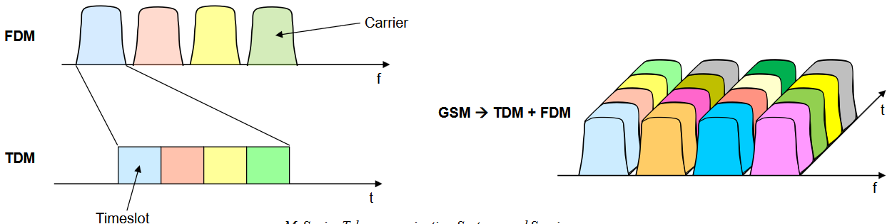

#### Traffic & Control Channels

Partiamo dai canali di traffico, che prendono il nome di Traffic Channels (TCH), usati per trasportare voice data.
- Broadcast Control Channel (BCCH):

    trasporta le informazioni generali relative alla Base Station, il Mobile Network Code (MNC) che è un id univoco per ogni rete radiomobile, e la Location Area Identity (LAI), che è quell'identificatore che è relativo alla Location Area a cui appartiene la BTS.

    Questo canale svoleg il ruolo di Beacon: viene ascoltato per portare in atto la procedura di Cell Selection.

    Inviato in downlink (da rete a utente).

- Paging Channel (PCH):

    usato per inviare messaggi di paging per cercare di rintracciare una MS quando si ha una chiamata in ingresso.

    Inviato in downlink (da rete a utente).

Canali di traffico:
- Random Access Channel (RACH):

    canale adottato quando una MS (Mobile Station) deve accedere alla rete, per inizializzare una nuova chiamata e quindi usato per accedere alla rete.

    Inviato in uplink.

- Access Grant Channel (AGCH):

    usato come canale di risposta alle richieste ottenute per mezzo del canale RACH.

    Uplink.

- Stand-alone Dedicated Control Channel (SDCCH):

    canale che viene assegnato dopo uno scambio di messaggi sui canali RACH e AGCH per scambiare ulteriore informazione relativa a informazioni di tipo short-lived. Su questo canale vengono scambiate informazioni necessarie ad esempio a portare l'autenticazione dell'utente, se deve essere fatta una location update, se deve essere inviato un SMS in direzione uplink (non in downlink perché viene usato il Paging Channel).

- Slow Associated Control Channel (SACCH):

    usato per scambiare misurazioni durante la connessione tra MS e BTS, come per esempio la Signal Strength.

- Fast Associated Control Channel (FACC):

    trasporta la segnalazione che viene generata quando si vuole stabilire una chiamata o quando si vuole fare l'Handover. Quindi trasporta i segnali necessari per portare a termine azioni di mobilità o a stabilire una chiamata.

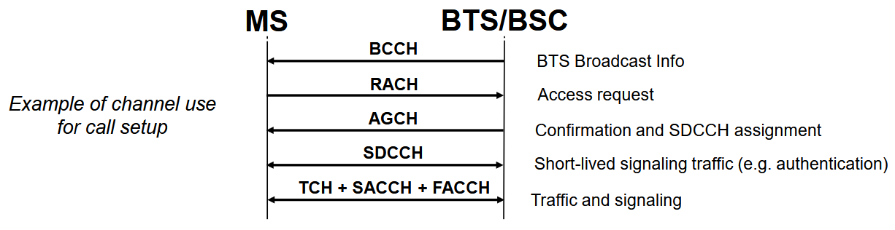

:::warning[Cosa imparare]
Al Savi non interessa che impariamo a memoria tutti questi canali, ma è importante capire l'utilizzo di alcuni di questi canali per portare a compimento le procedure che abbiamo già introdotto o che introduciamo tra poco.
:::

#### GSM Identifiers

Serve sapere che esistono per le varie procedure che vediamo tra poco.

- Mobile Station ISDN Number (MSISDN):

    non è altro che il numero di telefono cellulare. Numero permanente e pubblico; viene assegnato e non modificato.

- Mobile Station Roaming Number (MSRN):

    sintatticamente è analogo al MSISDN, ma viene assegnato in maniera provvisoria quando bisogna instradare una chiamata verso un utente e, più nello specifico, vero uno specifico MSC. È un numero temporaneo e privato, non noto al di fuori della rete radiomobile.

    

- International Mobile Station Identifier (IMSI):
    
    altro identificatore della MS assoluto, scritto nella SIM e immagazzinato nell'HLR. Nella migliore delle ipotesi, questo identificatore è conosciuto solo dall'HLR da un lato e dalla SIM dall'altro.

    Quando si compra una scheda SIM, biogna solitamente aspettare un attimo prima che sia attiva: questo è dovuto dal fatto che questo identificatore scritto sulla SIM deve essere attivato e registrato nell'HLR.

    Sarebbe meglio non fosse noto all'esterno, ma non è sempre possibile. Alcune volte è necessario scambiarlo in chiaro, ma significa che si potrebbe mettere a rischio la privacy utente e tracciarlo. Motivo per cui nasce il TMSI.

- Temporary Available Station Identifier (TMSI):

    identificatore strutturato com IMSI ma temporaneo e dinamico, allocato alle MS e immagazzinato nella VLR e nella SIM card.

- Loation Area Identity (LAI):

    Immagazzinato sia lato utente nella SIM che nel VLR. È un identificatore univoco della Location Area.

Perché è necessario il TMSI oltre all'IMSI? Per una questione di sicurezza: essendo IMSI univoco e personale, se lo utilizzo per comunicare in chiaro sull'interfaccia radio, chiunque potrebbe leggerlo e si potrebbe tracciare la mia posizione in un determinato momento. Nel VLR viene immagazzinata un'associazione tra TMSI e IMSI, in modo che quando possibile si utilizza il TMSI, mentre quando l'utente si sposta e viene servito da un altro MSC, quindi server un nuovo VLR, viene modificato il TMSI associato all'utente.

Durante l'autenticazione, viene inviato il TMSI.

In generale, se il TMSI non è disponibile, si invia IMSI.

### GMS Authentication & Ciphering
GSM richiede chiaramente autenticazione per poter inviare e ricevere chiamate. Sul segmento di interfaccia radio viene effettutata una cifratura della voce in modo da non poter "spiare".

Queste operazioni di sicurezza sono gestiti da un lato dalla SIM card, dall'altro dalla rete, in particolare dai nodi BTS/MSC/AUC.

Per compiere queste due procedure, necessitiamo di avere:

- $K_i$: una chiave di autenticazione univoca di 128 bit che funge da segreto condiviso tra utente e rete, scritta in maniera permanente sulla SIM e immagazzinata nell'AUC.

- RAND: numero casuale di 128 bit generato da AUC e inviato al MS tramite il MSC.

Le procedure di autenticazione e cifratura vengono eseguite da 3 algoritmi standardizzati:
1. A3: algoritmo salvato sia in AUC che nella SIM Card; la SIM esegue proprio l'algoritmo

2. A8: per ottenere la chiave di cifratura condivisa $K_c$ tra rete e utente. Anche in questo caso viene eseguito da AUC e SIM

3. A5: stream cipher algorithm che viene eseguito dalla MS, NON dalla SIM, e dalla BTS.

Come funziona il meccanismo di autenticazione e cifratura in GSM?

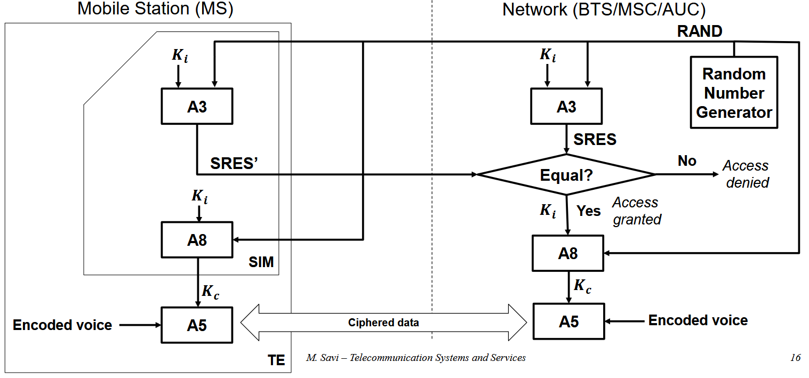

C'è però un problema nelle reti di generazioni successive: l'utente si autentica nei confronti della rete, ma la rete NON si autentica nei confronti dell'utente. Questo è soggetto ad attacchi ManInTheMiddle tramite degli **IMSI-catcher**. Questo importantissimo problema di mancata autenticazione della rete nei confronti della rete viene risolto a partire dalla generazione 3G.

### Procedure GSM

Vediamo più nel dettaglio alcune procedure fondamentali nel momento in cui io voglio comunicare su una rete GSM.

#### Turning on an MS
Cosa succede quando io accendo una MS e deve essere poi di fatto pronta per comunicare? Siamo comunque in una situazione di IDLE mobility: voglio che il terminale si accenda e che sia pronto a inviare e ricevere chiamate, ma non sto effettuando chiamate.

1. Quando una MS viene accesa, si compie la procedura di Cell Selection: la MS si connette alla BTS con qualità migliore a cui connettersi.

2. A questo punto, la MS, dopo essersi accesa e aver scelto la BTS, seleziona l'MSC che è attiva. Si ha la necessità di fare in modo che la rete sappia che adesso questo terminale (utente con SIM) è attivo nella rete. Ci sono 2 diversi casi:
    1. IMSI Attach: si verifica quando ricevo dalla Base Station lo stesso Location Area Identity che era già immagazzinato nella SIM card. Questo dice alla rete che l'utente ha spento e riacceso il cellulare esattamente dove si trovava prima e già ha le informazioni necessarie per localizzare l'utente. Semplicemente, la rete marca come attivo l'utente lato VLR. Dopo un tempo di inattività viene flaggato come cellulare spento.

    2. Location Update: non si ha un LAI nella SIM (primo accesso) o il LAI ricevuto è diverso da quello immagazzinato. In questo caso, si inizializza una procedura di Location Update.

##### Location Update
Procedura che viene eseguita quando sono in caso di IDLE mobility, fondamentale per tenere traccia della LA in cui si trova un utente e per modificare le informazioni relative alla LA attualmente visitata dall'utente.

Si hanno due diverse possibilità quando bisogna effettuare la procedura di Location Update:

1. Le LA sono servite dallo stesso MSC/VLR, ovvero che l'utente si sta spostando da una LA a un'altra e verrà servito da una BTS diversa, che a sua volta è servita da una BSC diversa. La questione è che l'MSC non varia.

    

2. Più complicato, in cui si ha una Location Update tra due LA servite da due MSC. Più raro, ma succede.

    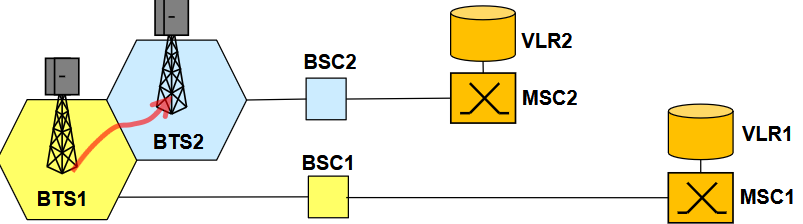

###### Location Update con MSC/VLR uguale

Anche qui al Savi non interessa che sappiamo a memoria i sequenze diagram, ma è importante vederli. Tra l'altro sono una marea e mostra nelle slide solo quelli più importanti.

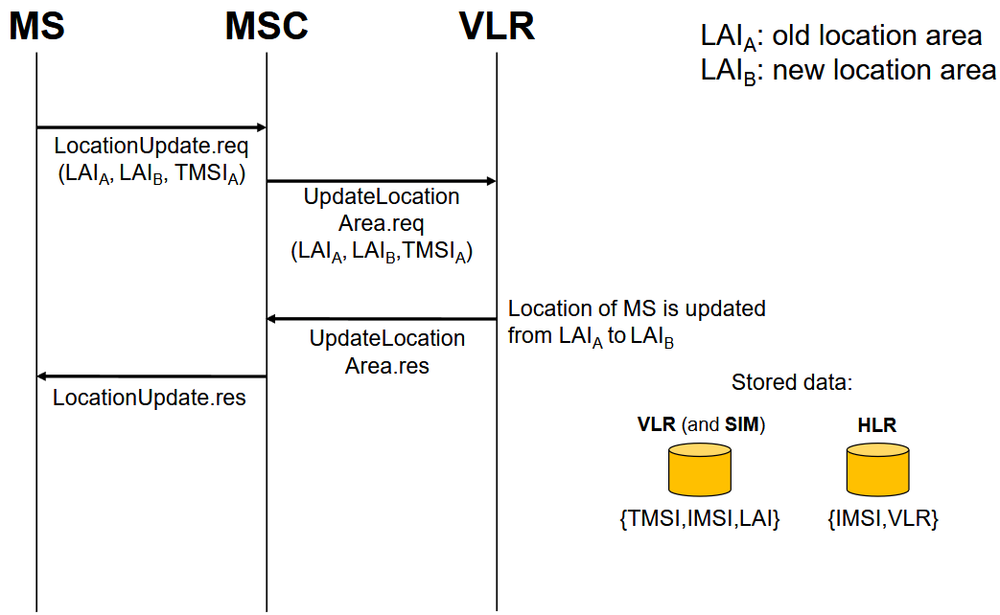

###### Location Update con MSC/VLR nuova

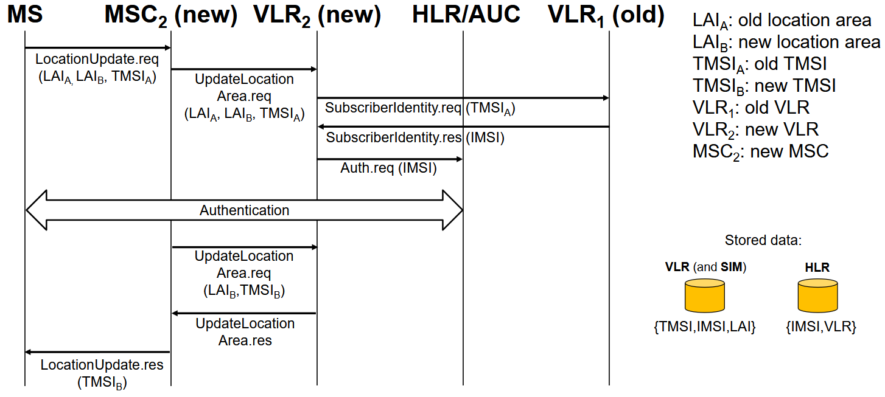
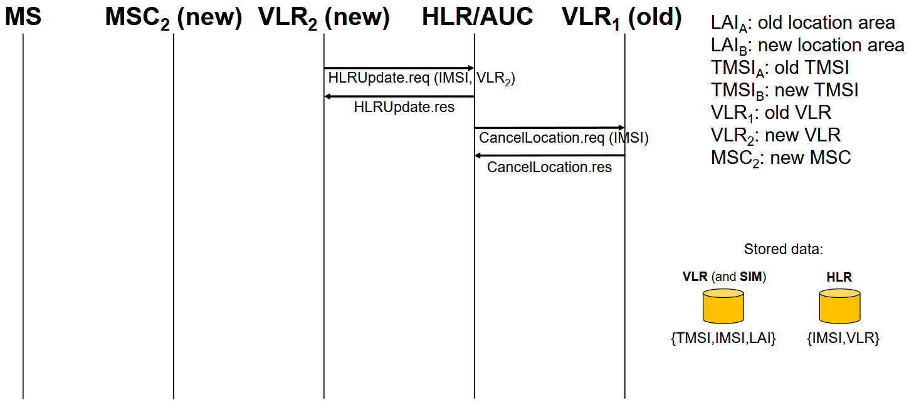

#### Call Setup

##### MS Initiated Call
La procedura è fondamentalmente la stessa di quella di VoIP.

##### MS Terminated Call

Situazione in cui sono il chiamato, qualcuno mi sta chiamando e devo stabilire la chiamata.

Consideriamo il caso più generale in cui si ha una chiamata dal PSTN al MS su una specificare rete radiomobile.

1. il chiamante (PSTN user) digita il MSISDN del chiamato
2. la rete PSTN analizza il numero e la chiamata viene intradata fino al GMSC della rete radiomobile
3. il GSMC riceve la richiesta di setup della chiamata

    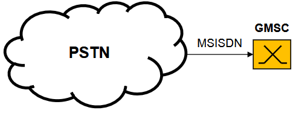

4. la GMSC interroga l'HLR per conoscere la posizione del MS
    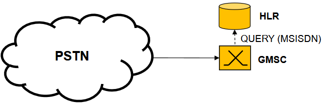

5. HLR analizza la richiesta e identifica nei suoi record il VLR attualmente visitato dal target MS

6. HLR invia un messaggio di segnalazione di nome "Routing Information Request" al VLR che include il IMSI dell'utente

7. il VLR alloca un MSRN provvisiorio che verrà utilizzato per instradare la chiamata al posto dell'MSISDN

8. l'MSRN viene inoltrato al GMSC

    

9. grazie a questo MSRN, può essere instradata la chiamata fino all'MSC relativo all'HLR che mi ha risposto precedentemente.

10. a questo punto, MSC attiva la procedura di pagin tramite il TMSI recuperato dal VLR:
    - identifica la LA attualmente visitata dall'utente tramite la LAI immagazzinata nel VLR insieme al TMSI
    - invia un comando di paging al BSC associato alla LA

I prossimi punti sono relativi alla procedura di Paging chee abbiamo già visto.

11. BSC inoltra il messaggio paging ai BTS collegati tramite broadcast e canale PCH

12. MS risponde al messaggio paging ricevuto e inizializza una procedure di accesso

13. MS inizia procedura di autenticazione per l'assegnazione della TCH in modo che la chiamata possa essere stabilita

##### MS Terminated Call International Roaming - Caso 1
Caso in cui voglio effettuare una chiamata verso un utente che si trova su una rete in un altro stato.

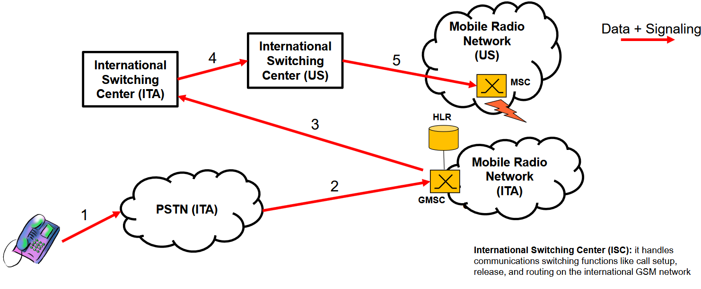

##### MS Terminated Call International Roaming - Caso 2
Sono utente su rete telefonica standard americana e voglio chiamare un utente italiano che malauguratamente si trova in roaming su una rete radiomobile americana.

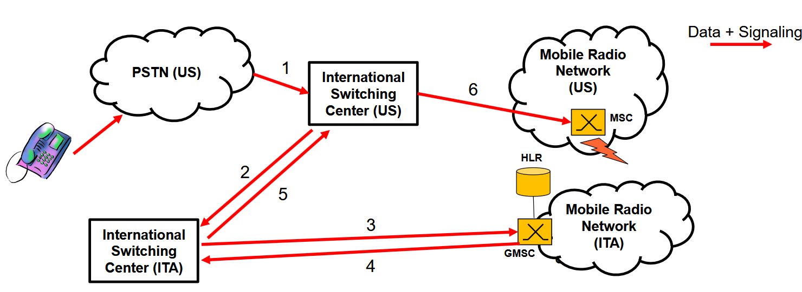

### Mobile Number Portability (MNP)
Servizio che permette di cambiare il provider di rete radiomobile senza dover cambiare numero di telefono.

Donor Radio Network -> vecchio operatore

Recipient Radio Network -> nuovo operatore

