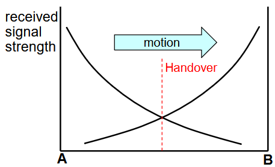
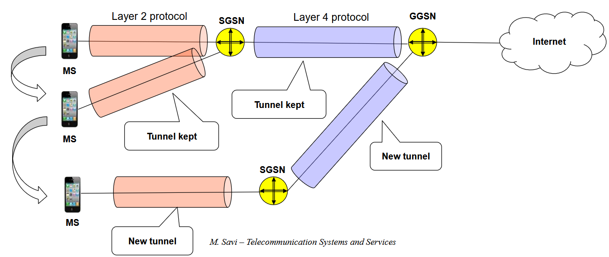
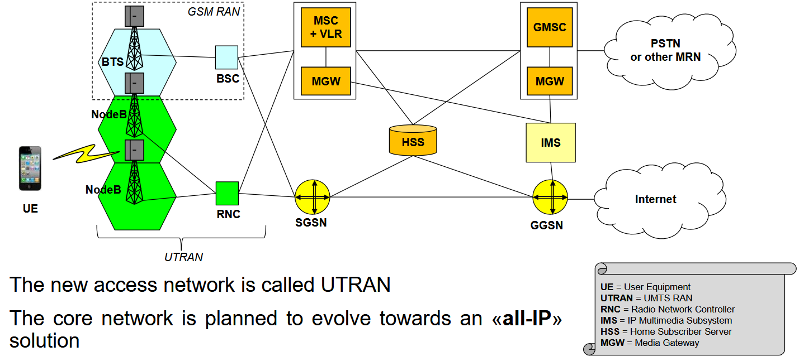
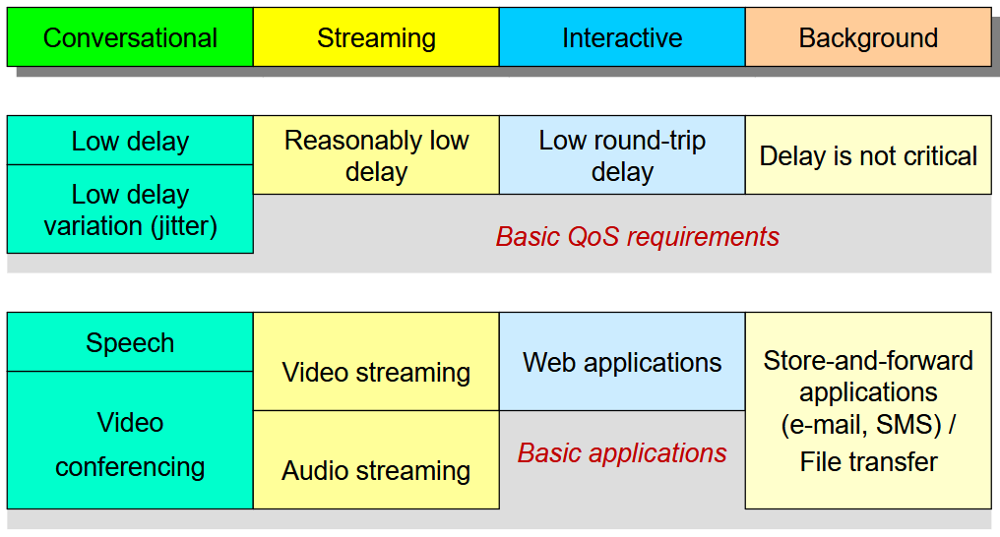
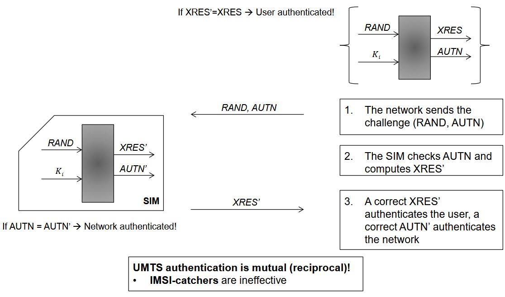
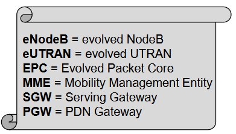
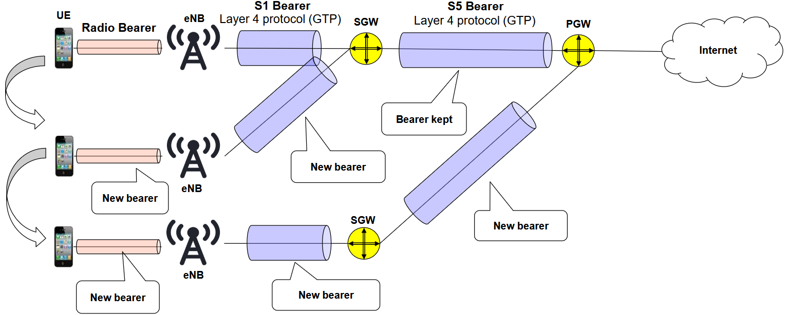

## 2G - GSM

GSM sta per Global System Communications.

Fu la prima generazione di rete cellulare di tipo digitale, dato che la 1G era di tipo analogico, ma non ci interessa studiarla.

La 2G è a commutazione di circuito.

### Architettura del GSM

La rete radiomobile, oltre a interconnettere utenti tra di loro, deve interconnettersi ad altre reti.

La struttura della rete radiomobile è una tipica struttura ad albero.

Ci sono un numero scarso di nodi che prende il nome di GMSC, che permette di interconnettere la rete radiomobile verso altre reti esterne

Quindi un GMSC è collegato a un certo numero di MSC, un MSC è collegato a un certo numero di BSC, un BSC è collegato a un certo numero di BTS e ogni BTS è collegato a un certo numero di MS (Mobile Station, terminale utente).

I cilindri indicano dei database: VLR, HLR e AUC.

Iniziamo la carrellata per capire qual è il ruolo di ogni componente.

I vari componenti sono collegati tra loro da delle interfacce; i nomi su queste interfacce che si vedono nell'immagine sono nomi standard, ovvero che, per esempio, l'interfaccia E mette in comunicazione MSC e GMSC. Non ci interessa molto, ma ci importa sapere che i dispositivi comunicano per mezzo di queste interfacce.

#### Architettura lato Radio Access Network
- Mobile Station (MS): 

    dispositivo mobile dell'utente che include un Terminal Equipment (TE) e la Subscriber Identity Module (SIM) card. Il ruolo della SIM Card è identificare e autenticare l'utente, mentre il ruolo del TE è effettuare chiaramente le chiamate e gestire la mobility lato utente.

- Base Transceiver Station (BTS):

    ha due ruoli fondamentali:
    1. gestire la connessione radio con i dispositivi degli utenti
    2. esegue dei comandi ricevuti dal BSC per effettuare l'allocazione delle risorse radio degli utenti. La BTS non prende nessuna decisione in autonomia su come queste risorse devono essere allocate agli utenti, ma questa decisione viene presa da un BSC, che controlla più BTS.

- Base Station Controller (BSC):

    ha il compito di, appunto, gestire le risorse radio di tutte le BTS ad esso connesso.

:::danger[BTS & BSC]
Importante sapere che, per GSM, si è deciso che l'insieme di tutte le BTS che sono controllate da uno stesso BSC appartengono tutte alla stessa Location Area (LA).
:::

#### Architettura lato Core Network
- Mobile Switching Center (MSC):

    Il primo nodo che si trova nella Core Network, e forse anche quello più importante che si trova nella rete radiomobile, è MSC: Mobile Switching Center.

    Possiamo immaginarlo come l'analogo di una centrale telefonica nella rete telefonica standard; ha il compito di instradare le chiamate voci e, quindi, gestire la segnalazione, ma la cosa fondamentale di MSC è che è il nodo che gestisce la stragrande maggioranza delle funzionaltià relative alla Mobility degli utenti, cosa fondamentale di una rete radiomobile.

- Visitor Location Register (VLR):

    ogni singolo MSC ha associato un database specifico, che è appunto il VLR. Questo database ha il compito fondamentale di immagazzinare delle informazioni temporanee relative a quali sono gli utenti che stanno visitando le celle che sono coperte dalle Base Transceiver Station che sono controllate dal Base Station Controller che sono collegate all'MSC.

    Quindi il VLR mantiene info temporanee che permettono di localizzare gli utenti collegati alle BTS, che sono collegate alla BSC, ...

    Fondamentale perché permette di instradare una chiamata verso l'utente.

- Gateway MSC (GMSC)

    Innanzitutto è un MSC e svolge le stesse funzionalità. Ha però un ulteriore compito: interconnettere la nostra rete radiomobile a altre reti radiomobili di altri operatori o alla rete telefonica standard. Deve quindi ovviamente implementare le funzioni di segnalazioni interworking.

- Home Location Register (HLR):

    database centrale che mantiene informazioni permanenti relative agli utenti, ma anxhe info dinamiche riguardo a qualche VLR è correntemente visitato da un utente. Anche questo fondamentale per effettuare chiamate entranti.

- Authentication Center (AUC):

    coinvolto nell'autenticazione delle schede SIM che cercano di collegarsi alla Core Network.

### GSM Physical Layer: FDM & TDM
In GSM c'è una multiplazione sull'interfaccia audio di tipo FDM+TDM.

Ci sono quindi diversi Carriers e su ogni Carrier si adotta TDM, quindi il tempo è diviso in trame (frame) e timeslots. 

I timeslots che vengono trasportati in ognuno dei carrier sono usati per trasportare dati relativi a diversi **canali** (channels). I canali possono essere canali per trasportare segmenti di voci, oppure usati per trasportare dei dati di controllo.

Il termine canale, come viene usato in GSM, si riferisce a qualcosa di logico, che a un certo punto questi canali logici vanno mappati su canali fisici.

#### Traffic & Control Channels

Partiamo dai canali di traffico, che prendono il nome di Traffic Channels (TCH), usati per trasportare voice data.
- Broadcast Control Channel (BCCH):

    trasporta le informazioni generali relative alla Base Station, il Mobile Network Code (MNC) che è un id univoco per ogni rete radiomobile, e la Location Area Identity (LAI), che è quell'identificatore che è relativo alla Location Area a cui appartiene la BTS.

    Questo canale svoleg il ruolo di Beacon: viene ascoltato per portare in atto la procedura di Cell Selection.

    Inviato in downlink (da rete a utente).

- Paging Channel (PCH):

    usato per inviare messaggi di paging per cercare di rintracciare una MS quando si ha una chiamata in ingresso.

    Inviato in downlink (da rete a utente).

Canali di traffico:
- Random Access Channel (RACH):

    canale adottato quando una MS (Mobile Station) deve accedere alla rete, per inizializzare una nuova chiamata e quindi usato per accedere alla rete.

    Inviato in uplink.

- Access Grant Channel (AGCH):

    usato come canale di risposta alle richieste ottenute per mezzo del canale RACH.

    Uplink.

- Stand-alone Dedicated Control Channel (SDCCH):

    canale che viene assegnato dopo uno scambio di messaggi sui canali RACH e AGCH per scambiare ulteriore informazione relativa a informazioni di tipo short-lived. Su questo canale vengono scambiate informazioni necessarie ad esempio a portare l'autenticazione dell'utente, se deve essere fatta una location update, se deve essere inviato un SMS in direzione uplink (non in downlink perché viene usato il Paging Channel).

- Slow Associated Control Channel (SACCH):

    usato per scambiare misurazioni durante la connessione tra MS e BTS, come per esempio la Signal Strength.

- Fast Associated Control Channel (FACC):

    trasporta la segnalazione che viene generata quando si vuole stabilire una chiamata o quando si vuole fare l'Handover. Quindi trasporta i segnali necessari per portare a termine azioni di mobilità o a stabilire una chiamata.

:::warning[Cosa imparare]
Al Savi non interessa che impariamo a memoria tutti questi canali, ma è importante capire l'utilizzo di alcuni di questi canali per portare a compimento le procedure che abbiamo già introdotto o che introduciamo tra poco.
:::

#### GSM Identifiers

Serve sapere che esistono per le varie procedure che vediamo tra poco.

- Mobile Station ISDN Number (MSISDN):

    non è altro che il numero di telefono cellulare. Numero permanente e pubblico; viene assegnato e non modificato.

- Mobile Station Roaming Number (MSRN):

    sintatticamente è analogo al MSISDN, ma viene assegnato in maniera provvisoria quando bisogna instradare una chiamata verso un utente e, più nello specifico, vero uno specifico MSC. È un numero temporaneo e privato, non noto al di fuori della rete radiomobile.

    

- International Mobile Station Identifier (IMSI):
    
    altro identificatore della MS assoluto, scritto nella SIM e immagazzinato nell'HLR. Nella migliore delle ipotesi, questo identificatore è conosciuto solo dall'HLR da un lato e dalla SIM dall'altro.

    Quando si compra una scheda SIM, biogna solitamente aspettare un attimo prima che sia attiva: questo è dovuto dal fatto che questo identificatore scritto sulla SIM deve essere attivato e registrato nell'HLR.

    Sarebbe meglio non fosse noto all'esterno, ma non è sempre possibile. Alcune volte è necessario scambiarlo in chiaro, ma significa che si potrebbe mettere a rischio la privacy utente e tracciarlo. Motivo per cui nasce il TMSI.

- Temporary Available Station Identifier (TMSI):

    identificatore strutturato com IMSI ma temporaneo e dinamico, allocato alle MS e immagazzinato nella VLR e nella SIM card.

- Loation Area Identity (LAI):

    Immagazzinato sia lato utente nella SIM che nel VLR. È un identificatore univoco della Location Area.

Perché è necessario il TMSI oltre all'IMSI? Per una questione di sicurezza: essendo IMSI univoco e personale, se lo utilizzo per comunicare in chiaro sull'interfaccia radio, chiunque potrebbe leggerlo e si potrebbe tracciare la mia posizione in un determinato momento. Nel VLR viene immagazzinata un'associazione tra TMSI e IMSI, in modo che quando possibile si utilizza il TMSI, mentre quando l'utente si sposta e viene servito da un altro MSC, quindi server un nuovo VLR, viene modificato il TMSI associato all'utente.

Durante l'autenticazione, viene inviato il TMSI.

In generale, se il TMSI non è disponibile, si invia IMSI.

### GMS Authentication & Ciphering
GSM richiede chiaramente autenticazione per poter inviare e ricevere chiamate. Sul segmento di interfaccia radio viene effettutata una cifratura della voce in modo da non poter "spiare".

Queste operazioni di sicurezza sono gestiti da un lato dalla SIM card, dall'altro dalla rete, in particolare dai nodi BTS/MSC/AUC.

Per compiere queste due procedure, necessitiamo di avere:

- $K_i$: una chiave di autenticazione univoca di 128 bit che funge da segreto condiviso tra utente e rete, scritta in maniera permanente sulla SIM e immagazzinata nell'AUC.

- RAND: numero casuale di 128 bit generato da AUC e inviato al MS tramite il MSC.

Le procedure di autenticazione e cifratura vengono eseguite da 3 algoritmi standardizzati:
1. A3: algoritmo salvato sia in AUC che nella SIM Card; la SIM esegue proprio l'algoritmo

2. A8: per ottenere la chiave di cifratura condivisa $K_c$ tra rete e utente. Anche in questo caso viene eseguito da AUC e SIM

3. A5: stream cipher algorithm che viene eseguito dalla MS, NON dalla SIM, e dalla BTS.

Come funziona il meccanismo di autenticazione e cifratura in GSM?

C'è però un problema nelle reti di generazioni successive: l'utente si autentica nei confronti della rete, ma la rete NON si autentica nei confronti dell'utente. Questo è soggetto ad attacchi ManInTheMiddle tramite degli **IMSI-catcher**. Questo importantissimo problema di mancata autenticazione della rete nei confronti della rete viene risolto a partire dalla generazione 3G.

### Procedure GSM

Vediamo più nel dettaglio alcune procedure fondamentali nel momento in cui io voglio comunicare su una rete GSM.

#### Turning on an MS
Cosa succede quando io accendo una MS e deve essere poi di fatto pronta per comunicare? Siamo comunque in una situazione di IDLE mobility: voglio che il terminale si accenda e che sia pronto a inviare e ricevere chiamate, ma non sto effettuando chiamate.

1. Quando una MS viene accesa, si compie la procedura di Cell Selection: la MS si connette alla BTS con qualità migliore a cui connettersi.

2. A questo punto, la MS, dopo essersi accesa e aver scelto la BTS, seleziona l'MSC che è attiva. Si ha la necessità di fare in modo che la rete sappia che adesso questo terminale (utente con SIM) è attivo nella rete. Ci sono 2 diversi casi:
    1. IMSI Attach: si verifica quando ricevo dalla Base Station lo stesso Location Area Identity che era già immagazzinato nella SIM card. Questo dice alla rete che l'utente ha spento e riacceso il cellulare esattamente dove si trovava prima e già ha le informazioni necessarie per localizzare l'utente. Semplicemente, la rete marca come attivo l'utente lato VLR. Dopo un tempo di inattività viene flaggato come cellulare spento.

    2. Location Update: non si ha un LAI nella SIM (primo accesso) o il LAI ricevuto è diverso da quello immagazzinato. In questo caso, si inizializza una procedura di Location Update.

##### Location Update
Procedura che viene eseguita quando sono in caso di IDLE mobility, fondamentale per tenere traccia della LA in cui si trova un utente e per modificare le informazioni relative alla LA attualmente visitata dall'utente.

Si hanno due diverse possibilità quando bisogna effettuare la procedura di Location Update:

1. Le LA sono servite dallo stesso MSC/VLR, ovvero che l'utente si sta spostando da una LA a un'altra e verrà servito da una BTS diversa, che a sua volta è servita da una BSC diversa. La questione è che l'MSC non varia.

    

2. Più complicato, in cui si ha una Location Update tra due LA servite da due MSC. Più raro, ma succede.

    

###### Location Update con MSC/VLR uguale

Anche qui al Savi non interessa che sappiamo a memoria i sequenze diagram, ma è importante vederli. Tra l'altro sono una marea e mostra nelle slide solo quelli più importanti.

###### Location Update con MSC/VLR nuova

#### Call Setup

##### MS Initiated Call
La procedura è fondamentalmente la stessa di quella di VoIP.

##### MS Terminated Call

Situazione in cui sono il chiamato, qualcuno mi sta chiamando e devo stabilire la chiamata.

Consideriamo il caso più generale in cui si ha una chiamata dal PSTN al MS su una specificare rete radiomobile.

1. il chiamante (PSTN user) digita il MSISDN del chiamato
2. la rete PSTN analizza il numero e la chiamata viene intradata fino al GMSC della rete radiomobile
3. il GSMC riceve la richiesta di setup della chiamata

    

4. la GMSC interroga l'HLR per conoscere la posizione del MS
    

5. HLR analizza la richiesta e identifica nei suoi record il VLR attualmente visitato dal target MS

6. HLR invia un messaggio di segnalazione di nome "Routing Information Request" al VLR che include il IMSI dell'utente

7. il VLR alloca un MSRN provvisiorio che verrà utilizzato per instradare la chiamata al posto dell'MSISDN

8. l'MSRN viene inoltrato al GMSC

    

9. grazie a questo MSRN, può essere instradata la chiamata fino all'MSC relativo all'HLR che mi ha risposto precedentemente.

10. a questo punto, MSC attiva la procedura di pagin tramite il TMSI recuperato dal VLR:
    - identifica la LA attualmente visitata dall'utente tramite la LAI immagazzinata nel VLR insieme al TMSI
    - invia un comando di paging al BSC associato alla LA

I prossimi punti sono relativi alla procedura di Paging chee abbiamo già visto.

11. BSC inoltra il messaggio paging ai BTS collegati tramite broadcast e canale PCH

12. MS risponde al messaggio paging ricevuto e inizializza una procedure di accesso

13. MS inizia procedura di autenticazione per l'assegnazione della TCH in modo che la chiamata possa essere stabilita

##### MS Terminated Call International Roaming - Caso 1
Caso in cui voglio effettuare una chiamata verso un utente che si trova su una rete in un altro stato.

##### MS Terminated Call International Roaming - Caso 2
Sono utente su rete telefonica standard americana e voglio chiamare un utente italiano che malauguratamente si trova in roaming su una rete radiomobile americana.

Uno dei grossi problemi del GSM è che Dati e Segnalazioni seguono lo stesso flusso. Se devo chiamare un numero di telefono italiano dagli stati uniti che si trova in roaming negli stati uniti, c'è un percorso tortuoso che porta al pagamento di due chiamate internazionali, perché i flussi dati arrivano fino all'italia per poi tornare indietro. 

##### Mobile Number Portability (MNP)
Servizio che permette di cambiare il provider di rete radiomobile senza dover cambiare numero di telefono.

Donor Radio Network -> vecchio operatore

Recipient Radio Network -> nuovo operatore

##### Handover
La procedura è inizializzata dalla rete, ma assisita dal terminale MS perché riceve il beacon da varie Base Stations e può prendere questa informazione sul livello di potenza attorno a lui, inviarla alla rete sul canale SACCH. Sulla base della ricezione di queste misure, la rete decide se fare handover o meno.

Comunque è la rete che decide quando l'utente deve switchare su una nuova BTS.

3 diversi tipi di Handover:
1. Intra BSC:

    le due celle tra cui sto effettuando handover sono collegate allo stesso BSC. È il caso più semplice da gestire.

2. Inter BSC (ma intra MSC)

    handover tra due celle gestite da due BSC diversi, quindi appartengono per definizione a due Location Area diverse, e quindi l'MSC deve essere coinvolto nella procedura che gestisce entrambi i BSC.

3. Inter MSC

    caso più complesso, in cui anche i BSC sono gestiti da diversi MSC.

Ci focalizziamo sul caso 2. Inter BSC ma intra MSC.

###### Inter BSC

### GPRS
GPRS (General Packet Radio Service) è un servizio di commutazione di pacchetto costruito sopra GSM. Grazie a GPRS si ha la prima tecnologie che permette la comunicazione a commutazione di pacchetto sulla rete radiomobile. È l'evoluzione di GSM per comunicare a commutazione di pacchetto.

Alcuni dei canali vengono dedicati al GPRS. viene definito un nuovo tipo di canale: PDTCH (Packet Data Traffic Channel).

EDGE è un'evoluzione di GPRS, con qualche miglioramento che portano ad avere velocità quasi raddoppiata, ma comunque molto lenta per il giorno moderno (170 Kbps e 270 Kbps).

Come è fatto l'overlay della rete GPRS su GSM?

Il nuovo nodo PCU ha praticamente lo stesso ruolo del BSC, ma per quanto riguarda la commutazione di pacchetto. La grossa differenza architetturale è che ci sono meno PCU di BSC. Agiscono insieme, comunque.

Nella parte di core, ci sono due nodi aggiuntivi: SGSN e GGSN. Questi nodi sono commutatori di pacchetto, ovvero dei router che però svolgono anche operazioni aggiuntive rispetto a quelli standard.

#### Packet Forwarding
Un concetto fondamentale nella rete GPRS è il concetto di **tunnel**, che si porta dietro in tutte le generazioni successive, anche se in realtà, a partire dal 3G, il termine utilizzato è **bearer**.

Comunque, il punto chiave è che per comunicare nelle reti radiomobili vanno stabiliti dei tunnel (o bearer nelle gen. successive).

Vengono stabiliti 2 tunnel, uno di livello 2 tra la MS e l'SGSN e uno di livello 4 tra SGSN e GGSN. Senza questi tunnel, l'utente proprio non può comunicare. Dobbiamo proprio vederli come dei bit-pipe usati per comunicare.

Il tunnel di livello due usa protocollo LLC (Logical Link Control) mentre quello di livello quattro usa GTP (GPRS Tunnelling Protocol). Di fatto, usiamo il termine tunnel ma non stiamo facendo altro se non l'incapsulamento in una trama di un protocollo di livello 2.

Nel caso del tunnel di livello 4 invece, si fa effettivamente capsulamento di livello IP; prendo il pacchetto che ha come origine MS e destinazione il server, lo incapsulo in un altro pacchetto IP con header IP che ha come sorgente SGSN e destinazine GGSN. Otre a questo viene aggiunta un'ulteriore intestazione di livello 4 che prende il nome di GTP. Sto facendo incapsulamento effettivo di pacchetto in un altro pacchetto IP; qui il termine tunnel ha più senso di prima.

##### Tunnels for Mobility Management
Si basa sul fatto che ogni volta che mi sposto posso avere la necessità di stabilire nuovi tunnel. 

Se l'utente si sposta in una Base Station gestita da una SGSN diversa bisogna definire nuovi tunnel.. Importante che sia chiaro il fatto che il concetto di tunnel è importante per la comunicazione, per la connettività e per anche la gestione della Mobility. Crea e distrugge tunnel.

## 3G - UMTS
UMTS (Universal Mobile Telecommunications System) è la prima tecnologia 3G.

La rete 3G ha sia una parte a commutazione di circuito, sia una parte a commutazione di pacchetto. Noi ci focalizzeremo principalmente sulla seconda.

Per quanto riguarda UMTS, le principali grosse innovazioni si hanno nella RAN (Radio Access Network), mentre a livello di Core Network non si ha un grosso cambiamento rispetto alla 2G.
Quindi, a livello RAN, si ha la specifica di una nuova interfaccia radio basata su CDMA che permette di avere bitrate molto più elevati. La seconda innovazione è il **soft handover**.

Introduce anche il concetto di **bearer**.

### Architettura di UMTS

Rispetto al 2G, piccole differenze funzionali, ma grandi differenze in termini di nomi. In particolare, la RAN si chiama UTRAN (UMTS RAN). Le Base Station si chiamano NodeB, mentre BSC diventa RNC (Radio Network Controller). 

A livello di Network Core, AUC e HLR vengono consolidati in un unico nodo HSS (Home Subscriber Server) e abbiamo 2 nuovi nodi MGW (Media Gateway) e IMS (IP Multimedia Subsystem).

Media Gateway ha il compito di convertire gli stream audio o audio/video tra tecnologie diverse per garantire interoperabilità. Può spesso capitare che il MGW.

### Avanzamenti di UMTS
- Higher Speed Data
- Primo rilascio di UMTS: 2 Mbit/s
- HSPA (High Speed Packet Access): 14.4 Mbit/s in downlink, 5.76 Mbit/s in uplink
- HSPA+: 42 Mbit/s in downlink, viene inoltre introdotto il concetto di **flat network**, ovvero disaccoppiare il percorso che viene preso dai flussi dati e flussi di controllo e cercare di ottimizzare il percorso seguito dai flussi dati per renderlo il più diretto possibile. HSPA+ è quello che c'è al giorno d'oggi, anche se il 3G è oggi in dismissione e ci si aspetta di non usarlo più, dato che si ha copertura totale del territorio con il 4G e il 5G.
- introduzione del concetto di **bearer**: posso creare dei bearer di tipo diverso sulla base della tipologia di traffico generati sulla rete, che permette di usare la rete 3G per quanto riguarda la multimedialità dei dati.

#### Bearer Services
Un Bearer è un concetto flessibile di "bitpipe" proprio come il tunnel, ma al bearer sono associati determinati attributi per la qualità del servizio.

Un bearer appartiene a uno specifico Bearer Service. I Bearer Service si distinguono sulla base delle entità coinvolte. Posso garantire una QoS per i Bearer Service; esistono 4 specifiche classi di QoS per i Bearer Services:
- Conversational
- Streaming
- Interactive
- Background

Possono essere specificati vari attributi associati alla QoS service class per la definizione di un Bearer:
- Maximum bitrate (kbps)
- Guaranteed bitrate (kbps)
- Transfer delay (ms)
- Error probability

Nel momento in cui voglio stabilire un Bearer specifico per il trasferimento di questo stream di bit, devo chiaramente garantire una determinata QoS. Da un punto di vista della rete, si trasla in operazioni di basso livello che permettono di garantire QoS. Fare una roba del genere non è banale da ottenere sulla rete.

Ci sono diversi tipi di Bearer Services che si distinguono sulla base dei nodi che sono coinvolti. I più importanti sono:
- Core Network Bearer Service: bearer stabiliti tra nodi della Core Network (SGSN e GGSN)
- Radio Access Bearer Service: stabiliti tra UE e SGSN
- Radio Bearer Service: stabiliti tra UE e RNC

Quando dobbiamo comunicare sulla rete è sempre fondamentale che un Radio Access Bearer venga stabilito; una volta stabilito, l'utente può effettivamente comunicare sulla rete.

### Soft Handover
Possibilità a uno UE di essere collegato a più NodeB contemporaneamente. La decisione dello stato di Soft Handover viene deciso dal Radio Network Controller (RNC). Il massimo è 6 NodeB contemporaneamente.

Nella uplink le varie NodeB ricevono la stessa trasmissione dell'utente e il primo dato ricevuto correttamente è mantenuto dal RNC.

Nella downlink ogni NodeB invia la trasmissione verso lo UE e il primo dato ricevuto correttamente è mantenuto nello UE. 

Vantaggio: migliore qualità e minore rischio di interruzione, proprio per la maggiore ridondanza.

Svantaggio: maggiore allocazione di risorse.

### New Authentication Scheme

Viene risolto il problema di autenticazione di GSM, in cui l'utente si autentica nei confronti della rete ma non il contrario. A partire dal 3G in poi è presente una mutua autenticazione.

Abbiamo sempre il segreto condiviso $K_i$ nella SIM e nel HSS. Abbiamo il numero RAND scelto dalla rete e inviato all'utente. Lo stesso algoritmo di autenticazione viene eseguito dalla SIM e dalla rete, ma in output non si ha più un singolo valore SRES, bensì due valori in uscita: XRES & AUTN.

Quindi all'utente viene inviato anche il valore AUTN; l'utente dà in input al suo algoritmo RAND e $K_i$, ottenendo XRES' & AUTN'. Se AUTN' è uguale a AUTN ricevuto, significa che la rete è autenticata nei confronti dell'utente. L'utente invia poi alla rete XRES' e se, dopo che la rete calcola XRES, se corrispondono l'utente è autenticato nei confronti della rete.

## 4G - LTE

Long Term Evolution.

Il grosso cambiamento/evoluzione rispetto alle 2 gen precedenti sono:

- concetto ALL-IP:

    tutto ciò che concerne la rete radiomobile è basato su IP.

    

    Nell'ambito radiomobile data plane = user plane.

    Quindi, tutto ciò che concerne i protocolli relativi allo User Plane e al Control Plane, in 4G viene spostato nativamente su rete a commutazione di pacchetto. NON ESISTE PIÙ UNA RETE A COMMUTAZIONE DI CIRCUITO.

- concetto di flat network

    vedremo nell'architettura che la Radio Access Network include 1 solo nodo: eNodeB. Nella rede 4G c'è una separazione tra i flussi dati e i flussi di controllo, ovvero che i flussi dati non per forza seguono lo stesso percorso seguito dai flussi di controllo per la gestione del controllo e per la segnalazione.

    L'obiettivo è creare un percorso il più diretto possibile per i flussi dati che attraversi il minor numero di nodi possibile. Motivo per cui nella 4G è presente 1 singolo nodo all'interno della RAN. In questo modo si riduce il più possibile la latenza per i flussi dati degli utenti.

LTE porta a grossi miglioramenti sia alla RAN che alla Core Network.
Riguardo ai miglioramenti a livello fisico:
- viene usato OFDM/OFDMA
- modulazione adattiva e coding
- supporto nativo per MIMO

Con la LTE ci si aspettava una grossa esplosione del traffico, proprio come è successo. L'obiettivo non era far usare questa 4G solo da cellulari, ma anche da molti altri dispositivi.

### Evoluzione verso la Flat Network

Essere arrivati nella situazione in cui nella rete 4G si cerca di avere un flusso dati diretto, parte anche dalle generazioni precedenti.

### Evoluzione verso la all-IP

### Architettura di LTE

Da mettersi le mani nei capelli perché quasi tutti i nodi hanno un nome differente.

Non si ha più un controllore come succede per il BSC o il RNT in 2G e 3G rispettivamente, ma "collassano" nell'eNodeB.

A livello di Core Network, abbiamo HSS, SGW, PGW, IMS e MME; la quasi totalità delle funzionalità relative alla mobility è eseguita dalla Mobility Management Entity, che essendo di Control Plane i flussi dati non attraverseranno mai la MME.

La telefonia è fatta tramite VoLTE, che vetremo poi.

LTE porta ad avere la possibilità di trasmissione dati fino a 1 Gbit/s.

Una cosa nuova che non si aveva nelle architetture delle precedenti generazioni è un collegamento diretto tra eNodeB, che possono essere collegate direttamente tra di loro per mezzo di un'interfaccia che prende il nome di **X2 Interface**. Nel momento in cui eNodeB sono collegate tra loro, facilita di molto l'handover.

#### eNodeB
Ha l'obiettivo di gestire le risorse radio. Funziona come relay node verso i SGWs. Potrebbe essere connesso a un set di MME/SGWs, ma ogni UE è connesso solamente a uno di essi.

#### Evolved Packet Core (EPC)
Permette di mettere in comunicazione applicazioni di tipo eterogeneo. Possiamo usare questa rete di core per interconnettere non solo Base Station della UTRAN, ma anche Base Stations di generazioni precedenti, come ad esempio UMTS. Oppure ancora per gestire la connettività wireless offerta ad esempio per mezzo di diversi tecnologie. Dobbiamo immaginarlo come un cervello che può controllare reti RAN di tipo differenti ma eterogene dal punto di vista tecnologico. Questa cosa però non è tanto tipica, soprattutto in italia.

La cosa importante è che la EPC fornisce la stragrande maggioranza delle funzioni di mobility per mezzo soprattutto del Mobility Management Entity (MME).

##### Management Entity (MME)
Svolge la quasi totalità delle funzioni di mobility.

Un UE stabilisce un collegamento diretto con la MME per procedure di mobility.

Ha anche un ruolo per autenticazione e security.

Se vogliamo, MME include le funzionalità che erano precedentemente compito di VLR/MSC.

Contiene inoltre un Database per immagazzinare informazione sulla Tracking Area (o Location Area) visitata da un UE.

MME è coinvolto ogni qualvolta c'è una procedura di handover E la X2 Interface NON è utilizzata.

Uno dei ruoli fondamentali di MME è stabilire Bearer tra i vari componenti in rete. Il Bearer più importante stabilito dal MME è quello che prende il nome di Default Bearer; viene stabilito da UE e PGW quando un terminale entra nella rete e si trova in IDLE state, tramite una procedura di nome **attach** che vedremo poi.

Se invece l'utente vuole comunicare, il MME stabilisce altri Bearer. Due dei più importanti stabiliti sono:
- S1 Bearer -> tra eNodeB e SGW per lo specifico utente
- Radio Bearer -> tra UE e eNodeB

Senza questa coppia di Bearer l'utente non può inviare e ricevere dati nella rete.

##### Serving Gateway (SGW)
Nel caso in cui non è presente la X2 Interface e c'è una procedura di Handover in corso, il SGW è quel nodo che si occupa di fare Packet re-routing; bufferizza e inoltra pacchetti alla eNodeB corretta.

Inoltre, quando il PGW invia pacchetti a un UE in stato di IDLE, bufferizza i pacchetti e richiede al MME di inizializzare la procedura di Paging.

##### PDN Gateway (PGW)
Altro nodo fondamentale che mette in comunicazione la rete radiomobile con le reti esterne. Assegna anche gli indirizzi IP ai terminali UE perché ha al suo interno un server DHCP. Gestisce tutto ciò che concerne la tariffazione e le statistiche.

##### Home Subscribe Server (HSS)
Sorta di database che implementa le funzionalità che nel 2G erano svolte da HLR/AUC e nel 3G dallo stesso HSS.

Quello importante da dire è che HSS e HLR 

### Packet Forwarding (Bearer)
Come si stabiliscono i Bearer (o i tunnel) nella rete 4G? La situazione è più pulita rispetto a quanto riguarda GPRS.

Si ha la necessità di stabilire 2 Bearer, entrambi tunnel di livello 4 per i quali viene fatto incapsulamento IP. Ci ritroviamo in una situazione di tunnelling effettivo.

Cosa bisogna fare se un utente si muove? Ovviamente bisogna creare e distruggere i Bearer in base a come l'utente si sta muovendo:

### Attach Procedure
Procedura fondamentale che avviene per assegnare un Default Bearer all'utente.

Uno UE può essere localizzato a livello di Tracking Area quando è in IDLE state. Nel momento in cui una UE cerca di accedere alla rete, c'è questa procedura di Attach, composta da 4 passaggi:
1. Autenticazione alla rete
2. Un indirizzo IP viene assegnato allo UE dal PGW
3. Un Default Bearer viene creato tra UE e PGW, mantenuto per tutto il tempo in cui il terminale è in stato di IDLE sulla rete. MME ha il compito di comunicare ai vari nodi di stabilire questo Bearer.
4. L'identità dell'MME che sta servendo questo specifico UE viene specificato all'HSS, dato che deve tenere traccia di quale è l'MME che deve essere contattao per rintracciare l'utente.

:::tip[IMPORTANTE]
Queste risorse assegnate al Default Bearer sono risorse che vengono mantenute finché il terminale dell'utente non viene spento.
:::

### Tracking Area Update
Analogo alla Location Area Update vista nelle generazioni precedenti. Di differenze sostanziali non ce ne sono, se non che abbiamo la Tracking Area, non Location Area; solitamente la Tracking Area è più piccola come numero di celle.

L'identificatore temporaneo TMSI cambia nome e diventa GUTI (Global Unique Temporary ID), mentre IMSI rimane.

Invece del LAI, abbiamo il TAI (Tracking Area Identifier).

### Handover
Possibili due scenari per fare l'handover:

- Handover tramite X2 Interface:

    la stragrande maggioranza dei messaggi di segnalazione viene scambiata tra gli eNodeB coinvolti. MME è quasi non coinvolto, se non per comunicare esiti e stabilire altri Bearer. I eNodeB si smassano la procedura di handover in maniera quasi autonoma.
- Handover tramite S1 interface:

    quando non è presnete la X2 Interface.

### Downstream Packet Handling Procedure
Si ha del traffico in Downstream che dall'esterno della rete radiomobile deve raggiungere il terminale UE.

In questo caso succede in due casi:
1. terminale in stato active e quindi c'è già un S1 Bearer tra SGW e eNB; in questo caso il pacchetto può essere inviato

2. Non è presente un S1 Bearer. MME avvia procedura di paging e mentre la paging viene portata avanti, i dati vengono bufferizzati dal SGW. Viene stabilito un nuovo S1 Bearer e un Radio Bearer  tra UE e eNB. Fatto questo, i pacchetti possono scorrere in downstream.

### Circuit Switched Services in LTE
Si ha un'interazione tra le reti di gen. differenti per fare in modo che si possa passare alla gen. di rete precedente per riceve la chiamata.

Per fare questa operazione è necessario mettere in comunicazione le due reti radiomobili, fatto per mezzo di un'interfaccia di nome **SGs interface**, posta tra MME della rete 4G e MSC della rete GSM, o 3G.

Se voglio fare chiamate su rete 4G nativamente su IP si usa VoIP e basta. Altrimenti, se non è supportato VoIP per qualche ragione dall'operatore, si informa l'utente di una chiamta entrante per mezzo del paging LTE. Si sfrutta quindi la rete 4G per mettere in atto la procedura di paging (segnalazione), però poi si switcha sulla rete 2G o 3G per effettuare la chiamata vera e propria. Quindi e risorse in rete per quanto riguarda il circuito vengono stabilite sulla rete di generazione precedenete.

## 4G - LTE - The Role of Virtualization
Concetti che vengono ripresi nativamente dalla rete 5G.

Come già detto, con 4G abbiamo una rete all-IP e flat. Abbiamo una separazione totale tra Control e Data plane con ottimizzazione dei flussi per quanto riguarda lo User Plane.

Per via di questa separazione, nasce l'idea di **virtualizzare** tutto ciò che concerne i messaggi e le funzionalità del Control Plan; se ne prendono le funzionalità che non riguardano i dati scambiati dall'utente e sfruttare tecniche di virtualizzazione per fornire queste funzionalità.

Virtual Evolved Packet Core (vEPC): aggregati di funzioni di rete virtualizzate sfruttando il paradigma della Network Function Virtualization che porta ad avere costi più bassi e una maggiore flessibilità. Costi più bassi perché ciò che concerne il cervello della rete è virtualizzato e se devo fare modifiche significa apportare modifiche software, maggiore flessibilità perché poi è possibile fare scale up o down sulla base degli utenti che vanno effettivamente serviti.

Il trend è scorporare la funzionalità relativa al Control Plane e allo User Plane:
- PGW è splittato in PGW-U (User Plane) e PGW-C (Control Plane)
- SGW è splittato in SGW-U (User Plane) e SGW-C (Control Plane)

La soluzione è virtualizzare tutto ciò che concerne il Control Plane, quindi PGW-C, SGW-C. MEE e HSS (vEPC).

