## 2G - GSM

GSM sta per **Global System for Mobile Communications**.

Fu la prima generazione di rete cellulare di tipo **digitale** (la 1G era analogica, ma non ci interessa studiarla). La 2G è a **commutazione di circuito**.

### Architettura del GSM

La rete radiomobile, oltre a interconnettere utenti tra di loro, deve interconnettersi ad altre reti. La sua struttura è una tipica struttura **ad albero**:

- un numero scarso di nodi **GMSC**, che interconnettono la rete radiomobile verso reti esterne;
- un GMSC è collegato a un certo numero di **MSC**;
- un MSC è collegato a un certo numero di **BSC**;
- un BSC è collegato a un certo numero di **BTS**;
- ogni BTS è collegato a un certo numero di **MS** (Mobile Station, terminale utente).

I cilindri indicano dei **database**: VLR, HLR e AUC.

:::note[Interfacce]
I vari componenti sono collegati da interfacce con nomi standard (es. l'interfaccia **E** mette in comunicazione MSC e GMSC). Non ci interessano molto, ma sappiamo che i dispositivi comunicano per mezzo di queste interfacce.
:::

#### Architettura lato Radio Access Network

| Componente | Ruolo |
| --- | --- |
| **Mobile Station (MS)** | Dispositivo mobile dell'utente: include un **Terminal Equipment (TE)** e la **SIM** (Subscriber Identity Module). La SIM identifica e autentica l'utente; il TE effettua le chiamate e gestisce la mobility lato utente. |
| **Base Transceiver Station (BTS)** | Due ruoli: 1) gestire la connessione radio con i dispositivi degli utenti; 2) eseguire i comandi ricevuti dal BSC per l'allocazione delle risorse radio. La BTS **non** prende decisioni in autonomia. |
| **Base Station Controller (BSC)** | Gestisce le risorse radio di tutte le BTS ad esso connesse. |

:::danger[BTS & BSC]
Per GSM si è deciso che l'insieme di tutte le BTS controllate da uno stesso BSC appartengono tutte alla **stessa Location Area (LA)**.
:::

#### Architettura lato Core Network

| Componente | Ruolo |
| --- | --- |
| **Mobile Switching Center (MSC)** | Il primo nodo della Core Network e forse il più importante. Analogo a una centrale telefonica: instrada le chiamate voce e gestisce la segnalazione. Soprattutto, gestisce la stragrande maggioranza delle funzionalità relative alla **Mobility**. |
| **Visitor Location Register (VLR)** | Database associato a ogni MSC. Immagazzina informazioni **temporanee** su quali utenti stanno visitando le celle coperte dalle BTS controllate dai BSC collegati all'MSC. Fondamentale per instradare una chiamata verso l'utente. |
| **Gateway MSC (GMSC)** | È un MSC con un compito in più: interconnettere la nostra rete radiomobile ad altre reti (altri operatori o PSTN). Implementa le funzioni di segnalazione **interworking**. |
| **Home Location Register (HLR)** | Database **centrale** con informazioni permanenti sugli utenti, e anche info dinamiche su quale VLR è correntemente visitato da un utente. Fondamentale per le chiamate entranti. |
| **Authentication Center (AUC)** | Coinvolto nell'autenticazione delle SIM che cercano di collegarsi alla Core Network. |

### GSM Physical Layer: FDM & TDM

In GSM c'è una multiplazione sull'interfaccia radio di tipo **FDM + TDM**. Ci sono diversi **Carrier** e su ogni Carrier si adotta **TDM**: il tempo è diviso in trame (frame) e timeslot.

I timeslot trasportati in ogni carrier sono usati per trasportare dati relativi a diversi **canali** (channel): canali per segmenti di voce, oppure per dati di controllo.

:::note
Il termine "canale" in GSM si riferisce a qualcosa di **logico**, che a un certo punto va mappato su canali fisici.
:::

#### Traffic & Control Channels

I canali di traffico prendono il nome di **Traffic Channels (TCH)** e trasportano voice data.

| Canale | Direzione | Uso |
| --- | --- | --- |
| **BCCH** (Broadcast Control Channel) | downlink | Trasporta info generali sulla Base Station, il **MNC** (Mobile Network Code, id univoco della rete) e la **LAI** (Location Area Identity). Svolge il ruolo di **Beacon** per la Cell Selection. |
| **PCH** (Paging Channel) | downlink | Invia messaggi di paging per rintracciare una MS con chiamata in ingresso. |
| **RACH** (Random Access Channel) | uplink | Adottato quando una MS deve accedere alla rete (es. inizializzare una chiamata). |
| **AGCH** (Access Grant Channel) | uplink | Canale di risposta alle richieste ottenute sul RACH. |
| **SDCCH** (Stand-alone Dedicated Control Channel) | - | Assegnato dopo lo scambio su RACH/AGCH per info short-lived (autenticazione, location update, invio SMS in uplink). |
| **SACCH** (Slow Associated Control Channel) | - | Scambia misurazioni durante la connessione MS-BTS (es. Signal Strength). |
| **FACCH** (Fast Associated Control Channel) | - | Trasporta la segnalazione per stabilire una chiamata o fare l'Handover. |

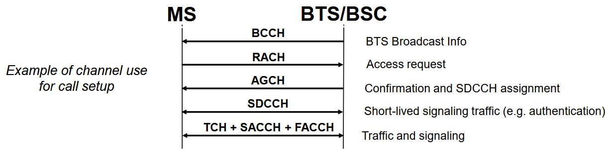

:::note[Cosa imparare]
Al Savi non interessa che impariamo a memoria tutti questi canali, ma è importante capire l'utilizzo di alcuni di essi per portare a compimento le procedure introdotte.
:::

#### GSM Identifiers

Servono per le varie procedure che vediamo tra poco.

| Identificatore | Descrizione |
| --- | --- |
| **MSISDN** (Mobile Station ISDN Number) | Il numero di telefono cellulare. Permanente e pubblico. |
| **MSRN** (Mobile Station Roaming Number) | Sintatticamente analogo al MSISDN, ma assegnato **provvisoriamente** quando bisogna instradare una chiamata verso uno specifico MSC. Temporaneo e privato, non noto fuori dalla rete radiomobile. |
| **IMSI** (International Mobile Subscriber Identity) | Identificatore assoluto della MS, scritto nella SIM e immagazzinato nell'HLR. Idealmente noto solo a HLR e SIM. |
| **TMSI** (Temporary Mobile Subscriber Identity) | Strutturato come IMSI ma **temporaneo e dinamico**, allocato alle MS e immagazzinato in VLR e SIM. |
| **LAI** (Location Area Identity) | Immagazzinato sia nella SIM (lato utente) che nel VLR. Identificatore univoco della Location Area. |

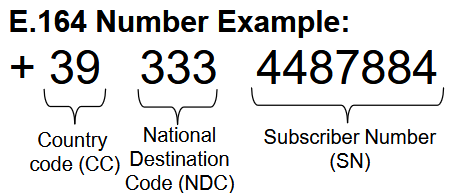

:::tip[Perché serve il TMSI oltre all'IMSI?]
Per **sicurezza**: l'IMSI è univoco e personale, quindi usarlo in chiaro sull'interfaccia radio permetterebbe a chiunque di leggerlo e tracciare la posizione dell'utente. Nel VLR si immagazzina un'associazione tra TMSI e IMSI, così quando possibile si usa il TMSI; quando l'utente si sposta ed è servito da un altro MSC (nuovo VLR), il TMSI viene modificato. Se il TMSI non è disponibile, si invia l'IMSI.
:::

:::note[IMSI e attivazione SIM]
Quando si compra una SIM bisogna aspettare un po' prima che sia attiva: l'IMSI scritto sulla SIM deve essere attivato e registrato nell'HLR.
:::

### GSM Authentication & Ciphering

GSM richiede **autenticazione** per inviare e ricevere chiamate. Sul segmento di interfaccia radio viene effettuata una **cifratura** della voce, per non poter "spiare". Queste operazioni sono gestite da un lato dalla **SIM**, dall'altro dalla rete (nodi **BTS/MSC/AUC**).

Servono:

- $K_i$: chiave di autenticazione univoca di **128 bit**, segreto condiviso tra utente e rete, scritta in modo permanente sulla SIM e immagazzinata nell'AUC;
- **RAND**: numero casuale di 128 bit generato dall'AUC e inviato alla MS tramite il MSC.

Le procedure usano 3 algoritmi standardizzati:

| Algoritmo | Eseguito da | Scopo |
| --- | --- | --- |
| **A3** | AUC e SIM | Autenticazione. |
| **A8** | AUC e SIM | Ottenere la chiave di cifratura condivisa $K_c$ tra rete e utente. |
| **A5** | MS (non SIM) e BTS | Stream cipher per la cifratura. |

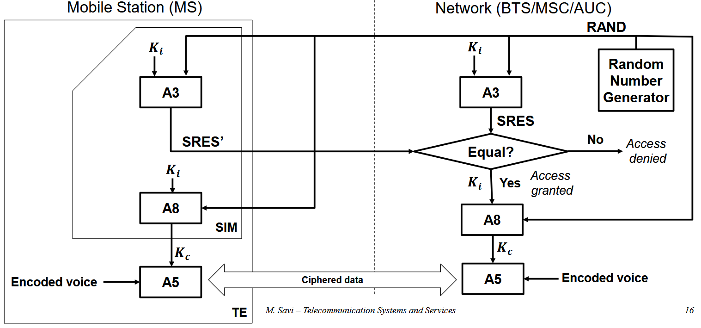

:::danger[Problema di sicurezza del GSM]
L'utente si autentica nei confronti della rete, ma la **rete NON si autentica** nei confronti dell'utente. Questo espone ad attacchi **Man-In-The-Middle** tramite **IMSI-catcher**. Il problema viene risolto a partire dalla generazione **3G**.
:::

### Procedure GSM

Vediamo alcune procedure fondamentali per comunicare su una rete GSM.

#### Turning on an MS

Cosa succede quando accendo una MS e deve essere pronta a comunicare? Siamo in **IDLE mobility**: il terminale si accende ed è pronto a inviare/ricevere chiamate, ma non ne sta effettuando.

1. All'accensione, si compie la **Cell Selection**: la MS si connette alla BTS con qualità migliore.
2. Poi la MS seleziona l'MSC attivo. La rete deve sapere che questo terminale è ora attivo. Ci sono 2 casi:
   - **IMSI Attach**: la Base Station fornisce lo stesso LAI già immagazzinato nella SIM. Significa che l'utente ha spento e riacceso il cellulare nello stesso posto: la rete ha già le info per localizzarlo e marca l'utente come attivo lato VLR. Dopo un tempo di inattività, viene flaggato come spento.
   - **Location Update**: non c'è un LAI nella SIM (primo accesso) o il LAI ricevuto è diverso da quello immagazzinato. Si inizializza la procedura di Location Update.

##### Location Update

Procedura eseguita in **IDLE mobility**, fondamentale per tenere traccia della LA in cui si trova un utente e aggiornarla. Due possibilità:

1. Le LA sono servite dallo **stesso MSC/VLR**: l'utente si sposta tra LA (BTS e BSC diversi), ma l'MSC non varia.
   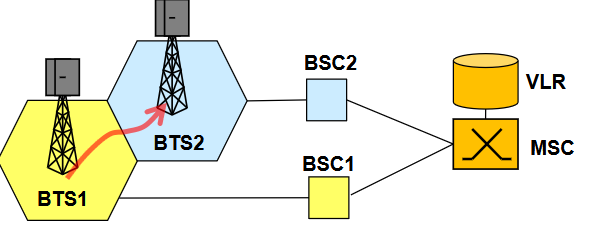
2. Location Update tra due LA servite da **due MSC diversi**. Più complicato e raro, ma succede.
   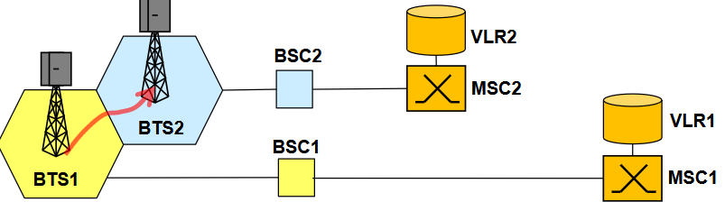

:::note
Al Savi non interessa che sappiamo a memoria i sequence diagram, ma è importante vederli (sono una marea, mostra solo i più importanti).
:::

###### Location Update con MSC/VLR uguale

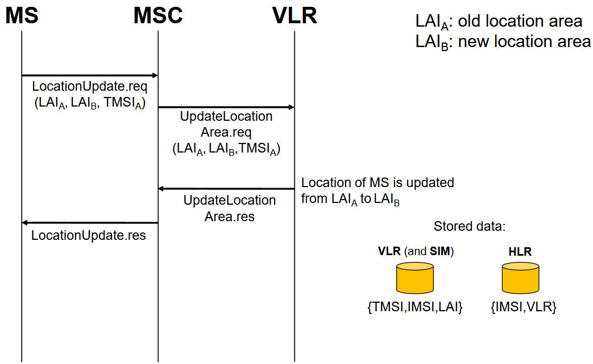

###### Location Update con MSC/VLR nuova

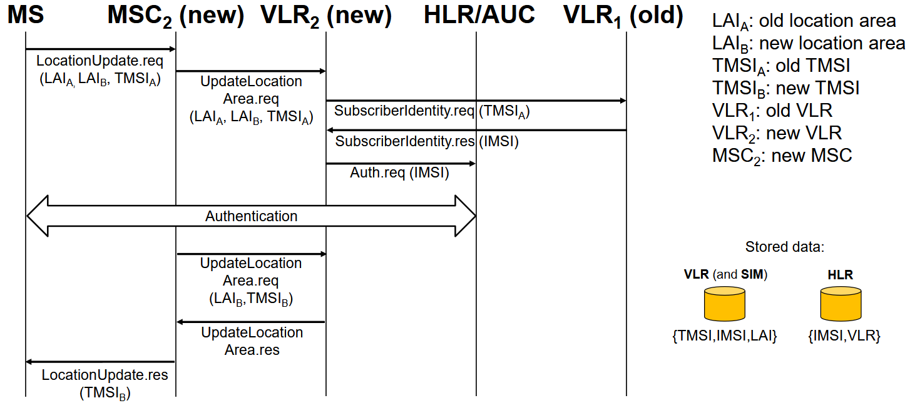
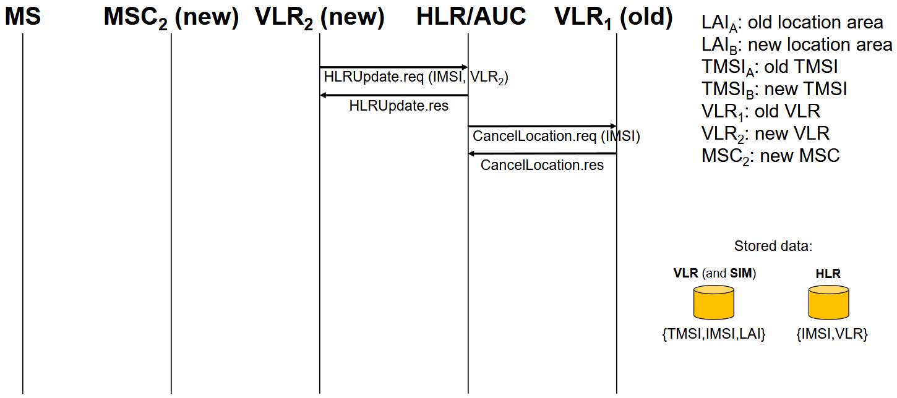

#### Call Setup

##### MS Initiated Call

La procedura è fondamentalmente la stessa di quella di VoIP.

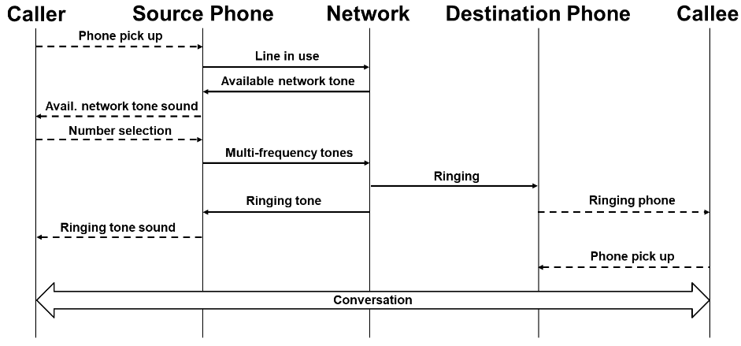

##### MS Terminated Call

Situazione in cui sono il **chiamato**. Consideriamo il caso più generale: chiamata dal PSTN verso una MS su una specifica rete radiomobile.

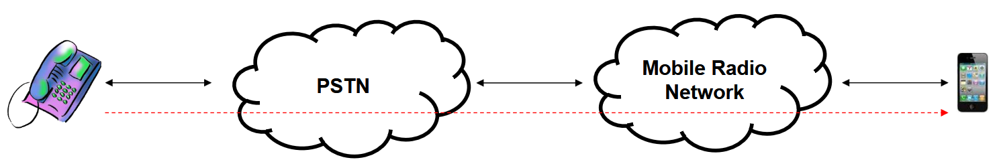
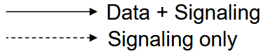

1. Il chiamante (PSTN user) digita il **MSISDN** del chiamato.
2. La rete PSTN analizza il numero e la chiamata viene instradata fino al **GMSC** della rete radiomobile.
3. Il GMSC riceve la richiesta di setup della chiamata.
   
4. Il GMSC interroga l'**HLR** per conoscere la posizione della MS.
   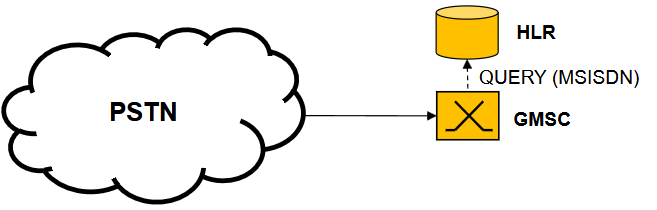
5. L'HLR analizza la richiesta e identifica nei suoi record il **VLR** attualmente visitato dal target MS.
6. L'HLR invia un messaggio "Routing Information Request" al VLR, includendo l'**IMSI** dell'utente.
7. Il VLR alloca un **MSRN** provvisorio, che verrà usato per instradare la chiamata al posto dell'MSISDN.
8. L'MSRN viene inoltrato al GMSC.
   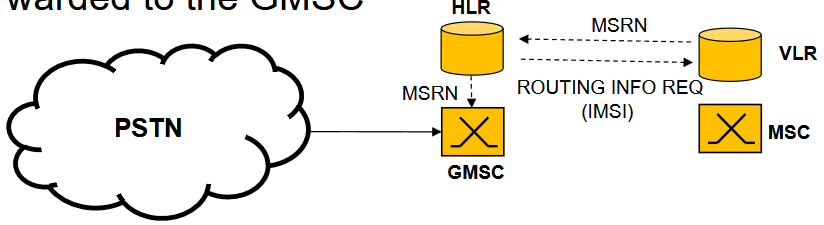
9. Grazie all'MSRN, la chiamata può essere instradata fino all'MSC relativo all'HLR che ha risposto.
   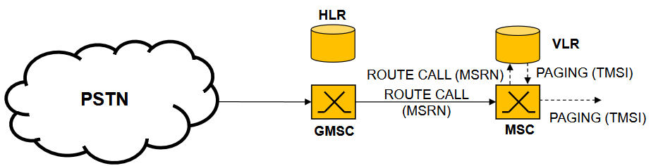
10. A questo punto l'MSC attiva la procedura di **paging** tramite il TMSI recuperato dal VLR:
    - identifica la LA attualmente visitata tramite la LAI immagazzinata nel VLR insieme al TMSI;
    - invia un comando di paging al BSC associato alla LA.
11. Il BSC inoltra il messaggio di paging alle BTS collegate tramite broadcast e canale **PCH**.
12. La MS risponde al paging e inizializza una procedura di accesso.
13. La MS inizia la procedura di autenticazione per l'assegnazione della **TCH**, in modo che la chiamata possa essere stabilita.

##### MS Terminated Call International Roaming - Caso 1

Caso in cui voglio chiamare un utente che si trova su una rete in un altro stato.

##### MS Terminated Call International Roaming - Caso 2

Sono un utente su rete telefonica standard americana e voglio chiamare un utente italiano che malauguratamente si trova in roaming su una rete radiomobile americana.

:::caution[Problema del GSM: Dati e Segnalazione seguono lo stesso flusso]
Se chiamo dagli Stati Uniti un numero italiano che si trova in roaming negli Stati Uniti, c'è un percorso **tortuoso** che porta al pagamento di **due chiamate internazionali**, perché i flussi dati arrivano fino all'Italia per poi tornare indietro.
:::

##### Mobile Number Portability (MNP)

Servizio che permette di cambiare provider di rete radiomobile senza dover cambiare numero di telefono.

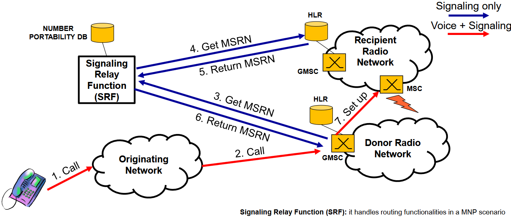

- **Donor Radio Network** → vecchio operatore
- **Recipient Radio Network** → nuovo operatore

##### Handover

La procedura è inizializzata dalla **rete**, ma **assistita** dal terminale MS: riceve il beacon da varie Base Station, raccoglie informazioni sul livello di potenza attorno a sé e le invia alla rete sul canale **SACCH**. Sulla base di queste misure, la rete decide se fare handover.

3 tipi di Handover:

| Tipo | Descrizione |
| --- | --- |
| **Intra BSC** | Le due celle sono collegate allo stesso BSC. Caso più semplice. |
| **Inter BSC** (intra MSC) | Handover tra celle gestite da due BSC diversi (quindi LA diverse): l'MSC deve essere coinvolto. |
| **Inter MSC** | Caso più complesso: anche i BSC sono gestiti da MSC diversi. |

Ci focalizziamo sul caso 2 (Inter BSC ma intra MSC).

###### Inter BSC

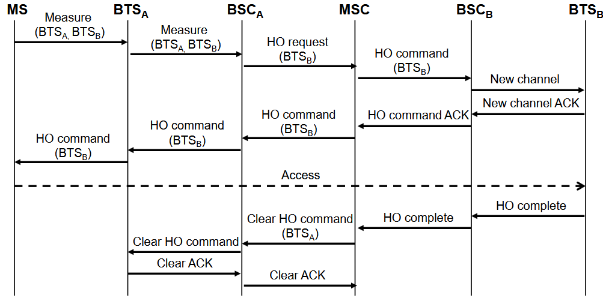

### GPRS

**GPRS** (General Packet Radio Service) è un servizio di commutazione di pacchetto costruito sopra GSM. È la prima tecnologia che permette la comunicazione a **commutazione di pacchetto** sulla rete radiomobile.

Alcuni canali vengono dedicati al GPRS e viene definito un nuovo tipo di canale: **PDTCH** (Packet Data Traffic Channel).

:::note[EDGE]
Evoluzione di GPRS, con miglioramenti che quasi raddoppiano la velocità, ma comunque molto lenta per il giorno moderno (**170 Kbps** e **270 Kbps**).
:::

Come è fatto l'overlay della rete GPRS su GSM?

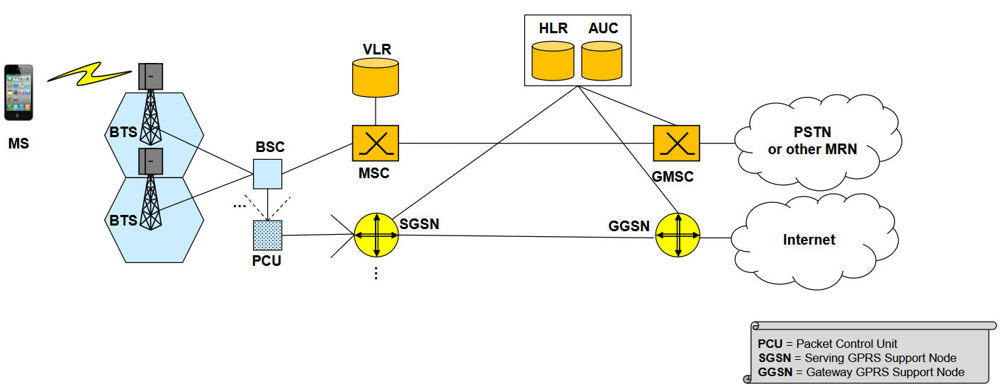

Il nuovo nodo **PCU** ha praticamente lo stesso ruolo del BSC, ma per la commutazione di pacchetto (ce ne sono meno dei BSC; agiscono comunque insieme). Nella parte di core ci sono due nodi aggiuntivi: **SGSN** e **GGSN**, commutatori di pacchetto (router) che svolgono operazioni aggiuntive.

#### Packet Forwarding

Un concetto fondamentale è quello di **tunnel**, che si porta dietro in tutte le generazioni successive (anche se dal 3G il termine usato è **bearer**). Per comunicare nelle reti radiomobili vanno stabiliti dei tunnel.

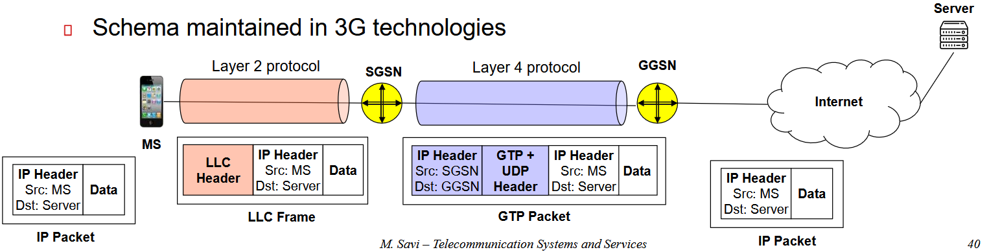

Vengono stabiliti **2 tunnel**: uno di livello 2 tra MS e SGSN, e uno di livello 4 tra SGSN e GGSN. Senza questi tunnel l'utente non può comunicare: vanno visti come dei **bit-pipe**.

- Il tunnel di **livello 2** usa il protocollo **LLC** (Logical Link Control): di fatto è solo l'incapsulamento in una trama di un protocollo di livello 2.
- Il tunnel di **livello 4** usa **GTP** (GPRS Tunnelling Protocol): qui c'è incapsulamento IP effettivo. Prendo il pacchetto con origine MS e destinazione il server, lo incapsulo in un altro pacchetto IP con sorgente SGSN e destinazione GGSN, aggiungendo un'intestazione GTP. Qui il termine "tunnel" ha più senso.

##### Tunnels for Mobility Management

Ogni volta che mi sposto, posso aver bisogno di stabilire nuovi tunnel.

Se l'utente si sposta in una Base Station gestita da un SGSN diverso, bisogna definire nuovi tunnel. Il concetto di tunnel è quindi importante sia per la **connettività** sia per la gestione della **Mobility** (crea e distrugge tunnel).

## 3G - UMTS

**UMTS** (Universal Mobile Telecommunications System) è la prima tecnologia 3G.

La rete 3G ha sia una parte a commutazione di circuito, sia una a commutazione di pacchetto (ci focalizziamo sulla seconda). Le principali innovazioni si hanno nella **RAN**, mentre la Core Network non cambia molto rispetto al 2G:

- nuova interfaccia radio basata su **CDMA** che permette bitrate molto più elevati;
- **soft handover**;
- introduzione del concetto di **bearer**.

### Architettura di UMTS

Rispetto al 2G: piccole differenze funzionali, ma grandi differenze nei nomi.

- la RAN si chiama **UTRAN** (UMTS RAN);
- le Base Station si chiamano **NodeB**;
- il BSC diventa **RNC** (Radio Network Controller);
- a livello di Core, AUC e HLR vengono consolidati in un unico nodo **HSS** (Home Subscriber Server);
- nuovi nodi **MGW** (Media Gateway) e **IMS** (IP Multimedia Subsystem).

Il **Media Gateway** converte gli stream audio/video tra tecnologie diverse per garantire interoperabilità.

### Avanzamenti di UMTS

- Higher Speed Data
- Primo rilascio di UMTS: **2 Mbit/s**
- **HSPA** (High Speed Packet Access): 14.4 Mbit/s in downlink, 5.76 Mbit/s in uplink
- **HSPA+**: 42 Mbit/s in downlink. Introduce il concetto di **flat network**: disaccoppiare il percorso dei flussi dati da quello dei flussi di controllo, ottimizzando il percorso dei flussi dati per renderlo il più diretto possibile. È quello che c'è al giorno d'oggi, anche se il 3G è in dismissione (copertura totale con 4G e 5G).
- introduzione del concetto di **bearer**: posso creare bearer di tipo diverso sulla base della tipologia di traffico, per usare la rete 3G per la multimedialità dei dati.

#### Bearer Services

Un **Bearer** è un concetto flessibile di "bitpipe" come il tunnel, ma con associati determinati **attributi di QoS**.

Un bearer appartiene a uno specifico **Bearer Service**. I Bearer Service si distinguono in base alle entità coinvolte. Esistono **4 classi di QoS** per i Bearer Service:

- Conversational
- Streaming
- Interactive
- Background

Attributi associabili alla QoS service class per la definizione di un Bearer:

- Maximum bitrate (kbps)
- Guaranteed bitrate (kbps)
- Transfer delay (ms)
- Error probability

I tipi di Bearer Service più importanti (distinti per nodi coinvolti):

| Bearer Service | Tra quali nodi |
| --- | --- |
| **Core Network Bearer Service** | nodi della Core Network (SGSN e GGSN) |
| **Radio Access Bearer Service** | UE e SGSN |
| **Radio Bearer Service** | UE e RNC |

Per comunicare è sempre fondamentale che venga stabilito un **Radio Access Bearer**; una volta stabilito, l'utente può effettivamente comunicare.

### Soft Handover

Possibilità per uno UE di essere collegato a **più NodeB contemporaneamente** (massimo **6**). La decisione è presa dal **RNC**.

- in **uplink**: le varie NodeB ricevono la stessa trasmissione dell'utente e il primo dato ricevuto correttamente è mantenuto dal RNC;
- in **downlink**: ogni NodeB invia la trasmissione verso lo UE e il primo dato ricevuto correttamente è mantenuto dallo UE.

| | |
| --- | --- |
| ✅ **Vantaggio** | Migliore qualità e minore rischio di interruzione (maggiore ridondanza). |
| ⚠️ **Svantaggio** | Maggiore allocazione di risorse. |

### New Authentication Scheme

Viene risolto il problema di autenticazione di GSM: a partire dal 3G è presente una **mutua autenticazione**.

Abbiamo sempre il segreto condiviso $K_i$ (nella SIM e nell'HSS) e il numero **RAND** scelto dalla rete e inviato all'utente. Lo stesso algoritmo viene eseguito da SIM e rete, ma in output non si ha più un singolo SRES, bensì due valori: **XRES** e **AUTN**.

All'utente viene inviato anche AUTN: l'utente dà in input al suo algoritmo RAND e $K_i$, ottenendo XRES' e AUTN'. Se AUTN' è uguale ad AUTN ricevuto, **la rete è autenticata** nei confronti dell'utente. L'utente invia poi alla rete XRES'; se la rete, calcolando XRES, trova corrispondenza, **l'utente è autenticato** nei confronti della rete.

## 4G - LTE

**LTE** = Long Term Evolution.

I grossi cambiamenti rispetto alle 2 generazioni precedenti:

- **concetto ALL-IP**: tutto ciò che concerne la rete radiomobile è basato su IP.
  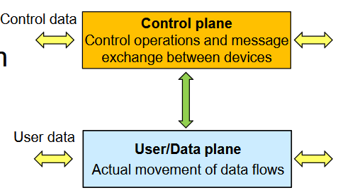
  :::danger[Niente più commutazione di circuito]
  Nell'ambito radiomobile, **data plane = user plane**. Tutto ciò che concerne i protocolli dello User Plane e del Control Plane viene spostato nativamente su commutazione di pacchetto. **NON ESISTE PIÙ UNA RETE A COMMUTAZIONE DI CIRCUITO.**
  :::
- **concetto di flat network**: la RAN include **1 solo nodo** (eNodeB). C'è separazione tra flussi dati e flussi di controllo: i flussi dati non seguono per forza lo stesso percorso dei flussi di controllo. L'obiettivo è un percorso il **più diretto possibile** per i flussi dati, che attraversi il minor numero di nodi, riducendo la latenza.

LTE porta grossi miglioramenti a RAN e Core Network. A livello fisico:

- viene usato **OFDM/OFDMA**;
- modulazione adattiva e coding;
- supporto nativo per **MIMO**.

Con LTE ci si aspettava (e c'è stata) una grossa esplosione del traffico, con l'obiettivo di essere usata non solo dai cellulari ma anche da molti altri dispositivi.

### Evoluzione verso la Flat Network

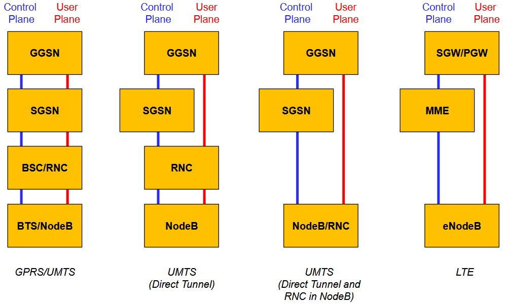

L'arrivo al flusso dati diretto della 4G parte già dalle generazioni precedenti.

### Evoluzione verso la all-IP

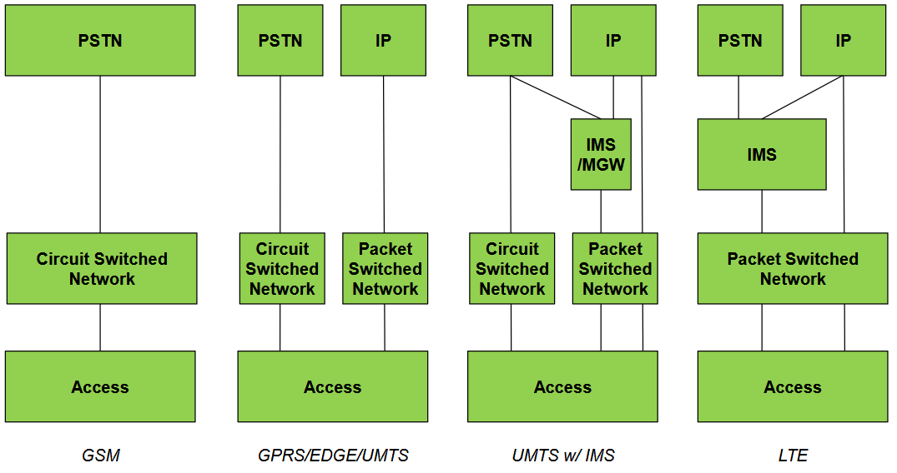

### Architettura di LTE

Da mettersi le mani nei capelli, perché quasi tutti i nodi hanno un nome differente.

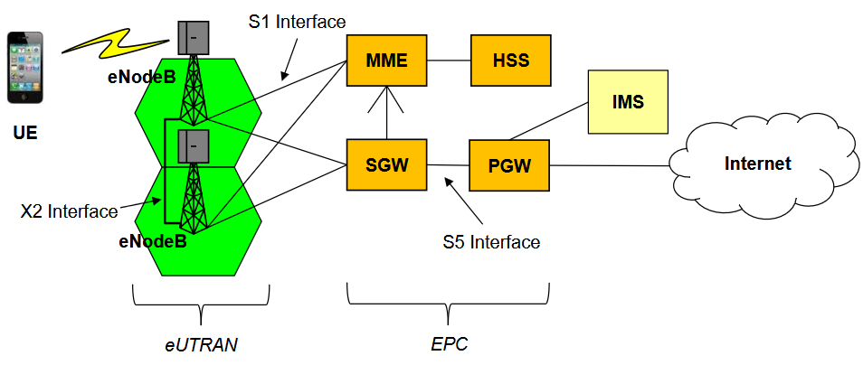

Non si ha più un controllore come il BSC (2G) o l'RNC (3G): le funzioni "collassano" nell'**eNodeB**.

A livello di Core Network abbiamo **HSS, SGW, PGW, IMS e MME**. La quasi totalità delle funzionalità di mobility è eseguita dalla **Mobility Management Entity (MME)** che, essendo di Control Plane, non viene mai attraversata dai flussi dati. La telefonia è fatta tramite **VoLTE**. LTE permette trasmissione dati fino a **1 Gbit/s**.

:::tip[X2 Interface]
Novità rispetto alle generazioni precedenti: un collegamento **diretto** tra eNodeB, per mezzo di un'interfaccia chiamata **X2 Interface**. Quando le eNodeB sono collegate tra loro, l'handover è molto più facile.
:::

#### eNodeB

Gestisce le risorse radio. Funziona come **relay node** verso i SGW. Può essere connesso a un set di MME/SGW, ma ogni UE è connesso solo a uno di essi.

#### Evolved Packet Core (EPC)

Permette di mettere in comunicazione applicazioni eterogenee. Può interconnettere non solo Base Station della UTRAN, ma anche di generazioni precedenti (es. UMTS), o gestire connettività wireless di tecnologie diverse. Va immaginato come un **cervello** che può controllare reti RAN tecnologicamente eterogenee (cosa però non tanto tipica, soprattutto in Italia).

La EPC fornisce la stragrande maggioranza delle funzioni di mobility, soprattutto tramite la **MME**.

##### Management Entity (MME)

- Svolge la quasi totalità delle funzioni di **mobility**.
- Uno UE stabilisce un collegamento diretto con la MME per le procedure di mobility.
- Ha un ruolo per autenticazione e security.
- Include le funzionalità che erano di VLR/MSC.
- Contiene un Database per le info sulla **Tracking Area** (o Location Area) visitata da un UE.
- È coinvolta negli handover **quando la X2 Interface NON è utilizzata**.

Uno dei ruoli fondamentali è stabilire **Bearer** tra i componenti in rete. Il più importante è il **Default Bearer**, stabilito tra UE e PGW quando un terminale entra nella rete ed è in IDLE state, tramite la procedura di **attach**. Se invece l'utente vuole comunicare, la MME stabilisce altri Bearer, tra cui:

- **S1 Bearer** → tra eNodeB e SGW, per lo specifico utente;
- **Radio Bearer** → tra UE e eNodeB.

Senza questa coppia di Bearer, l'utente non può inviare/ricevere dati.

##### Serving Gateway (SGW)

- Quando non c'è la X2 Interface e c'è un Handover in corso, fa **Packet re-routing**: bufferizza e inoltra i pacchetti alla eNodeB corretta.
- Quando il PGW invia pacchetti a un UE in IDLE, bufferizza i pacchetti e richiede alla MME di inizializzare il **Paging**.

##### PDN Gateway (PGW)

Mette in comunicazione la rete radiomobile con le reti esterne. Assegna gli indirizzi IP ai terminali (ha un server **DHCP** interno). Gestisce tariffazione e statistiche.

##### Home Subscriber Server (HSS)

Database che implementa le funzionalità svolte da HLR/AUC nel 2G e dallo stesso HSS nel 3G.

### Packet Forwarding (Bearer)

Come si stabiliscono i Bearer (tunnel) nella 4G? La situazione è più pulita rispetto a GPRS.

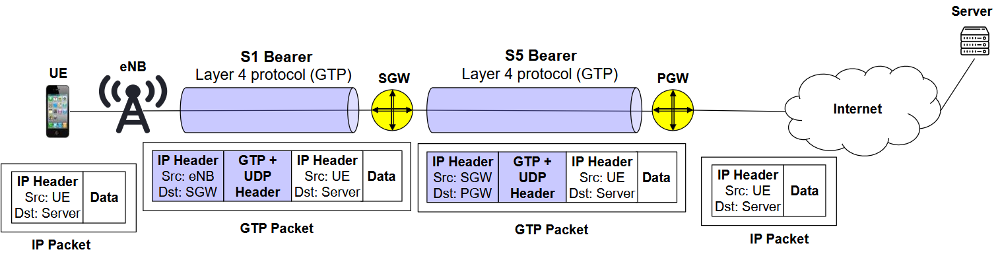

Si ha la necessità di stabilire **2 Bearer**, entrambi tunnel di livello 4 con incapsulamento IP: tunnelling effettivo.

Se un utente si muove, bisogna creare e distruggere i Bearer di conseguenza:

### Attach Procedure

Procedura fondamentale per assegnare un **Default Bearer** all'utente. Uno UE può essere localizzato a livello di **Tracking Area** quando è in IDLE. Quando una UE cerca di accedere alla rete, la procedura di Attach si compone di 4 passaggi:

1. Autenticazione alla rete.
2. Un indirizzo IP viene assegnato allo UE dal **PGW**.
3. Un **Default Bearer** viene creato tra UE e PGW, mantenuto per tutto il tempo in cui il terminale è IDLE sulla rete. La MME comunica ai vari nodi di stabilire questo Bearer.
4. L'identità dell'MME che serve questo UE viene comunicata all'**HSS** (che deve sapere quale MME contattare per rintracciare l'utente).

:::tip[IMPORTANTE]
Le risorse assegnate al Default Bearer vengono mantenute **finché il terminale non viene spento**.
:::

### Tracking Area Update

Analogo alla Location Area Update delle generazioni precedenti. Differenze sostanziali nessuna, se non che si parla di **Tracking Area** (solitamente più piccola come numero di celle). Inoltre:

- l'identificatore temporaneo TMSI cambia nome e diventa **GUTI** (Global Unique Temporary ID), mentre IMSI rimane;
- invece del LAI, abbiamo il **TAI** (Tracking Area Identifier).

### Handover

Due scenari possibili:

| Scenario | Descrizione |
| --- | --- |
| **Handover tramite X2 Interface** | La maggior parte dei messaggi di segnalazione viene scambiata tra gli eNodeB coinvolti. La MME è quasi non coinvolta (solo per comunicare esiti e stabilire altri Bearer). Gli eNodeB gestiscono la procedura in maniera quasi autonoma. |
| **Handover tramite S1 Interface** | Quando non è presente la X2 Interface. |

### Downstream Packet Handling Procedure

Traffico in Downstream che dall'esterno deve raggiungere il terminale UE. Due casi:

1. terminale in stato **active**: c'è già un S1 Bearer tra SGW e eNB, il pacchetto può essere inviato;
2. **non** c'è un S1 Bearer: la MME avvia il Paging e, mentre procede, i dati vengono bufferizzati dal SGW. Vengono stabiliti un nuovo S1 Bearer e un Radio Bearer tra UE e eNB; fatto questo, i pacchetti scorrono in downstream.

### Circuit Switched Services in LTE

Si ha un'interazione tra le reti di generazioni differenti, per poter passare alla generazione precedente e ricevere la chiamata. Si mettono in comunicazione le due reti radiomobili tramite un'interfaccia di nome **SGs interface**, posta tra MME della rete 4G e MSC della rete GSM o 3G.

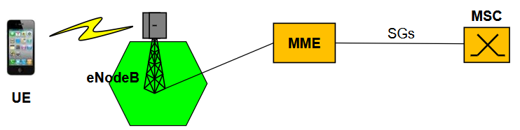

Se voglio fare chiamate sulla rete 4G nativamente su IP, si usa **VoIP** e basta. Altrimenti, se VoIP non è supportato dall'operatore, si informa l'utente di una chiamata entrante tramite il **paging LTE** (segnalazione), ma poi si **switcha sulla rete 2G/3G** per la chiamata vera e propria. Le risorse di circuito vengono quindi stabilite sulla rete di generazione precedente.

## 4G - LTE - The Role of Virtualization

Concetti ripresi nativamente dalla rete 5G.

Con 4G abbiamo una rete **all-IP** e **flat**, con separazione totale tra Control e Data plane e ottimizzazione dei flussi dello User Plane. Da questa separazione nasce l'idea di **virtualizzare** tutto ciò che concerne i messaggi e le funzionalità del Control Plane: si prendono le funzionalità che non riguardano i dati dell'utente e si sfruttano tecniche di virtualizzazione.

:::note[Virtual Evolved Packet Core (vEPC)]
Aggregati di funzioni di rete virtualizzate, sfruttando il paradigma **NFV**, che portano a **costi più bassi** (modifiche software invece che hardware) e **maggiore flessibilità** (scale up/down sulla base degli utenti da servire).
:::

Il trend è scorporare la funzionalità relativa al Control Plane da quella dello User Plane:

- PGW splittato in **PGW-U** (User Plane) e **PGW-C** (Control Plane);
- SGW splittato in **SGW-U** (User Plane) e **SGW-C** (Control Plane).

La soluzione è virtualizzare tutto ciò che concerne il Control Plane (PGW-C, SGW-C, MME e HSS → vEPC).

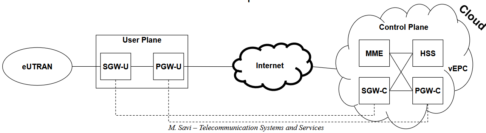
