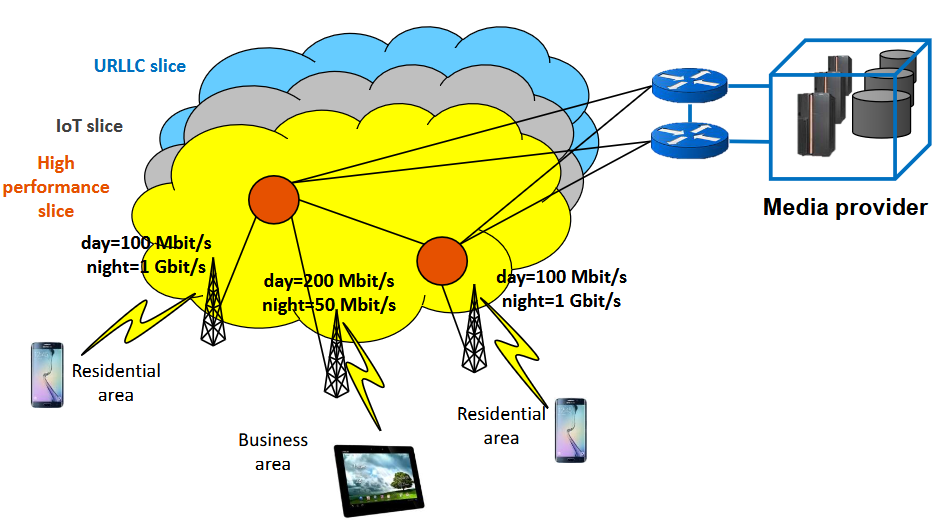

## Evoluzione Verso 5G
Il focus delle evoluzioni delle varie generazioni è stato sempre migliorare il bitrate fornito agli utenti. Con il 5G, invece, si ha un cambio di paradigma: andare a migliorare le prestazioni in termini di bitrate è solo uno degli obiettivi, dove altri sono riduzione sostanziale della latenza, possibilità di avere altissima affidabilità sulla rete, possibilità di gestire un altissimo numero di utenti e riduzione del consumo energetico.

Un ruolo fondamentale nella rete 5G è ricoperto dalla virtualizzazione. Un concetto fondamentale è il Network Slicing.

### The Role of Virtualization
#### Network Slicing
Affettamento della rete 5G. Si sfruttano i paradigmi innovativi NFV e DSN per creare delle reti che sono separate e specializzate, che prendono il nome di Network Slices. Ogni Slice è assegnata a dei "tenant" differenti. 

Nonostante il termine slice, fondamentalmente quello che andiamo a creare sono delle reti virtuali isolate l'una dall'altra in cui se ci sono problemi su una non impattano le altre. Nonostante sia prevista dalla tecnologia, siamo ancora lontani dall'averla sul mercato.

#### Edge Computing
Possiamo vederlo come questo paradigma di computazione che prevede di fornire, appunto, computazione agli utenti nelle loro vicinanze. Ci sono degli Edge Nodes nelle vicinanze degli utenti, la cui computazione può essere usata dagli utenti stessi.

Possono essere virtualizzate le risorse di computazione di storage e memoria e messe a disposizione agli utenti nella rete RAN. Questo può essere utile perché quando si hanno determinate applicazioni che richiedono bassa latenza è fondamentale che la computazione sia effettuata il più vicino possibile all'utente.

Con questi Edge Node è possibile fornire dei servizi di rete avanzati agli utenti, nella forma di Virtual Network Function (VNFs).

L'idea è spostare il più possibile la computazione verso l'utente.

Possiamo fare un'analogia con le CDN: hanno l'obiettivo di fare la stessa cosa, ovvero spostare i contenuti vicino l'utente.

