## Evoluzione Verso 5G

Il focus delle evoluzioni delle varie generazioni è sempre stato migliorare il **bitrate** fornito agli utenti. Con il 5G si ha un **cambio di paradigma**: il bitrate è solo **uno** degli obiettivi. Gli altri sono:

- riduzione sostanziale della **latenza**;
- altissima **affidabilità** sulla rete;
- gestione di un **altissimo numero** di utenti;
- riduzione del **consumo energetico**.

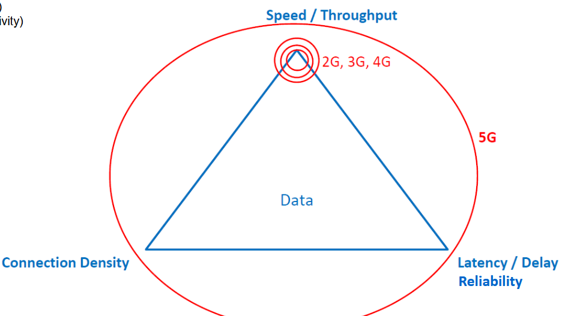
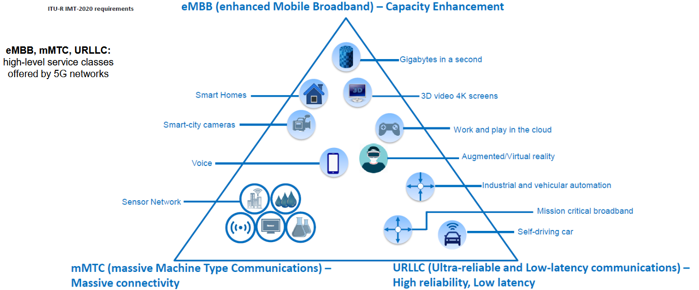

Un ruolo fondamentale nella rete 5G è ricoperto dalla **virtualizzazione**. Un concetto centrale è il **Network Slicing**.

### The Role of Virtualization

#### Network Slicing

Affettamento della rete 5G. Si sfruttano i paradigmi innovativi **NFV** e **SDN** per creare reti separate e specializzate, che prendono il nome di **Network Slice**. Ogni Slice è assegnata a "tenant" differenti.

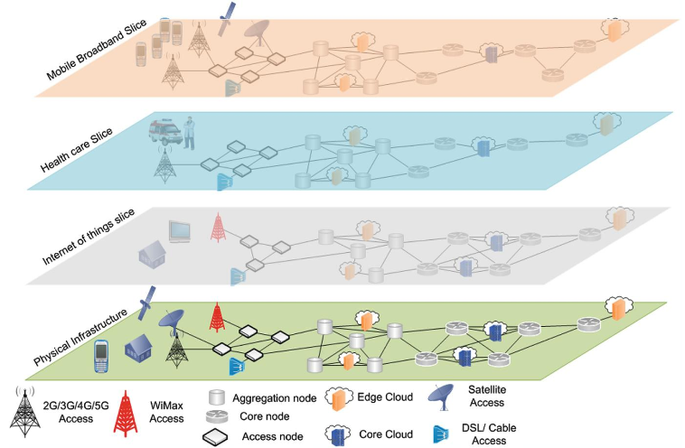

Nonostante il termine "slice", quello che creiamo sono di fatto **reti virtuali isolate** l'una dall'altra: se ci sono problemi su una, non impattano le altre.

:::note
Nonostante sia prevista dalla tecnologia, siamo ancora lontani dall'averla sul mercato.
:::

#### Edge Computing

Paradigma di computazione che prevede di fornire computazione agli utenti **nelle loro vicinanze**. Ci sono degli **Edge Node** vicino agli utenti, la cui computazione può essere usata dagli utenti stessi.

Si possono virtualizzare le risorse di computazione, storage e memoria e metterle a disposizione nella rete RAN. Utile quando determinate applicazioni richiedono **bassa latenza**: è fondamentale che la computazione sia il più vicino possibile all'utente.

Con questi Edge Node è possibile fornire servizi di rete avanzati nella forma di **Virtual Network Function (VNF)**. L'idea è spostare il più possibile la computazione verso l'utente.

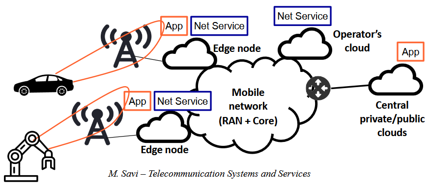

:::tip[Analogia con le CDN]
Hanno lo stesso obiettivo: spostare i contenuti (qui, la computazione) vicino all'utente.
:::

#### Onde Millimetriche

Con **Onde Millimetriche** ci si riferisce al range tra **24 GHz e 300 GHz**, dove la wavelength è compresa tra **10 mm e 1 mm**.

Sono appetibili per gli operatori perché:

- siamo in una porzione di spettro il cui utilizzo è praticamente **nullo** per le trasmissioni;
- essendo a frequenze elevate, c'è una porzione di **banda disponibile molto elevata**;
- si possono avere **array di antenne molto piccoli di dimensioni**, con cui fare cose come il MIMO.

:::tip[Perché antenne così piccole?]
La lunghezza delle antenne dipende dalla lunghezza delle onde che si trasmettono e ricevono.

:::

:::caution[Limitazioni delle mmWave]
- altissima **Path Loss** (direttamente proporzionale alla frequenza: più la frequenza è alta, più si perde);
- alto impatto degli **agenti atmosferici**;
- la presenza di **ostacoli** crea grossi problemi nella trasmissione.
:::

**Soluzione**: usare la tecnologia nel caso di **Small Cells**, ovvero celle molto piccole (raggio < 200 m), garantendo pochi problemi di attenuazione e assorbimento atmosferico. Inoltre, mettendo un'antenna in un ambiente piccolo ma con pochi ostacoli, si copre bene chi si trova nell'area, garantendo capacità molto elevate. Si hanno tante antenne, ma a potenze molto basse.

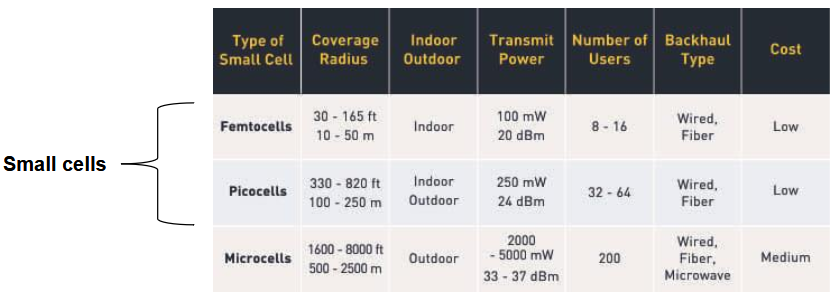

#### Massive MIMO

Altra tecnologia su cui fa forte affidamento il 5G. Spinge all'estremo quello che il MIMO permette di fare: si ha un **array di antenne** e un certo numero di esse viene usato per trasmettere segnale **esclusivamente a uno specifico utente**.

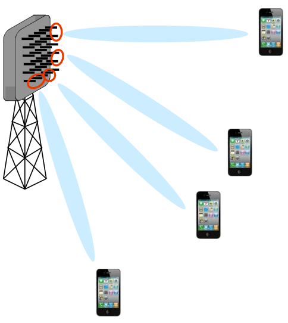

Si può usare questa tecnologia con **fasci molto stretti**, ottenendo un segnale che si propaga nella direzione dell'utente. Grazie a questo si può **riutilizzare la stessa banda** di frequenza senza grossi problemi.

:::tip[Beamforming]
Tecnica fondamentale che permette di **indirizzare** il segnale radio verso un terminale mentre questo si sposta (come un laser che punta al terminale). Permette un segnale più stabile.
:::

Massive MIMO non è ancora diffusissima e non si può adottare per tutti gli utenti, ma solo in casi specifici.

### Architettura 5G (SBA)

Questa architettura prende il nome di **Service Based Architecture**.

Altra marea di acronimi quasi tutti diversi rispetto a prima 💀🫠.

Il 5G vuole fornire nativamente la possibilità di **virtualizzare** le proprie componenti: gran parte delle componenti possono essere virtualizzate e deployate in Cloud o all'Edge.

:::note[CUPS: il massimo della Flat Network]
Già in 4G si cercava di separare Control e Data plane con ottimizzazione del Data Plane; nel 5G è presente la **CUPS** (Control User Plane Separation) **totale**. Tutte le funzionalità del piano di controllo sono disaggregate in funzionalità il più possibile **atomiche**, che svolgono compiti ben precisi.
:::

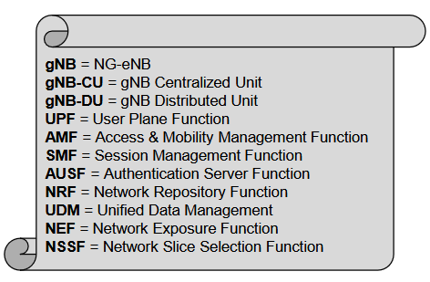

Tutte le interfacce a livello di Control Plane possono parlare tra di loro per mezzo di una serie di **interfacce REST**.

#### 5G RAN

##### Next Generation NB (gNB)

Il nodo fondamentale nella 5G RAN è il **gNB** (gNodeB). Può essere splittato in due nodi funzionali:

| Nodo | Responsabile per |
| --- | --- |
| **gNB-DU** | layer 1 e layer 2 |
| **gNB-CU** | layer 2 (parte alta) e layer 3 |

La **gNB-DU** deve trovarsi a non più di **1 ms** di distanza dall'antenna. La **gNB-CU** può essere posta più in profondità nella rete, e una CU può controllare più DU.

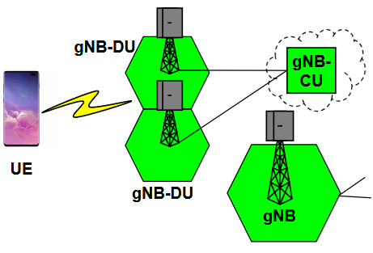

:::note[C-RAN]
Il concetto di virtualizzare la gNB-CU prende il nome di **C-RAN** (Cloud RAN): quella componente è stata virtualizzata e cloudificata.
:::

##### SD-RAN

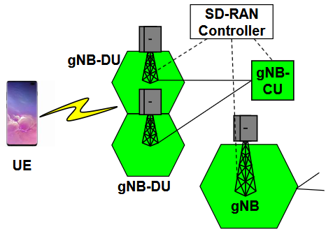

**Software-Defined RAN**: una rete RAN in cui un **SD-RAN Controller** ha il compito di controllare le gNB e le varie sottocomponenti.

#### 5G Core - Control Plane

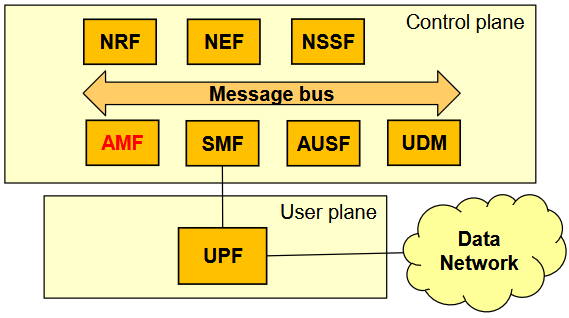

:::note
L'AMF è in rosso nell'immagine semplicemente perché nelle slide del professore viene evidenziato il componente di cui si sta parlando.
:::

##### Funzioni con Controparti in EPC di 4G

###### Access & Mobility Management Function - AMF

Gestisce gli aspetti relativi alla **mobility** degli utenti. La controparte in 4G è l'**MME** (per le funzionalità di mobility).

###### Session Management Function - SMF

Gestisce le **sessioni** e alloca gli indirizzi IP agli utenti.

Il concetto di tunnel (2G) → bearer (3G/4G) continua: in 5G si usano i termini **Session** e **Bearer**. Si può immaginare la SMF come un componente che gestisce Bearer e Sessioni. Le controparti in 4G sono **MME** e **SGW/PGW** (per la gestione dei Bearer).

###### Authentication Server Function - AUSF

Esegue l'**autenticazione** con uno UE. La controparte è l'**HSS** della EPC (con 5G si disaggrega, avendo una sola funzionalità dedicata all'autenticazione).

###### Unified Data Management - UDM

Repository che mantiene le informazioni di tutti gli utenti. La controparte è l'**HSS** della EPC.

##### Funzioni senza Controparti in EPC di 4G

###### Network Repository Function - NRF

Ci sono tante funzioni nuove che svolgono compiti diversi e devono comunicare tra loro. La NRF mantiene una **Repository** di tutte le funzioni di cui si può fare il deployment e tiene le info su quali funzioni sono effettivamente attive in rete e come possono essere raggiunte dalle altre. Componente fondamentale per la gestione di tutte le funzioni.

###### Network Exposure Function - NEF

Permette a utenti **esterni**, previa autenticazione, di accedere a informazioni nella rete 5G (es. tariffazione di servizi, logging, analytics). Ci sono delle **API** interrogate da sistemi esterni.

###### Network Slice Selection Function - NSSF

Quando un terminale effettua la procedura di Attach, la NSSF seleziona la **Network Slice** a cui l'utente si deve collegare. Se non c'è più di una Slice, si usa quella di default e questo componente non fa nulla.

#### 5G Core - User Plane

##### User Plane Function - UPF

È fondamentalmente un **router** che inoltra i pacchetti tra la RAN e le reti esterne. Ha anche il compito di fare **enforcement** dei requisiti di QoS. La controparte in 4G è **PGW e SGW** nella EPC.

### Packet Forwarding

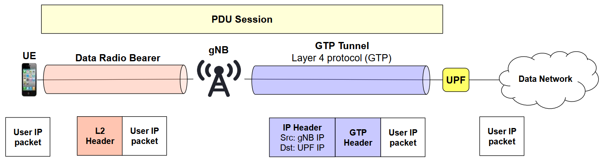

Nella 5G abbiamo una sessione di nome **PDU Session**, in qualche modo analoga al **Default Bearer** del 4G. Quando stabilita, viene mantenuta per tutta la connessione dell'utente.

### Deployment di Rete 5G

Due possibilità:

| Tipo | Descrizione |
| --- | --- |
| **Stand-Alone (SA)** | Un nuovo operatore mette in piedi una rete 5G. Si può fare, ma ha costo molto elevato. |
| **Non-Stand-Alone (NSA)** | Nuove gNB connesse a una 4G EPC esistente. Il Core Network viene poi evoluto incrementalmente, fino a migrare tutto il core 4G al core 5G. |

### Recap delle Innovazioni di 5G

- **Disaggregazione**: splittare i moduli in funzioni indipendenti.
- **Virtualizzazione**: abilità di eseguire istanze di funzioni virtualizzate.
- **Commoditization**: una volta disaggregate, virtualizzate e cloudificate le funzionalità, si possono scalare in maniera elastica (su/giù) in base alla situazione del momento (es. di notte, con meno utenti, si diminuiscono le risorse).

### Attori del 5G

- Telco operators
- Over the Top (OTT) operators
- Companies offering innovative services
- Companies offering advanced virtualization technologies
