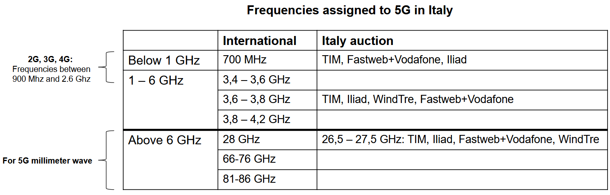
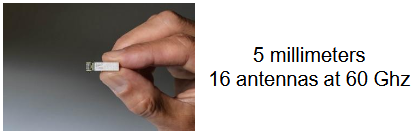
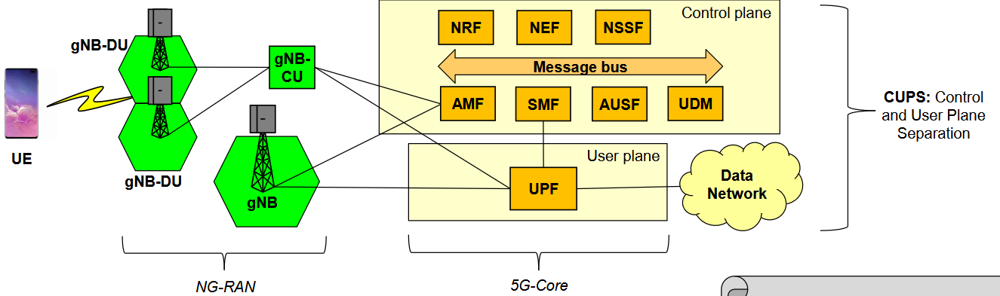

## Evoluzione Verso 5G
Il focus delle evoluzioni delle varie generazioni è stato sempre migliorare il bitrate fornito agli utenti. Con il 5G, invece, si ha un cambio di paradigma: andare a migliorare le prestazioni in termini di bitrate è solo uno degli obiettivi, dove altri sono riduzione sostanziale della latenza, possibilità di avere altissima affidabilità sulla rete, possibilità di gestire un altissimo numero di utenti e riduzione del consumo energetico.

Un ruolo fondamentale nella rete 5G è ricoperto dalla virtualizzazione. Un concetto fondamentale è il Network Slicing.

### The Role of Virtualization
#### Network Slicing
Affettamento della rete 5G. Si sfruttano i paradigmi innovativi NFV e DSN per creare delle reti che sono separate e specializzate, che prendono il nome di Network Slices. Ogni Slice è assegnata a dei "tenant" differenti. 

Nonostante il termine slice, fondamentalmente quello che andiamo a creare sono delle reti virtuali isolate l'una dall'altra in cui se ci sono problemi su una non impattano le altre. Nonostante sia prevista dalla tecnologia, siamo ancora lontani dall'averla sul mercato.

#### Edge Computing
Possiamo vederlo come questo paradigma di computazione che prevede di fornire, appunto, computazione agli utenti nelle loro vicinanze. Ci sono degli Edge Nodes nelle vicinanze degli utenti, la cui computazione può essere usata dagli utenti stessi.

Possono essere virtualizzate le risorse di computazione di storage e memoria e messe a disposizione agli utenti nella rete RAN. Questo può essere utile perché quando si hanno determinate applicazioni che richiedono bassa latenza è fondamentale che la computazione sia effettuata il più vicino possibile all'utente.

Con questi Edge Node è possibile fornire dei servizi di rete avanzati agli utenti, nella forma di Virtual Network Function (VNFs).

L'idea è spostare il più possibile la computazione verso l'utente.

Possiamo fare un'analogia con le CDN: hanno l'obiettivo di fare la stessa cosa, ovvero spostare i contenuti vicino l'utente.

#### Onde Millimetriche

Con Onde Millimetriche ci si riferisce al range tra 24 Ghz e 300 Ghz, dove la wavelength è compresa tra i 10mm e 1mm.

Le onde millimetriche sono appetibili per gli operatori perché siamo in una porzione di spettro in cui l'utilizzo di spettro è praticamente nullo per le trasmissioni. Siamo anche a frequenze elevate, quindi si ha una porzione di banda disponibile molto elevata che può essere sfruttata nelle comunicazioni.

Un altro grande vantaggio che si ha nell'adozione delle onde millimetriche è che possiamo avere degli array di antenne molto piccoli on dimensioni. Con queste antenne posso fare cose tipo il MIMO. 

:::tip[Perché?]
La lunghezza delle antenne dipende proprio dalla lunghezza delle onde che si trasmettono e ricevono.

:::

Limitazioni delle mmWave:
- altissima Path Loss (Path Loss è direttamente proporzionale alla frequenza, quindi di fatto si perde più in Path Loss tanto più la frequenza è elevata)
- alto impatto degli agenti atmosferici
- presenza di ostacoli crea grossi problemi nella trasmissione

Soluzione alle limitazioni: la tecnologia si deve utilizzare nel caso di Small Cells, ovvero avere celle molto piccole, con raggio più piccolo di 200m, garantendo pochi problemi di attenuazione e assorbimento atmosferico e si può sfruttare il fatto che se si mette un'antenna in un ambiente piccolo ma con pochi ostacoli posso coprire bene le persone che si trovano all'interno di quell'area.

Altro grosso vantaggio è che si possono garantire capacità molto elevate agli utenti.

Si hanno tante antenne, ma trasmettono a potenze molto basse. Tecnologia che è quindi stata considerata appetibile dagli operatori in determinate condizioni.

#### Massive MIMO

Altra tecnologie su cui fa forte affidamento il 5G. Il Massive MIMO spinge all'estremo quello che il MIMO permette di fare.

Si ha un array di antenne e un certo numero di queste antenne viene usato per trasmettere segnale esclusivamente a uno specifico utente.

La cosa importante è che si può usare questa tecnologie con dei fasci molto stretti, facendo in modo di ottenere un segnale che si propaga nella direzione dell'utente. Grazie a questo, si può riutilizzare la stessa banda di frequenza senza grossi problemi.

Una tecnica fondamentale che viene adottata è il Beamforming: tecnica che permette di indirizzare il segnale radio verso un terminale quando il terminale si sta spostando. Immaginiamo di avere un laser che punta al terminale mentre si sta spostando. Questo permette un segnale più stabile.

Massive MIMO non è ancora diffusissima e non si può adottare per tutti gli utenti, ma solo in casi specifici.

### Architettura 5G (SBA)

Questa architettura prende il nome di Service Based Architecture.

Altra marea di acronimi quasi tutti diversi rispetto a prima 💀🫠.

Il 5G vuole fornire nativamente la possiblità di virtualizzare le proprie componenti; gran parte delle componenti di questa architettura 5G possono essere virtualizzate e deployate per esempio in Cloud o all'Edge.

La cosa importante è che abbiamo raggiunto il massimo che potevamo avere in termini di Flat Network. Già in 4G cercava di separare il più possibile Control e Data plane con ottimizzazione del Data Plane, nel 5G è presente la CUPS, ovvero Control User Plane Separation. Totale. Questo vale ciò che concerne la rete di Core. Si sono disaggregate tutte le funzionalità del piano di controllo in funzionalità il più possibile atomiche che svolgono compiti ben precisi.

Tutte le interfacce a livello di Control Plane possono parlare tra di loro per mezzo di una serie di interfacce REST.

#### 5G RAN
##### Next Generation NB (gNB)
Il nodo fondamentale nella 5G RAN è il gNB (gNodeB).

la gNB può essere splittata in due nodi funzionali diversi:
- gNB-DU: responsabile per layer 1 e layer 2
- gNB-CU: responsabile per layer 2 (parte alta) e layer 3

La gNB-DU deve trovarsi a non più di 1ms di distanza dall'antenna. La gNB-CU può invece essere posta più in profondità nella rete e posso avere che una CU controlla o è interconnessa a più DU.

Il concetto di virtualizzare gNB-CU prende il nome di C-RAN, ovvero Cloud RAN. Se si ha una Cloud RAN significa che quella componente è stata virtualizzata e cloudificata.

##### SD-RAN

Software-Defined RAN. Rete RAN in cui un controllore SD-RAN Controller ha il compito di controllare le gNB e le varie sottocomponenti.

#### 5G Core - Control Plane

Vediamo componente per componente. AMF è in rosso semplicemente perché nelle slides del professore l'immagine cambia e viene evidenziato il componente di cui si sta parlando.

##### Funzioni con Controparti in EPC di 4G
###### Access & Mobility Management Function - AMF
Ha il compito di gestire gli aspetti relativi alla mobility per quanto riguarda gli utenti.

La controparte in 4G è l'MME per quanto riguarda le sue funzionalità di gestione di mobility.

###### Session Management Function - SMF
Ha il compito di gestire le sessioni e allocare gli indirizzi IP agli utenti.

Abbiamo visto il concetto di tunnel in 2G che in 3G si estende in Bearer e continua anche per 4G. In 5G vengono utilizzati i termini Session e anche il termine Bearer. Quando si dice Session management si può immaginare un componente che gestisce i Bearer e le Sessioni.

Le controparti di questa funzionalità nella rete 4G sono MME e SGW/PGW per la gestione dei Bearer.

###### Authentication Server Function - AUSF
Esegue l'autenticazione con un UE.

La controparte è HSS di EPC. Con 5G si disaggrega, dato che abbiamo nuovamente solo 1 funzionalità che gestisce l'autenticazione.

###### Unified Data Management - UDM
Repository che mantiene le informazioni di tutti gli utenti.

La controparte è HSS di EPC.

##### Funzioni senza Controparti in EPC di 4G
###### Network Repository Function - NRF
Ci troviamo di fronta a una situazione con tante funzioni nuove che svolgono compiti diversi e devono comunicare tra loro per portare a compimento determinate procedure.

La NRF mantiene una Repository di tutte le funzioni di cui si può fare il deployment e mantiene le info riguardo a quali funzionaità sono effettivamente già attive in rete e come possono essere raggiunte dalle altre funzioni.

Componente quindi fondamentale per la gestione di tutte le funzioni.

###### Network Exposure Function - NEF
Altra funzione che permette a utenti estern, previa autenticazione, di accedere a informazioni nella rete di 5G, ad esempio per tariffazione di servizi, logging, analytics...

Ci sono delle API che vengono interrogate da sistemi esterni.

###### Network Slice Selection Function - NSSF
Nel momento in cui un terminale effettua la procedura di Attach, la NSSF ha il compito di selezionare la Network Slice a cui l'utente si deve collegare. Ovviamente, nel caso non si ha più di una Network Slice si usa quella di default e questo componente non fa nulla.

#### 5G Core - User Plane
#### User Plane Function - UPF
È fondamentalmente un router che inoltra i pacchetti tra la RAN e le reti esterne. Ha anche il compito di fare enforcement dei requisiti di QoS.

La controparte nella 4G è PGW e SGW nella EPC di 4G.

### Packet Forwarding

Nella 5G abbiamo una sessione di nome PDU Session che è in qualche modo analoga al Default Bearer del 4G. Quando stabilita, viene mantenuta per tutta la connessione dell'utente.

### Deployment di Rete 5G
Due possibilità:
1. Stand-Alone (SA): 

    Sono un nuovo operatore sul territorio e metto in piedi una rete 5G. Si può fare ma ha costo molto elevato.
2. Non-Stand-Alone (NSA):

    Nuove gNBs connesse a 4G EPC esistenti. Il Core Network viene poi evoluto incrementalmente. Alla situazione finale ho migrato tutto il core 4G al core 5G.

### Recap delle Innovazioni di 5G
- Disaggregazione:

    splittare i moduli in funzioni indipendenti

- Virtualizzazione:

    abilità di eseguire istanze di funzioni virtualizzate

- Commoditization:

    quando ho disaggregato, virtualizzato, cloudificato le funzionalità, posso scalarle in maniera elastica verso alto o basso in termini di risorse allocate sulla base della situazione del momento. Se per esempio sono di notte con meno utenti sulla rete posso diminuire le risorse.

### Attori del 5G
- Telco operators
- Over the Top (OTT) operators
- Companies offering innovative services
- Companies offering advanced virtualization technologies

